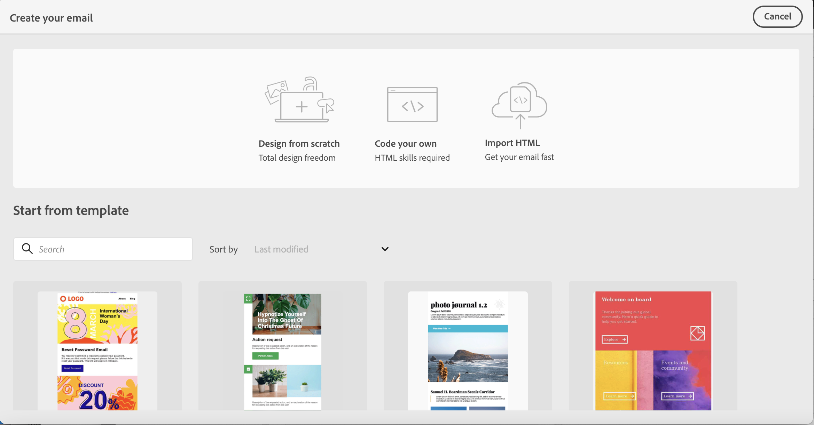
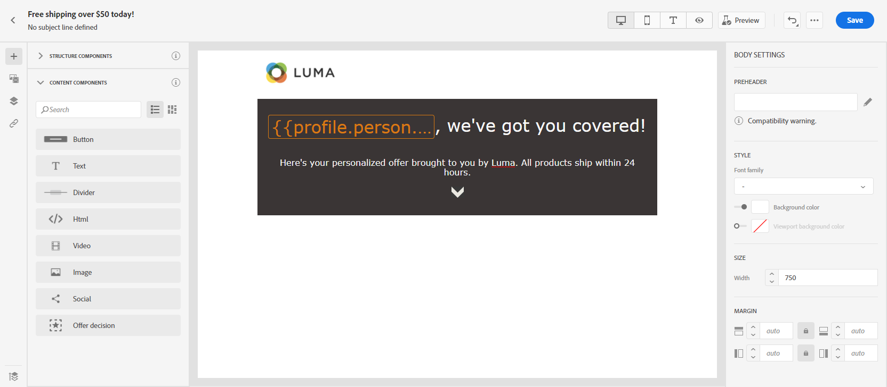

# Ontwerp uw e-mailinhoud in de gebruikersinterface {#create-email-content}

Zodra u [uw bericht hebt gemaakt](create-message.md)kunt u uw e-mailinhoud maken.

➡️ [Ontdek deze functie in video](#video)

1. Selecteer **[!UICONTROL Email designer]** in de **[!UICONTROL Body]** sectie.

   

1. Kies op de introductiepagina van E-mail Designer hoe u uw e-mail wilt ontwerpen uit de volgende opties:

   * Selecteren **[!UICONTROL Design from scratch]** om de mogelijkheden van de e-mailontwerper te gebruiken om uw e-mailinhoud te maken. [Meer informatie](#design-scratch)

   * Selecteren **[!UICONTROL Start from template]** om uw e-mail te maken op basis van een ingebouwde lijst met sjablonen. U kunt geen andere sjablonen maken.

   * Selecteren **[!UICONTROL Code your own]** om HTML raw-code in te voeren of te plakken. [Meer informatie](existing-content.md#import-raw-html-code).

   * Selecteren **[!UICONTROL Import HTML]** om een HTML- of ZIP-map te importeren. [Meer informatie](existing-content.md#import-html-content-from-file).

   

## Ontwerpen vanaf nul {#design-scratch}

>[!CONTEXTUALHELP]
>id="ac_structure_components"
>title="Informatie over de componenten Structuur"
>abstract="Structuurelementen definiëren de indeling van de e-mail."

>[!CONTEXTUALHELP]
>id="ac_edition_columns"
>title="E-mailkolommen definiëren"
>abstract="Met de E-mailontwerper kunt u de indeling van uw e-mail eenvoudig definiëren door de kolomstructuur te definiëren."

Met de e-mailontwerper kunt u de structuur van uw e-mail eenvoudig definiëren. Door structuurelementen toe te voegen en te bewegen met eenvoudige belemmering-en-dalingsacties, kunt u de vorm van uw e-mail binnen seconden ontwerpen.

Voer de onderstaande stappen uit om uw e-mailinhoud samen te stellen met de e-mailontwerper:

1. Na het selecteren van **[!UICONTROL Design from scratch]** kunt u uw e-mailinhoud ontwerpen door deze te slepen en neer te zetten **[!UICONTROL Structure components]** om de indeling van uw e-mail te definiëren.

   >[!NOTE]
   >
   >Kolommen zijn niet compatibel met alle e-mailprogramma&#39;s. Kolommen worden niet gestapeld als deze functie niet wordt ondersteund.
   >
   >Nadat u de onderdelen in de e-mail hebt geplaatst, kunt u deze alleen verplaatsen of verwijderen als er al een inhoudscomponent of een fragment in de e-mail is geplaatst.

   

1. Zoveel toevoegen **[!UICONTROL Structure components]** indien nodig.

   Selecteer **[!UICONTROL n:n column]** om het aantal kolommen van uw keus (tussen 3 en 10) te bepalen. U kunt de breedte van elke kolom ook bepalen door de pijlen bij de bodem van elke kolom te bewegen.

   >[!NOTE]
   >
   >Elke kolomgrootte mag niet kleiner zijn dan 10% van de totale breedte van de structuurcomponent. U kunt geen kolom verwijderen die niet leeg is.

1. Van de **[!UICONTROL Content components]** vervolgkeuzelijst, kunt u zoveel toevoegen **[!UICONTROL Content components]** zoals u nodig hebt in de structuurcomponent. [Meer informatie over inhoudscomponenten](content-components.md).

   

1. Elke component kan verder worden aangepast met de **[!UICONTROL Component settings]** sectie. U kunt bijvoorbeeld de tekststijl, de opvulling of marge van de component wijzigen. [Meer informatie over uitlijning en opvulling](#adjusting-vertical-alignment-and-padding).

   

1. Van de **[!UICONTROL Assets picker]** kunt u rechtstreeks elementen toevoegen die zijn opgeslagen in het dialoogvenster **[!UICONTROL Assets library]** naar uw e-mail. [Meer informatie over middelenbeheer](assets-essentials.md).

   Dubbelklik op de map met uw elementen en sleep het element dat u aan uw e-mail wilt toevoegen.

   

1. Voeg verpersoonlijkingsgebieden toe om de inhoud van uw profielgegevens aan te passen. [Meer informatie over content personalization](../personalization/personalize.md).

   

1. In de **[!UICONTROL Links]** in het linkerdeelvenster, controleert u de lijst van alle URL&#39;s van de inhoud die wordt bijgehouden. U kunt de **[!UICONTROL Tracking Type]**, **[!UICONTROL Label]** en **[!UICONTROL Tags]** indien nodig.

   

   >[!NOTE]
   >
   >Meer informatie over koppelingen en berichttracering vindt u in [deze pagina](message-tracking.md).

1. Indien nodig kunt u overschakelen naar de code-editor om uw e-mail verder aan te passen door op **[!UICONTROL Switch to code editor]** in het geavanceerde menu. Voor meer informatie over de coderedacteur, verwijs naar [deze pagina](existing-content.md#import-raw-html-code).

   >[!NOTE]
   >
   >U zult niet de visuele ontwerper voor deze e-mail na omschakeling aan de coderedacteur kunnen gebruiken.

   

1. Klikken **[!UICONTROL Show preview]** om de rendering van uw e-mail te controleren. U kunt kiezen voor de weergave Computer of Mobiel.

   Raadpleeg voor meer informatie over hoe u een voorbeeld van uw e-mail kunt bekijken [deze pagina](preview.md).

   

1. Wanneer uw e-mail gereed is, klikt u op **[!UICONTROL Save & Close]**.

Uw e-mailinhoud kan nu worden gebruikt in een bericht. [Leer hoe u een bericht verzendt](publish-manage-message.md).

## De tekstversie van een e-mailbericht maken {#generate-text-version}

U wordt aangeraden een tekstversie van de berichttekst te maken die wordt gebruikt wanneer HTML-inhoud niet kan worden weergegeven.

Standaard maakt de e-mailontwerper een **[!UICONTROL Plain text]** versie van uw e-mail, inclusief personalisatievelden. Deze versie wordt automatisch gegenereerd en gesynchroniseerd met de HTML-versie van uw inhoud.

Voer de onderstaande stappen uit als u liever een andere inhoud gebruikt voor de versie zonder opmaak:

1. Selecteer in uw e-mail de optie **[!UICONTROL Plain text]** tab.

   

1. Gebruik de **[!UICONTROL Sync with HTML]** schakelen om synchronisatie uit te schakelen.

   

1. Klik op het vinkje om uw keuze te bevestigen.

   

1. Vervolgens kunt u de versie zonder tekst naar wens bewerken.

>[!CAUTION]
>
>* Wijzigingen aangebracht in **[!UICONTROL Plain text]** worden niet weerspiegeld in de weergave HTML.
>
>* Als u de **[!UICONTROL Sync with HTML]** Nadat u de onbewerkte tekstinhoud hebt bijgewerkt, gaan de wijzigingen verloren en worden deze vervangen door tekstinhoud die is gegenereerd uit de HTML-versie.

## Een preheader toevoegen {#preheader}

>[!CONTEXTUALHELP]
>id="ac_edition_preheader"
>title="Een preheader toevoegen"
>abstract="Een preheader is een korte samenvattingstekst die op de onderwerpregel volgt wanneer een e-mailbericht van uw e-mailclient wordt weergegeven. In veel gevallen geeft het een korte samenvatting van de e-mail en is het doorgaans één zin lang."

Een preheader is een korte samenvattingstekst die op de onderwerpregel volgt wanneer een e-mailbericht van uw e-mailclient wordt weergegeven. In veel gevallen geeft het een korte samenvatting van de e-mail en is het doorgaans één zin lang.

>[!NOTE]
>
>Preheaders worden niet door alle e-mailclients ondersteund. Als deze optie niet wordt ondersteund, wordt de preheader niet weergegeven.

Voer de volgende stappen uit om de e-mailvoorheader te definiëren:

1. Voeg een **[!UICONTROL Structure components]** om uw e-mail te gaan ontwerpen.

   

1. Van de **[!UICONTROL Body settings]** rechterdeelvenster, klik op **Bewerken** naast de **[!UICONTROL Preheader]** veld om inhoud toe te voegen.

   

1. Voeg de preheader toe. U kunt de afbeelding verder aanpassen door op de knop **[!UICONTROL Add personalization]** pictogram.

   

1. Van de **[!UICONTROL Edit Personalization]** venster, kunt u toevoegen **[!UICONTROL Content block]**, **[!UICONTROL Dynamic content]** of **[!UICONTROL Personalization fields]**.

1. Klikken **[!UICONTROL Validate]** om uw personalisatiesyntaxis te controleren.

   

1. Klik op **[!UICONTROL Save]**.

Uw preheader is nu geconfigureerd voor uw e-mail.

## Achtergrondinstellingen {#about-backgrounds}

>[!CONTEXTUALHELP]
>id="ac_edition_backgroundimage"
>title="Achtergrondinstellingen"
>abstract="U kunt de achtergrondkleur of achtergrondafbeelding voor uw inhoud aanpassen. Achtergrondafbeelding wordt niet door alle e-mailclients ondersteund."

Als het gaat om het instellen van achtergronden met de e-mailontwerper, raadt Adobe het volgende aan:

1. Pas een achtergrondkleur toe op de tekst van uw e-mail, indien dat door uw ontwerp wordt vereist.
1. In de meeste gevallen stelt u achtergrondkleuren in op kolomniveau.
1. Probeer geen achtergrondkleuren te gebruiken voor afbeeldings- of tekstcomponenten, omdat deze moeilijk te beheren zijn.

Hieronder vindt u de beschikbare achtergrondinstellingen die u kunt gebruiken.

* Een **[!UICONTROL Background color]** voor de hele e-mail. Selecteer de instellingen voor de hoofdtekst in de boomstructuur die toegankelijk is in het linkerpalet.

* Dezelfde achtergrondkleur voor alle structuurcomponenten instellen door **[!UICONTROL Viewport background color]**. Met deze optie kunt u een andere instelling selecteren dan de achtergrondkleur.

* Stel een andere achtergrondkleur in voor elke structuurcomponent. Selecteer een structuur in de boomstructuur die toegankelijk is vanuit het linkerpalet als u alleen een specifieke achtergrondkleur op die structuur wilt toepassen.

   Zorg ervoor dat u geen achtergrondkleur voor de viewport instelt, omdat hierdoor de achtergrondkleuren van de structuur kunnen worden verborgen.

* Een **[!UICONTROL Background image]** voor de inhoud van een structuurcomponent.

   >[!NOTE]
   >
   >Sommige e-mailprogramma&#39;s ondersteunen achtergrondafbeeldingen niet. Als deze optie niet wordt ondersteund, wordt in plaats daarvan de achtergrondkleur van de rij gebruikt. Selecteer de gewenste achtergrondkleur voor fallback voor het geval de afbeelding niet kan worden weergegeven.

* Stel een achtergrondkleur in op kolomniveau.

   >[!NOTE]
   >
   >Dit is het meest gebruikte geval. Adobe raadt aan achtergrondkleuren in te stellen op kolomniveau, omdat dit meer flexibiliteit biedt bij het bewerken van de volledige e-mailinhoud.

   U kunt ook een achtergrondafbeelding instellen op kolomniveau, maar dit wordt zelden gebruikt.

## Verticale uitlijning en opvulling aanpassen {#adjusting-vertical-alignment-and-padding}

In dit voorbeeld passen we opvulling en verticale uitlijning aan binnen een structuurcomponent die uit drie kolommen bestaat.

1. Selecteer de structuurcomponent rechtstreeks in de e-mail of met de opdracht **[!UICONTROL Navigation tree]** beschikbaar in het linkermenu.

   

1. Klik op de werkbalk op **[!UICONTROL Select a column]** en kiest u het bestand dat u wilt bewerken. U kunt deze ook selecteren in de boomstructuur.

   De bewerkbare parameters voor die kolom worden weergegeven in het dialoogvenster **[!UICONTROL Column settings]** -menu.

   

1. Selecteer onder **[!UICONTROL Vertical alignment]** de optie **[!UICONTROL Bottom]**.

   De inhoudscomponent wordt naar de onderkant van de kolom verplaatst.

   

1. Onder **[!UICONTROL Padding]** Definieer de opvulling boven in de kolom. Klik op het vergrendelingspictogram om de synchronisatie met de onderste opvulling te verbreken.

   Definieer de linker- en rechteropvulling voor die kolom.

   

1. Ga op dezelfde manier te werk om de uitlijning en opvulling van de andere kolommen aan te passen.

1. Sla uw wijzigingen op.

## Een stijl voor koppelingen definiëren {#about-styling-links}

U kunt een koppeling onderstrepen en de kleur en het doel ervan selecteren in de e-mailontwerper.

1. In een tekst **[!UICONTROL Content component]** wanneer een koppeling wordt ingevoegd, selecteert u de koppeling.

1. In de **[!UICONTROL Component settings]** menu, controle **[!UICONTROL Underline link]** om de labeltekst van uw koppeling te onderstrepen.

   

1. Kies hoe de doelgroep wordt omgeleid met de **[!UICONTROL Target]** vervolgkeuzelijst:

   * **[!UICONTROL None]**: Hiermee opent u de koppeling in hetzelfde frame als waarop u hebt geklikt (standaard).
   * **[!UICONTROL Blank]**: Hiermee opent u de koppeling in een nieuw venster of op een nieuw tabblad.
   * **[!UICONTROL Self]**: Hiermee opent u de koppeling in hetzelfde frame als waarop u hebt geklikt.
   * **[!UICONTROL Parent]**: Hiermee opent u de koppeling in het bovenliggende frame.
   * **[!UICONTROL Top]**: Hiermee opent u de koppeling in de volledige tekst van het venster.

   

1. Als u de kleur van de koppeling wilt wijzigen, klikt u op **[!UICONTROL Link color]**.

   

1. Kies de gewenste kleur.

1. Sla uw wijzigingen op.

## Inline-opmaakkenmerken toevoegen {#adding-inline-styling-attributes}

Wanneer u in de interface E-mailontwerper een element selecteert en de instellingen van het element in het zijpaneel weergeeft, kunt u de inline-kenmerken en de bijbehorende waarde voor dat specifieke element aanpassen.

1. Selecteer een element in de inhoud.
1. Op het zijpaneel, zoek naar **[!UICONTROL Styles Inline]** instellingen.

1. Wijzig de waarden van de bestaande kenmerken of voeg nieuwe kenmerken toe met de **+** knop. U kunt alle kenmerken en waarden toevoegen die CSS-compatibel zijn.

De stijl wordt vervolgens toegepast op het geselecteerde element. Als voor de onderliggende elementen geen specifieke stijlkenmerken zijn gedefinieerd, wordt de opmaak van het bovenliggende element overgeërfd.

## Hoe kan ik-video {#video}

Leer hoe u e-mailinhoud maakt met de berichteneditor.

>[!VIDEO](https://video.tv.adobe.com/v/334150?quality=12)
