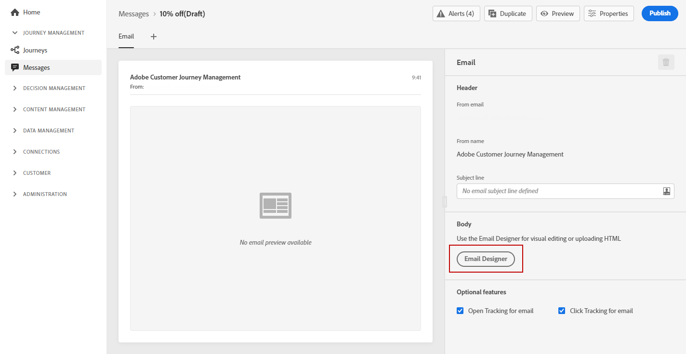
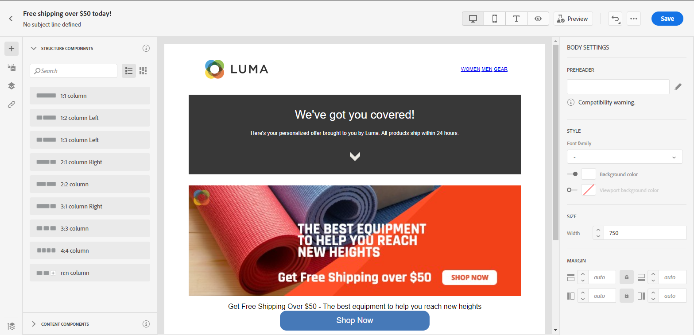

# Uw e-mailinhoud importeren of coderen {#existing-content}

Met Journey Optimizer kunt u bestaande HTML-inhoud importeren om uw e-mails te ontwerpen. Deze inhoud kan onbewerkte HTML-code of inhoud uit een bestaand HTML-bestand of een ZIP-map zijn.

Ga als volgt te werk om HTML-inhoud te coderen of bestaande inhoud te importeren:

1. [Een bericht maken](create-message.md)

1. Open de **[!UICONTROL Email Designer]** van de **[!UICONTROL Edit Content]** sectie.

   

1. Selecteren **[!UICONTROL Code your own]** of **[!UICONTROL Import HTML]**. Raadpleeg de onderstaande secties voor de volgende stappen.

## Uw eigen code schrijven {#import-raw-html-code}

Gebruik de **[!UICONTROL Code your own]** -modus kunt u onbewerkte HTML importeren en/of uw e-mailinhoud coderen. Deze methode vereist HTML-vaardigheden.

>[!CAUTION]
>
> Afbeeldingen van [Adobe Experience Manager Assets Essentials](assets-essentials.md) kan niet worden van verwijzingen voorzien wanneer het gebruiken van deze methode. De afbeeldingen waarnaar in uw HTML-code wordt verwezen, moeten worden opgeslagen op een openbare locatie.

1. Selecteer op de introductiepagina E-mail Designer de optie **[!UICONTROL Code your own]**.

   

1. Voer de onbewerkte HTML-code in of plak deze.

1. Gebruik het linkerdeelvenster om het te benutten [!DNL Journey Optimizer] personalisatiemogelijkheden. Raadpleeg [deze sectie](../personalization/personalize.md) voor meer informatie.

   

1. Als u de e-mailontwerper wilt openen om uw e-mail te starten vanuit een nieuw ontwerp, selecteert u **[!UICONTROL Change your design]** in het optiemenu.

   

1. Klik op de knop **[!UICONTROL Preview]** om het berichtontwerp en de verpersoonlijking te controleren gebruikend testprofielen. Raadpleeg [deze sectie](preview.md) voor meer informatie.

   

1. Wanneer de code gereed is, klikt u op **[!UICONTROL Save]** ga dan terug naar het scherm van de berichtverwezenlijking om uw bericht te voltooien.

   

## HTML importeren {#import-html-content-from-file}

U kunt HTML-inhoud importeren in de e-mailontwerper. Deze inhoud kan:

* An **HTML-bestand** met een model in een ingebouwde stijlpagina,
* A **.zip-map** met het HTML-bestand, de stijlpagina (.css) en afbeeldingen.

   >[!NOTE]
   >
   >Er gelden geen beperkingen voor de .zip-bestandsstructuur. Verwijzingen moeten echter relatief zijn en passen bij de boomstructuur van de ZIP-map.

Voer de volgende stappen uit om een bestand met HTML-inhoud te importeren:

1. Selecteer op de introductiepagina E-mail Designer de optie **[!UICONTROL Import HTML]**.

   

1. Sleep het HTML- of ZIP-bestand met de inhoud van uw HTML.

1. Zodra de HTML-inhoud is geüpload, kunt u de e-mailfuncties van E-mailontwerper gebruiken om uw e-mailadres te bewerken en er een voorvertoning van weer te geven. [Meer informatie in deze sectie](create-email-content.md).

   
