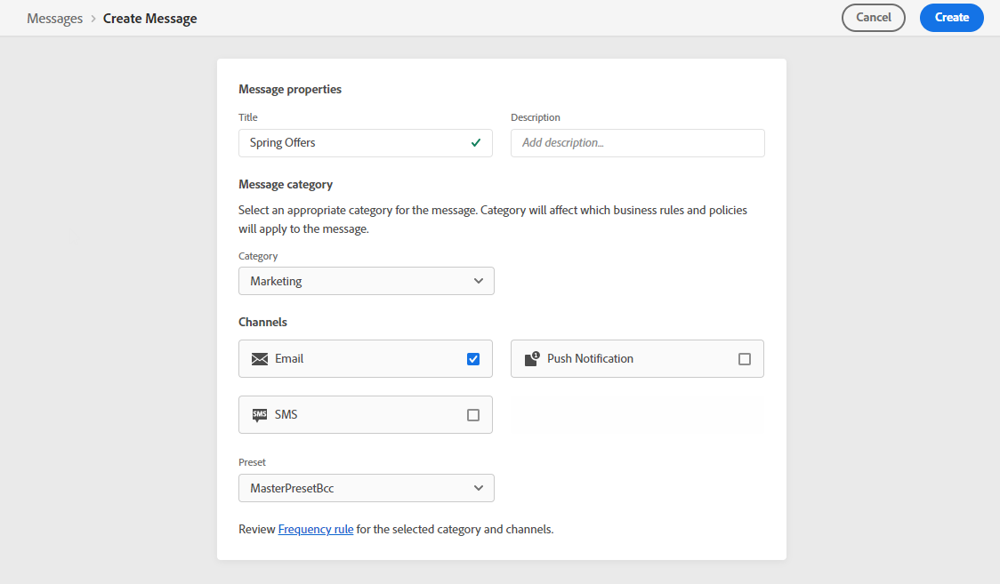
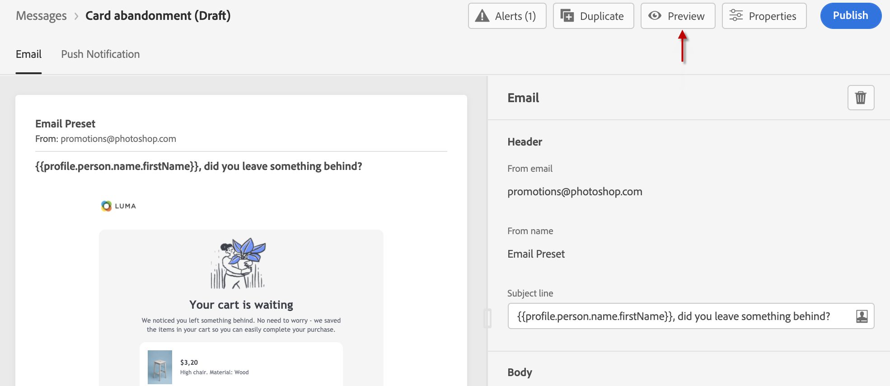
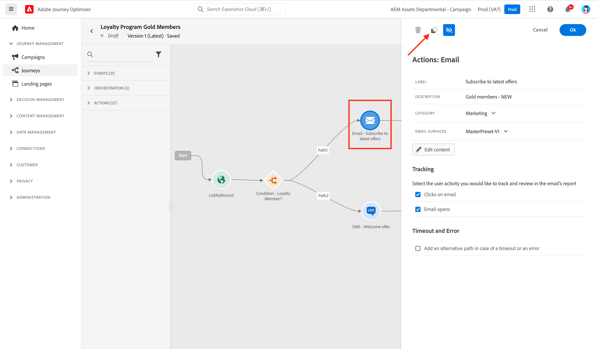

# Aan de slag met berichten {#get-started-contents-messages}

Gebruiken [!DNL Journey Optimizer] om meerdere bronnen, zoals elementen en inhoud, op één locatie te gebruiken en persoonlijke pushberichten en e-mailberichten te maken en te publiceren.

* Hefboomwerking [!DNL Journey Optimizer] **e-mailontwerpmogelijkheden** om responsieve e-mails te maken of te importeren.

* Hefboomwerking **Adobe Experience Manager Assets Essentials** om uw eigen database met elementen te maken en uw e-mails te verrijken.

* De ervaring van klanten verbeteren door **persoonlijke push- en e-mailberichten** op basis van hun profielkenmerken.

* **Push- en e-mailberichten maken** op basis van deze inhoud te publiceren.

## Toegangsberichten {#access-messages}

Berichten zijn beschikbaar via de **[!UICONTROL Messages]** sneltoets voor de linkernavigatie. Alle berichten worden weergegeven, gesorteerd op publicatiedatum (voor gepubliceerde berichten) of aanmaakdatum (voor conceptuele berichten).

>[!NOTE]
>
>Gebruikers kunnen berichten openen, maken, bewerken en/of publiceren, afhankelijk van hun productprofiel. Meer informatie over gebruikersmachtigingen [in deze sectie](../administration/permissions.md).

* Gebruik de **[!UICONTROL Show recents]** Schakel deze optie in om directe koppelingen toe te voegen aan de berichten die u de afgelopen 5 dagen hebt geopend.

   

* Gebruik het filterpictogram om alleen tekst, gepubliceerde tekst of berichten weer te geven die worden gepubliceerd. U kunt ook zoeken op berichtlabel, zoals hieronder:

   

* U kunt ongebruikte berichten archiveren om de berichtlijst te ontruimen gebruikend het specifieke pictogram van het snelle actiemenu.

   

   Gebruik het filterpictogram om alle gearchiveerde berichten weer te geven en klik op de knop **[!UICONTROL Unarchive]** pictogram om een item uit de lijst met gearchiveerde berichten te verwijderen.

   >[!NOTE]
   >
   >U kunt geen gearchiveerd bericht openen. U moet het eerst dearchiveren.

## Een nieuw bericht maken {#create-new-message}

Volg onderstaande stappen om een nieuw bericht te maken:

1. Open de berichtenlijst en klik vervolgens op **[!UICONTROL Create Message]**.

1. Definieer de berichteigenschappen.

   

   * Voer een **[!UICONTROL Title]** (verplicht) en een **[!UICONTROL Description]**.

   * Selecteer **[!UICONTROL Message category]**: Marketing of transactie.

   * Selecteer de kanalen die u voor dat bericht wilt gebruiken: E-mail- en/of pushmelding. U moet ten minste één kanaal selecteren om het bericht te kunnen maken.

   <!--
   >[!NOTE]
   >
   >You can click the **[!UICONTROL Frequency rule]** link to view the frequency rules that will apply for the selected category and channel(s). Learn more on [frequency rules](../configuration/frequency-rules.md).
   -->

   * Selecteer **[!UICONTROL Preset]** voor het bericht te gebruiken.

      Voorinstellingen bevatten alle parameters die vereist zijn voor het verzenden van een e-mail- en/of pushmelding volgens uw merk. Meer informatie over [voorinstellingen](../configuration/message-presets.md).
   >[!CAUTION]
   >
   >U moet een geldige berichtvoorinstelling kiezen voor de geselecteerde categorie en het geselecteerde kanaal of kanalen.

   U kunt de titel, beschrijving en voorinstelling van het bericht op elk gewenst moment openen en wijzigen met de opdracht **[!UICONTROL Properties]** in de berichtinterface.

1. Klikken **[!UICONTROL Create]** om het aanmaken van berichten te bevestigen. Uw bericht wordt toegevoegd in de berichtenlijst, in **[!UICONTROL Draft]** status.

   Er is één tab beschikbaar voor elk geselecteerd kanaal. Gebruik deze tabbladen om de inhoud voor elk kanaal te configureren. U kunt een tabblad verwijderen door het te selecteren en op de knop **[!UICONTROL Delete channel]** rechts.

   

   <!--
   >[!NOTE]
   >
   >If you enabled the **[!UICONTROL BCC email]** option in the preset, the BCC email address will display under the sender email. [Learn more](../configuration/email-settings.md#bcc-email)
   -->

   U kunt nu de inhoud van het bericht maken en instellingen aanpassen. Gedetailleerde informatie over de configuratie van e-mail- en pushmeldingen is beschikbaar in de volgende secties:

   * [Een e-mail maken](create-email.md)
   * [Pushberichten maken](create-push.md)

   >[!NOTE]
   >   
   >U kunt uw berichten personaliseren gebruikend de gegevens van profielen gebruikend de uitdrukkingsredacteur. Raadpleeg voor meer informatie over personalisatie [deze sectie](../personalization/personalize.md).

1. Controleer de weergave van uw berichten en controleer de instellingen voor de personalisatie met testprofielen aan de linkerkant met behulp van de voorbeeldsectie. Raadpleeg [deze sectie](../design/preview.md) voor meer informatie.

   

1. Controleer waarschuwingen in het bovenste gedeelte van de editor.  Sommige zijn eenvoudige waarschuwingen, maar andere kunnen voorkomen dat u het bericht publiceert. Meer informatie in [deze sectie](alerts.md).

1. U kunt uw bericht nu publiceren door op de knop **[!UICONTROL Publish]** of als concept behouden en later publiceren. Raadpleeg voor meer informatie over het publiceren van berichten [deze sectie](publish-manage-message.md).

## Een bericht dupliceren {#duplicate-message}

Voer de onderstaande stappen uit om een bericht te maken op basis van een bestaand bericht.

1. Open het bericht dat u wilt kopiëren.

1. Gebruik de **[!UICONTROL Duplicate]** van de berichtinterface.

   

   Alle montages en configuratie zullen aan het nieuwe bericht worden gekopieerd.

1. U kunt de naam van het bericht wijzigen voordat u de duplicatie bevestigt.

   

1. Zodra het nieuwe bericht is gemaakt, wordt onder in het venster een bevestigingsbericht weergegeven.

U kunt ook een bericht uit de berichtenlijst dupliceren met behulp van het toegewezen pictogram in het menu Snelle acties.

Hetzelfde bevestigingsproces is van toepassing.

