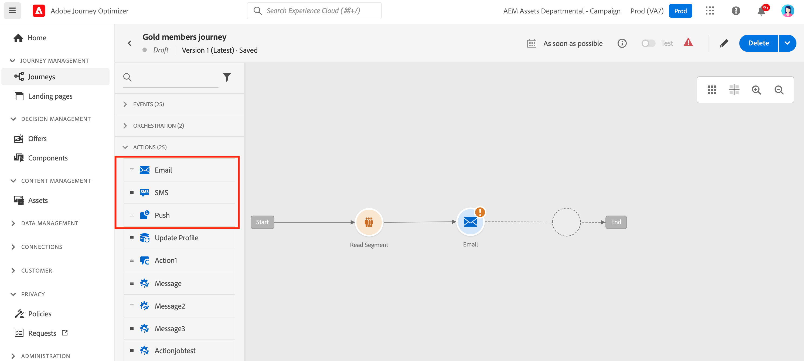
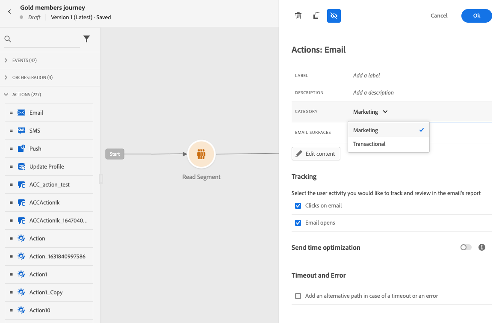
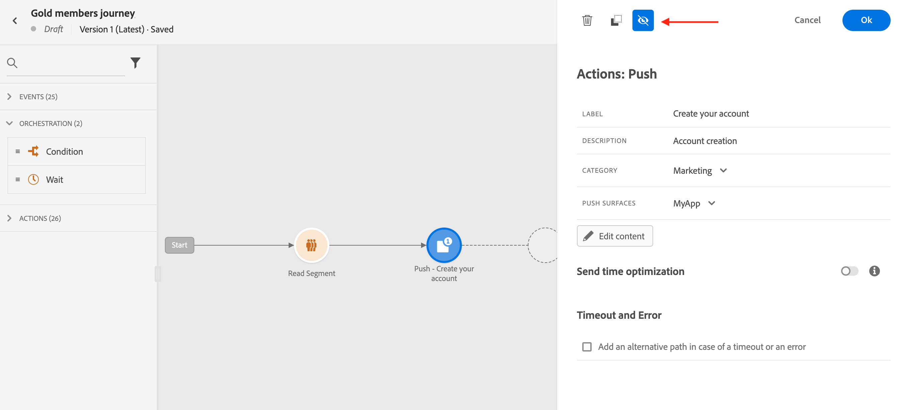
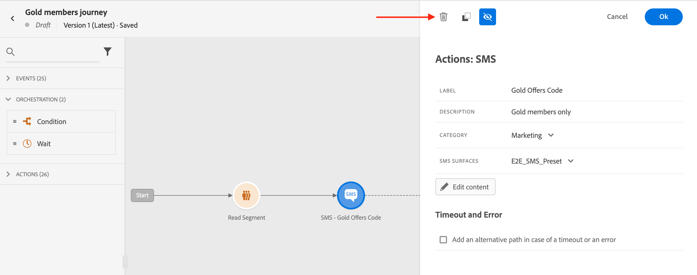

# Berichten toevoegen tijdens reizen{#messages-in-journeys}

>[!CONTEXTUALHELP]
>id="ajo_message_category"
>title="Berichtcategorie"
>abstract="Kies Marketing voor commerciële berichten of Transactie voor niet-commerciële berichten zoals bevestiging van de bestelling, wachtwoordterugstellings berichten, of leveringsinformatie"

>[!CONTEXTUALHELP]
>id="ajo_message_surface"
>title="Kanaaloppervlak"
>abstract="Een kanaaloppervlak is een instantie van dat kanaal dat over alle instellingen beschikt om een actie te kunnen uitvoeren via een campagne of een reis. Het wordt bepaald door een systeembeheerder."

In uw reizen, gebruik de kanaalacties om het bericht te ontwerpen en te personaliseren u aan uw publiek wilt verzenden. Wanneer u een e-mail, een SMS- of een pushactie toevoegt aan het canvas van de reis, maakt u een getriggerde send. Wanneer de contacten die kanaalactie bereiken, verzendt Adobe Journey Optimizer automatisch het bericht.

>[!NOTE]
>U kunt ook campagnes maken om geplande berichten te verzenden. Meer informatie [in deze sectie](../campaigns/get-started-with-campaigns.md).

Voeg een push-, SMS- of e-mailactiviteit toe aan de reiscanvas om berichten toe te voegen aan een reis.

1. Begin uw reis met een [Gebeurtenis](../building-journeys/general-events.md) of [Segment lezen](../building-journeys/read-segment.md) activiteit.

1. Van de **Handelingen** van het palet, slepen en neerzetten en **email**, en **SMS** of **Push** op het canvas.

   

1. Voer een label en beschrijving in.

1. Selecteer het bericht **[!UICONTROL Category]**: kiezen **Marketing** voor commerciële berichten, of **Transactioneel** voor niet-commerciële berichten, zoals bevestiging van de bestelling, wachtwoordherstelmeldingen of leveringsgegevens.

   

   >[!CAUTION]
   >
   >* Als u [frequentieregels](../configuration/frequency-rules.md) voor een specifiek kanaal en een bepaalde categorie, worden zij automatisch toegepast op het bericht wanneer het selecteren van dat kanaal en die categorie. Alleen de **[!UICONTROL Marketing]** categorie is beschikbaar voor frequentievoorschriften.
   >
   >* Marketingberichten moeten een [opt-out-koppeling](../privacy/opt-out.md#opt-out-management). Dit is niet vereist voor transactieberichten omdat deze berichten naar profielen kunnen worden verzonden die van marketing mededelingen afzien.

1. Selecteer het kanaal **[!UICONTROL Surface]** (d.w.z. voorinstelling voor berichten) die moet worden gebruikt om uw bericht te verzenden.

   Een oppervlak is een configuratie die is gedefinieerd door een [Systeembeheerder](../start/path/administrator.md). Het bevat alle technische parameters voor het verzenden van het bericht, zoals headerparameters, subdomein, mobiele apps, enz. [Meer informatie](../configuration/channel-surfaces.md).

   >[!CAUTION]
   >
   >U moet een geldig kanaaloppervlak kiezen voor de geselecteerde berichtcategorie en het geselecteerde kanaal.

   U kunt tot het etiket, de beschrijving en de oppervlakte van het bericht toegang hebben en wijzigen op elk ogenblik gebruikend **[!UICONTROL Properties]** in de berichtinterface.

1. Maak de berichtinhoud.

   Leer gedetailleerde stappen om uw berichtinhoud tot stand te brengen op de volgende pagina:

   * [Een e-mail maken](create-email.md)
   * [Pushberichten maken](create-push.md)
   * [Een SMS-bericht maken](create-sms.md)

## Optimalisatie bij verzenden inschakelen{#sto-in-journeys}

Voor e-mail- en pushberichten kunt u **[!UICONTROL Send-time optimization]**.

Gebruiken **[!UICONTROL Send-time optimization]** om gepersonaliseerd te plannen verzend tijden voor elke gebruiker om open te groeien en tarieven van uw berichten te klikken. [Meer informatie](../messages/send-time-optimization.md).

## Geavanceerde parameters{#adv-settings}

Geavanceerde parameters zijn standaard alleen-lezen en verborgen.

Klik op de knop **[!UICONTROL Show read-only fields]** boven aan het berichtvenster.

De geavanceerde parameters worden getoond bij de bodem van de berichtruit. Deze parameters worden gedefinieerd door de [systeembeheerder](../start/path/administrator.md) in de [kanaaloppervlak](../configuration/channel-surfaces.md) (d.w.z. voorinstelling bericht) die aan het bericht is gekoppeld.

Voor pushberichten kunt u de volgende parameters weergeven: Token, AppID, AppPlatform.

Voor e-mail kunt u het primaire e-mailadres weergeven.

Voor specifiek gebruik, kunt u deze waarden in specifieke contexten met voeten treden. Als u een waarde wilt afdwingen, klikt u op de knop **Parameteroverschrijving inschakelen** rechts van het veld. Deze optie is bijvoorbeeld handig voor:

* Test een e-mailadres. U kunt uw e-mailadres toevoegen. Nadat u de reis hebt gepubliceerd, wordt het e-mailbericht naar u verzonden.
* Raadpleeg het e-mailadres van de abonnees van een lijst. Meer informatie in [dit geval gebruiken](../building-journeys/message-to-subscribers-uc.md).

Klik op hetzelfde pictogram om geavanceerde instellingen te verbergen.

## Bladeren door berichten{#browse-message}

Wanneer de veelvoudige berichten in een reis worden gebruikt, kunt u van één aan een andere van **Inhoud bewerken** scherm.

U kunt vervolgens [waarschuwingen controleren](alerts.md) en [simuleren](../design/preview.md) elke inhoud uit één weergave.

## Een bericht dupliceren {#duplicate-message}

U kunt een bestaand bericht kopiëren vanaf het canvas van de reis.

Volg onderstaande stappen om dit te doen:

1. Selecteer het bericht dat u wilt kopiëren.

1. Gebruik de **[!UICONTROL Copy]** van de knop **[!UICONTROL Action]** venster.

   

1. Enter **crtl+V** om het bericht te plakken.

   Het bericht wordt toegevoegd aan het reiscanvas. Alle montages en configuratie zullen aan het nieuwe bericht worden gekopieerd.

   

1. Wijzig de naam van het bericht om het oorspronkelijke bericht te kunnen onderscheiden van de kopie, bijvoorbeeld bij het bewerken van berichten, zoals hieronder:

   

>[!NOTE]
>
>Voor e-mailberichten kunt u ook een bestaand bericht naar een sjabloon sturen. [Meer informatie](../design/email-templates.md).

## Een bericht verwijderen{#delete-message}

Als u een bericht wilt verwijderen, gebruikt u het prullenbakpictogram boven aan het deelvenster Handeling Kanaal.

Gebruik de **[!UICONTROL Confirm]** te valideren.
