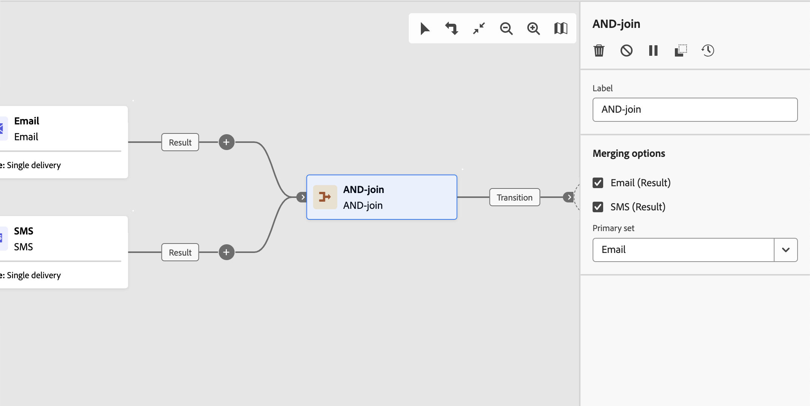

# AND-join {#join}

>[!CONTEXTUALHELP]
>id="ajo_orchestration_and-join"
>title="AND-join-activiteit"
>abstract="De **en-sluit zich aan** activiteit staat u toe om veelvoudige uitvoeringstakken van een georkestreerde campagne te synchroniseren. De regeling wordt in werking gesteld zodra alle voorgaande activiteiten zijn beëindigd. Op deze manier kunt u ervoor zorgen dat bepaalde activiteiten zijn voltooid voordat u doorgaat met het uitvoeren van de georkestreerde campagne."

De **en-sluit zich aan** activiteit is de controle **activiteit van de a** Stroom. Hiermee kunt u meerdere uitvoeringstakken van een georkestreerde campagne synchroniseren.

Deze activiteit brengt slechts zijn uitgaande overgang teweeg zodra alle binnenkomende overgangen worden geactiveerd, met andere woorden, zodra alle voorafgaande activiteiten zijn geëindigd. Hierdoor kunt u ervoor zorgen dat bepaalde activiteiten zijn voltooid voordat u doorgaat met het uitvoeren van de georkestreerde campagne.

## Vorm en verbind activiteit{#and-join-configuration}

>[!CONTEXTUALHELP]
>id="ajo_orchestration_and-join_merging"
>title="Samenvoegopties"
>abstract="Selecteer de activiteiten waaraan u wilt deelnemen. In de **Primaire reeks** drop-down, kies welke binnenkomende overgangspopulatie u wilt houden."

Voer de volgende stappen uit om de **EN-lid** activiteit te vormen:

1. Voeg veelvoudige activiteiten zoals kanaalactiviteiten toe om minstens twee verschillende uitvoertakken te vormen.
1. Voeg **toe EN-sluit** activiteit aan om het even welke takken.
1. In de **het samenvoegen opties** sectie, controleer alle vorige activiteiten u wenst u zich aansluit.
1. In de **Primaire reeks** drop-down, kies welke binnenkomende overgangspopulatie u wilt houden. De uitgaande overgang kan slechts één van de binnenkomende overgangspopulaties bevatten.

## Voorbeeld{#and-join-example}

In het volgende voorbeeld worden twee georkestreerde campagnevertakkingen getoond met een e-mail- en sms-levering. EN-toetreden zal teweegbrengen wanneer beide binnenkomende overgangen worden toegelaten. De pushberichten worden dan pas verzonden nadat beide leveringen zijn voltooid.

{zoomable="yes"}
