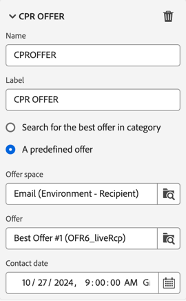
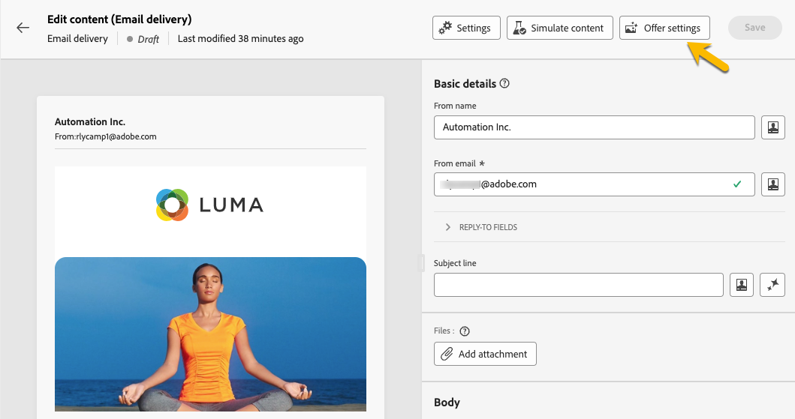

# Verrijking {#enrichment}

>[!CONTEXTUALHELP]
>id="ajo_orchestration_enrichment"
>title="Verrijkingsactiviteit"
>abstract="De **Verrijking** activiteit staat u toe om de gerichte gegevens met extra informatie van het gegevensbestand te verbeteren. Het wordt vaak gebruikt in een werkschema na segmenteringsactiviteiten."

De **Verrijking** activiteit is a **richtend** activiteit. Hiermee kunt u de doelgegevens verbeteren met aanvullende informatie uit de database. Het wordt vaak gebruikt in een werkschema na segmenteringsactiviteiten.

Verrijkingsgegevens kunnen worden verkregen:

* **van de zelfde het werklijst** zoals die in uw multi-step campagne wordt gericht:

  *Doel een groep klanten en voeg het &quot;datum&quot;gebied van de Geboorteplaats aan de huidige het werklijst* toe.

* **van een andere het werklijst**:

  *Beoogd een groep klanten en voeg de &quot;Bedrag&quot;en &quot;Type van product&quot;gebieden toe die uit de &quot;lijst van de Aankoop&quot;komen*.

Zodra de verrijkingsgegevens aan de multi-step campagne zijn toegevoegd, kan het in de activiteiten worden gebruikt die na de **Verrijking** activiteit worden toegevoegd om klanten in verschillende groepen te segmenteren die op hun gedrag, voorkeur, en behoeften worden gebaseerd, of gepersonaliseerde marketing berichten en campagnes tot stand te brengen die waarschijnlijker met uw doelpubliek zullen resoneren.

U kunt bijvoorbeeld informatie over aankopen van klanten toevoegen aan de werktabel met meerdere stappen voor campagnes en deze gegevens gebruiken om de e-mails aan uw wensen aan te passen met hun laatste aankoop of het bedrag dat aan deze aankopen is besteed.

## Een verrijkingsactiviteit toevoegen {#enrichment-configuration}

Volg deze stappen om de **1} activiteit van de Verrijking {te vormen:**

1. Voeg activiteiten zoals **toe bouwt publiek** en **combineer** activiteiten.
1. Voeg een **Verrijking** activiteit toe.
1. Als er meerdere overgangen zijn geconfigureerd in uw campagne met meerdere stappen, kunt u het veld **[!UICONTROL Primary set]** gebruiken om te bepalen welke overgang moet worden gebruikt als primaire set om te verrijken met gegevens.

## Verrijkingsgegevens toevoegen {#enrichment-add}

>[!CONTEXTUALHELP]
>id="ajo_targetdata_personalization_enrichmentdata"
>title="Verrijkingsgegevens"
>abstract="Selecteer de gegevens die u wilt gebruiken om uw campagne met meerdere stappen te verrijken. U kunt twee soorten verrijkingsgegevens selecteren: één enkel verrijkingsattribuut van de doelafmeting, of een inzamelingsverbinding, die een verbinding met een 1-N kardinaliteit tussen lijsten is."

>[!CONTEXTUALHELP]
>id="ajo_orchestration_enrichment_data"
>title="Verrijkingsactiviteit"
>abstract="Zodra de verrijkingsgegevens aan de multi-step campagne zijn toegevoegd, kan het in de activiteiten worden gebruikt die na de activiteit van de Verrijking worden toegevoegd om klanten in verschillende groepen te segmenteren die op hun gedrag, voorkeur, en behoeften worden gebaseerd, of om gepersonaliseerde marketing berichten en campagnes tot stand te brengen die eerder met uw doelpubliek zullen resoneren."

1. Klik **toevoegen verrijkingsgegevens** en selecteer de attributen om de gegevens te gebruiken te verrijken.

   U kunt twee soorten verrijkingsgegevens selecteren: één enkel verrijkingsattribuut van de doelafmeting, of een inzamelingsverbinding. Elk van deze typen wordt in de volgende voorbeelden beschreven:
   * [Enkel verrijkingskenmerk](#single-attribute)
   * [Verzamelaar](#collection-link)

   >[!NOTE]
   >
   >De **geeft uitdrukkingsknoop** in het scherm van de attributenselectie uit staat u toe om geavanceerde uitdrukkingen te bouwen om de attributen te selecteren.

   

## Koppelingen maken tussen tabellen {#create-links}

>[!CONTEXTUALHELP]
>id="ajo_orchestration_enrichment_simplejoin"
>title="Koppelingsdefinitie"
>abstract="Maak een koppeling tussen de gegevens van de werktabel en Adobe Journey Optimizer. Als u bijvoorbeeld gegevens laadt uit een bestand dat het rekeningnummer, land en e-mail van ontvangers bevat, moet u een koppeling naar de landentabel maken om deze gegevens in hun profielen bij te werken."

Met de sectie **[!UICONTROL Link definition]** kunt u een koppeling maken tussen de gegevens van de werktabel en Adobe Journey Optimizer. Als u bijvoorbeeld gegevens laadt uit een bestand dat het rekeningnummer, land en e-mail van ontvangers bevat, moet u een koppeling naar de landentabel maken om deze gegevens in hun profielen bij te werken.

Er zijn verschillende typen koppelingen beschikbaar:

* **[!UICONTROL 1 cardinality simple link]**: Elke record uit de primaire set kan worden gekoppeld aan één record uit de gekoppelde gegevens.
* **[!UICONTROL 0 or 1 cardinality simple link]**: Elke record uit de primaire set kan worden gekoppeld aan 0- of 1-record uit de gekoppelde gegevens, maar niet aan meer dan één record.
* **[!UICONTROL N cardinality collection link]**: Elke record uit de primaire set kan worden gekoppeld aan 0, 1 of meer (N) records uit de gekoppelde gegevens.

Ga als volgt te werk om een koppeling te maken:

1. Klik in de sectie **[!UICONTROL Link definition]** op de knop **[!UICONTROL Add link]** .

   

1. In het **type van Verhouding** drop-down lijst, kies het type van verbinding u wilt tot stand brengen.

1. Identificeer het doel u de primaire reeks aan wilt verbinden:

   * Als u een bestaande tabel in de database wilt koppelen, kiest u **[!UICONTROL Database schema]** en selecteert u de gewenste tabel in het veld **[!UICONTROL Target schema]** .
   * Om met gegevens van de inputovergang te verbinden, verkies **Tijdelijk schema** en selecteer de overgang waarvan gegevens u wilt gebruiken.

1. Definieer de afstemmingscriteria die overeenkomen met gegevens uit de primaire set met het gekoppelde schema. Er zijn twee soorten verbindingen beschikbaar:

   * **Eenvoudig sluit zich aan**: Selecteer een specifiek attribuut om gegevens van de twee schema&#39;s aan te passen. Klik **toevoegen toetreedt** en selecteert **Source** en **de attributen van de Bestemming** om als verzoeningscriteria te gebruiken.
   * **Geavanceerd sluit zich aan**: Creeer zich bij gebruikend geavanceerde voorwaarden. Klik **toevoegen toetreedt** en klik **creëren voorwaarde** knoop om de vraagmodelaar te openen.

Een werkschemavoorbeeld dat verbindingen gebruikt is beschikbaar in de [ sectie van Voorbeelden ](#link-example).

## Gegevensafstemming {#reconciliation}

>[!CONTEXTUALHELP]
>id="ajo_orchestration_enrichment_reconciliation"
>title="Afstemming"
>abstract="De **verrijking** activiteit kan worden gebruikt om gegevens van het schema van Journey Optimizer met gegevens van een ander schema, of met gegevens te combineren die uit een tijdelijk schema zoals gegevens komen die gebruikend een het dossieractiviteit van de Lading worden geupload. Dit type koppeling definieert een koppeling naar een unieke record. Journey Optimizer maakt een koppeling naar een doeltabel door er een externe sleutel aan toe te voegen voor het opslaan van een verwijzing naar de unieke record."

De **verrijking** activiteit kan worden gebruikt om gegevens van het het gegevensbestandschema van de Campagne met gegevens van een ander schema, of met gegevens te verzoenen die uit een tijdelijk schema zoals gegevens komen die gebruikend een het dossieractiviteit van de Lading worden geupload. Dit type koppeling definieert een koppeling naar een unieke record. Journey Optimizer maakt een koppeling naar een doeltabel door er een externe sleutel aan toe te voegen voor het opslaan van een verwijzing naar de unieke record.

U kunt deze optie bijvoorbeeld gebruiken om het land van een profiel dat is opgegeven in een geüpload bestand, te combineren met een van de landen die beschikbaar zijn in de specifieke tabel van de Campagne-database.

Volg de stappen om een **1} activiteit van de Verrijking {met een verzoeningsverbinding te vormen:**

1. Klik **toevoegen verbinding** knoop in de **Verzoening** sectie.
1. Identificeer de gegevens u een verzoeningsverbinding met wilt tot stand brengen.

   * Om een verzoeningsverbinding met gegevens van het gegevensbestand van de Campagne tot stand te brengen, selecteer **schema van het Gegevensbestand** en kies het schema waar het doel wordt opgeslagen.
   * Om een verzoeningsverbinding met gegevens tot stand te brengen die uit de inputovergang komen, selecteer **Tijdelijk schema** en kies de multi-step campagneovergang waar het doelgegeven wordt opgeslagen.

1. De **gebieden van het Etiket** en **Naam** worden automatisch bevolkt gebaseerd op het geselecteerde doelschema. U kunt de waarden desgewenst wijzigen.

1. In de **sectie van de Criteria van de Afstemming**, specificeer hoe u gegevens van de bron en bestemmingstabellen wilt combineren:

   * **Eenvoudig sluit zich aan**: Verwerk een specifiek gebied van de bronlijst met een ander gebied in de bestemmingslijst. Om dit te doen, klik **voeg toe** knoop en specificeer **Source** en **Doopings** gebieden toe om voor de verzoening te gebruiken.

     >[!NOTE]
     >
     >U kunt één of meerdere **Eenvoudige gebruiken toetreedt** criteria, in welk geval zij allen moeten worden geverifieerd zodat de gegevens samen kunnen worden verbonden.

   * **Geavanceerde treedt** toe: Gebruik de vraagmodeler om de verzoeningscriteria te vormen. Om dit te doen, klik **creeer voorwaarde** knoop dan uw verzoeningscriteria door uw eigen regel te bouwen gebruikend EN EN OF verrichtingen.

Het voorbeeld toont hieronder een multi-step campagne die wordt gevormd om een verbinding tussen de profielenlijst van Journey Optimizer en een tijdelijke lijst tot stand te brengen die a **dossier** activiteit van de Lading wordt geproduceerd. In dit voorbeeld, verzoent de **Verrijking** activiteit beide lijsten gebruikend het e-mailadres als verzoeningscriteria.

## Aanbiedingen toevoegen {#add-offers}

>[!CONTEXTUALHELP]
>id="ajo_orchestration_enrichment_offer_proposition"
>title="Voorstel"
>abstract="Met de verrijkingsactiviteit kunt u aanbiedingen toevoegen voor elk profiel."

Met de activiteit **[!UICONTROL Enrichment]** kunt u aanbiedingen toevoegen voor elk profiel.

Voer hiertoe de stappen uit om een **[!UICONTROL Enrichment]** -activiteit met een aanbieding te configureren:

1. Klik in de **[!UICONTROL Enrichment]** -activiteit in de **[!UICONTROL Offer proposition]** -sectie op de **[!UICONTROL Add offer]** -knop

   

1. U kunt uit twee opties kiezen:

   * **[!UICONTROL Search for the best offer in category]** : controleer deze optie en geef de parameters op voor de aanroep van de aanbiedingsengine (ruimte, categorie of thema(&#39;s), contactdatum, aantal aanbiedingen dat u wilt behouden). De motor berekent de beste aanbieding(en) die op basis van deze parameters moet worden toegevoegd. We raden u aan de categorie of het themaveld in te vullen in plaats van beide.

     

   * **[!UICONTROL A predefined offer]** : controleer deze optie en specificeer een aanbiedingsruimte, een specifieke aanbieding, en een contactdatum om de aanbieding direct te vormen die u, zonder de aanbiedingsmotor te roepen wilt toevoegen.

     

1. Klik op **[!UICONTROL Confirm]** nadat u uw voorstel hebt geselecteerd.

Je kunt het voorstel nu gebruiken in de leveringsactiviteiten.

### De aanbiedingen van verrijkingsactiviteiten gebruiken

Volg onderstaande stappen als u in een campagne met meerdere stappen de aanbiedingen wilt gebruiken die u van een verrijkingsactiviteit bij de levering krijgt:

1. Open de leveringsactiviteit en ga in de inhoudsuitgave. Klik op de knop **[!UICONTROL Offers settings]** en selecteer in de vervolgkeuzelijst de **[!UICONTROL Offers space]** die overeenkomt met uw aanbieding.
Als u alleen de aanbiedingen van de verrijkingsactiviteit wilt weergeven, stelt u het aantal **[!UICONTROL Propositions]** in op 0 en slaat u de wijzigingen op.

   

1. Als de ontwerper van de e-mail een personalisatie met aanbiedingen toevoegt, klikt u op het pictogram **[!UICONTROL Propositions]** en geeft deze de aangeboden aanbiedingen weer die u van de **[!UICONTROL Enrichment]** -activiteit krijgt. Open het voorstel dat u wilt kiezen door erop te klikken.

   

   Ga naar **[!UICONTROL Rendering functions]** en kies **[!UICONTROL HTML rendering]** of **[!UICONTROL Text rendering]** naar wens.

   

>[!NOTE]
>
>Als u ervoor kiest om meer dan één aanbieding in de **[!UICONTROL Enrichment]** activiteit bij de **[!UICONTROL Number of offers to keep]** optie te hebben, worden alle aanbiedingen getoond wanneer het klikken op het **[!UICONTROL Propositions]** pictogram.

## Voorbeelden {#example}

### Enkel verrijkingskenmerk {#single-attribute}

Hier voegen we slechts één verrijkingskenmerk toe, bijvoorbeeld de geboortedatum. Voer de volgende stappen uit:

1. Klik binnen het **gebied van Attributen**.
1. Selecteer een eenvoudig veld in de doeldimensie, de geboortedatum in ons voorbeeld.
1. Klik **bevestigen**.

### Verzamelingskoppeling {#collection-link}

In dit complexere gebruiksgeval, zullen wij een inzamelingsverbinding selecteren die een verbinding met een 1-N kardinaliteit tussen lijsten is. Laten we de drie laatste aankopen ophalen die minder dan 100 dollar bedragen. Hiervoor moet u definiëren:

* een verrijkingsattribuut: het **Prijs** gebied
* het aantal op te halen lijnen: 3
* een filter: items uitfilteren die groter zijn dan 100$
* a sorterend: dalend sorterend op het **datum** gebied van de Orde.

#### Het kenmerk toevoegen {#add-attribute}

Hier selecteert u de verzamelingskoppeling die u als verrijkingsgegevens wilt gebruiken.

1. Klik binnen het **gebied van Attributen**.
1. Klik **Geavanceerde attributen van de Vertoning**.
1. Selecteer het **gebied van de Prijs** {van de **Aankopen** lijst.

<!--  -->

#### De verzamelingsinstellingen definiëren{#collection-settings}

Definieer vervolgens hoe de gegevens worden verzameld en hoeveel records moeten worden opgehaald.

1. Selecteer **verzamelen gegevens** in **Uitgezocht hoe het gegeven** drop-down wordt verzameld.
1. Het type &quot;3&quot;op de **Lijnen om terug te winnen (Kolommen om te creëren)** gebied.

Als u, bijvoorbeeld, de gemiddelde hoeveelheid aankopen voor een klant wilt krijgen, **Geaggregeerde gegevens** in plaats daarvan selecteren, en **Gemiddelde** in de **Geaggregeerde functie** drop-down selecteren.

Gebruik het **Etiket** en **alias** gebieden van uw attribuut om het begrijpelijker te maken zoals hieronder getoond.

#### Filters definiëren{#collection-filters}

Hier, bepalen wij de maximumwaarde voor de verrijkingsattributen. We filteren items die groter zijn dan 100$.
1. Klik **creeer filters**.
1. Voeg de twee volgende filters toe: **Prijs** bestaat EN **Prijs** is minder dan 100. De eerste filtert NULL-waarden op dezelfde manier als de hoogste waarde.
1. Klik **bevestigen**.

#### De sortering definiëren{#collection-sorting}

Wij moeten nu het sorteren toepassen om de drie **recentste** aankopen terug te winnen.

1. Activeer **het sorteren** optie toelaten.
1. Klik binnen het **gebied van Attributen**.
1. Selecteer het **gebied van de datum van de Orde 0} {.**
1. Klik **bevestigen**.
1. Selecteer **Aflopend** van de **drop-down Soort**.

### Verrijking met gekoppelde gegevens {#link-example}

In het onderstaande voorbeeld ziet u een campagne met meerdere stappen die is geconfigureerd om een koppeling tussen twee overgangen te maken. De eerste overgangen richten profielgegevens gebruikend de activiteit van de a **Vraag**, terwijl de tweede overgang aankoopgegevens omvat die in een dossier worden opgeslagen dat door een het dossieractiviteit van de Lading wordt geladen.

* De eerste **Verrijking** activiteit verbindt de primaire reeks (gegevens van de **Vraag** activiteit) met het schema van de **het dossier van de Lading** activiteit. Hierdoor kunnen we elk profiel waarop de query betrekking heeft, afstemmen op de corresponderende aankoopgegevens.

  

* Een tweede **Verrijking** activiteit wordt toegevoegd om gegevens van de multi-step campagnecelijst met de aankoopgegevens te verrijken die uit de **komen van het dossier van de Lading** activiteit. Op deze manier kunnen we die gegevens in verdere activiteiten gebruiken, bijvoorbeeld om berichten die aan klanten worden verzonden met informatie over hun aankoop te personaliseren.

  

