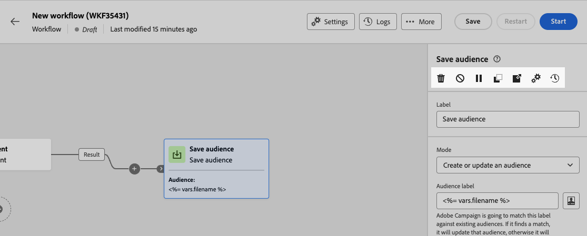
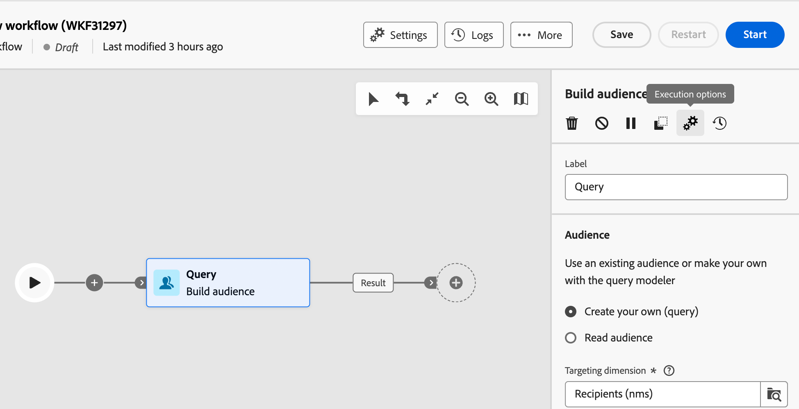

# Meerstappencampagne ordenen {#orchestrate}

Zodra u [ een multi-step campagne ](gs-campaign-creation.md) hebt gecreeerd, of van het multi-step campagnemenu of binnen een campagne, kunt u beginnen de verschillende taken te ordenen het zal uitvoeren. Hiervoor is een visueel canvas beschikbaar, waarmee u een uit meerdere stappen bestaand campagnediagram kunt samenstellen. Binnen dit diagram, kunt u diverse activiteiten toevoegen en hen in een opeenvolgende orde verbinden.

## Activiteiten toevoegen {#add}

In dit stadium van de configuratie, wordt het diagram getoond met een beginpictogram, dat het begin van uw multi-step campagne vertegenwoordigt. Als u uw eerste activiteit wilt toevoegen, klikt u op de knop **+** die is verbonden met het beginpictogram.

Er wordt een lijst met activiteiten weergegeven die aan het diagram kunnen worden toegevoegd. De beschikbare activiteiten zijn afhankelijk van uw positie binnen het campagnediagram met meerdere stappen. Bijvoorbeeld, wanneer het toevoegen van uw eerste activiteit, kunt u uw multi-step campagne beginnen door een publiek te richten, het multi-step campagneweg te splitsen, of a **te plaatsen wacht** activiteit om de multi-step campagneuitvoering te vertragen. Anderzijds, na a **bouwt publiek** activiteit, kunt u uw doel met het richten van activiteiten verfijnen, een levering naar uw publiek met kanaalactiviteiten verzenden, of het multi-step campagneproces met de activiteiten van de stroomcontrole organiseren.

{zoomable="yes"}

Zodra een activiteit aan het diagram is toegevoegd, verschijnt een juiste ruit, toestaand u om de onlangs toegevoegde activiteit met specifieke montages te vormen. De gedetailleerde informatie over hoe te om elke activiteit te vormen is beschikbaar in [ deze sectie ](activities/about-activities.md).

{zoomable="yes"}

Herhaal dit proces om zoveel activiteiten toe te voegen als u wilt, afhankelijk van de taken die u wilt uitvoeren voor uw campagne in meerdere stappen. U kunt ook een nieuwe activiteit invoegen tussen twee activiteiten. Om dit te doen, klik **+** knoop op de overgang tussen de activiteiten, selecteer de gewenste activiteit en vorm het in de juiste ruit.

Om een activiteit te verwijderen, selecteer het op het canvas en klik **Schrapping** pictogram in de activiteiteneigenschappen.

>[!TIP]
>
>U kunt de naam van de overgangen tussen elke activiteit aanpassen. U doet dit door de overgang te selecteren en het label ervan te wijzigen in het rechterdeelvenster.

## De werkbalk {#toolbar}

De werkbalk in de rechterbovenhoek van het canvas bevat opties waarmee u de activiteiten eenvoudig kunt manipuleren en op het canvas kunt navigeren:

* **Veelvoudige selectiemodus**: Selecteer veelvoudige activiteiten om hen allen in één keer te schrappen of hen te kopiëren en te kleven. Zie [deze sectie](#copy).
* **roteer**: Verdraai verticaal het canvas.
* **Passend aan het scherm**: Pas het het gezoemniveau van het canvas aan uw scherm aan.
* **Gezoem uit** / **Gezoem binnen**: Gezoem uit of in het canvas.
* **kaart van de Vertoning**: Opent een momentopname van het canvas die u toont wordt gevestigd.

{zoomable="yes"}{width="50%"}

## Activiteiten beheren {#manage}

Wanneer u activiteiten toevoegt, zijn er actieknoppen beschikbaar in het deelvenster Eigenschappen, zodat u meerdere bewerkingen kunt uitvoeren.

{zoomable="yes"}

U kunt:

* **Schrap** de activiteit van het canvas.
* **onbruikbaar maken/laat** de activiteit toe. Wanneer de meerstapscampagne wordt uitgevoerd, worden activiteiten met een handicap en de volgende activiteiten op hetzelfde pad niet uitgevoerd en wordt de meerstapscampagne gestopt.
* **Pauze/hervat** de activiteit. Wanneer de multi-step campagne wordt uitgevoerd, pauzeert het bij de gepauzeerde activiteit. De bijbehorende taak en alle taken die deze in hetzelfde pad volgen, worden niet uitgevoerd.
* **Exemplaar** de activiteit. Zie [deze sectie](#copy).
* **beweging** een activiteit en al zijn kindknopen aan een andere overgang. Zie [ deze sectie ](#move)
* Heb toegang tot de opties van de activiteit **Uitvoering**.
* Heb toegang tot de Logboeken en de taken van de activiteit ****.

Verscheidene **richtend** activiteiten, zoals **combineren** of **Deduplicatie**, staat u toe om de resterende bevolking te verwerken en het in een extra uitgaande overgang te omvatten. Bijvoorbeeld, als u a **Gesplitste** activiteit gebruikt, bestaat de aanvulling uit de bevolking die om het even welke eerder bepaalde ondergroepen niet aanpast. Om dit vermogen te gebruiken, activeer **aanvult** optie.

## Verplaatsen of kopiëren {#move-copy}

### Kopiëren en plakken {#copy}

U kunt uit meerdere stappen bestaande campagneactiviteiten kopiëren en deze in elke werkstroom plakken. De campagne met meerdere stappen voor het doel kan zich op een ander browsertabblad bevinden.

Voor het kopiëren van activiteiten hebt u twee mogelijkheden:

* Kopieer één activiteit gebruikend de actieknoop.

  {zoomable="yes"}{width="70%"}

* Kopieer meerdere activiteiten met de werkbalkknop.

  {zoomable="yes"}{width="70%"}

Als u de gekopieerde activiteiten wilt plakken, klikt u op de knop **+** in een overgang en selecteert u &quot;X-activiteit plakken&quot;.

{zoomable="yes"}{width="50%"}

### Activiteiten verplaatsen en hun onderliggende knooppunten verplaatsen {#move}

Met Journey Optimizer kunt u een activiteit samen met de volledige inhoud van de onderliggende knooppunten (inclusief alle overgangen en activiteiten in de onderliggende knooppunten) verplaatsen naar het einde van een andere overgang binnen dezelfde campagne met meerdere stappen.

Dit proces verbreekt de verbinding tussen de activiteit en alles in de uitgaande overgang van de oorspronkelijke locatie en verplaatst deze naar de nieuwe doelovergang.

Een activiteit verplaatsen:

1. Selecteer de activiteit die u wilt verplaatsen.
1. In de de eigenschappen van de activiteit ruit, klik de **knoop van de Beweging**.
1. Selecteer de overgang waar u de activiteit en zijn uitgaande overgang wilt plaatsen, dan bevestig.

## Execution options {#execution}

Met alle activiteiten kunt u de uitvoeropties ervan beheren. Selecteer een activiteit en klik op de **opties van de Uitvoering** knoop. Hiermee kunt u de uitvoeringsmodus en het gedrag van de activiteit definiëren in het geval van fouten.

{zoomable="yes"}{width="70%"}

### Properties

Het **gebied van de Uitvoering** staat u toe om de uit te voeren actie te bepalen wanneer de taak is begonnen.

Het **Maximale uitvoeringstijd** gebied staat u toe om een duur zoals &quot;30s&quot;of &quot;1h&quot;te specificeren. Als de activiteit niet wordt gebeëindigd nadat de gespecificeerde duur is verstreken, wordt een alarm teweeggebracht. Dit heeft geen invloed op de werking van de campagne in meerdere stappen.

Het **gebied van de tijdzone** staat u toe om de tijdzone van de activiteit te selecteren. Met Adobe Journey Optimizer kunt u de tijdsverschillen tussen meerdere landen op hetzelfde moment beheren. De toegepaste instelling wordt geconfigureerd wanneer de instantie wordt gemaakt.

**het gebied van de affiniteit** staat u toe om een multi-step campagne of een multi-step campagneactiviteit te dwingen om op een bepaalde machine uit te voeren. Hiervoor moet u een of meer affiniteiten opgeven voor de betreffende meerfasecampagne of -activiteit.

Het **gebied van het Gedrag** staat u toe om de te volgen procedure te bepalen als de asynchrone taken worden gebruikt.

### Foutbeheer

Het **In geval van fout** gebied staat u toe om de uit te voeren actie te specificeren als de activiteit een fout ontmoet.

### Initialisatiescript

Het **manuscript van de Initialisatie** laat u variabelen initialiseren of activiteiteneigenschappen wijzigen. Klik **geef code** knoop uit en typ het fragment van uit te voeren code. Het script wordt aangeroepen wanneer de activiteit wordt uitgevoerd.

## Voorbeeld {#example}

Hier volgt een voorbeeld van een campagne die uit meerdere stappen bestaat en die is ontworpen om een e-mail te sturen naar alle klanten (behalve VIP-klanten) met een e-mail die geïnteresseerd zijn in koffiecomputers.

{zoomable="yes"}{zoomable="yes"}

Hiervoor zijn de volgende activiteiten toegevoegd:

* Een **[!UICONTROL Fork]** -activiteit die de campagne met meerdere stappen onderverdeelt in drie paden (één voor elke set klanten),
* **[!UICONTROL Build audience]** -activiteiten om zich te richten op de drie groepen klanten:

   * Klanten met een e-mail,
   * Klanten die behoren tot het reeds bestaande publiek &quot;Interrested in Coffee Machine(s)&quot;,
   * Klanten die tot het reeds bestaande &quot;VIP of bonus&quot;-publiek behoren.

* Een **[!UICONTROL Combine]** activiteit die klanten met een e-mail en degenen groepeert die in koffiemachines geinteresseerd zijn,
* Een **[!UICONTROL Combine]** -activiteit die VIP-klanten uitsluit,
* Een **[!UICONTROL Email delivery]** -activiteit die een e-mail naar de resulterende klanten verzendt.

Als u de campagne met meerdere stappen hebt voltooid, voegt u en **[!UICONTROL End]** activiteit toe aan het einde van het diagram. Met deze activiteit kunt u visueel het einde van een werkstroom markeren en heeft deze geen invloed op de functionaliteit.

Nadat u het campagnediagram met meerdere stappen hebt ontworpen, kunt u de campagne in meerdere stappen uitvoeren en de voortgang van de verschillende taken bijhouden. [ Leer hoe te om een multi-step campagne te beginnen en zijn uitvoering te controleren ](start-monitor-campaigns.md)
