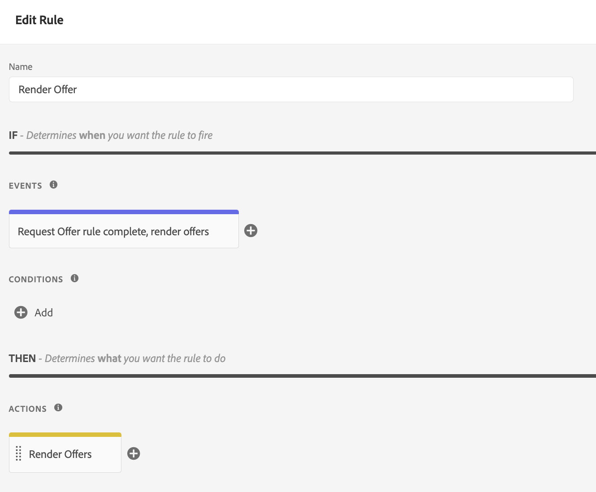

# Aanbiedingen leveren met de Edge-API voor besluitvorming {#edge-decisioning-api}

>[!TIP]
>
>Het besluit, de nieuwe beslissingsmogelijkheden van [!DNL Adobe Journey Optimizer], is nu beschikbaar via de op code gebaseerde ervaring en e-mailkanalen! [Meer informatie](../../../experience-decisioning/gs-experience-decisioning.md)

## Aan de slag en voorwaarden {#edge-overview-and-prerequisites}

Het [&#x200B; Web SDK van Adobe Experience Platform &#x200B;](https://experienceleague.adobe.com/docs/experience-platform/edge/home.html#video-overview) is een cliënt-kant bibliotheek van JavaScript die de klanten van Adobe Experience Cloud toestaat om met de diverse diensten in Experience Cloud door Experience Platform Edge Network in wisselwerking te staan.

Experience Platform Web SDK steunt het vragen van de verpersoonlijkingsoplossingen in Adobe, met inbegrip van Beslissingsbeheer, die u toestaat om gepersonaliseerde aanbiedingen terug te winnen en terug te geven die u gebruikend APIs of de Bibliotheek van de Aanbieding hebt gecreeerd. Voor meer gedetailleerde instructies, verwijs naar de documentatie bij [&#x200B; het creëren van een aanbieding &#x200B;](../../get-started/starting-offer-decisioning.md).

Er zijn twee manieren om besluitvormingsbeheer met het [&#x200B; Web SDK van het Platform &#x200B;](https://experienceleague.adobe.com/docs/experience-platform/edge/home.html#video-overview) uit te voeren. Eén manier is gericht op ontwikkelaars en vereist kennis van websites en programmering. De andere manier is door de Adobe Experience Platform-gebruikersinterface te gebruiken voor het instellen van aanbiedingen waarbij alleen naar een klein script moet worden verwezen in de koptekst van de HTML-pagina.

Verwijs naar de documentatie van Adobe Experience Platform over [&#x200B; besluitvormingsbeheer &#x200B;](https://experienceleague.adobe.com/docs/experience-platform/edge/personalization/offer-decisioning/offer-decisioning-overview.html#enabling-offer-decisioning) voor meer informatie over hoe te om gepersonaliseerde aanbiedingen te leveren gebruikend SDK van het Web van Adobe Experience Platform.

## Adobe Experience Platform Web SDK {#aep-web-sdk}

Platform Web SDK vervangt de volgende SDK&#39;s:

* Visitor.js
* AppMeasurement.js
* AT.js
* DIL.js

De SDK heeft deze bibliotheken niet met elkaar gecombineerd en is een nieuwe implementatie. Als u dit wilt gebruiken, moet u eerst de volgende stappen uitvoeren:

1. Zorg ervoor dat uw organisatie over de juiste machtigingen beschikt om de SDK te gebruiken en dat u de machtigingen correct hebt geconfigureerd.

   <!-- For more detailed instructions, refer to the documentation on using the [Adobe Experience Platform Web SDK](). -->

1. [&#x200B; vorm uw gegevensstroom &#x200B;](https://experienceleague.adobe.com/docs/experience-platform/edge/fundamentals/datastreams.html) binnen het lusje van de Inzameling van Gegevens in uw rekening in Adobe Experience Cloud.

1. Installeer de SDK. Er zijn veelvoudige methodes om dit te doen, die op [&#x200B; behandeld zijn installeer de pagina van SDK &#x200B;](https://experienceleague.adobe.com/docs/experience-platform/edge/fundamentals/installing-the-sdk.html). Deze pagina gaat verder met elke andere implementatiemethode.

Om SDK te gebruiken, moet u a [&#x200B; schema &#x200B;](../../../data/get-started-schemas.md) hebben en a [&#x200B; datastream &#x200B;](../../../data/get-started-datasets.md) bepaald.

<!-- ****TODO - Configure schema**** -->

Om aanbiedingen te personaliseren, moet u uw personalisatie/profielen afzonderlijk vormen.

<!-- Refer to the [doc](www.link.com) for detailed instructions.  -->

>[!NOTE]
>
>**het overgaan van contextgegevens in Edge beslissingsverzoeken**
>
>U kunt contextgegevens (zoals apparaattype, locatie of gebruikersvoorkeuren) doorgeven in uw Edge-beslissingsverzoeken om dynamische geschiktheidsregels te maken en persoonlijke aanbiedingen te leveren op basis van real-time voorwaarden. [&#x200B; Leer meer op contextgegevens &amp; Edge beslissingsverzoeken &#x200B;](../../context-data-edge.md)

Voer een van de volgende twee stappen uit om de SDK voor besluitvormingsbeheer te configureren:

## Optie 1 - De tagextensie en -implementatie installeren met Starten

Deze optie is gebruiksvriendelijker voor mensen die minder ervaring hebben met coderen.

1. [&#x200B; creeer een markeringsbezit &#x200B;](https://experienceleague.adobe.com/docs/experience-platform/tags/admin/companies-and-properties.html)

1. [&#x200B; voeg de ingebedde code &#x200B;](https://experienceleague.adobe.com/docs/core-services-learn/implementing-in-websites-with-launch/configure-launch/launch-add-embed.html) toe

1. Installeer en vorm de uitbreiding van Adobe Experience Platform Web SDK met de Datstream u door de configuratie van &quot;Datstream&quot;dropdown te selecteren creeerde. Zie de documentatie op [&#x200B; uitbreidingen &#x200B;](https://experienceleague.adobe.com/docs/experience-platform/tags/ui/extensions/overview.html).

   

   

1. Creeer de noodzakelijke [&#x200B; Elementen van Gegevens &#x200B;](https://experienceleague.adobe.com/docs/experience-platform/tags/ui/data-elements.html). Bij het absolute minimum, moet u een Identiteitskaart van het Web van het Platform van SDK en een het gegevenselement van de Objecten van SDK XDM van het Web van het Platform tot stand brengen XDM.

   

   

1. Creeer uw [&#x200B; Regels &#x200B;](https://experienceleague.adobe.com/docs/experience-platform/tags/ui/rules.html):

   Voeg een Actie van de Gebeurtenis van het Web van het Platform toe SDK verzendt en voeg relevante decisionsScopes aan de configuratie van die actie toe

    terug

   

1. [&#x200B; creeer en publiceer &#x200B;](https://experienceleague.adobe.com/docs/experience-platform/tags/publish/libraries.html) een bibliotheek die alle relevante Regels, de Elementen van Gegevens, en Uitbreidingen bevat u hebt gevormd.

## Optie 2 - Handmatig implementeren met behulp van de geïntegreerde zelfstandige versie

Hier zijn de stappen nodig om besluitvormingsbeheer te gebruiken gebruikend de prebuilt standalone installatie van het Web SDK. In deze handleiding wordt ervan uitgegaan dat dit de eerste keer is dat u de SDK implementeert. Het is dus mogelijk dat niet alle stappen op u van toepassing zijn. Deze gids veronderstelt ook enige ontwikkelervaring.

Omvat het volgende fragment van JavaScript van Optie 2: De Prebuilt Standalone Versie op [&#x200B; deze pagina &#x200B;](https://experienceleague.adobe.com/docs/experience-platform/edge/fundamentals/installing-the-sdk.html) in de `<head>` sectie van uw pagina van HTML.

```
javascript
    <script>
        !function(n,o){o.forEach(function(o){n[o]||((n.__alloyNS=n.__alloyNS||
        []).push(o),n[o]=function(){var u=arguments;return new Promise(
        function(i,l){n[o].q.push([i,l,u])})},n[o].q=[])})}
        (window,["alloy"]);
    </script>
    <script src="https://cdn1.adoberesources.net/alloy/2.6.4/alloy.js" async></script>
```

U hebt twee id&#39;s nodig vanuit uw Adobe-account om de SDK-configuratie in te stellen: uw edgeConfigId en uw orgId. edgeConfigId is het zelfde als uw identiteitskaart DataStream, die u in de Eerste vereisten zou moeten gevormd hebben.

Ga naar Gegevensverzameling en selecteer uw DataStream om de edgeConfigID/datastream-id te zoeken. Ga naar uw profiel om uw orgId te zoeken.

Configureer de SDK in JavaScript volgens de instructies op deze pagina. U zult altijd edgeConfigId en orgId in de configuratiefunctie gebruiken. De documentatie beschrijft ook welke facultatieve parameters voor uw configuratie bestaan. De uiteindelijke configuratie ziet er misschien ongeveer als volgt uit:

```
javascript
    alloy("configure", {
        "edgeConfigId": "12345678-0ABC-DEF-GHIJ-KLMNOPQRSTUV",                            
        "orgId":"ABCDEFGHIJKLMNOPQRSTUVW@AdobeOrg",
        "debugEnabled": true,
        "edgeDomain": "edge.adobedc.net",
        "clickCollectionEnabled": true,
        "idMigrationEnabled": true,
        "thirdPartyCookiesEnabled": true,
        "defaultConsent":"in"  
    });
```

Installeer de extensie Foutopsporing Chrome die u wilt gebruiken bij foutopsporing. Dat kun je hier vinden: <https://chrome.google.com/webstore/detail/adobe-experience-platform/bfnnokhpnncpkdmbokanobigaccjkpob>

Meld u vervolgens aan bij uw account binnen de foutopsporing. Ga vervolgens naar Logs en controleer of u bent verbonden met de juiste werkruimte. Kopieer nu de base64 gecodeerde versie van het beslissingsbereik van uw aanbieding.

Wanneer u uw website bewerkt, neemt u het script op met de configuratie en de functie `sendEvent` om het beslissingsbereik naar Adobe te verzenden.

**Voorbeeld**:

```
javascript
    alloy("sendEvent", {
        "decisionScopes": 
        [
        "eyJ4ZG06YWN0aXZpdHlJZCI6Inhjb3JlOm9mZmVyLWFjdGl2aXR5OjE0ZWE4MDhhZjJjZDM1NzQiLCJ4ZG06cGxhY2VtZW50SWQiOiJ4Y29yZTpvZmZlci1wbGFjZW1lbnQ6MTRjNGFmZDI2OTXXXXXXXXXX"
        ]
    });
```

Zie het volgende voorbeeld voor een voorbeeld van hoe te om de reactie te behandelen:

```
javascript
    alloy("sendEvent", {
        "decisionScopes":
        [
        "eyJ4ZG06YWN0aXZpdHlJZCI6Inhjb3JlOm9mZmVyLWFjdGl2aXR5OjE0ZWE4MDhhZjJjZDM1NzQiLCJ4ZG06cGxhY2VtZW50SWQiOiJ4Y29yZTpvZmZlci1wbGFjZW1lbnQ6MTRjNGFmZDI2OTXXXXXXXXXX"
        ]
    }).then(function(result) {
        Object.entries(result).forEach(([key, value]) => {
            console.log(key, value);
        });
    });
```

U kunt de debugger gebruiken om te verifiëren dat u met succes met het netwerk van Edge hebt verbonden.

>[!NOTE]
>
>Als u geen verbinding met de rand ziet in de logboeken, moet u de advertentieblokkering mogelijk uitschakelen.

Ga terug naar de manier waarop je voorstel hebt gemaakt en de gebruikte opmaak. Op basis van de criteria die in het besluit zijn opgenomen, wordt een voorstel met de informatie die u hebt opgegeven bij het maken van het voorstel in Adobe Experience Platform, aan u teruggestuurd.

In dit voorbeeld is de JSON die moet worden geretourneerd:

```
json
{
   "name":"ABC Test",
   "description":"This is a test offer", 
   "link":"https://sampletesting.online/",
   "image":"https://sample-demo-URL.png"
}
```

Verwerk het reactieobject en parseer de benodigde gegevens. Aangezien u veelvoudige besluitvormingswerkingsgebied in één `sendEvent` vraag kunt verzenden, zou uw reactie lichtjes verschillend kunnen kijken.

```
json
    {
        "id": "abrxgl843d913",
        "scope": "eyJ4ZG06YWN0aXZpdHlJZCI6Inhjb3JlOm9mZmVyLWFjdGl2aXR5OjE0ZWE4MDhhZjJjZDM1NzQiLCJ4ZG06cGxhY2VtZW50SWQiOiJ4Y29yZTpvZmZlci1wbGFjZW1lbnQ6MTRjNGFmZDI2OTVlNWRmOSJ9",
        "items": 
        [
            {
                "id": "xcore:fallback-offer:14ea7f1ea26ebd0a",
                "etag": "1",
                "schema": "https://ns.adobe.com/experience/offer-management/content-component-json",
                "data": {
                    "id": "xcore:fallback-offer:14ea7f1ea26ebd0a",
                    "format": "application/json",
                    "language": [
                        "en-us"
                    ],
                    "content": "{\"name\":\"ABC Test\",\"description\":\"This is a test offer\", \"link\":\"https://sampletesting.online/\",\"image\":\"https://sample-demo-URL.png\"}"
                }
            }
        ]
    }
]
}
```

```
json
{
    "propositions": 
    [
    {
        "renderAttempted": false,
        "id": "e15ecb09-993e-4b66-93d8-0a4c77e3d913",
        "scope": "eyJ4ZG06YWN0aXZpdHlJZCI6Inhjb3JlOm9mZmVyLWFjdGl2aXR5OjE0ZWE4MDhhZjJjZDM1NzQiLCJ4ZG06cGxhY2VtZW50SWQiOiJ4Y29yZTpvZmZlci1wbGFjZW1lbnQ6MTRjNGFmZDI2OTVlNWRmOSJ9",
        "items": 
        [
            {
                "id": "xcore:fallback-offer:14ea7f1ea26ebd0a",
                "etag": "1",
                "schema": "https://ns.adobe.com/experience/offer-management/content-component-json",
                "data": {
                    "id": "xcore:fallback-offer:14ea7f1ea26ebd0a",
                    "format": "application/json",
                    "language": [
                        "en-us"
                    ],
                    "content": "{\"name\":\"Claire Hubacek Test\",\"description\":\"This is a test offer\", \"link\":\"https://sampletesting.online/\",\"image\":\"https://sample-demo-URL.png\"}"
                }
            }
        ]
    }
    ]
}
```

In dit voorbeeld was het pad dat nodig was om de aanbiedingsspecifieke details op de webpagina af te handelen en te gebruiken: `result['decisions'][0]['items'][0]['data']['content']`

De JS-variabelen instellen:

```
javascript
const offer = JSON.parse(result['decisions'][0]['items'][0]['data']['content']);

let offerURL = offer['link'];
let offerDescription = offer['description'];
let offerImageURL = offer['image'];

document.getElementById("offerDescription").innerHTML = offerDescription;
document.getElementById('offerImage').src = offerImageURL;
```

<!--## Limitations

Some offer constraints are currently not supported with the mobile Experience Edge workflows, for example Capping. The Capping field value specifies the number of times an offer can be presented across all users. For more details, see [Add constraints to an offer](../../offer-library/add-constraints.md#capping).-->
