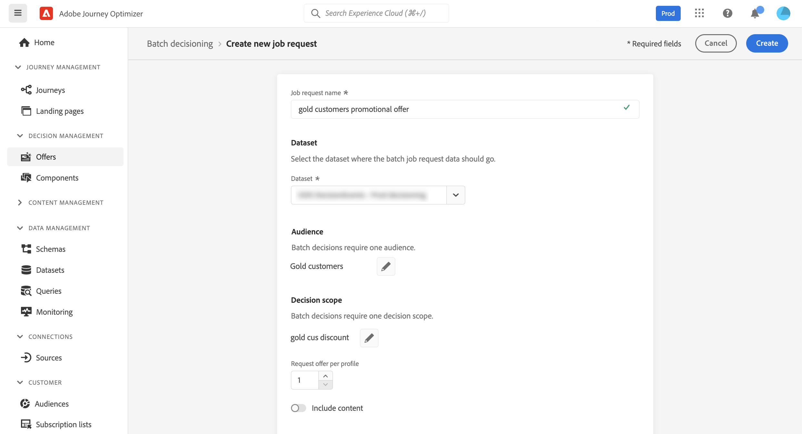
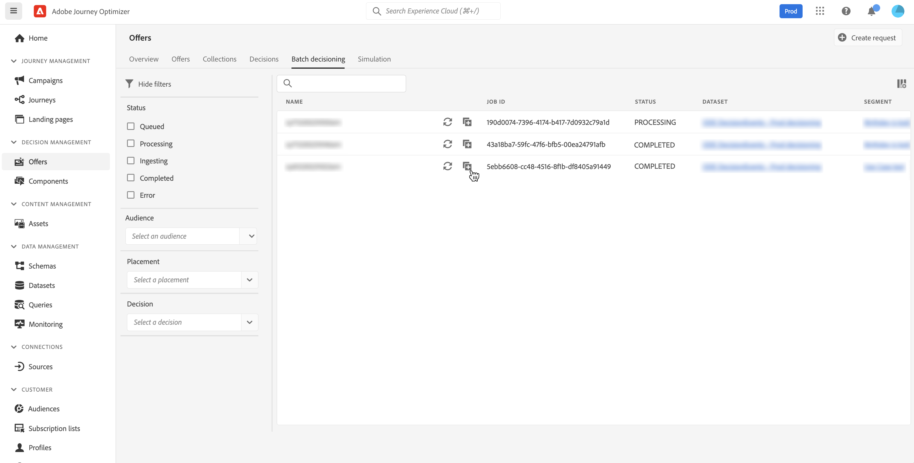

# Batchbeslissing {#deliver}

>[!TIP]
>
>Het besluit, de nieuwe beslissingsmogelijkheden van [!DNL Adobe Journey Optimizer], is nu beschikbaar via de op code gebaseerde ervaring en e-mailkanalen! [Meer informatie](../experience-decisioning/gs-experience-decisioning.md)

## Aan de slag met batch-beslissingen {#start}

Met Journey Optimizer kunt u besluiten aanbieden aan alle profielen in een bepaald Adobe Experience Platform-publiek.

Hiervoor moet u in Journey Optimizer een aanvraag voor een taak maken die informatie bevat over het doelpubliek en het besluit om een aanbieding te gebruiken. De aanbiedingsinhoud voor elk profiel in het publiek wordt dan geplaatst in een dataset van Adobe Experience Platform waar het voor de werkschema&#39;s van de douanepartij beschikbaar is.

Batchlevering kan ook worden uitgevoerd met behulp van API&#39;s. Voor meer op dit, verwijs naar de [&#x200B; Bevestiging API documentatie van de Partij &#x200B;](api-reference/offer-delivery-api/batch-decisioning-api.md).

## Vereisten {#prerequisites}

Voordat u een taakaanvraag configureert, moet u controleren of u het volgende hebt gemaakt:

* **dataset van A** in Adobe Experience Platform. Deze dataset zal worden gebruikt om het beslissingsresultaat op te slaan gebruikend het schema &quot;ODE DecisionEvents&quot;. Leer meer in de [&#x200B; documentatie van Datasets &#x200B;](https://experienceleague.adobe.com/docs/experience-platform/catalog/datasets/overview.html).

* **een publiek** in Adobe Experience Platform. Het publiek moet worden geëvalueerd en vervolgens worden bijgewerkt. Leer hoe te om de evaluatie van het publiekslidmaatschap in de [&#x200B; documentatie van de Dienst van de Segmentatie &#x200B;](https://www.adobe.com/go/segmentation-overview-en) bij te werken

  >[!NOTE]
  >
  >Een batchtaak loopt van de profielmomentopname die één keer per dag plaatsvindt. Met de optie Batch-beslissingen wordt de frequentie vastgelegd en worden profielen altijd geladen vanaf de meest recente momentopname. Wacht 24 uur nadat u een publiek hebt gemaakt voordat u de batch-beslissings-API uitprobeert.

* **een besluit van A** in Adobe Journey Optimizer. [&#x200B; Leer hoe te om een besluit &#x200B;](offer-activities/create-offer-activities.md) tot stand te brengen

<!-- in API doc, remove these info and add ref here-->

## Een taakaanvraag maken

Voer de onderstaande stappen uit om een nieuwe taakaanvraag te maken.

1. Open in het menu **[!UICONTROL Offers]** de tab **[!UICONTROL Batch decisioning]** en klik vervolgens op **[!UICONTROL Create request]** .

   

1. Geef uw taakverzoek een naam en selecteer vervolgens de gegevensset waarin de taakgegevens moeten worden verzonden.

1. Selecteer het Adobe Experience Platform-publiek dat u als doel wilt instellen.

1. Selecteer een of meer keuzelijsten voor biedingsbesluiten die u wilt gebruiken om aanbiedingen aan het publiek te leveren:
   1. Selecteer een plaatsing in de lijst.
   1. De beschikbare beslissingen voor de geselecteerde plaatsingsweergave. Selecteer de gewenste beslissing en klik op **[!UICONTROL Add]** .
   1. Herhaal de bewerking om zoveel beslissingsbereik toe te voegen als u wilt.

   

1. Standaard wordt één aanbieding van het beslissingsbereik geretourneerd voor elk profiel. U kunt het aantal geretourneerde voorstellen aanpassen met de optie **[!UICONTROL Request offer per profile]** . Als u bijvoorbeeld 2 selecteert, worden de beste 2 aanbiedingen weergegeven voor het geselecteerde beslissingsbereik.

   >[!NOTE]
   >
   >U kunt maximaal 30 voorstellen aanvragen per beslissingsbereik.

1. Schakel de optie **[!UICONTROL Include content]** in als u de aanbiedingsinhoud wilt opnemen in de gegevensset. Deze optie is standaard uitgeschakeld.

1. Klik op **[!UICONTROL Create]** om de taakaanvraag uit te voeren.

## Batchtaken controleren

Alle aangevraagde batchtaken zijn toegankelijk via het tabblad **[!UICONTROL Batch decisioning]** . Bovendien, zijn de onderzoek en het filtreren hulpmiddelen beschikbaar om u te helpen de lijst verfijnen.

### Status van taakaanvragen

Nadat een taakaanvraag is gemaakt, worden meerdere statussen gebruikt voor de batchtaak:

>[!NOTE]
>
>Om ervoor te zorgen dat u de recentste informatie over de status van een baanverzoek krijgt, gebruik de ellipsknoop naast de baan om het te verfrissen.

1. **[!UICONTROL Queued]**: De taakaanvraag is gemaakt en is in de verwerkingswachtrij geplaatst. Tot 5 partijbanen kunnen in een tijd per dataset worden in werking gesteld. Om het even welke andere partijverzoeken met de zelfde outputdataset worden toegevoegd aan de rij. Er wordt een taak in de wachtrij opgehaald om te worden verwerkt zodra de vorige taak is voltooid.
1. **[!UICONTROL Processing]**: De taakaanvraag wordt verwerkt
1. **[!UICONTROL Ingesting]**: De taakaanvraag is uitgevoerd, resultaatgegevens worden in de geselecteerde dataset opgenomen,
1. **[!UICONTROL Completed]**: Het taakverzoek is uitgevoerd en de resultaatgegevens worden nu opgeslagen in de geselecteerde dataset.

   >[!NOTE]
   >
   >U kunt tot de dataset toegang hebben waar de resultaten van een baan door zijn naam in baanlijst te klikken worden opgeslagen.

Als een fout optreedt terwijl de taakaanvraag wordt uitgevoerd, krijgt deze de status **[!UICONTROL Error]** . Probeer de batchtaak te dupliceren om een nieuwe aanvraag te maken. [&#x200B; leren hoe te om een partijbaan &#x200B;](#duplicate) te dupliceren

### Procestijd batchtaak

De tijd van begin tot eind voor elke partijbaan is de duur van de tijd de werkbelasting aan de tijd wordt gecreeerd wanneer het beslissingsresultaat in de outputdataset beschikbaar is.

De publieksgrootte is de belangrijkste factor die de partijbeslissingstijd van begin tot eind beïnvloedt. Als voor de in aanmerking komende aanbieding een algemeen frequentiegrenswaarde is ingeschakeld, duurt het nemen van batchbeslissingen meer tijd om dit te voltooien. Hieronder vindt u een aantal benaderingen van de end-to-end verwerkingstijd voor de verschillende doelformaten, zowel met als zonder aftopping van de frequentie voor in aanmerking komende aanbiedingen:

Met frequentiegrens ingeschakeld voor in aanmerking komende aanbiedingen:

| Grootte publiek | Eind-aan-eind verwerkingstijd |
|--------------|----------------------------|
| 10.000 profielen of minder | 7 minuten |
| 1 miljoen profielen of minder | 30 minuten |
| 15 miljoen profielen of minder | 50 minuten |

Zonder frequentiegrens voor in aanmerking komende aanbiedingen:

| Grootte publiek | Eind-aan-eind verwerkingstijd |
|--------------|----------------------------|
| 10.000 profielen of minder | 6 minuten |
| 1 miljoen profielen of minder | 8 minuten |
| 15 miljoen profielen of minder | 16 minuten |

## Een taakaanvraag dupliceren {#duplicate}

U kunt gegevens van een bestaande taak opnieuw gebruiken om een nieuwe aanvraag te maken.

Klik hiertoe op het pictogram voor dupliceren, bewerk indien nodig de taakgegevens en klik op **[!UICONTROL Create]** om de nieuwe aanvraag te maken.

