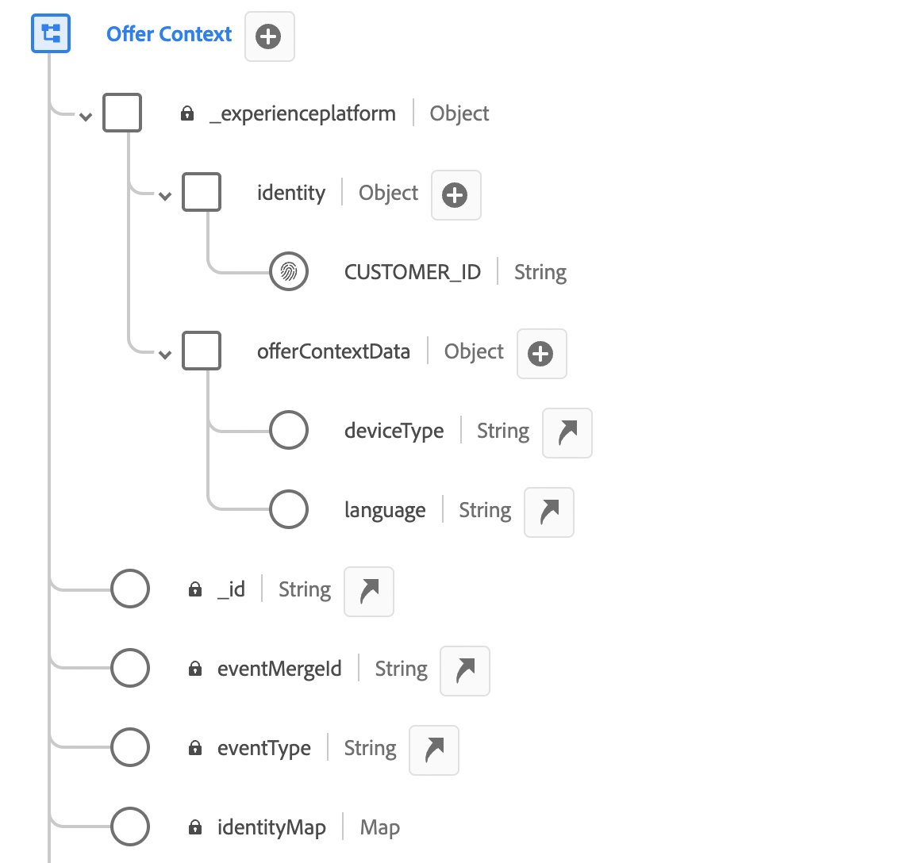

# Contextgegevens en Edge-beslissingsverzoeken {#edge}

In deze sectie worden contextgegevens doorgegeven in Edge-beslissingsverzoeken en worden deze gebruikt in subsidiabiliteitsregels. Wij zullen een gebruiksgeval van begin tot eind onderzoeken dat aantoont hoe te om gepersonaliseerde aanbiedingen te leveren die op het type van apparatenklanten worden gebaseerd.

Bij dit gebruik zijn verschillende belangrijke stappen betrokken:

1. [&#x200B; de eerste vereisten van de Opstelling &#x200B;](#prerequisites): Zorg alle noodzakelijke stappen worden voltooid om contextgegevens in uw verzoeken over te gaan.
1. [&#x200B; de contextgegevens van het Gebruik in toelatingsregels &#x200B;](#rules): Creeer regels die welke aanbiedingen bepalen om te tonen gebaseerd op het het apparatentype van de gebruiker.
1. [&#x200B; apparaat-specifieke aanbiedingen van het Ontwerp &#x200B;](#offers): Creeer op maat gemaakte aanbiedingen voor elk apparatentype en verbind hen met de overeenkomstige regels.
1. [&#x200B; creeer een aanbiedingsinzameling &#x200B;](#collection): Groepeer alle aanbiedingen samen in een statische inzameling.
1. [&#x200B; vorm een besluit &#x200B;](#decision): Creeer een nieuw besluit dat hefboomwerkingen de Motor van het Besluit van de Aanbieding om de beste aanbieding te kiezen om aan gebruikers voor te stellen die op hun apparatentype worden gebaseerd.
1. [&#x200B; geef contextgegevens in het Edge Beslissende verzoek &#x200B;](#request) door: geef contextgegevens door uw API verzoek door om de aangewezen aanbiedingen aan gebruikers terug te winnen en voor te stellen.

>[!BEGINSHADEBOX]

Om verder te gaan, kunt u hefboomwerkingscontextgegevens in **rangschikkende formules** ook, of **uw aanbiedingsvertegenwoordiging** dynamisch personaliseren. U kunt bijvoorbeeld één aanbieding maken en verpersoonlijkingsvelden gebruiken om de representatie aan te passen op basis van de contextgegevens. Geef bijvoorbeeld een bepaalde afbeelding weer als de gebruiker een iPhone heeft en een andere afbeelding voor iPad-gebruikers. Raadpleeg de volgende secties voor meer informatie:

* [Willekeurige formules - Verhoog de aanbiedingen op basis van contextgegevens](../offers/ranking/create-ranking-formulas.md#context-data)
* [Afbeeldingen personaliseren op basis van contextgegevens](../offers/offer-library/add-representations.md#context-data)

>[!ENDSHADEBOX]

## Vereisten om contextgegevens in Edge-beslissingsverzoeken door te geven {#prerequisites}

In tegenstelling tot het doorgeven van context in een vrij vrije indeling met behulp van de API voor besluitvorming, moet de lading van de Edge Decisioning-context voldoen aan de XDM Experience Event-standaard. Hiervoor moet de context worden gedefinieerd als onderdeel van de &#39;XDM Experience Event&#39; die wordt gebruikt voor gegevensverzameling.

1. Definieer een ervaringsgebeurtenisschema. Voor dit gebruiksgeval wordt een schema &quot;Context van de Aanbieding&quot;gecreeerd en de gebieden van de aanbiedingscontext maken deel uit van een het gebiedsgroep van de &quot;Context van de Aanbieding&quot;. In werkelijkheid zou de veldgroep worden toegevoegd aan het schema van de ervaringsgebeurtenis dat wordt gebruikt voor gegevensverzameling die is gekoppeld aan de gegevensstroom &#39;Edge Collection Network&#39;.

   >[!NOTE]
   >
   >Het gebeurtenisschema van de aanbiedingscontext-ervaring moet onderdeel zijn van een profiel, waarbij het veld &#39;CUSTOMER_ID&#39; wordt gebruikt als primaire identiteit.

   In dit voorbeeld heeft de veldgroep &quot;Context aanbod&quot; twee eigenschappen: taal en deviceType. Deze eigenschappen zullen worden gebruikt in de rangorde en de toelatingsregels voor aanbiedingen.

   {width="60%" align="center" zoomable="yes"}

   Leer hoe te met schema&#39;s in het Model van de Gegevens van de Ervaring van Adobe Experience Platform [&#x200B; (XDM) gids &#x200B;](https://experienceleague.adobe.com/nl/docs/experience-platform/xdm/home){target="_blank"} werken

1. Maak een dataset (hier &quot;Context van aanbieding&quot;) en zorg ervoor dat deze is ingeschakeld voor profiel.

1. Maak een nieuwe gegevensstroom via het menu **[!UICONTROL Data Collection]** > **[!UICONTROL Datastreams]** . Leer hoe te om gegevensstroom in de gids van Gegevens van Adobe Experience Platform [&#x200B; tot stand te brengen en te vormen &#x200B;](https://experienceleague.adobe.com/nl/docs/experience-platform/datastreams/configure){target="_blank"}

   Hier, hebben wij een &quot;context van de Aanbieding&quot;gegevensstroom gecreeerd, met het de gebeurtenisschema van de &quot;Inhoud van de Aanbieding&quot;geselecteerd.

   

1. Bewerk de zojuist gemaakte gegevensstroom en selecteer &quot;Adobe Experience Platform&quot; als de service en &quot;Context aanbieden&quot; als de gebeurtenisdataset.

   

1. Sla de gegevensstroom op en kopieer de bijbehorende id. Deze id wordt gebruikt in het API-aanvraageindpunt. [&#x200B; Leer hoe te om de API vraag &#x200B;](#request) te bouwen

   

## Contextgegevens gebruiken in subsidiabiliteitsregels {#rules}

Maak subsidiabiliteitsregels die bepalen welke aanbiedingen moeten worden weergegeven op basis van het apparaattype van de gebruiker:


* iPhone-apparaatregel:

   * Regelnaam: &quot;Edge Context Rule - iphone&quot;
   * Configuration: deviceType = &#39;iphone&#39;
   * PQL-syntaxis:

     ```
     select _Any1 from xEvent where _Any1._experienceplatform.offerContextData.deviceType.equals("iphone", false)
     ```

* ipad apparaatregel:

   * Regelnaam: &quot;Edge Context Rule - ipad&quot;
   * Configuration: deviceType = &#39;ipad&#39;
   * PQL-syntaxis

     ```
     select _Any1 from xEvent where _Any1._experienceplatform.offerContextData.deviceType.equals("ipad", false)
     ```

## Aanbiedingen maken {#offers}

Maak een aanbieding voor elk apparaattype en koppel deze aan de overeenkomende, eerder gemaakte geschiktheidsregel:

* Voorstel voor telefoongebruikers:

   * Naam van aanbieding: &quot;Edge Context - iPhone Offer Content&quot;
   * Gekoppelde regel: &quot;Edge Context Rule - iPhone&quot;

* Voorstel voor iPad-gebruikers:

   * Naam van voorstel: Edge Context - iPad Offer Content:
   * Gekoppelde regel: &quot;Edge Context Rule - ipad&quot;

Maak bovendien een fallback-aanbieding (hier &#39;&#39;Context Fallback Content&#39;&#39;) om weer te geven als niet aan specifieke apparaatcriteria wordt voldaan.

## Aanbiedingen toevoegen in een verzameling {#collection}

Voeg de aanbiedingen toe die eerder zijn gemaakt aan een statische verzameling met de naam &quot;Edge Device Context&quot;. In het besluit tot het indienen van een bod zullen in aanmerking komende aanbiedingen worden gekozen die aan klanten worden aangeboden.


## Beslissing voorstel maken {#decision}

Maak een nieuw besluit dat gebruikmaakt van de Offertebeslissingsengine om de beste aanbieding te kiezen die op basis van hun apparaattype aan gebruikers kan worden getoond met de &quot;Context Fallback&quot;-aanbieding geselecteerd als de fallback-aanbieding.


>[!NOTE]
>
>Om verder te gaan, kunt u contextgegevens in rangschikkingsformules gebruiken en hen aan uw besluit toewijzen. INFORMATIE TOEVOEGEN

## Contextgegevens in de Edge-beslissingsaanvraag doorgeven {#request}

### Endpoint

In het eindpunt, gebruik identiteitskaart van de [&#x200B; eerder gemaakte gegevensstroom &#x200B;](#prerequisites).

`https://edge.adobedc.net/ee/irl1/v1/interact?configId=f3c47f2a-c484-4908-87a5-a82b55039e22`

### Payload

Hier is een voorbeeld van een verzoek die contextgegevens overgaan.

* Informatie over het type apparaat wordt doorgegeven in het knooppunt `xdm:ContextData` .
* In de `decisionScopes` knoop, kopieer-kleef het besluitvormingswerkingsgebied van het [&#x200B; aanbiedingsbesluit &#x200B;](#decision) eerder gevormd.

  +++Waar kan het beslissingsbereik worden opgehaald?

  

  +++

```
{
    "events": [{
        "xdm": {
            "identityMap": {
                "customerId": [{
                    "id": "0000158216",
                    "authenticatedState": "authenticated",
                    "primary": true
                }]
            },
            "_experienceplatform": {
                "identity": {
                    "core": {
                        "customerId": "0000158216"
                    }
                },
                "offerContextData" : {
                    "language" : "NL",
                    "deviceType" : "iphone"
                }
            }
        }
    }],
    "query": {
        "personalization": {
            "decisionScopes": ["eyJ4ZG06YWN0aXZpdHlJZCI6Inhjb3JlOm9mZmVyLWFjdGl2aXR5OjE3M2I1MGM5Mjg0ZGQ4NzkiLCJ4ZG06cGxhY2VtZW50SWQiOiJ4Y29yZTpvZmZlci1wbGFjZW1lbnQ6MTZhMzQxZWQ4ZDYyMzc2MSJ9"]
        }
    }
}
```

### Antwoord

Hier volgt een voorbeeldreactie:

```
{
    "requestId": "14a2d3f5-a6fa-494e-b42c-cc65a845284a",
    "handle": [
        {
            "payload": [
                {
                    "id": "1eafc831-4819-4800-8e25-c9e9f0838e09",
                    "scope": "eyJ4ZG06YWN0aXZpdHlJZCI6Inhjb3JlOm9mZmVyLWFjdGl2aXR5OjE3M2I1MGM5Mjg0ZGQ4NzkiLCJ4ZG06cGxhY2VtZW50SWQiOiJ4Y29yZTpvZmZlci1wbGFjZW1lbnQ6MTZhMzQxZWQ4ZDYyMzc2MSJ9",
                    "activity": {
                        "id": "xcore:offer-activity:173b50c9284dd879",
                        "etag": "1",
                        "name": "Edge Device Context"
                    },
                    "placement": {
                        "id": "xcore:offer-placement:16a341ed8d623761",
                        "etag": "1",
                        "name": "HIB",
                        "channel": "https://ns.adobe.com/xdm/channel-types/mobile",
                        "componentType": "https://ns.adobe.com/experience/offer-management/content-component-json"
                    },
                    "items": [
                        {
                            "id": "xcore:personalized-offer:173b4e05676d87f5",
                            "etag": "3",
                            "name": "Edge Context - iPhone Offer",
                            "priority": 0,
                            "schema": "https://ns.adobe.com/experience/offer-management/content-component-json",
                            "data": {
                                "id": "xcore:personalized-offer:173b4e05676d87f5",
                                "format": "application/json",
                                "language": [
                                    "en-gb"
                                ],
                                "content": "{\n    \"name\" : \"iphone offer\"\n}"
                            }
                        }
                    ]
                }
            ],
            "type": "personalization:decisions",
            "eventIndex": 0
        },
        {
            "payload": [],
            "type": "activation:pull",
            "eventIndex": 0
        },
        {
            "payload": [],
            "type": "personalization:decisions",
            "eventIndex": 0
        },
        {
            "payload": [
                {
                    "scope": "Target",
                    "hint": "37",
                    "ttlSeconds": 1800
                },
                {
                    "scope": "AAM",
                    "hint": "6",
                    "ttlSeconds": 1800
                },
                {
                    "scope": "EdgeNetwork",
                    "hint": "irl1",
                    "ttlSeconds": 1800
                }
            ],
            "type": "locationHint:result"
        },
        {
            "payload": [
                {
                    "key": "kndctr_907075E95BF479EC0A495C73_AdobeOrg_identity",
                    "value": "CiY0MDAwMDgyMjMzNTEzNzU1OTcwMjQ0NDcyNjU1MTAyMDEwNDQ3MVIRCNnE4Y6QMRABGAEqBElSTDHwAdnE4Y6QMQ==",
                    "maxAge": 34128000
                },
                {
                    "key": "kndctr_907075E95BF479EC0A495C73_AdobeOrg_cluster",
                    "value": "irl1",
                    "maxAge": 1800
                }
            ],
            "type": "state:store"
        }
    ]
}
```
