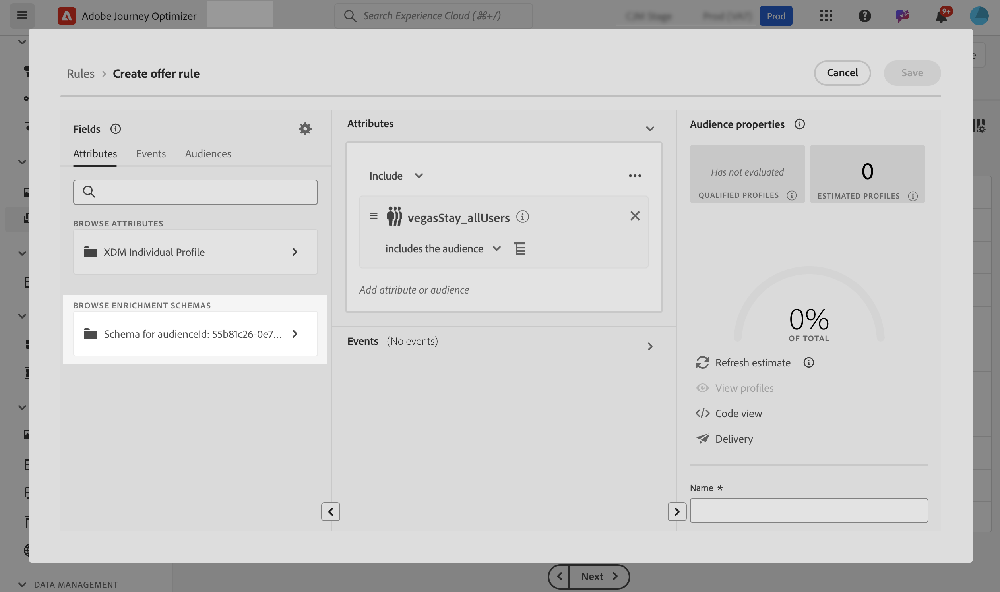
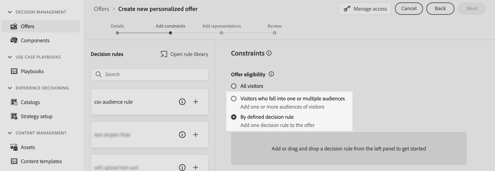

# Aangepast uploadpubliek gebruiken voor beslissingen {#custom-upload-decisioning}

Met Journey Optimizer kunt u gegevens van gebruikers die zijn gemaakt met Aangepast uploaden (CSV-bestand) naar Adobe Experience Platform gebruiken om uw workflows voor Beslissingsbeheer te ondersteunen. Dit is met name nuttig wanneer de gegevens niet nodig zijn voor het profiel, maar nog steeds essentieel zijn voor beslissingsdoeleinden.

Gegevens van een aangepast publiek voor uploaden kunnen in Beslissingsbeheer worden gebruikt voor:

1. Subsidiabiliteitscriteria in aanbiedingen en besluiten.
2. Inhoud aanpassen in aanbiedingsafbeeldingen.

Raadpleeg de secties voor meer informatie over het publiek voor Aangepaste upload:

* [Aan de slag met publiek en Journey Optimizer](../audience/about-audiences.md)
* [&#x200B; het Invoeren van een publiek in Adobe Experience Platform &#x200B;](https://experienceleague.adobe.com/nl/docs/experience-platform/segmentation/ui/audience-portal#import-audience){target="_blank"}

## Lees hier meer {#must-read}

* Deze functionaliteit wordt gesteund in **slechts het Beheer van het Besluit**, niet in Beslissing (vroeger gekend als &quot;Beslissing van de Ervaring&quot;).
* Het is uitsluitend beschikbaar door **Beslissing API (Hub)** verzoeken en wordt niet gesteund door **Edge Decisioning API** of **partijbesluit**.

## Een aangepast upload-publiek gebruiken als geschiktheidscriteria {#eligibilty}

U kunt een publiek van de upload van de Douane als geschiktheidscriteria op zowel het voorstel als beslissingsniveau gebruiken. Als deze criteria eenmaal zijn toegevoegd, kunnen aanbiedingen of inzamelingen van aanbiedingen van de subsidiabiliteit worden uitgesloten. Hier volgt een overzicht van de verschillende locaties waar u Aangepaste uploadmogelijkheden kunt gebruiken om aanbiedingen en beslissingen beter in aanmerking te nemen:

* Maak een beslissingsregel met gebruik van een aangepast uploadpubliek:

   1. Wanneer het ontwerpen van een regel, toegang tot het **publiek** lusje en onderzoek naar uw publiek CSV in de lijst. Sleep het publiek naar het regelcanvas.
   1. Gebruik het **lusje van Attributen** en navigeer aan verrijkingsschema&#39;s verbonden aan het geselecteerde publiek om tot alle gegevens van het Csv- dossier toegang te hebben en het in uw regel te gebruiken. Op deze manier kunt u een veld uit het CSV-bestand gebruiken om de regel te verfijnen. [&#x200B; Leer hoe te om een besluitvormingsregel &#x200B;](../offers/offer-library/creating-decision-rules.md) tot stand te brengen
   1. Sla de regel op. Wanneer de regel eenmaal is ingesteld, kan deze zowel op het niveau van de offerte als op het niveau van de beslissing worden gebruikt om hun geschiktheid te verfijnen.

  

* Gebruik Aangepast uploadpubliek als aanbiedingsbeperking. [&#x200B; Leer hoe te om beperkingen aan een aanbieding toe te voegen &#x200B;](../offers/offer-library/add-constraints.md)

  Wanneer het ontwerpen van een aanbieding, bij **voegt de stap van Beperkingen** toe, kunt u of:

   * Gebruik het uploadpubliek van de Douane om aanbiedingsontvankelijkheid te bepalen,
   * Pas een regel toe die het uploadpubliek van de Douane leveraging.

  

* Gebruik Aangepast uploadpubliek op beslissingsniveau.

  Wanneer vestiging een besluit, bij **toevoegt de stap van het Toepassingsgebied van het Besluit**, kunt u de upload van de Douane als evaluatiecriterium voor een inzameling van aanbiedingen gebruiken. [&#x200B; Leer hoe te om besluitwerkingsgebied &#x200B;](../offers/offer-activities/create-offer-activities.md#add-decision-scopes) te bepalen

  

## Een aangepast upload publiek gebruiken om de aanbiedingsweergaven aan te passen

Aangepast uploadpubliek kan ook worden gebruikt om de inhoud van aanbiedingsrepresentaties aan te passen door te verwijzen naar gegevens uit het CSV-bestand. [&#x200B; Leer hoe te om vertegenwoordiging aan een aanbieding toe te voegen &#x200B;](../offers/offer-library/add-representations.md)

Als u de kenmerken van een aangepast uploadpubliek wilt gebruiken voor perosolatie, moet u eerst het aangepaste publiek toevoegen als een beperking. Dit doen, terwijl het ontwerpen van een aanbieding, in **voegt de stap van Beperkingen** toe, voegt het publiek als beperkingen toe of selecteert een regel leveraging het uploadpubliek van de Douane.

Wanneer het publiek is toegevoegd als een beperking, kunt u de kenmerken ervan gebruiken om de weergave-inhoud aan te passen. Om dit te doen, heb toegang tot het **lusje van de Attributen van het Profiel** en onderzoek naar de Douane uploadt publiek. Selecteer de relevante kenmerken van het publiek om de inhoud van de aanbieding aan te passen.

