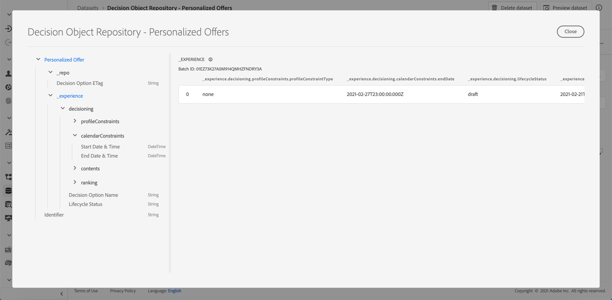

# De geëxporteerde aanbiedingscatalogus openen {#access-exported-catalog}

De geëxporteerde aanbiedingencatalogus is toegankelijk in Adobe Experience Platform **[!UICONTROL Datasets]** -menu. Er wordt één gegevensset gemaakt voor elk object in de bibliotheek met aanbiedingen.

Klik op een gegevensset om de details te openen.

De **[!UICONTROL Preview dataset]** de knoop staat u toe om de meest recente succesvolle partij in de dataset te tonen. Het linkerdeelvenster bevat informatie over de typen gegevens die zijn geëxporteerd.

Voor meer informatie over hoe te om datasets te doorbladeren en te gebruiken, verwijs naar [deze pagina](../../start/get-started-datasets.md).
