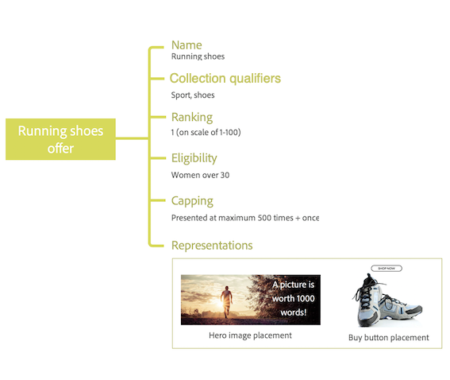

# Aan de slag met Beslissingsbeheer {#about-decision-management}

>[!TIP]
>
>Het besluit, de nieuwe beslissingsmogelijkheden van [!DNL Adobe Journey Optimizer], is nu beschikbaar via de op code gebaseerde ervaring en e-mailkanalen! [Meer informatie](../../experience-decisioning/gs-experience-decisioning.md)

Gebruik [!DNL Journey Optimizer] om uw klanten de beste aanbieding en ervaring op alle aanraakpunten op het juiste moment te bieden. Als u ze eenmaal hebt ontworpen, richt u zich op uw publiek met persoonlijke aanbiedingen.

Beslissingsbeheer maakt personalisatie gemakkelijk met een centrale bibliotheek van marketing aanbiedingen en een besluitvormingsmotor die regels en beperkingen op rijke, real-time profielen toepast die door Adobe Experience Platform worden gecreeerd om u te helpen uw klanten het juiste aanbod op het juiste ogenblik verzenden.

De beslissingsmanagementcapaciteit bestaat uit twee hoofdcomponenten:

* De **Gecentraliseerde Bibliotheek van de Aanbieding** die de interface is waar u creeert en de verschillende elementen beheert die uw aanbiedingen samenstellen, en hun regels en beperkingen bepalen.
* De **Motor van het Besluit van de Aanbieding** die hefboomwerkingen de gegevens van Adobe Experience Platform en de profielen van de Klant in real time, samen met de Bibliotheek van de Aanbieding, om de juiste tijd, de klanten en de kanalen te selecteren waaraan de aanbiedingen zullen worden geleverd.

Voordelen zijn:

* Verbeterde campagneprestatie door persoonlijke aanbiedingen op meerdere kanalen te leveren,
* Verbeterde workflows: in plaats van meerdere verzendingen of campagnes te maken kunnen marketingteams de workflows verbeteren door één verzending te maken en de aanbiedingen in verschillende delen van de sjabloon te variëren,
* De controle over het aantal keren dat een aanbieding wordt getoond aan campagnes en klanten.

➡️ [ Leer meer over het Beheer van het Besluit in deze video&#39;s ](#video)

>[!NOTE]
>
>Als u een [ Adobe Experience Platform ](https://experienceleague.adobe.com/docs/experience-platform/landing/home.html?lang=nl-NL){target="_blank"} gebruiker die de **Offer Decisioning** toepassing leveraging, zijn alle die eigenschappen van het Beheer van het Besluit in deze sectie worden beschreven ook op u van toepassing.

## Aanbiedingen en beslissingen {#about-offers-and-decisions}

Een **Aanbieding** bestaat uit content, geschiktheidsregels en restricties die de voorwaarden bepalen waaronder deze aan uw klanten wordt gepresenteerd.

De aanbieding wordt gemaakt aan de hand van de **Aanbiedingsbibliotheek**, die een centrale aanbiedingscatalogus verstrekt waar u geschiktheidsregels en restricties kunt koppelen aan meerdere stukken content om aanbiedingen te maken en te publiceren (zie [Gebruikersinterface van de Aanbiedingsbibliotheek](../get-started/user-interface.md)).

Zodra de Aanbiedingsbibliotheek is verrijkt met aanbiedingen, kunt u uw aanbiedingen integreren in **beslissingen**.

Besluiten zijn containers voor uw aanbiedingen die gebruikmaken van de Offertenbeslissingsengine om de beste aanbieding te kiezen, afhankelijk van het doel van de levering.

## Vaak voorkomende gebruiksscenario&#39;s {#common-use-cases}

Dankzij de mogelijkheden voor Beslissingsbeheer en de integratie met Adobe Experience Platform kunt u tal van gebruiksgevallen verwerken om u te helpen de betrokkenheid en conversie van klanten te vergroten.

* Geef op de startpagina van uw website de aanbiedingen weer die passen bij de belangstelling van de bezoekende klant, op basis van gegevens van Adobe Experience Platform.

  

* Als klanten in de buurt van één van uw winkels lopen, stuur ze dan pushmeldingen om hen te herinneren aan beschikbare aanbiedingen op basis van hun kenmerken (loyaliteitsniveau, gender, eerdere aankopen...).

  

* Beslissingsbeheer helpt u ook de ervaring van uw klanten te verbeteren wanneer u contact opneemt met uw ondersteuningsteam. Het Beheer APIs van het besluit staat u toe om in uw portaalinformatie van de agenten van het vraagcentrum over de terugbetaalde klant en volgende beste aanbiedingen te tonen.

  

## Toegang verlenen tot het beheer van besluiten {#granting-acess-to-decision-management}

De toestemmingen om beslissingsmogelijkheden toegang te hebben en te gebruiken worden beheerd gebruikend [ Adobe Admin Console ](https://helpx.adobe.com/nl/enterprise/managing/user-guide.html){target="_blank"}.

Als u toegang wilt verlenen tot de functionaliteit voor beslissingsbeheer, moet u een **[!UICONTROL Product profile]** maken en de bijbehorende machtigingen aan uw gebruikers toewijzen. Leer meer over het beheren van [!DNL Journey Optimizer] gebruikers en toestemmingen in [ deze sectie ](../../administration/permissions.md).

De toestemmingen specifiek voor het Beheer van het Besluit worden vermeld in [ deze sectie ](../../administration/high-low-permissions.md#decisions-permissions).

## Woordenlijst {#glossary}

U kunt onder de lijst van de belangrijkste concepten vinden u zult werken met wanneer het gebruiken van Beslissingsbeheer.

* **Limitering** of **Frequentiebeperking**: limitering (ofwel beperking) wordt gebruikt om een limiet in te stellen voor het aantal keren dat een aanbieding wordt ingezet. Er zijn twee soorten limieten: een limiet voor het aantal keren dat een aanbieding aan de gecombineerde doelgroep kan worden aangeboden, ook wel ‘totaallimiet’ genoemd, en een limiet voor het aantal keren dat een aanbieding aan dezelfde eindgebruiker kan worden aangeboden, ook wel ‘profiellimiet’ genoemd.

* **Verzamelingen**: verzamelingen zijn subsets van aanbiedingen die zijn gebaseerd op vooraf gedefinieerde voorwaarden die door een marketeer zijn gedefinieerd, zoals de categorie van de aanbieding.

* **Besluit**: Een besluit bevat de logica die de selectie van een aanbieding informeert.

* **Beslissingsregel**: beslissingsregels zijn restricties die aan een persoonlijke aanbieding worden toegevoegd en op een profiel worden toegepast om te bepalen of dat profiel in aanmerking komt voor een aanbieding.

* **Geschikte aanbieding**: een geschikte aanbieding voldoet aan de restricties die op een hoger niveau zijn ingesteld zodat de aanbieding consistent aan een profiel kan worden aangeboden.

* **Beheer van het Besluit**: Staat u toe om eindgebruiker gepersonaliseerde aanbiedingservaringen over kanalen en toepassingen tot stand te brengen en te leveren gebruikend bedrijfslogica en besluitvormingsregels.

* **Alternatieve aanbiedingen**: een alternatieve aanbieding is de standaardaanbieding die wordt weergegeven wanneer een eindgebruiker niet in aanmerking komt voor een van de persoonlijke aanbiedingen in de verzameling.

* **Aanbieding**: een aanbieding is een marketingbericht waaraan regels gekoppeld kunnen zijn die bepalen wie in aanmerking komt om de aanbieding te zien.

* **Bibliotheek van de Aanbieding**: De aanbiedingsbibliotheek is een centrale bibliotheek die wordt gebruikt om gepersonaliseerde en reserveaanbiedingen, besluitvormingsregels en besluiten te beheren.

* **Persoonlijke aanbiedingen**: een persoonlijke aanbieding is een aanpasbaar marketingbericht op basis van geschiktheidsregels en restricties.

* **Plaatsingen**: een plaatsing is de locatie en/of de context waarin een aanbieding voor een eindgebruiker wordt weergegeven.

* **Prioriteit**: prioriteiten worden gebruikt om aanbiedingen te rangschikken die voldoen aan alle restricties, zoals geschiktheid, kalender en beperking.

* **Weergaven**: een weergave is informatie (bijv. de locatie of taal) die door een kanaal wordt gebruikt om een aanbieding te tonen.

## Hoe kan ik-video&#39;s{#video}

### Wat is het beheer van besluiten? {#what-is-offer-decisioning}

In de onderstaande video wordt een inleiding gegeven op de belangrijkste mogelijkheden, architectuur en gebruiksscenario&#39;s van het beheer van beslissingen:

>[!VIDEO](https://video.tv.adobe.com/v/326961?quality=12&learn=on)

### Aanbiedingen definiëren en beheren {#use-offer-decisioning}

In de onderstaande video ziet u hoe u Beslissingsbeheer kunt gebruiken om uw aanbiedingen te definiëren en te beheren en real-time klantgegevens kunt gebruiken.

>[!VIDEO](https://video.tv.adobe.com/v/3470051?quality=12&learn=on&captions=dut)

