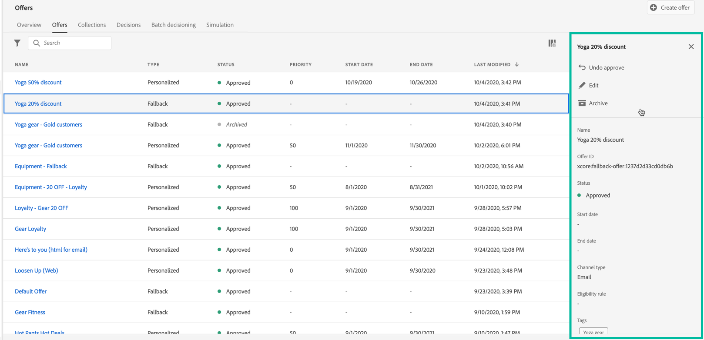

# Gebruikersinterface {#user-interface}

De **[!UICONTROL Decision management]** het gedeelte in de linkerrail bevat twee menu &#39; s die u toegang geven tot de mogelijkheden voor besluitvormingsbeheer :

Gebruik de **[!UICONTROL Offers]** menu voor het beheren en leveren van uw aanbiedingen:

* **[!UICONTROL Overview]**: Nieuw bij [!DNL decision management]? Volg de stappen op het scherm om aan de slag te gaan met het instellen van plaatsingen, aanbiedingen en verzamelingen. Als u al vertrouwd bent met [!DNL decision management], bekijk een overzicht van je meest recente aanbiedingen, verzamelingen en beslissingen. [Meer informatie](#overview)
* **[!UICONTROL Offers]**: Maak en open uw persoonlijke en fallback-aanbiedingen. Leer hoe u creeert [aanbiedingen](../offer-library/creating-personalized-offers.md) en [fallbackaanbiedingen](../offer-library/creating-fallback-offers.md)
* **[!UICONTROL Collections]**: Organiseer uw aanbiedingen in statische en dynamische verzamelingen. [Meer informatie](../offer-library/creating-collections.md)
* **[!UICONTROL Decisions]**: Beslissingen maken en beheren om uw aanbiedingen te leveren. [Meer informatie](../offer-activities/create-offer-activities.md)
* **[!UICONTROL Batch decisioning]**: Besluiten over aanbiedingen voor alle profielen in een bepaald Adobe Experience Platform-segment. [Meer informatie](../batch-delivery.md)
* **[!UICONTROL Simulation]**: Valideer uw besluitvormingslogica door te simuleren welke aanbiedingen aan een testprofiel voor een bepaalde plaatsing zullen worden geleverd. [Meer informatie](../offer-activities/simulation.md)

Gebruik de **[!UICONTROL Components]** menu om componenten te maken en te beheren die nodig zijn om aanbiedingen en beslissingen te maken:

* **[!UICONTROL Placements]**: Maak en beheer plaatsingen waar uw aanbiedingen worden weergegeven. [Meer informatie](../offer-library/creating-placements.md)
* **[!UICONTROL Collection qualifiers]**: Maak en beheer verzamelingsaanduidingen (voorheen &#39;tags&#39; genoemd) om uw aanbiedingen te organiseren en filteren. [Meer informatie](../offer-library/creating-tags.md)
* **[!UICONTROL Rules]**: De voorwaarden beheren waaronder uw voorstellen worden weergegeven. [Meer informatie](../offer-library/creating-decision-rules.md)
* **[!UICONTROL Ranking]**: Opstellen en beheren van rangschikkingsformules om te bepalen welke aanbieding als eerste voor een bepaalde plaatsing moet worden gepresenteerd. [Meer informatie](../ranking/create-ranking-formulas.md)

>[!NOTE]
>
>Als u problemen ondervindt bij het benaderen van het beslissingsbeheer of een aantal van de functies ervan, kunt u contact opnemen met een Admin-gebruiker om te controleren of u de vereiste rechten hebt. Zie [Toegang verlenen tot het beheer van besluiten](starting-offer-decisioning.md#granting-acess-to-decision-management).

## Overzicht {#overview}

Als u nog niet eerder [!DNL decision management]de **[!UICONTROL Overview]** bevat een overzicht van de belangrijkste stappen die nodig zijn om de beslissing over je eerste voorstel op te stellen. Volg de stappen op het scherm om plaatsingen, aanbiedingen en verzamelingen te maken. Zodra u met deze eerste stappen wordt gedaan, wordt u ertoe aangezet om aanbiedingsbesluiten tot stand te brengen.

>[!NOTE]
>
>De belangrijkste stappen om aanbiedingen tot stand te brengen en hen in een besluit te gebruiken zijn voorgesteld in [deze sectie](../offer-library/key-steps.md).

Wanneer u vertrouwd bent met [!DNL decision management] en u hebt al ten minste één biedingsbesluit gemaakt, de **[!UICONTROL Overview]** geeft uw meest recente aanbiedingen, verzamelingen en beslissingen weer.

Klik op een voorstel of een beslissing om rechtstreeks toegang te krijgen tot de gegevens van het geselecteerde object.

Klik op de knop **[!UICONTROL View all]** om tot de aanbieding, inzameling, of besluitvormingslijsten toegang te hebben.

## Informatie zoeken en filteren {#search-and-filter-information}

Gebruik de **zoekbalk** om een specifiek item te zoeken.

**Filters** U kunt ook toegang krijgen door op het filterpictogram linksboven in de lijst te klikken. Hiermee kunt u de weergegeven elementen filteren op basis van verschillende criteria. U kunt bijvoorbeeld de plaatsen filteren die zijn gemaakt voor het communicatiekanaal en de inhoud van het type afbeelding.

## Weergegeven gegevens aanpassen {#customize-displayed-information}

De lijsten van de menu&#39;s van het Beheer van het Besluit kunnen worden gepersonaliseerd gebruikend de configuratieknoop op het hoogste recht van de lijsten.

Op deze manier kunt u de informatie kiezen die u wilt weergeven.

Merk op dat de kolomaanpassing voor elke gebruiker wordt bewaard.

## Informatievenster {#information-pane}

Selecteer in de verschillende lijsten een element om een informatievenster weer te geven waarmee u informatie kunt ophalen en basishandelingen op het element kunt uitvoeren.

Met de lijsten met aanbiedingen en beslissingen kunt u ook bulkacties uitvoeren op verschillende elementen. U doet dit door de gewenste aanbiedingen of beslissingen te selecteren en vervolgens in het informatievenster de actie te selecteren die u wilt uitvoeren.

U kunt ook een bestaande aanbieding of een bestaande beslissing dupliceren om een kopie te maken met de **[!UICONTROL Draft]** status. Dit kan of van de informatieruit of van een aanbieding of de gedetailleerde mening van een besluit worden uitgevoerd.

## Aanbiedingen en besluiten veranderen logboeken {#changes-logs}

In de bibliotheek met aanbiedingen kunt u alle wijzigingen visualiseren die in een voorstel of een beslissing zijn aangebracht. Als u dit wilt doen, opent u het voorstel of de beslissing door op de naam ervan in de lijst te klikken en selecteert u vervolgens het **[!UICONTROL Change log]** tab.

Alle aangebrachte wijzigingen worden in dit scherm weergegeven, evenals de naam van de gebruiker die de wijzigingen heeft uitgevoerd.

