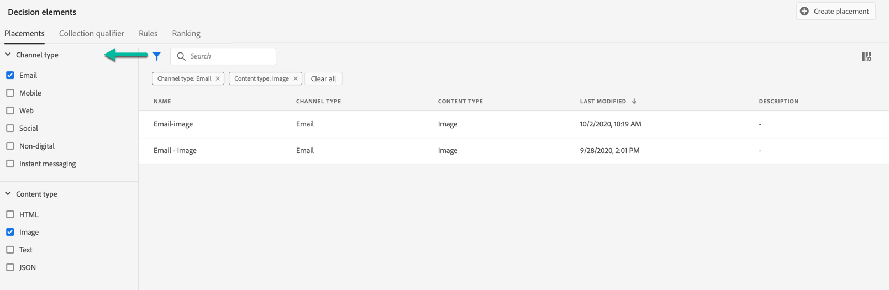

# Biedt Library User Interface {#user-interface}

>[!TIP]
>
>Het besluit, de nieuwe beslissingsmogelijkheden van [!DNL Adobe Journey Optimizer], is nu beschikbaar via de op code gebaseerde ervaring en e-mailkanalen! [Meer informatie](../../experience-decisioning/gs-experience-decisioning.md)

Het gedeelte **[!UICONTROL Decision management]** in de linkertrack bevat twee menu&#39;s waarmee u toegang krijgt tot de mogelijkheden voor besluitvormingsbeheer:

Gebruik het menu **[!UICONTROL Offers]** om uw aanbiedingen te beheren en te leveren:

* **[!UICONTROL Overview]**: Nieuw bij [!DNL decision management] ? Volg de stappen op het scherm om aan de slag te gaan met het instellen van plaatsingen, aanbiedingen en verzamelingen. Als u [!DNL decision management] al kent, krijgt u een overzicht van de meest recente aanbiedingen, verzamelingen en beslissingen. [Meer informatie](#overview)
* **[!UICONTROL Offers]**: Maak en open uw gepersonaliseerde en fallback-aanbiedingen. Leer hoe te om [&#x200B; aanbiedingen &#x200B;](../offer-library/creating-personalized-offers.md) te creëren en [&#x200B; fallback aanbiedingen &#x200B;](../offer-library/creating-fallback-offers.md)
* **[!UICONTROL Collections]**: organiseer uw aanbiedingen in statische en dynamische verzamelingen. [Meer informatie](../offer-library/creating-collections.md)
* **[!UICONTROL Decisions]**: maak en beheer beslissingen om uw voorstellen te leveren. [Meer informatie](../offer-activities/create-offer-activities.md)
* **[!UICONTROL Batch decisioning]**: bied beslissingen aan voor alle profielen in een bepaald Adobe Experience Platform-publiek. [Meer informatie](../batch-delivery.md)
* **[!UICONTROL Simulation]**: bevestig uw besluitvormingslogica door te simuleren welke aanbiedingen aan een testprofiel voor een bepaalde plaatsing zullen worden geleverd. [Meer informatie](../offer-activities/simulation.md)

Gebruik het menu **[!UICONTROL Components]** om componenten te maken en te beheren die nodig zijn om aanbiedingen en beslissingen te maken:

* **[!UICONTROL Placements]**: maak en beheer plaatsen waar uw aanbiedingen worden weergegeven. [Meer informatie](../offer-library/creating-placements.md)
* **[!UICONTROL Collection qualifiers]**: Maak en beheer verzamelingskwalificatoren (voorheen &#39;&#39;tags&#39;&#39; genoemd) om uw aanbiedingen te organiseren en filteren. [Meer informatie](../offer-library/creating-tags.md)
* **[!UICONTROL Rules]**: beheer de voorwaarden waaronder uw voorstellen worden weergegeven. [Meer informatie](../offer-library/creating-decision-rules.md)
* **[!UICONTROL Ranking]**: maak en beheer rangschikkingsformules om te bepalen welke aanbieding als eerste voor een bepaalde plaatsing moet worden gepresenteerd. [Meer informatie](../ranking/create-ranking-formulas.md)

>[!NOTE]
>
>Als u problemen ondervindt bij het benaderen van het beslissingsbeheer of een aantal van de functies ervan, kunt u contact opnemen met een Admin-gebruiker om te controleren of u de vereiste rechten hebt. Zie [&#x200B; toegang van de Verlening tot het Beheer van het Besluit &#x200B;](starting-offer-decisioning.md#granting-acess-to-decision-management).

## Overzicht {#overview}

Als u [!DNL decision management] nog niet eerder hebt gebruikt, begeleidt het tabblad **[!UICONTROL Overview]** u door de belangrijkste stappen die nodig zijn om uw eerste besluit over aanbiedingen te maken. Voer de stappen op het scherm uit om plaatsingen, aanbiedingen en verzamelingen te maken. Zodra u met deze eerste stappen wordt gedaan, wordt u ertoe aangezet om aanbiedingsbesluiten tot stand te brengen.

>[!NOTE]
>
>De belangrijkste stappen om aanbiedingen tot stand te brengen en hen in een besluit te gebruiken worden voorgesteld in [&#x200B; deze sectie &#x200B;](../offer-library/key-steps.md).

Wanneer u vertrouwd bent met [!DNL decision management] en u al minstens één aanbiedingsbesluit hebt gemaakt, geeft het tabblad **[!UICONTROL Overview]** uw meest recente aanbiedingen, verzamelingen en beslissingen weer.

Klik op een voorstel of een beslissing om rechtstreeks toegang te krijgen tot de gegevens van het geselecteerde object.

Klik op de knop **[!UICONTROL View all]** om de lijst met aanbiedingen, verzamelingen of beslissingen te openen.

## Zoeken en filteren van gegevens {#search-and-filter-information}

Gebruik de **onderzoeksbar** om een specifiek punt te vinden.

**de Filters** kunnen ook worden betreden door het filterpictogram op de bovenkant links van de lijst te klikken. Hiermee kunt u de weergegeven elementen filteren op basis van verschillende criteria. U kunt bijvoorbeeld de plaatsen filteren die zijn gemaakt voor het communicatiekanaal en de inhoud van het type afbeelding.

## Weergegeven gegevens aanpassen {#customize-displayed-information}

De lijsten van de menu&#39;s van het Beheer van het Besluit kunnen worden gepersonaliseerd gebruikend de configuratieknoop op het hoogste recht van de lijsten.

Op deze manier kunt u de informatie kiezen die u wilt weergeven.

Merk op dat de kolomaanpassing voor elke gebruiker wordt bewaard.

## Informatievenster {#information-pane}

Selecteer in de verschillende lijsten een element om een informatievenster weer te geven waarmee u informatie kunt ophalen en basishandelingen op het element kunt uitvoeren.

Met de lijsten met aanbiedingen en beslissingen kunt u ook bulkacties uitvoeren op verschillende elementen. U doet dit door de gewenste aanbiedingen of beslissingen te selecteren en vervolgens in het informatievenster de actie te selecteren die u wilt uitvoeren.

U kunt ook een bestaande aanbieding of beslissing dupliceren om een kopie met de status **[!UICONTROL Draft]** te maken. Dit kan of van de informatieruit of van een aanbieding of de gedetailleerde mening van een besluit worden uitgevoerd.

## Aanbiedingen en besluiten veranderen logboeken {#changes-logs}

Met [!DNL Journey Optimizer] kunt u alle wijzigingen visualiseren die in een aanbieding of beslissing zijn aangebracht. U doet dit door het menu **[!UICONTROL Audits]** te openen vanuit het linkermenu. [&#x200B; Leer hoe te om acties op middelen &#x200B;](../../privacy/audit-logs.md) te controleren
