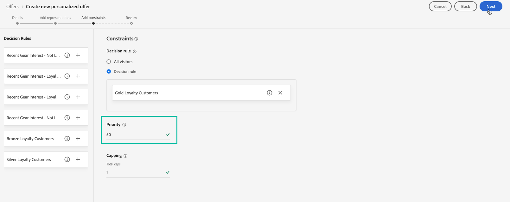
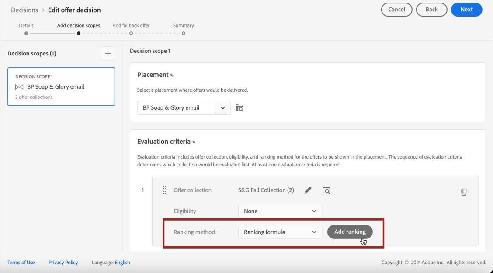
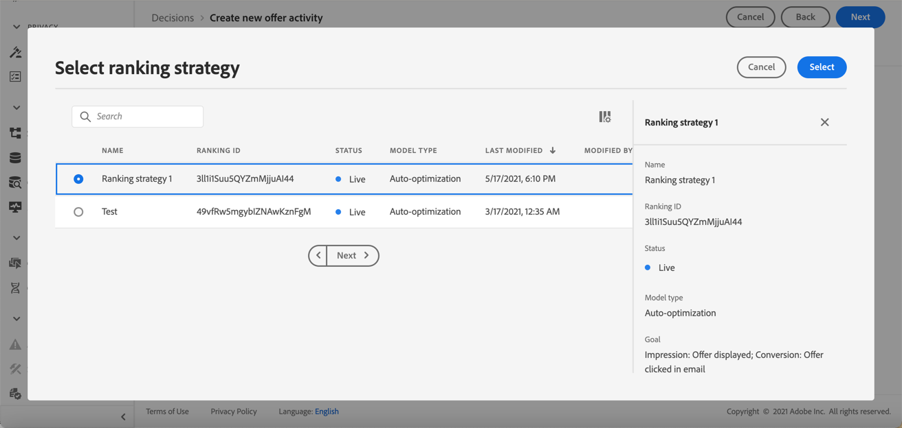

# Selectie van aanbiedingen in beslissingen configureren {#offers-selection-in-decisions}

Als verscheidene aanbiedingen voor een bepaalde plaatsing verkiesbaar zijn, kunt u de methode kiezen die de beste aanbieding voor elk profiel zal selecteren wanneer het vormen van een besluit. Je kunt voorstellen plaatsen op:
* Voorstelprioriteit
* Willekeurige formule
* [AI-classificatie](#use-ranking-strategy) (alleen voor bepaalde gebruikers)

## Voorstelprioriteit {#offer-priority}

Wanneer meerdere aanbiedingen in aanmerking komen voor een bepaalde plaatsing in een besluit, worden standaard de aanbiedingen met de hoogste **prioriteit** wordt eerst aan de klanten geleverd.

De prioritaire scores van aanbiedingen worden toegewezen wanneer het creëren van een aanbieding. Leer hoe u een persoonlijke aanbieding kunt maken in [deze sectie](../offer-library/creating-personalized-offers.md).

## Willekeurige formule {#assign-ranking-formula}

Met Journey Optimizer kunt u niet alleen prioriteit bieden, maar ook **rangschikkingsformules**. Dit zijn formules die bepalen welke aanbieding eerst voor een bepaalde plaatsing moet worden gepresenteerd, in plaats van rekening te houden met de prioriteitsscores van de aanbiedingen.

U kunt bijvoorbeeld de prioriteit verhogen van alle aanbiedingen met een einddatum van minder dan 24 uur, of aanbiedingen verhogen van de categorie &quot;actief&quot; als het interessepunt van het profiel &quot;actief&quot; is.

Leer hoe u een waarderingsformule maakt in [deze sectie](../offer-library/create-ranking-formulas.md).

Nadat u een rangschikkingsformule hebt gemaakt, kunt u deze toewijzen aan een plaatsing in een beslissing. Volg de onderstaande stappen om dit te doen:

1. Maak een beslissing of bewerk een bestaande beslissing. Zie [Besluiten maken](../offer-activities/create-offer-activities.md).

1. Voeg de plaatsingen toe die uw voorstellen zullen bevatten. Zie [Plaatsen maken](../offer-library/creating-placements.md).

1. Voeg voor elke plaatsing een verzameling toe. Zie [Verzamelingen maken](../offer-library/creating-collections.md).

1. Selecteren **[!UICONTROL Ranking formula]** als de waarderingsmethode klikt u op **[!UICONTROL Add ranking]**.

   

1. Selecteer de gewenste rangschikkingsformule en klik op **[!UICONTROL Select]**.

   

De rangschikkingsformule is nu gekoppeld aan de plaatsing.

Indien meerdere aanbiedingen in aanmerking komen om in deze plaatsing te worden gepresenteerd, wordt in het besluit de formule van de rangorde gebruikt om te berekenen welke aanbieding het eerst wordt geleverd.

## AI-rangschikking {#use-ranking-strategy}

<!--If you are an [Adobe Experience Platform](https://experienceleague.adobe.com/docs/experience-platform/landing/home.html){target="_blank"} user leveraging the **Offer Decisioning** application service,-->

U kunt ook een getraind modelsysteem gebruiken dat aanbiedingen voor een bepaald profiel automatisch rangschikt door een classificatiestrategie te selecteren. Leer hoe u een waarderingsstrategie maakt in [deze sectie](../offer-library/create-ranking-strategies.md).

>[!CAUTION]
>
>Het gebruik van de AI-rangschikking is momenteel beschikbaar in een vroeg stadium en alleen voor bepaalde gebruikers.

Zodra een rangschikkingsstrategie is gecreeerd, kunt u het aan een plaatsing in een besluit toewijzen. Hiervoor voert u de volgende stappen uit:

1. Maak een beslissing of bewerk een bestaande beslissing. Zie [Besluiten maken](../offer-activities/create-offer-activities.md).

1. Voeg de plaatsingen toe die uw voorstellen zullen bevatten. Zie [Plaatsen maken](../offer-library/creating-placements.md).

1. Voeg voor elke plaatsing een verzameling toe. Zie [Verzamelingen maken](../offer-library/creating-collections.md).

1. Kies ervoor om voorstellen te plaatsen op **[!UICONTROL AI ranking]** in de vervolgkeuzelijst en klik op **[!UICONTROL Add ranking]**.

   

1. Selecteer de waarderingsstrategie die u hebt gemaakt. Alle details van de classificatiestrategie worden weergegeven.

   

1. Klik op **[!UICONTROL Select]**. De rangschikkingsstrategie is nu gekoppeld aan de plaatsing.

Indien meerdere aanbiedingen in aanmerking komen, bepaalt het opgeleide modelsysteem welke aanbieding eerst voor een bepaalde plaatsing moet worden gepresenteerd.

