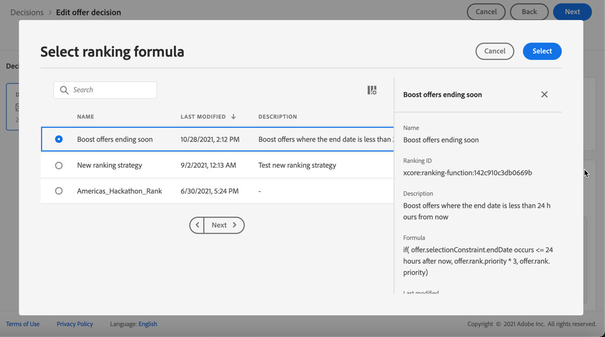

# Selectie van aanbiedingen in beslissingen configureren {#offers-selection-in-decisions}

>[!TIP]
>
>Het besluit, de nieuwe beslissingsmogelijkheden van [!DNL Adobe Journey Optimizer], is nu beschikbaar via de op code gebaseerde ervaring en e-mailkanalen! [Meer informatie](../../experience-decisioning/gs-experience-decisioning.md)

Als verscheidene aanbiedingen voor een bepaalde plaatsing verkiesbaar zijn, kunt u de methode kiezen die de beste aanbieding voor elk profiel zal selecteren wanneer het vormen van een besluit. Je kunt voorstellen plaatsen op:

* Voorstelprioriteit
* Willekeurige formule
* [AI-rangschikking](#use-ranking-strategy)

## Voorstelprioriteit {#offer-priority}

Door gebrek, wanneer verscheidene aanbiedingen voor een bepaalde plaatsing in een besluit verkiesbaar zijn, zullen de aanbiedingen met de hoogste **prioriteit** eerst aan de klanten worden geleverd.

De prioritaire scores van aanbiedingen worden toegewezen wanneer het creëren van een aanbieding. Leer hoe te om een gepersonaliseerde aanbieding in [ tot stand te brengen deze sectie ](../offer-library/creating-personalized-offers.md).

## Willekeurige formule {#assign-ranking-formula}

Naast het aanbieden van prioriteit, staat Journey Optimizer u toe om **het rangschikken formules** tot stand te brengen. Dit zijn formules die bepalen welke aanbieding eerst voor een bepaalde plaatsing moet worden gepresenteerd, in plaats van rekening te houden met de prioriteitsscores van de aanbiedingen.

U kunt bijvoorbeeld de prioriteit verhogen van alle aanbiedingen met een einddatum van minder dan 24 uur, of aanbiedingen verhogen van de categorie &quot;actief&quot; als het interessepunt van het profiel &quot;actief&quot; is.

Leer hoe te om een het rangschikken formule in [ tot stand te brengen deze sectie ](../ranking/create-ranking-formulas.md).

Nadat een formule is gemaakt, kunt u deze toewijzen aan een plaatsing in een beslissing. Hiervoor voert u de volgende stappen uit:

1. Maak een beslissing of bewerk een bestaande beslissing. Zie [ besluiten ](../offer-activities/create-offer-activities.md) creëren.

1. Voeg de plaatsingen toe die uw voorstellen zullen bevatten. Zie [ plaatsingen ](../offer-library/creating-placements.md) creëren.

1. Voeg voor elke plaatsing een verzameling toe. Zie [ inzamelingen ](../offer-library/creating-collections.md) creëren.

1. Selecteer **[!UICONTROL Formula]** als waarderingsmethode en klik op **[!UICONTROL Add ranking]** .

   

1. Selecteer de gewenste formule en klik op **[!UICONTROL Select]** .

   

De rangschikkingsformule is nu gekoppeld aan de plaatsing.

Als meerdere aanbiedingen in aanmerking komen om in deze plaatsing te worden gepresenteerd, wordt in de beslissing de geselecteerde formule gebruikt om te berekenen welke aanbieding het eerst wordt geleverd.

## AI-rangschikking {#use-ranking-strategy}

<!--If you are an [Adobe Experience Platform](https://experienceleague.adobe.com/docs/experience-platform/landing/home.html){target="_blank"} user leveraging the **Offer Decisioning** application service,-->

U kunt ook een getraind modelsysteem gebruiken dat aanbiedingen voor een bepaald profiel automatisch rangschikt door een AI-model te selecteren. Leer hoe te om een AI model in [ tot stand te brengen deze sectie ](../ranking/create-ranking-strategies.md).

Nadat u een AI-model hebt gemaakt, kunt u het toewijzen aan een plaatsing in een beslissing. Hiervoor voert u de volgende stappen uit:

1. Maak een beslissing of bewerk een bestaande beslissing. Zie [ besluiten ](../offer-activities/create-offer-activities.md) creëren.

1. Voeg de plaatsingen toe die uw voorstellen zullen bevatten. Zie [ plaatsingen ](../offer-library/creating-placements.md) creëren.

1. Voeg voor elke plaatsing een verzameling toe. Zie [ inzamelingen ](../offer-library/creating-collections.md) creëren.

1. Kies om aanbiedingen op **[!UICONTROL AI ranking]** te plaatsen in de vervolgkeuzelijst en klik op **[!UICONTROL Add ranking]** .

   

1. Selecteer het gemaakte AI-model. Alle details van het model worden weergegeven.

   

1. Klik op **[!UICONTROL Select]**. Het AI-model is nu gekoppeld aan de plaatsing.

Indien meerdere aanbiedingen in aanmerking komen, bepaalt het opgeleide modelsysteem welke aanbieding eerst voor een bepaalde plaatsing moet worden gepresenteerd.

