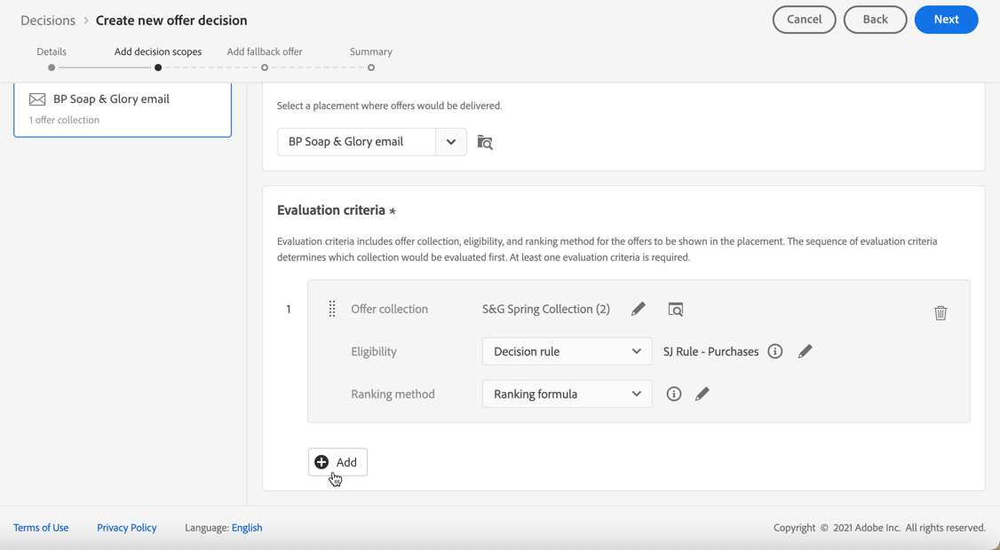
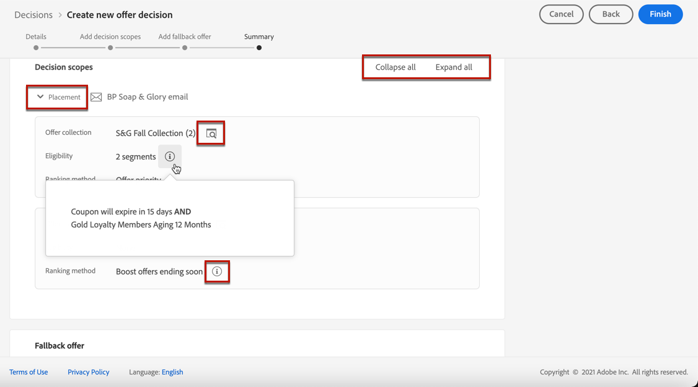

# Beslissingen nemen {#create-offer-activities}

Besluiten (voorheen bekend als aanbiedingsactiviteiten) zijn containers voor uw aanbiedingen die gebruikmaken van de Offertenbeslissingsengine om de beste aanbieding te kiezen, afhankelijk van het doel van de levering.

➡️ [Ontdek deze functie in video](#video)

De lijst van besluiten is toegankelijk in **[!UICONTROL Offers]** menu > **[!UICONTROL Decisions]** tab. De filters zijn beschikbaar om u te helpen besluiten op hun status of begin en einddata terugwinnen.

Voordat u een beslissing maakt, moet u controleren of de onderstaande componenten zijn gemaakt in de bibliotheek met aanbiedingen:

* [Plaatsingen](../offer-library/creating-placements.md)
* [Verzamelingen](../offer-library/creating-collections.md)
* [Persoonlijke aanbiedingen](../offer-library/creating-personalized-offers.md)
* [Alternatieve aanbiedingen](../offer-library/creating-fallback-offers.md)

## De beslissing maken {#create-activity}

1. Open de beslissingslijst en klik vervolgens op **[!UICONTROL Create decision]**.

1. Geef de naam van de beslissing op.

1. Geef zo nodig een begin- en einddatum en -tijd op en klik op **[!UICONTROL Next]**.

   

## Bepaal beslissingsbereik {#add-decision-scopes}

1. Selecteer een plaatsing van de drop-down lijst. Het zal aan het eerste beslissingswerkingsgebied in uw besluit worden toegevoegd.

   

1. Klikken **[!UICONTROL Add]** om evaluatiecriteria voor deze plaatsing te selecteren.

   

   Elk criterium bestaat uit een verzameling aanbiedingen die gekoppeld is aan een geschiktheidsbeperking en een waarderingsmethode om de aanbiedingen te bepalen die in de plaatsing moeten worden getoond.

   >[!NOTE]
   >
   >Er is ten minste één evaluatiecriterium vereist.

1. Selecteer de aanbiedingsinzameling die de aanbiedingen bevat om te overwegen, dan klik **[!UICONTROL Add]**.

   

   >[!NOTE]
   >
   >U kunt op de knop **[!UICONTROL Open offer collections]** koppeling om de lijst met verzamelingen op een nieuw tabblad weer te geven, zodat u door de verzamelingen en de aanbiedingen in deze verzamelingen kunt bladeren.

   De geselecteerde verzameling wordt toegevoegd aan de criteria.

   

1. Gebruik de **[!UICONTROL Eligibility]** om de selectie van aanbiedingen voor deze plaatsing te beperken.

   Deze beperking kan worden toegepast door een **beslissingsregel**, of een of meer **Adobe Experience Platform-segmenten**. Beide zijn gedetailleerd in [deze sectie](#segments-vs-decision-rules).

   * Selecteer **[!UICONTROL Segments]** en klik vervolgens op **[!UICONTROL Add segments]**.

      

      Voeg een of meerdere segmenten uit het linkervenster toe en combineer deze met de opdracht **[!UICONTROL And]** / **[!UICONTROL Or]** logische operatoren.

      

      Leer hoe u met segmenten werkt in [deze sectie](../../segment/about-segments.md).

   * Als u een selectiegrens met een beslissingsregel wilt toevoegen, gebruikt u de optie **[!UICONTROL Decision rule]** en selecteert u de gewenste regel.

      

      Leer hoe u een beslissingsregel maakt in [deze sectie](../offer-library/creating-decision-rules.md).

1. Definieer de waarderingsmethode die u wilt gebruiken om de beste aanbieding voor elk profiel te selecteren.

   

   * Als meerdere aanbiedingen voor deze plaatsing in aanmerking komen, wordt standaard de aanbieding met de hoogste prioriteitsscore aan de klant geleverd.

   * Als u een specifieke formule wilt gebruiken om te kiezen welke aanbieding in aanmerking komt, selecteert u **[!UICONTROL Ranking formula]**. Leer hoe je voorstellen kunt beoordelen in [deze sectie](../offer-activities/configure-offer-selection.md).

1. Klikken **[!UICONTROL Add]** om meer criteria voor dezelfde plaatsing te definiëren.

   

1. Wanneer u meerdere criteria toevoegt, worden deze in een bepaalde volgorde geëvalueerd. De eerste verzameling die aan de reeks is toegevoegd, wordt eerst geëvalueerd, enzovoort.

   Als u de standaardvolgorde wilt wijzigen, kunt u de verzamelingen slepen en neerzetten om ze naar wens opnieuw te rangschikken.

   

1. U kunt ook meerdere criteria tegelijk evalueren. U doet dit door de verzameling boven op een andere verzameling te slepen.

   

   Ze hebben nu dezelfde rang en zullen dus tegelijkertijd worden geëvalueerd.

   

1. Als u een andere plaatsing voor uw voorstellen wilt toevoegen als onderdeel van deze beslissing, gebruikt u de opdracht **[!UICONTROL New scope]** knop. Herhaal bovenstaande stappen voor elk beslissingsbereik.

   

### Segmenten en beslissingsregels gebruiken {#segments-vs-decision-rules}

<!--to move to create-offers?-->

Als u een beperking wilt toepassen, kunt u de selectie van aanbiedingen beperken tot de leden van een of meerdere **Adobe Experience Platform-segmenten** of u kunt een **beslissingsregel**, beide oplossingen voor verschillende toepassingen.

In feite, is de output van een segment een lijst van profielen, terwijl een besluitvormingsregel een functie is die op bestelling tegen één enkel profiel tijdens het besluitvormingsproces wordt uitgevoerd. Het verschil tussen deze twee toepassingen wordt hieronder nader toegelicht.

* **Segmenten**

   Aan de ene kant zijn segmenten een groep Adobe Experience Platform-profielen die overeenkomen met een bepaalde logica op basis van profielkenmerken en gebeurtenissen ervaren. Het segment wordt echter niet opnieuw berekend door het Offertenbeheer, dat mogelijk niet up-to-date is wanneer de aanbieding wordt gepresenteerd.

   Meer informatie over segmenten in [deze sectie](../../segment/about-segments.md).

* **Beslissingsregels**

   Anderzijds is een beslissingsregel gebaseerd op in Adobe Experience Platform beschikbare gegevens en bepaalt aan wie een aanbieding kan worden getoond. Zodra geselecteerd in een aanbieding of een besluit voor een bepaalde plaatsing, wordt de regel uitgevoerd telkens als een besluit wordt genomen, die ervoor zorgt dat elk profiel de recentste en beste aanbieding krijgt.

   Meer informatie over beslissingsregels vindt u in [deze sectie](../offer-library/creating-decision-rules.md).

## Een fallback-aanbieding toevoegen {#add-fallback}

Zodra u het besluitvormingswerkingsgebied bepaalde, bepaal de reserveaanbieding die als laatste redmiddel aan de klanten zal worden voorgesteld die niet de regels en de beperkingen van de aanbiedingen geschiktheid aanpassen.

U doet dit door het te selecteren in de lijst met beschikbare fallback-aanbiedingen voor de plaatsingen die in de beslissing zijn gedefinieerd, en vervolgens op **[!UICONTROL Next]**.

>[!NOTE]
>
>U kunt op de knop **[!UICONTROL Open offer library]** koppeling om de lijst met aanbiedingen op een nieuw tabblad weer te geven.

## Beslissing bekijken en opslaan {#review}

Als alles behoorlijk wordt gevormd, toont een samenvatting van de beslissingseigenschappen.

1. Zorg ervoor dat het besluit klaar is om te worden gebruikt om aanbiedingen aan klanten voor te stellen. Alle besluitvormingswerkingsgebieden en de reserveaanbieding het bevat worden getoond.

   

   U kunt elke plaatsing uitvouwen of samenvouwen. U kunt ook een voorvertoning weergeven van de beschikbare voorstellen, de geschiktheid en de waarderingsdetails voor elke plaatsing.

   

1. Klik op **[!UICONTROL Finish]**.
1. Selecteer **[!UICONTROL Save and activate]**.

   

   U kunt de beslissing ook opslaan als concept, zodat u deze later kunt bewerken en activeren.

De beslissing wordt in de lijst weergegeven met de **[!UICONTROL Live]** of **[!UICONTROL Draft]** status, afhankelijk van het feit of u deze al dan niet hebt geactiveerd in de vorige stap.

Het is nu klaar om te worden gebruikt om aanbiedingen aan klanten te leveren.

## Beslissingenlijst {#decision-list}

In de beslissingslijst kunt u de beslissing selecteren om de eigenschappen ervan weer te geven. Daar kunt u het ook bewerken, de status ervan wijzigen (**Concept**, **Live**, **Voltooid**, **Gearchiveerd**), de beslissing dupliceren of verwijderen.

Selecteer **[!UICONTROL Edit]** om terug te gaan naar de modus voor beslissingseditie, waar u de beslissing kunt wijzigen [details](#create-activity), [beslissingsbereik](#add-decision-scopes) en [fallback-aanbieding](#add-fallback).

Selecteer een live beslissing en klik op **[!UICONTROL Deactivate]** om de beslissingsstatus terug te brengen naar **[!UICONTROL Draft]**.

De status opnieuw instellen op **[!UICONTROL Live]**, selecteert u de **[!UICONTROL Activate]** die nu wordt weergegeven.

De **[!UICONTROL More actions]** schakelt u de hieronder beschreven handelingen in.

* **[!UICONTROL Complete]**: stelt de status van de beslissing in op **[!UICONTROL Complete]**, wat betekent dat het besluit niet meer kan worden genoemd. Deze handeling is alleen beschikbaar voor geactiveerde beslissingen. Het besluit is nog steeds beschikbaar in de lijst, maar u kunt de status niet terugzetten op **[!UICONTROL Draft]** of **[!UICONTROL Approved]**. U kunt het alleen dupliceren, verwijderen of archiveren.

* **[!UICONTROL Duplicate]**: een besluit met dezelfde eigenschappen, beslissingsbereik en terugvalaanbieding. Het nieuwe besluit heeft standaard de **[!UICONTROL Draft]** status.

* **[!UICONTROL Delete]**: Hiermee verwijdert u de beslissing uit de lijst.

   >[!CAUTION]
   >
   >Het besluit en de inhoud ervan zijn niet meer toegankelijk. Deze handeling kan niet ongedaan worden gemaakt.
   >
   >Als de beslissing in een ander object wordt gebruikt, kan deze niet worden verwijderd.

* **[!UICONTROL Archive]**: stelt de beslissingsstatus in op **[!UICONTROL Archived]**. Het besluit is nog steeds beschikbaar in de lijst, maar u kunt de status niet terugzetten op **[!UICONTROL Draft]** of **[!UICONTROL Approved]**. U kunt deze alleen dupliceren of verwijderen.

U kunt ook de status van meerdere beslissingen tegelijk verwijderen of wijzigen door de desbetreffende selectievakjes in te schakelen.

Als u de status wilt wijzigen van verschillende beslissingen met verschillende statussen, worden alleen de desbetreffende statussen gewijzigd.

Nadat u een beslissing hebt gemaakt, kunt u in de lijst op de naam ervan klikken.

Dit laat u toe om tot gedetailleerde informatie voor dat besluit toegang te hebben. Selecteer **[!UICONTROL Change log]** tab naar [alle wijzigingen controleren](../get-started/user-interface.md#changes-log) die op het besluit zijn genomen.

## Video over zelfstudie {#video}

>[!NOTE]
>
>Deze video is van toepassing op de Offer decisioning toepassingsservice die op Adobe Experience Platform is gebouwd. Het biedt echter algemene richtlijnen voor het gebruik van Aanbieding in de context van Journey Optimizer.

>[!VIDEO](https://video.tv.adobe.com/v/329606?quality=12)
