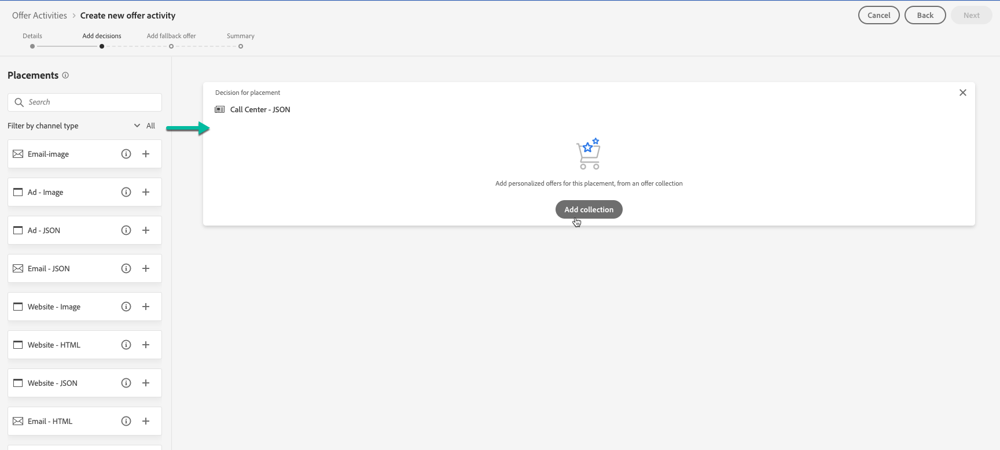
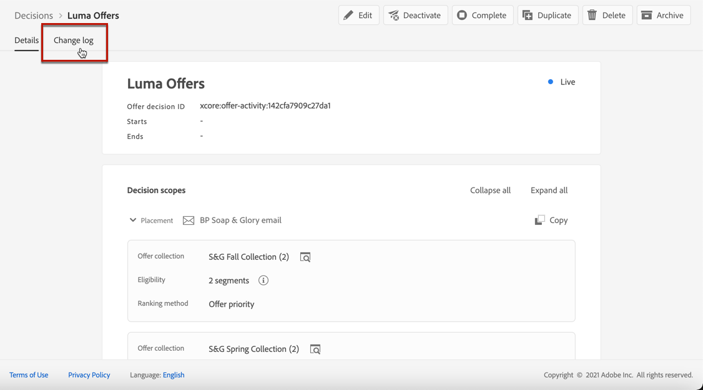

# Beslissingen nemen {#create-offer-activities}

Besluiten (voorheen bekend als aanbiedingsactiviteiten) zijn containers voor uw aanbiedingen die gebruikmaken van de Offertenbeslissingsengine om de beste aanbieding te kiezen, afhankelijk van het doel van de levering.

➡️ [Ontdek deze functie in video](#video)

De lijst met beslissingen is toegankelijk via het menu **[!UICONTROL Offers]** > tabblad **[!UICONTROL Decisions]**. De filters zijn beschikbaar om u te helpen besluiten op hun status of begin en einddata terugwinnen.

Voordat u een beslissing maakt, moet u controleren of de onderstaande componenten zijn gemaakt in de bibliotheek met aanbiedingen:

* [Plaatsingen](../offer-library/creating-placements.md)
* [Verzamelingen](../offer-library/creating-collections.md)
* [Persoonlijke aanbiedingen](../offer-library/creating-personalized-offers.md)
* [Alternatieve aanbiedingen](../offer-library/creating-fallback-offers.md)

## De beslissing maken {#create-activity}

1. Heb toegang tot de besluitenlijst, dan klik **[!UICONTROL Create decision]**.

1. Geef de naam van de beslissing op.

1. Definieer een begin- en einddatum en -tijd en klik vervolgens op **[!UICONTROL Next]**.

   

## Beslissingsbereik toevoegen {#add-decision-scopes}

1. Sleep een positie uit de lijst om deze aan de beslissing toe te voegen en klik vervolgens op **[!UICONTROL Add collection]**.

   

   >[!NOTE]
   >
   >Dezelfde plaatsing kan meerdere keren in de beslissing worden geselecteerd.

1. Selecteer de inzameling die de aanbiedingen bevat om te overwegen, dan klik **[!UICONTROL Add]**.

   

1. De geselecteerde voorstellen worden toegevoegd aan de plaatsing.

   In dit voorbeeld, selecteerden wij twee aanbiedingen die in een JSON-type plaatsing zullen tonen gericht op het voorstellen van aanbiedingen in een oplossing van het vraagcentrum.

   

1. Als meerdere aanbiedingen voor deze plaatsing in aanmerking komen, worden standaard de aanbiedingen met de hoogste prioriteitsscore aan de klant geleverd.

   Als u een specifieke formule of een het rangschikken strategie wilt gebruiken om te kiezen welke in aanmerking komende aanbieding te leveren, selecteer een rangschikkende formule van **[!UICONTROL Rank offers by]** drop-down lijst. Raadpleeg [deze sectie](../offer-activities/configure-offer-selection.md) voor meer informatie.

1. In het veld **[!UICONTROL Constraint]** is de selectie van aanbiedingen voor deze plaatsing beperkt. Deze beperking kan worden toegepast door een **beslissingsregel**, of één of verscheidene **Adobe Experience Platform segmenten** te gebruiken. Beide zijn gedetailleerd in [deze sectie](#segments-vs-decision-rules).

   * Als u de selectie van de aanbiedingen wilt beperken tot de leden van een Adobe Experience Platform-segment, selecteert u **[!UICONTROL Segments]** en klikt u op **[!UICONTROL Add segments]**.

      

      Voeg een of meerdere segmenten uit het linkervenster toe, combineer deze met de logische operatoren **[!UICONTROL And]** / **[!UICONTROL Or]** en klik vervolgens op **[!UICONTROL Select]** om te bevestigen.

      

      Meer informatie over het werken met segmenten in [deze sectie](../../segment/about-segments.md).

   * Als u een selectiegrens voor deze plaatsing gebruikend een besluitregel wilt toevoegen, selecteer **[!UICONTROL Decision rule]** optie, dan sleep de gewenste regel van de linkerruit in **[!UICONTROL Decision rule]** gebied.

      

      Leer meer op hoe te om een beslissingsregel in [deze sectie](../offer-library/creating-decision-rules.md) tot stand te brengen.

### Segmenten en beslissingsregels gebruiken {#segments-vs-decision-rules}

<!--to move to create-offers?-->

Om een beperking toe te passen, kunt u de selectie van aanbiedingen tot de leden van één of verscheidene **Adobe Experience Platform segmenten** beperken, of u kunt een **besluit regel**, beide oplossingen gebruiken die aan verschillende toepassingen beantwoorden.

In feite, is de output van een segment een lijst van profielen, terwijl een besluitvormingsregel een functie is die op bestelling tegen één enkel profiel tijdens het besluitvormingsproces wordt uitgevoerd. Het verschil tussen deze twee toepassingen wordt hieronder nader toegelicht.

* **Segmenten**

   Aan de ene kant zijn segmenten een groep Adobe Experience Platform-profielen die overeenkomen met een bepaalde logica op basis van profielkenmerken en gebeurtenissen ervaren. Het segment wordt echter niet opnieuw berekend door het Offertenbeheer, dat mogelijk niet up-to-date is wanneer de aanbieding wordt gepresenteerd.

   Leer meer op segmenten in [deze sectie](../../segment/about-segments.md).

* **Beslissingsregels**

   Anderzijds is een beslissingsregel gebaseerd op in Adobe Experience Platform beschikbare gegevens en bepaalt aan wie een aanbieding kan worden getoond. Zodra geselecteerd in een aanbieding of een besluit voor een bepaalde plaatsing, wordt de regel uitgevoerd telkens als een besluit wordt genomen, die ervoor zorgt dat elk profiel de recentste en beste aanbieding krijgt.

   Meer informatie over beslissingsregels vindt u in [deze sectie](../offer-library/creating-decision-rules.md).

## Een fallback-aanbieding toevoegen {#add-fallback}

Selecteer de fallback-aanbieding die als laatste redmiddel zal worden weergegeven aan klanten die niet voldoen aan de regels en beperkingen voor het in aanmerking nemen van aanbiedingen en klik vervolgens op **[!UICONTROL Next]**.

## Beslissing bekijken en opslaan {#review}

Als alles behoorlijk wordt gevormd, toont een samenvatting van de beslissingseigenschappen.

1. Zorg ervoor dat de beslissing klaar is om te worden gebruikt om aanbiedingen aan klanten voor te stellen.
1. Klik op **[!UICONTROL Finish]**.
1. Selecteer vervolgens **[!UICONTROL Save and activate]**.

   

   U kunt de beslissing ook opslaan als concept, zodat u deze later kunt bewerken en activeren.

De beslissing wordt in de lijst weergegeven met de status **[!UICONTROL Live]** of **[!UICONTROL Draft]**, afhankelijk van of u de beslissing hebt geactiveerd in de vorige stap.

Het is nu klaar om te worden gebruikt om aanbiedingen aan klanten te leveren.

## Beslissingenlijst {#decision-list}

In de beslissingslijst kunt u de beslissing selecteren om de eigenschappen ervan weer te geven. Hiervanaf kunt u het ook bewerken, de status ervan wijzigen (**Concept**, **Live**, **Complete**, **Gearchiveerd**), de beslissing dupliceren of deze verwijderen.

Selecteer de **[!UICONTROL Edit]** knoop om naar de wijze van de beslissingsuitgave terug te keren, waar u [details](#create-activity), [beslissingswerkingsgebied](#add-decision-scopes) en [fallback aanbieding](#add-fallback) kunt wijzigen.

Selecteer een live beslissing en klik op **[!UICONTROL Deactivate]** om de beslissingsstatus weer in te stellen op **[!UICONTROL Draft]**.

Als u de status opnieuw wilt instellen op **[!UICONTROL Live]**, selecteert u de knop **[!UICONTROL Activate]** die nu wordt weergegeven.

Met de knop **[!UICONTROL More actions]** schakelt u de hieronder beschreven handelingen in.

* **[!UICONTROL Complete]**: de status van de beschikking wordt vastgesteld  **[!UICONTROL Complete]**, hetgeen betekent dat de beschikking niet meer kan worden opgeroepen. Deze handeling is alleen beschikbaar voor geactiveerde beslissingen. De beslissing is nog steeds beschikbaar in de lijst, maar u kunt de status niet terugzetten op **[!UICONTROL Draft]** of **[!UICONTROL Approved]**. U kunt het alleen dupliceren, verwijderen of archiveren.

* **[!UICONTROL Duplicate]**: een besluit met dezelfde eigenschappen, beslissingsbereik en terugvalaanbieding. Standaard heeft het nieuwe besluit de status **[!UICONTROL Draft]**.

* **[!UICONTROL Delete]**: Hiermee verwijdert u de beslissing uit de lijst.

   >[!CAUTION]
   >
   >Het besluit en de inhoud ervan zijn niet meer toegankelijk. Deze handeling kan niet ongedaan worden gemaakt.
   >
   >Als de beslissing in een ander object wordt gebruikt, kan deze niet worden verwijderd.

* **[!UICONTROL Archive]**: stelt de beslissingsstatus in op  **[!UICONTROL Archived]**. De beslissing is nog steeds beschikbaar in de lijst, maar u kunt de status niet terugzetten op **[!UICONTROL Draft]** of **[!UICONTROL Approved]**. U kunt deze alleen dupliceren of verwijderen.

U kunt ook de status van meerdere beslissingen tegelijk verwijderen of wijzigen door de desbetreffende selectievakjes in te schakelen.

Als u de status wilt wijzigen van verschillende beslissingen met verschillende statussen, worden alleen de desbetreffende statussen gewijzigd.

Nadat u een beslissing hebt gemaakt, kunt u in de lijst op de naam ervan klikken.

Dit laat u toe om tot gedetailleerde informatie voor dat besluit toegang te hebben. Selecteer **[!UICONTROL Change log]** lusje aan [monitor alle veranderingen](../get-started/user-interface.md#changes-log) die aan het besluit zijn aangebracht.

## Video over zelfstudie {#video}

>[!NOTE]
>
>Deze video is van toepassing op de Offer decisioning toepassingsservice die op Adobe Experience Platform is gebouwd. Het biedt echter algemene richtlijnen voor het gebruik van Aanbieding in de context van Journey Optimizer.

>[!VIDEO](https://video.tv.adobe.com/v/329606?quality=12)
