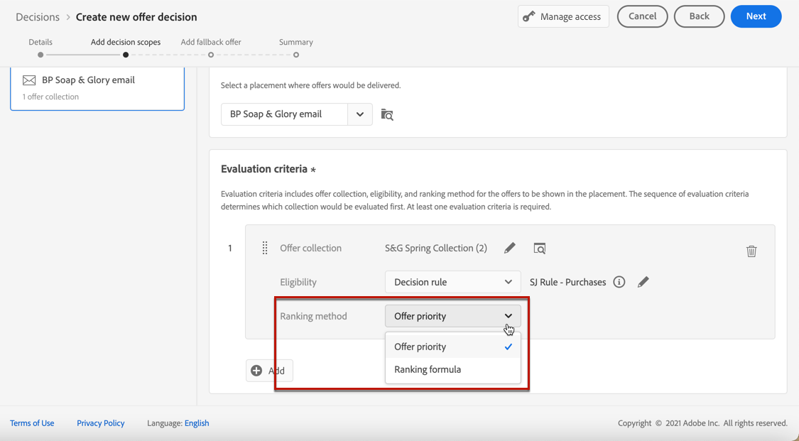
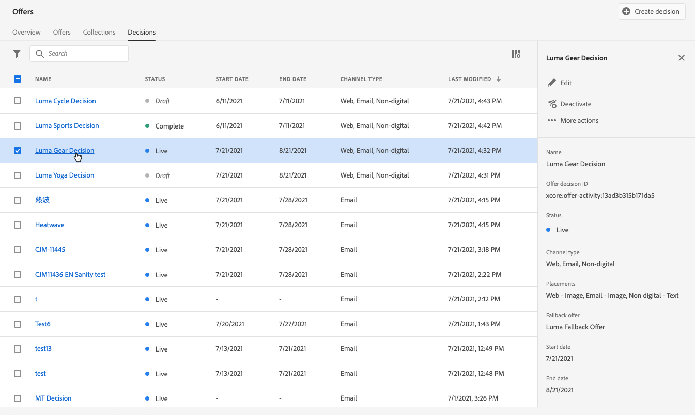

# Beslissingen maken {#create-offer-activities}

Besluiten zijn containers voor uw aanbiedingen die gebruikmaken van de Offertenbeslissingsengine om de beste aanbieding te kiezen, afhankelijk van het doel van de levering.

➡️ [ Leer hoe te om aanbiedingsactiviteiten in deze video tot stand te brengen ](#video)

De lijst met beslissingen is toegankelijk via het tabblad **[!UICONTROL Offers]** > **[!UICONTROL Decisions]** . De filters zijn beschikbaar om u te helpen besluiten op hun status of begin en einddata terugwinnen.

Voordat u een beslissing maakt, moet u controleren of de onderstaande componenten zijn gemaakt in de bibliotheek met aanbiedingen:

* [Plaatsen](../offer-library/creating-placements.md)
* [Verzamelingen](../offer-library/creating-collections.md)
* [Aangepaste aanbiedingen](../offer-library/creating-personalized-offers.md)
* [Herkansingsaanbiedingen](../offer-library/creating-fallback-offers.md)

## De beslissing maken {#create-activity}

>[!CONTEXTUALHELP]
>id="ajo_decisioning_decision_details"
>title="Beslissingsgegevens voorstel"
>abstract="Geef de naam van de beslissing op en definieer zo nodig een begin- en einddatum en -tijd. Selecteer **[!UICONTROL Manage access]** als u aangepaste of basislabels voor gegevensgebruik aan de beslissing wilt toewijzen."

1. Open de beslissingslijst en klik vervolgens op **[!UICONTROL Create decision]** .

1. Geef de naam van de beslissing op.

1. Geef zo nodig een begin- en einddatum en -tijd op en klik op **[!UICONTROL Next]** .

   

1. Selecteer **[!UICONTROL Manage access]** als u aangepaste of basislabels voor gegevensgebruik aan de beslissing wilt toewijzen. [ leer meer over de Controle van de Toegang van het Niveau van Objecten (OLAC) ](../../administration/object-based-access.md)

## Bepaal beslissingsbereik {#add-decision-scopes}

>[!CONTEXTUALHELP]
>id="ajo_decisioning_decision_scopes"
>title="Beslissingsbereik"
>abstract="Vorm één of veelvoudige werkingsgebied voor het aanbiedingsbesluit om de aanbiedingen te bepalen die moeten worden getoond. Dit wordt gedaan door een plaatsing en een bijbehorende evaluatiecriteria voor deze plaatsing te selecteren."

>[!CONTEXTUALHELP]
>id="ajo_decisioning_decision_placement"
>title="Plaatsing"
>abstract="Selecteer een plaatsing waar de voorstellen zouden worden geleverd."

>[!CONTEXTUALHELP]
>id="ajo_decisioning_decision_evaluation"
>title="Evaluatiecriteria"
>abstract="De evaluatiecriteria bestaan uit een aanbod dat gekoppeld is aan een toelatingsbeperking en een rangschikkingsmethode om de aanbiedingen te bepalen die in de plaatsing moeten worden getoond. De volgorde van evaluatiecriteria bepaalt welke verzameling eerst wordt geëvalueerd. Ten minste één evaluatiecriterium is vereist."

1. Selecteer een plaatsing van de drop-down lijst. Het zal aan het eerste beslissingswerkingsgebied in uw besluit worden toegevoegd.

   

1. Klik op **[!UICONTROL Add]** om evaluatiecriteria voor deze plaatsing te selecteren.

   

   Elk criterium bestaat uit een verzameling aanbiedingen die gekoppeld is aan een geschiktheidsbeperking en een rangschikkingsmethode om de aanbiedingen te bepalen die in de plaatsing moeten worden getoond.

   >[!NOTE]
   >
   >Er is ten minste één evaluatiecriterium vereist.

1. Selecteer de aanbiedingsverzameling met de aanbiedingen die u wilt overwegen en klik op **[!UICONTROL Add]** .

   

   >[!NOTE]
   >
   >U kunt op de koppeling **[!UICONTROL Open offer collections]** klikken om de lijst met verzamelingen op een nieuw tabblad weer te geven, zodat u door de verzamelingen en de aanbiedingen in deze verzamelingen kunt bladeren.

   De geselecteerde verzameling wordt toegevoegd aan de criteria.

   

1. Gebruik het veld **[!UICONTROL Eligibility]** om de selectie van aanbiedingen voor deze plaatsing te beperken.

   Deze beperking kan worden toegepast door a **besluitvormingsregel**, of één of verscheidene **publiek van Adobe Experience Platform** te gebruiken. Beide zijn gedetailleerd in [ deze sectie ](../offer-library/add-constraints.md#segments-vs-decision-rules).

   * Als u de selectie van de aanbiedingen wilt beperken tot de leden van een Experience Platform-publiek, selecteert u **[!UICONTROL Audiences]** en klikt u op **[!UICONTROL Add audiences]** .

     

     Voeg een of meer soorten publiek toe vanuit het linkerdeelvenster en combineer ze met de logische operatoren **[!UICONTROL And]** / **[!UICONTROL Or]** .

     

     Leer hoe te om met publiek in [ te werken deze sectie ](../../audience/about-audiences.md).

   * Als u een selectieregel wilt toevoegen met een beslissingsregel, gebruikt u de optie **[!UICONTROL Decision rule]** en selecteert u de gewenste regel.

     

     Leer hoe te om een besluitvormingsregel in [ tot stand te brengen deze sectie ](../offer-library/creating-decision-rules.md).

1. Wanneer u publiek of beslissingsregels selecteert, kunt u informatie over de geschatte gekwalificeerde profielen zien. Klik op **[!UICONTROL Refresh]** om gegevens bij te werken.

   >[!NOTE]
   >
   >Profielramingen zijn niet beschikbaar wanneer regelparameters gegevens bevatten die niet in het profiel staan, zoals contextgegevens. Bijvoorbeeld, een toelatingsregel die het huidige weer om 80 graden vereist te zijn.

   

1. Definieer de waarderingsmethode die u wilt gebruiken om de beste aanbieding voor elk profiel te selecteren. [Meer informatie](../offer-activities/configure-offer-selection.md).

   

   * Als meerdere aanbiedingen voor deze plaatsing in aanmerking komen, gebruikt de methode **[!UICONTROL Offer priority]** standaard de waarde die in de aanbiedingen is gedefinieerd: de aanbieding met de hoogste prioriteitsscore wordt aan de gebruiker geleverd.

   * Selecteer **[!UICONTROL Formula]** of **[!UICONTROL AI model]** als u een specifieke berekende score wilt gebruiken om te kiezen welke aanbieding in aanmerking komt. [Meer informatie](../offer-activities/configure-offer-selection.md).

1. Klik op **[!UICONTROL Add]** om meer criteria voor dezelfde plaatsing te definiëren.

   

1. Wanneer u meerdere criteria toevoegt, worden deze in een bepaalde volgorde geëvalueerd. De eerste verzameling die aan de reeks is toegevoegd, wordt eerst geëvalueerd, enzovoort. [Meer informatie](#evaluation-criteria-order)

   Als u de standaardvolgorde wilt wijzigen, kunt u de verzamelingen slepen en neerzetten om ze naar wens opnieuw te rangschikken.

   

1. U kunt ook meerdere criteria tegelijk evalueren. U doet dit door de verzameling boven op een andere verzameling te slepen.

   

   Ze hebben nu dezelfde rang en zullen dus tegelijkertijd worden geëvalueerd. [Meer informatie](#evaluation-criteria-order)

   

   >[!CAUTION]
   >
   >* Als [ AI model ](../ranking/ai-models.md) in een groep van evaluatiecriteria wordt gebruikt, moeten alle evaluatiecriteria in die groep de AI rangschikkende methode gebruiken en zij moeten het zelfde specifieke AI model gebruiken.
   >
   >* Slechts één groep met evaluatiecriteria kan het AI-model gebruiken. Andere groepen binnen een beslissingsbereik moeten andere rangordemethoden gebruiken (prioriteit of formule). [ leer meer over het rangschikken methodes ](../offer-activities/configure-offer-selection.md)

1. Als u nog een plaatsing voor uw aanbiedingen wilt toevoegen als onderdeel van deze beslissing, gebruikt u de knop **[!UICONTROL New scope]** . Herhaal bovenstaande stappen voor elk beslissingsbereik.

   

   >[!NOTE]
   >
   >Wanneer het toevoegen van veelvoudige beslissingswerkingsgebied, zal de orde van de evaluatiecriteria worden beïnvloed. [Meer informatie](#multiple-scopes)

### Volgorde van de beoordelingscriteria {#evaluation-criteria-order}

Zoals hierboven is beschreven, bestaan de evaluatiecriteria uit een verzameling, subsidiabiliteitsbeperkingen en een rangorde. U kunt de opeenvolgende orde plaatsen u voor de evaluatiecriteria wilt worden geëvalueerd, maar u kunt veelvoudige evaluatiecriteria ook combineren zodat zij samen en niet afzonderlijk worden geëvalueerd.

#### Met één bereik {#one-scope}

Binnen één besluitvormingsgebied bepalen meerdere criteria en de groepering daarvan de prioriteit van de criteria en de rangorde van de in aanmerking komende aanbiedingen. De eerste criteria hebben de hoogste prioriteit en de criteria die in dezelfde &quot;groep&quot; worden gecombineerd, hebben dezelfde prioriteit.

U hebt bijvoorbeeld twee verzamelingen, één in evaluatiecriteria A en één in evaluatiecriteria B. Er worden twee voorstellen teruggestuurd. Laten we zeggen dat er twee in aanmerking komende aanbiedingen zijn uit evaluatiecriteria A en drie in aanmerking komende aanbiedingen uit evaluatiecriteria B.

* Als de twee evaluatiecriteria **niet gecombineerd** en/of in opeenvolgende orde (1 en 2) zijn, zullen de hoogste twee in aanmerking komende aanbiedingen van de evaluatiecriteria in de eerste rij zijn teruggekeerd. Als er niet twee in aanmerking komende aanbiedingen voor de eerste evaluatiecriteria zijn, zal de beslissingsmotor achtereenvolgens overgaan op de volgende evaluatiecriteria om te zien hoeveel aanbiedingen nog nodig zijn, en uiteindelijk een terugslag teruggeven indien nodig.

  

* Als de twee inzamelingen **tezelfdertijd** worden geëvalueerd, aangezien er twee in aanmerking komende aanbiedingen van evaluatiecriteria A en drie in aanmerking komende aanbiedingen van evaluatiecriteria B zijn, zullen alle vijf aanbiedingen samen worden gerangschikt die op de waarde door de respectieve rangschikkingsmethodes wordt bepaald. Er wordt om twee aanbiedingen verzocht, zodat de twee belangrijkste in aanmerking komende aanbiedingen van deze vijf aanbiedingen worden teruggegeven.

  

+++ **Voorbeeld met veelvoudige criteria**

Laten we nu een voorbeeld bekijken waarbij u meerdere criteria hebt voor één bereik dat is verdeeld in verschillende groepen.

U hebt drie criteria gedefinieerd. De criteria 1 en 2 worden in groep 1 samengevoegd en criterium 3 is onafhankelijk (groep 2).

De in aanmerking komende aanbiedingen voor elke criteria en hun prioriteit (gebruikt bij de beoordeling van de rangorde) zijn als volgt:

* Groep 1:
   * Criteria 1 - (Aanbieding 1, Aanbieding 2, Aanbieding 3) - Prioriteit 1
   * Criteria 2 - (Aanbieding 3, Aanbieding 4, Aanbieding 5) - Prioriteit 1

* Groep 2:
   * Criteria 3 - (voorstel 5, voorstel 6) - Prioriteit 0

De hoogste prioritaire aanbiedingen worden eerst geëvalueerd en aan de gerangschikte lijst met aanbiedingen toegevoegd.

**Herhaling 1:**

De criteria 1 en criteria 2 voorstellen worden samen geëvalueerd (voorstel 1, voorstel 2, voorstel 3, voorstel 4, voorstel 5). Laten we zeggen dat het resultaat:

Aanbieding 1 - 10
Voorstel 2 - 20
Aanbieding 3 - 30 uit criterium 1, 45 uit criterium 2. Het hoogste van beide wordt in overweging genomen, dus er wordt rekening gehouden met 45.
Voorstel 4 - 40
Voorstel 5 - 50

Het gerangschikte voorstel is nu als volgt: Voorstel 5, voorstel 3, voorstel 4, voorstel 2, voorstel 1.

**Herhaling 2:**

Criteria 3 worden geëvalueerd (voorstel 5, voorstel 6). Laten we zeggen dat het resultaat:

* Voorstel 5 - Wordt niet geëvalueerd omdat dit al in het bovenstaande resultaat voorkomt.
* Voorstel 6 - 60

De gerangschikte voorstellen zijn nu als volgt: Voorstel 5, voorstel 3, voorstel 4, voorstel 2, voorstel 1, voorstel 6.

+++

#### Met meerdere bereiken {#multiple-scopes}

**als het dupliceren weg** is

Wanneer u meerdere besluitvormingsgebieden aan een besluit toevoegt en duplicatie niet is toegestaan tussen verschillende plaatsen, worden de in aanmerking komende aanbiedingen opeenvolgend geselecteerd in de volgorde van de beslissingsreikwijdte in het verzoek.

>[!NOTE]
>
>De parameter **[!UICONTROL Allow Duplicates across placements]** wordt ingesteld op het plaatsingsniveau. Als duplicatie is ingesteld op false voor plaatsing in een beslissingsverzoek, nemen alle plaatsen in het verzoek de instelling false over. [ Leer meer over verdubbelingsparameter ](../offer-library/creating-placements.md)

Neem een voorbeeld waarin u twee beslissingsbereiken hebt toegevoegd, zoals:

* Bereik 1: Er zijn vier in aanmerking komende aanbiedingen (voorstel 1, voorstel 2, voorstel 3, voorstel 4) en het verzoek is om twee voorstellen terug te sturen.
* Bereik 2: Er zijn vier in aanmerking komende aanbiedingen (voorstel 1, voorstel 2, voorstel 3, voorstel 4) en het verzoek is om twee voorstellen terug te sturen.

+++ **Voorbeeld 1**

De selectie ziet er als volgt uit:

1. De bovenste twee in aanmerking komende aanbiedingen uit bereik 1 worden geretourneerd (voorstel 1, voorstel 2).
1. De resterende twee in aanmerking komende aanbiedingen uit bereik 2 worden geretourneerd (voorstel 3, voorstel 4).

+++

+++ **Voorbeeld 2**

In dit voorbeeld heeft Aanbod 1 de limiet voor de frequentiegrenzen bereikt. [ Leer meer over frequentie het in kaart brengen ](../offer-library/add-constraints.md#capping)

De selectie ziet er als volgt uit:

1. De resterende twee in aanmerking komende aanbiedingen uit bereik 1 worden geretourneerd (voorstel 2, voorstel 3).
1. Het resterende in aanmerking komende aanbod uit bereik 2 wordt geretourneerd (voorstel 4).

+++

+++ **Voorbeeld 3**

In dit voorbeeld bereikten Aanbod 1 en Aanbieding 3 hun limiet voor de frequentiegrenzen. [ Leer meer over frequentie het in kaart brengen ](../offer-library/add-constraints.md#capping)

De selectie ziet er als volgt uit:

1. De resterende twee in aanmerking komende aanbiedingen uit bereik 1 worden geretourneerd (voorstel 2, voorstel 4).
1. Er zijn geen resterende in aanmerking komende aanbiedingen voor Reikwijdte 2, zodat is de [ fallback aanbieding ](#add-fallback) teruggekeerd.

+++

**als het dupliceren** is

Wanneer duplicatie op alle plaatsen is toegestaan, kan hetzelfde aanbod meerdere malen voor verschillende plaatsen worden voorgesteld. Als deze optie is ingeschakeld, overweegt het systeem dezelfde aanbieding voor meerdere plaatsingen. [ Leer meer over verdubbelingsparameter ](../offer-library/creating-placements.md)

Neem het zelfde voorbeeld zoals hierboven waar u twee besluitvormingswerkingsgebied zoals toevoegde:

* Bereik 1: Er zijn vier in aanmerking komende aanbiedingen (voorstel 1, voorstel 2, voorstel 3, voorstel 4) en het verzoek is om twee voorstellen terug te sturen.
* Bereik 2: Er zijn vier in aanmerking komende aanbiedingen (voorstel 1, voorstel 2, voorstel 3, voorstel 4) en het verzoek is om twee voorstellen terug te sturen.

+++ **Voorbeeld 1**

De selectie ziet er als volgt uit:

1. De bovenste twee in aanmerking komende aanbiedingen uit bereik 1 worden geretourneerd (voorstel 1, voorstel 2).
1. Dezelfde top twee in aanmerking komende aanbiedingen uit bereik 2 worden geretourneerd (voorstel 1, voorstel 2).

+++

+++ **Voorbeeld 2**

In dit voorbeeld heeft Aanbod 1 de limiet voor de frequentiegrenzen bereikt. [ Leer meer over frequentie het in kaart brengen ](../offer-library/add-constraints.md#capping)

De selectie ziet er als volgt uit:

1. De resterende twee in aanmerking komende aanbiedingen uit bereik 1 worden geretourneerd (voorstel 2, voorstel 3).

1. Dezelfde resterende twee in aanmerking komende aanbiedingen uit bereik 2 worden geretourneerd (voorstel 2, voorstel 3).

+++

+++ **Voorbeeld 3**

In dit voorbeeld bereikten Aanbod 1 en Aanbieding 3 hun limiet voor de frequentiegrenzen. [ Leer meer over frequentie het in kaart brengen ](../offer-library/add-constraints.md#capping)

De selectie ziet er als volgt uit:

1. De resterende twee in aanmerking komende aanbiedingen uit bereik 1 worden geretourneerd (voorstel 2, voorstel 4).

1. Dezelfde resterende twee in aanmerking komende aanbiedingen uit bereik 2 worden geretourneerd (voorstel 2, voorstel 4).

+++

## Een fallback-aanbieding toevoegen {#add-fallback}

>[!CONTEXTUALHELP]
>id="ajo_decisioning_decision_fallback"
>title="Een fallback-aanbieding toevoegen"
>abstract="Zodra u het besluitvormingswerkingsgebied bepaalde, bepaal de reserveaanbieding die als laatste redmiddel aan de klanten zal worden voorgesteld die niet de regels en de beperkingen van de aanbiedingen geschiktheid aanpassen."

Nadat u het besluitvormingswerkingsgebied bepaalde, bepaal de [ fallback aanbieding ](../offer-library/creating-fallback-offers.md) die als laatste redmiddel aan de klanten zal worden voorgesteld die niet de regels en de beperkingen van de aanbiedingen geschiktheid aanpassen.

U doet dit door het te selecteren in de lijst met beschikbare fallback-aanbiedingen voor de plaatsingen die in de beslissing zijn gedefinieerd.

>[!NOTE]
>
>De terugvalaanbiedingen moeten alle in een besluit gebruikte verklaringen bevatten. Als een beslissing bijvoorbeeld vijf voorstellen bevat en elk voorstel een andere representatie heeft, moeten er vijf voorstellen in het fallback-aanbod worden opgenomen.

Klik op **[!UICONTROL Next]** als deze optie is geselecteerd.

Klik op de koppeling **[!UICONTROL Open offer library]** om de lijst met aanbiedingen op een nieuw tabblad weer te geven.

## Beslissing bekijken en opslaan {#review}

Als alles behoorlijk wordt gevormd, toont een samenvatting van de beslissingseigenschappen.

1. Zorg ervoor dat het besluit klaar is om te worden gebruikt om aanbiedingen aan klanten voor te stellen. Alle besluitvormingswerkingsgebieden en de reserveaanbieding het bevat worden getoond.

   

1. U kunt elke plaatsing uitvouwen of samenvouwen. U kunt voor elke plaatsing een voorvertoning weergeven van de beschikbare voorstellen, de geschiktheid en de rangschikkingsgegevens. U kunt ook informatie weergeven over de geschatte gekwalificeerde profielen. Klik op **[!UICONTROL Refresh]** om gegevens bij te werken.

   

1. Klik op **[!UICONTROL Finish]**.
1. Selecteer **[!UICONTROL Save and activate]**.

   

   U kunt de beslissing ook opslaan als concept, zodat u deze later kunt bewerken en activeren.

De beslissing wordt in de lijst weergegeven met de status **[!UICONTROL Live]** of **[!UICONTROL Draft]** , afhankelijk van het feit of u de beslissing hebt geactiveerd in de vorige stap.

Het is nu klaar om te worden gebruikt om aanbiedingen aan klanten te leveren.

## Beslissingenlijst {#decision-list}

In de beslissingslijst kunt u de beslissing selecteren om de eigenschappen ervan weer te geven. Van daar kunt u het ook uitgeven, zijn status veranderen (**Ontwerp**, **Levend**, **Volledig**, **Gearchiveerd**), het besluit dupliceren, of het schrappen.

Selecteer de **[!UICONTROL Edit]** knoop om naar de wijze van de beslissingsuitgave terug te gaan, waar u de 1} details van het besluit [ kunt wijzigen, ](#create-activity) besluitvormingswerkingsgebied [ en ](#add-decision-scopes) fallback aanbieding [.](#add-fallback)

>[!IMPORTANT]
>
>Als er wijzigingen worden aangebracht in een biedbesluit dat wordt gebruikt in een reisbericht, moet u de reis ongedaan maken en opnieuw publiceren.  Dit zal ervoor zorgen dat de veranderingen in het reisbericht worden opgenomen en dat de boodschap in overeenstemming is met de meest recente updates.

Selecteer een live beslissing en klik op **[!UICONTROL Deactivate]** om de beslissingsstatus weer in te stellen op **[!UICONTROL Draft]** .

Als u de status opnieuw wilt instellen op **[!UICONTROL Live]** , selecteert u de knop **[!UICONTROL Activate]** die nu wordt weergegeven.

Met de knop **[!UICONTROL More actions]** schakelt u de hieronder beschreven handelingen in.

* **[!UICONTROL Complete]**: stelt de status van het besluit in op **[!UICONTROL Complete]** , wat betekent dat het besluit niet meer kan worden aangeroepen. Deze handeling is alleen beschikbaar voor geactiveerde beslissingen. De beslissing is nog steeds beschikbaar in de lijst, maar u kunt de status niet terugzetten op **[!UICONTROL Draft]** of **[!UICONTROL Approved]** . U kunt het alleen dupliceren, verwijderen of archiveren.

* **[!UICONTROL Duplicate]**: maakt een beslissing met dezelfde eigenschappen, hetzelfde beslissingsbereik en dezelfde fallback-aanbieding. De nieuwe beslissing heeft standaard de status **[!UICONTROL Draft]** .

* **[!UICONTROL Delete]** : hiermee verwijdert u de beslissing uit de lijst.

  >[!CAUTION]
  >
  >Het besluit en de inhoud ervan zijn niet meer toegankelijk. Deze handeling kan niet ongedaan worden gemaakt.
  >
  >Als de beslissing in een ander object wordt gebruikt, kan deze niet worden verwijderd.

* **[!UICONTROL Archive]** : stelt de beslissingsstatus in op **[!UICONTROL Archived]** . De beslissing is nog steeds beschikbaar in de lijst, maar u kunt de status niet terugzetten op **[!UICONTROL Draft]** of **[!UICONTROL Approved]** . U kunt deze alleen dupliceren of verwijderen.

U kunt ook de status van meerdere beslissingen tegelijk verwijderen of wijzigen door de desbetreffende selectievakjes in te schakelen.

Als u de status van verschillende beslissingen met verschillende statussen wilt wijzigen, worden alleen de desbetreffende statussen gewijzigd.

Nadat u een beslissing hebt gemaakt, kunt u in de lijst op de naam ervan klikken.

Dit laat u toe om tot gedetailleerde informatie voor dat besluit toegang te hebben. Selecteer het **[!UICONTROL Change log]** lusje aan [ controle alle veranderingen ](../get-started/user-interface.md#changes-logs) die aan het besluit zijn aangebracht.

## Hoe kan ik-video{#video}

Leer hoe u aanbiedingsactiviteiten kunt maken in besluitvormingsbeheer.

>[!VIDEO](https://video.tv.adobe.com/v/329606?quality=12)

