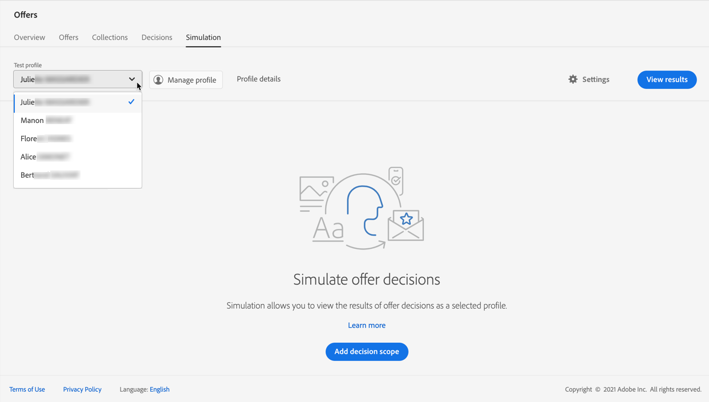
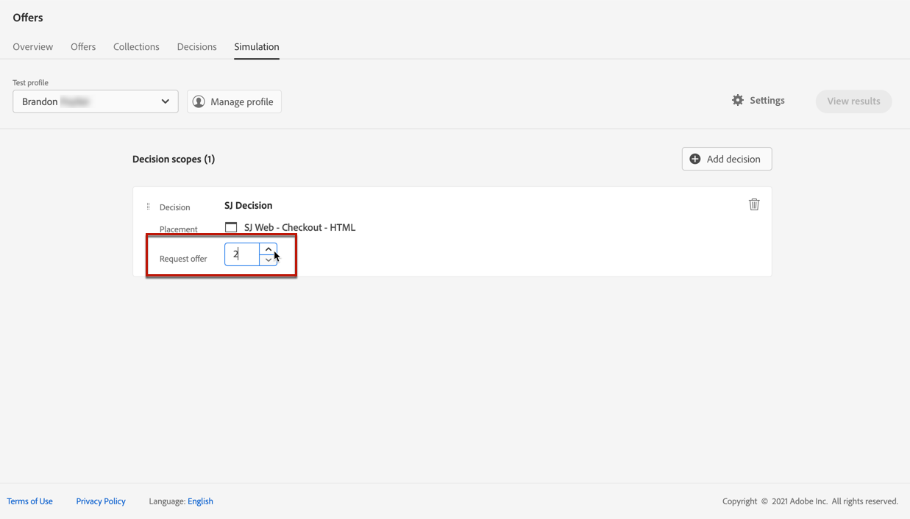

# Simulaties maken {#create-simulations}

## Informatie over simulatie {#about-simulation}

Om uw beslissingslogica te bevestigen, kunt u simuleren welke aanbiedingen aan een testprofiel voor een bepaalde plaatsing zullen worden geleverd.

<!--Simulation allows you to view the results of offer decisions as a selected profile.-->

Hierdoor kunt u verschillende versies van uw aanbiedingen testen en verfijnen, zonder dat dit gevolgen heeft voor de beoogde ontvangers.

>[!NOTE]
>
>Deze mogelijkheid simuleert één verzoek aan de [!DNL Decisions] API. Meer informatie over [Aanbiedingen leveren met behulp van de Besluiten-API](../api-reference/decisions-api/deliver-offers.md).

Als u deze functie wilt openen, selecteert u de optie **[!UICONTROL Simulation]** van de **[!UICONTROL Decision management]** > **[!UICONTROL Offers]** -menu.

<!--
➡️ [Discover this feature in video](#video)
-->

## Testprofielen selecteren {#select-test-profiles}

Eerst moet u de testprofielen selecteren die u voor simulatie gaat gebruiken.

1. Klik op **[!UICONTROL Manage profile]**.

   

1. Selecteer de naamruimte voor de identiteit die u wilt gebruiken om testprofielen te identificeren. In dit voorbeeld gebruiken we de **E-mail** naamruimte.

   >[!NOTE]
   >
   >Een naamruimte voor identiteiten definieert de context van een id, zoals een e-mailadres of CRM-id. Meer informatie over naamruimten in Adobe Experience Platform [in deze sectie](../../start/get-started-identity.md){target=&quot;_blank&quot;}.

1. Voer de identiteitswaarde in en klik op **[!UICONTROL View]** om de beschikbare profielen weer te geven.

   

1. Voeg andere profielen toe als u andere profielgegevens wilt testen en sla uw selectie op.

   

1. Na toevoeging worden alle profielen vermeld in de vervolgkeuzelijst onder **[!UICONTROL Test profile]**. U kunt schakelen tussen de opgeslagen testprofielen om de resultaten voor elk geselecteerd profiel weer te geven.

   

   >[!NOTE]
   >
   >De geselecteerde profielen blijven als testprofielen vermeld in het dialoogvenster **[!UICONTROL Simulation]** tabblad van sessie tot sessie totdat deze zijn verwijderd via **[!UICONTROL Manage profile]**.

1. U kunt op de knop **[!UICONTROL Profile details]** koppeling gebruiken om de geselecteerde profielgegevens weer te geven.

<!--Learn more on [selecting test profiles](messages/preview.md#select-test-profiles)-->

## Beslissingsbereik toevoegen {#add-decision-scopes}

Selecteer nu de aanbiedingsbesluiten die u op uw testprofielen wilt simuleren.

1. Selecteer **[!UICONTROL Add decision scope]**.

   

1. Selecteer een plaatsing in de lijst.

   

1. De beschikbare beslissingen worden weergegeven.

   * U kunt het zoekveld gebruiken om de selectie te verfijnen.
   * U kunt op de knop **[!UICONTROL Open offer decisions]** Hiermee opent u de lijst met alle beslissingen die u hebt gemaakt. Meer informatie over [besluiten](create-offer-activities.md).

   Selecteer de gewenste beslissing en klik op **[!UICONTROL Add]**.

   

1. Het beslissingsbereik dat u zojuist hebt gedefinieerd, wordt weergegeven in de hoofdwerkruimte.

   U kunt het aantal voorstellen aanpassen dat u wilt verzoeken. Als u bijvoorbeeld 2 selecteert, worden de beste 2 aanbiedingen weergegeven voor dit beslissingsbereik.

   

   >[!NOTE]
   >
   >Je kunt maximaal 30 voorstellen aanvragen.

1. Herhaal bovenstaande stappen om zoveel beslissingen toe te voegen als u nodig hebt.

   

   >[!NOTE]
   >
   >Zelfs als u verschillende beslissingsbereiken definieert, wordt slechts één API-aanvraag gesimuleerd.

## Simulatie-instellingen definiëren {#define-simulation-settings}

Volg onderstaande stappen om de standaardinstellingen voor uw simulaties te bewerken.

1. Klik op **[!UICONTROL Settings]**.

   

1. In de **[!UICONTROL Deduplication]** kunt u dubbele aanbiedingen toestaan voor verschillende beslissingen en/of plaatsen. Dit betekent dat meerdere beslissingen/stages dezelfde aanbieding kunnen krijgen.

   

   >[!NOTE]
   >
   >Door gebrek, worden alle vlaggen van de Deduplicatie toegelaten voor simulatie, zo betekent het dat de besluitvormingsmotor duplicaten toestaat en zo de zelfde voorstelling over veelvoudige besluiten/plaatsen kan maken. Meer informatie over de [!DNL Decisions] Eigenschappen voor API-aanvragen in [deze sectie](../api-reference/decisions-api/deliver-offers.md).

1. In de **[!UICONTROL Response format]** kunt u metagegevens opnemen in de codeweergave. Controleer de corresponderende optie en selecteer de metagegevens van uw keuze. Ze worden weergegeven in de aanvraag- en antwoordlading wanneer u **[!UICONTROL View code]**. Meer informatie in het dialoogvenster [Simulatieresultaten weergeven](#simulation-results) sectie.

   

   >[!NOTE]
   >
   >Wanneer u de optie inschakelt, worden standaard alle items geselecteerd.

1. Klik op **[!UICONTROL Save]**.

>[!NOTE]
>
>Momenteel kunt u voor simulatiegegevens alleen de opdracht **[!UICONTROL Hub]** API.

<!--
In the **[!UICONTROL API for simulation]** section, select the API you want to use: **[!UICONTROL Hub]** or **[!UICONTROL Edge]**.
Hub and Edge are two different end points for simulation data.

In the **[!UICONTROL Context data]** section, you can add as many elements as needed.

    >[!NOTE]
    >
    >This section is hidden if you select Edge API in the section above. Hub allows the use of Context data, Edge does not.

Context data allows the user to add contextual data that could affect the simulation score.
For instance, let's say the customer has an offer for a discount on ice cream. In the rules for that offer, it can have logic that would rank it higher when the temperature is above 80 degrees. In simulation, the user could add context data: temperature=65 and that offer would rank lower, of they could add temperature=95 and that would rank higher.
-->

## Simulatieresultaten weergeven {#simulation-results}

Nadat u een beslissingsbereik hebt toegevoegd en een testprofiel hebt geselecteerd, kunt u de resultaten bekijken.

1. Klik op **[!UICONTROL View results]**.

   

1. De beste beschikbare aanbiedingen worden weergegeven volgens het geselecteerde profiel voor elke beslissing.

   Selecteer een voorstel om de details ervan weer te geven.

   

1. Klikken **[!UICONTROL View code]** om de aanvraag- en antwoordlading weer te geven. [Meer informatie](#view-code)

1. Selecteer een ander profiel in de lijst om de resultaten van de biedingsbesluiten voor een ander testprofiel weer te geven.

1. U kunt het beslissingsbereik zo vaak als nodig toevoegen, verwijderen of bijwerken.

>[!NOTE]
>
>Elke keer dat u profielen wijzigt of beslissingsbereik bijwerkt, moet u de resultaten vernieuwen met de opdracht **[!UICONTROL View results]** knop.

## Code weergeven {#view-code}

1. Gebruik de **[!UICONTROL View code]** om de aanvraag- en antwoordlading weer te geven.

   

   De codeweergave toont de ontwikkelaarsinformatie voor de huidige gebruiker. Standaard worden de **[!UICONTROL Response payload]** wordt weergegeven.

   

1. Klikken **[!UICONTROL Response payload]** of **[!UICONTROL Request payload]** om tussen de twee tabbladen te navigeren.

   

1. Om de verzoeklading buiten te gebruiken [!DNL Journey Optimizer] - voor het oplossen van problemendoel bijvoorbeeld, kopieer het gebruikend **[!UICONTROL Copy to clipboard]** boven op de codeweergave.

   

   <!--You cannot copy the response payload. ACTUALLY YES YOU CAN > to confirm with PM/dev? -->

   >[!NOTE]
   >
   >Wanneer u de aanvraag- of antwoordladingen naar uw eigen code kopieert, moet u {USER_TOKEN} en {API_KEY} vervangen door geldige waarden. Leer hoe u deze waarden kunt ophalen in het dialoogvenster [Adobe Experience Platform API&#39;s](https://experienceleague.adobe.com/docs/experience-platform/landing/platform-apis/api-authentication.html){target=&quot;_blank&quot;} documentatie.

