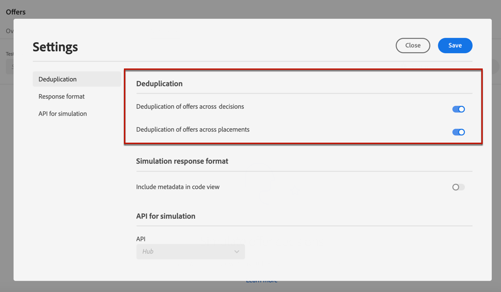
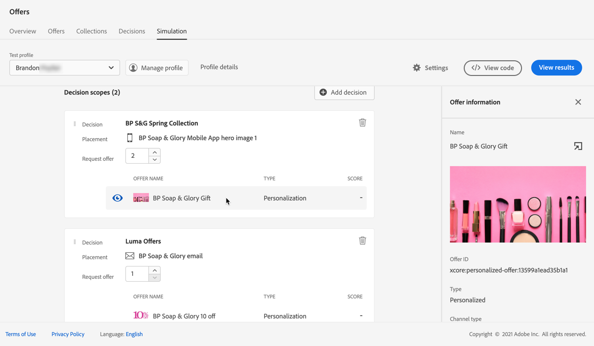
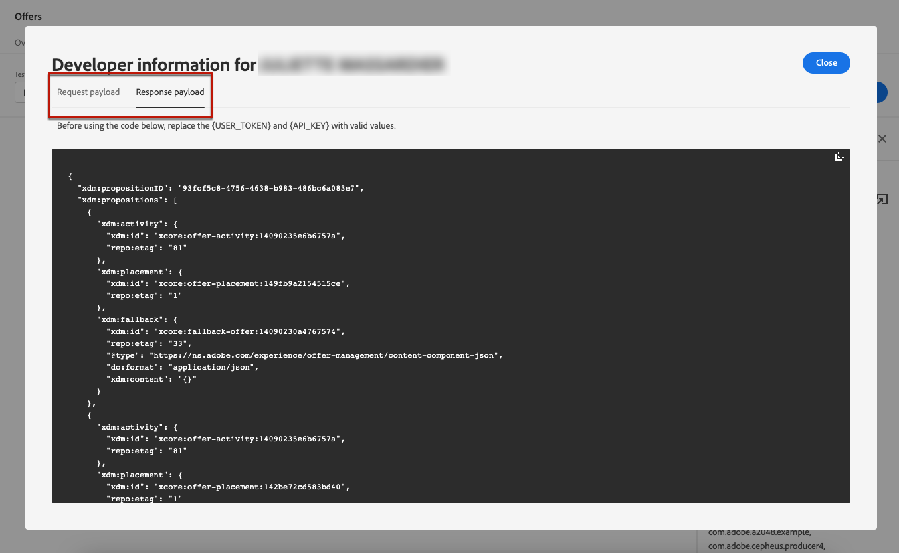

# Simulaties maken {#create-simulations}

>[!CONTEXTUALHELP]
>id="ajo_decisioning_simulation"
>title="Aanbiedingsbesluiten simuleren"
>abstract="Met simulatie kunt u simuleren welke aanbiedingen aan een testprofiel voor een bepaalde plaatsing worden geleverd. Hierdoor kunt u verschillende versies van uw aanbiedingen testen en verfijnen, zonder dat dit gevolgen heeft voor de beoogde ontvangers."

## Informatie over simulatie {#about-simulation}

Om uw beslissingslogica te bevestigen, kunt u simuleren welke aanbiedingen aan een testprofiel voor een bepaalde plaatsing zullen worden geleverd.

<!--Simulation allows you to view the results of offer decisions as a selected profile.-->

Hierdoor kunt u verschillende versies van uw aanbiedingen testen en verfijnen, zonder dat dit gevolgen heeft voor de beoogde ontvangers.

>[!NOTE]
>
>Deze mogelijkheid simuleert één aanvraag voor de [!DNL Decisioning] API. Leer meer over [ aanbiedingen leveren gebruikend besluit API ](../api-reference/offer-delivery-api/decisioning-api.md).

U opent deze functie door de tab **[!UICONTROL Simulation]** in het menu **[!UICONTROL Decision management]** > **[!UICONTROL Offers]** te selecteren.

>[!NOTE]
>
>Aangezien de simulatie geen besluitvormingsgebeurtenis produceert, wordt het [ maximum ](../offer-library/add-constraints.md#capping) aantal niet beïnvloed.

<!--
➡️ [Discover this feature in video](#video)
-->

## Testprofielen selecteren {#select-test-profiles}

>[!CONTEXTUALHELP]
>id="ajo_decisioning_simulation_test_profile"
>title="Testprofielen toevoegen"
>abstract="U kunt een testprofiel toevoegen door een naamruimte voor de identiteit en een bijbehorende identiteitswaarde te selecteren. U moet testprofielen al beschikbaar hebben om hen voor simulatie te kunnen gebruiken."

Eerst moet u de testprofielen selecteren die u voor simulatie gaat gebruiken.

>[!CAUTION]
>
>U moet testprofielen beschikbaar hebben om te simuleren welke aanbiedingen aan hen zullen worden geleverd. Leer hoe te om [ testprofielen ](../../audience/creating-test-profiles.md) tot stand te brengen.

1. Klik op **[!UICONTROL Manage profile]**.

   

1. Selecteer de naamruimte voor de identiteit die u wilt gebruiken om testprofielen te identificeren. In dit voorbeeld, zullen wij **E-mail** gebruiken namespace.

   >[!NOTE]
   >
   >Een naamruimte voor identiteiten definieert de context van een id, zoals een e-mailadres of CRM-id. Leer meer over de identiteitsnaamruimten van Adobe Experience Platform [ in deze sectie ](../../audience/get-started-identity.md){target="_blank"}.

1. Voer de identiteitswaarde in en klik op **[!UICONTROL View]** om de beschikbare profielen weer te geven.

   

1. Voeg andere profielen toe als u andere profielgegevens wilt testen en sla uw selectie op.

   

1. Als deze eenmaal zijn toegevoegd, worden alle profielen vermeld in de vervolgkeuzelijst onder **[!UICONTROL Test profile]** . U kunt schakelen tussen de opgeslagen testprofielen om de resultaten voor elk geselecteerd profiel weer te geven.

   

   >[!NOTE]
   >
   >De geselecteerde profielen blijven op het tabblad **[!UICONTROL Simulation]** van sessie tot sessie weergegeven als testprofielen totdat ze met **[!UICONTROL Manage profile]** worden verwijderd.

1. Klik op de koppeling **[!UICONTROL Profile details]** om de geselecteerde profielgegevens weer te geven.

## Beslissingsbereik toevoegen {#add-decision-scopes}

Selecteer nu de aanbiedingsbesluiten die u op uw testprofielen wilt simuleren.

1. Selecteer **[!UICONTROL Add decision scope]**.

   

1. Selecteer een plaatsing in de lijst.

   

1. De beschikbare beslissingen worden weergegeven.

   * Met het zoekveld kunt u de selectie verfijnen.
   * U kunt op de koppeling **[!UICONTROL Open offer decisions]** klikken om de lijst met alle beslissingen te openen die u hebt gemaakt. Leer meer over [ besluiten ](create-offer-activities.md).

   Selecteer de gewenste beslissing en klik op **[!UICONTROL Add]** .

   

1. Het beslissingsbereik dat u zojuist hebt gedefinieerd, wordt weergegeven in de hoofdwerkruimte.

   U kunt het aantal voorstellen aanpassen dat u wilt verzoeken. Als u bijvoorbeeld 2 selecteert, worden de beste 2 aanbiedingen weergegeven voor dit beslissingsbereik.

   

   >[!NOTE]
   >
   >Je kunt maximaal 30 voorstellen aanvragen.

1. Herhaal bovenstaande stappen om zoveel beslissingen toe te voegen als u nodig hebt.

   

   >[!NOTE]
   >
   >Zelfs als u verschillende beslissingsbereiken definieert, wordt slechts één API-aanvraag gesimuleerd.

## Simulatie-instellingen definiëren {#define-simulation-settings}

Volg onderstaande stappen om de standaardinstellingen voor uw simulaties te bewerken.

1. Klik op **[!UICONTROL Settings]**.

   

1. In de sectie **[!UICONTROL Deduplication]** kunt u dubbele aanbiedingen toestaan voor verschillende beslissingen en/of plaatsen. Dit betekent dat meerdere beslissingen/stages dezelfde aanbieding kunnen krijgen.

   

   >[!NOTE]
   >
   >Door gebrek, worden alle vlaggen van de Deduplicatie toegelaten voor simulatie, wat betekent dat de besluitvormingsmotor duplicaten toestaat en zo de zelfde voorstelling over veelvoudige besluiten/plaatsen kan maken. Leer meer over [!DNL Decisioning] API verzoekeigenschappen in [ deze sectie ](../api-reference/offer-delivery-api/decisioning-api.md).

1. In de sectie **[!UICONTROL Response format]** kunt u metagegevens opnemen in de codeweergave. Controleer de corresponderende optie en selecteer de metagegevens van uw keuze. Deze worden weergegeven in de aanvraag- en antwoordladingen wanneer u **[!UICONTROL View code]** selecteert. Leer meer in de [ simulatieresultaten van de Mening ](#simulation-results) sectie.

   

   >[!NOTE]
   >
   >Wanneer u de optie inschakelt, worden standaard alle items geselecteerd.

1. Klik op **[!UICONTROL Save]**.

>[!NOTE]
>
>Momenteel kunt u alleen de API **[!UICONTROL Hub]** gebruiken voor simulatiegegevens.

<!--
In the **[!UICONTROL API for simulation]** section, select the API you want to use: **[!UICONTROL Hub]** or **[!UICONTROL Edge]**.
Hub and Edge are two different end points for simulation data.

In the **[!UICONTROL Context data]** section, you can add as many elements as needed.

    >[!NOTE]
    >
    >This section is hidden if you select Edge API in the section above. Hub allows the use of Context data, Edge does not.

Context data allows the user to add contextual data that could affect the simulation score.
For instance, let's say the customer has an offer for a discount on ice cream. In the rules for that offer, it can have logic that would rank it higher when the temperature is above 80 degrees. In simulation, the user could add context data: temperature=65 and that offer would rank lower, of they could add temperature=95 and that would rank higher.
-->

## Simulatieresultaten weergeven {#simulation-results}

Nadat u een beslissingsbereik hebt toegevoegd en een testprofiel hebt geselecteerd, kunt u de resultaten bekijken.

1. Klik op **[!UICONTROL View results]**.

   

1. De beste beschikbare aanbiedingen worden weergegeven volgens het geselecteerde profiel voor elke beslissing.

   Selecteer een voorstel om de details ervan weer te geven.

   

1. Klik op **[!UICONTROL View code]** om de aanvraag- en antwoordladingen weer te geven. [Meer informatie](#view-code)

1. Selecteer een ander profiel in de lijst om de resultaten van de biedingsbesluiten voor een ander testprofiel weer te geven.

1. U kunt het beslissingsbereik zo vaak als nodig toevoegen, verwijderen of bijwerken.

>[!NOTE]
>
>Telkens wanneer u profielen wijzigt of beslissingsbereik bijwerkt, moet u de resultaten vernieuwen met de knop **[!UICONTROL View results]** .

## Code weergeven {#view-code}

1. Gebruik de knop **[!UICONTROL View code]** om de aanvraag- en antwoordladingen weer te geven.

   

   De codeweergave toont de ontwikkelaarsinformatie voor de huidige gebruiker. Standaard wordt **[!UICONTROL Response payload]** weergegeven.

   

1. Klik op **[!UICONTROL Response payload]** of **[!UICONTROL Request payload]** om tussen de twee tabbladen te navigeren.

   

1. Als u de payload van de aanvraag buiten [!DNL Journey Optimizer] wilt gebruiken - voor het oplossen van problemen, kopieert u de aanvraag bijvoorbeeld met de knop **[!UICONTROL Copy to clipboard]** boven op de codeweergave.

   

   <!--You cannot copy the response payload. ACTUALLY YES YOU CAN > to confirm with PM/dev? -->

   >[!NOTE]
   >
   >Wanneer u de aanvraag- of antwoordladingen naar uw eigen code kopieert, moet u {USER_TOKEN} en {API_KEY} vervangen door geldige waarden. Leer hoe te om deze waarden in de [ Adobe Experience Platform APIs ](https://experienceleague.adobe.com/docs/experience-platform/landing/platform-apis/api-authentication.html){target="_blank"} documentatie terug te winnen.

