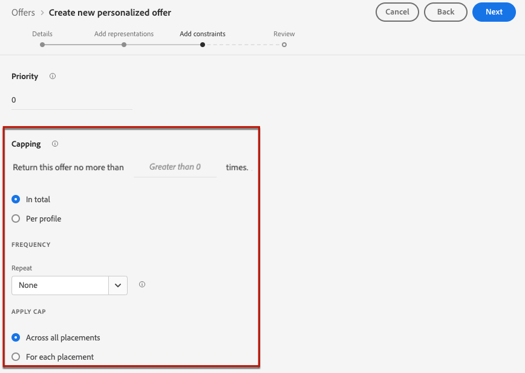
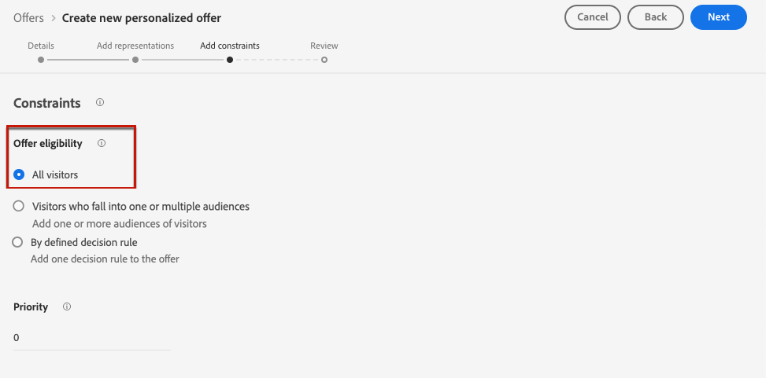
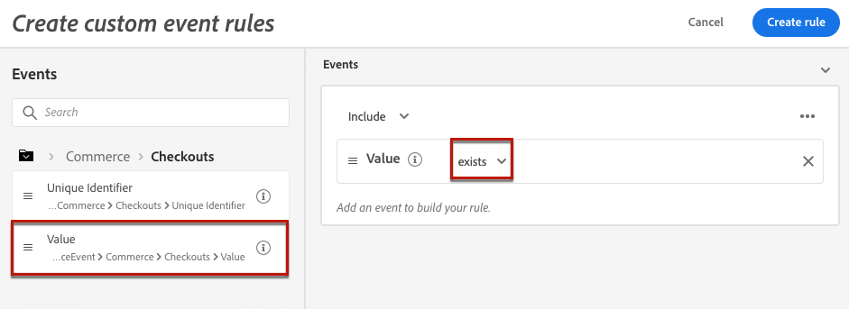

# Beperkingen aan een aanbieding toevoegen {#add-constraints}

>[!CONTEXTUALHELP]
>id="od_offer_constraints"
>title="Over aanbiedingsbeperkingen"
>abstract="Met beperkingen, kunt u specificeren hoe de aanbieding aan de gebruiker in vergelijking met andere aanbiedingen voorrang wordt gegeven en wordt voorgesteld."

>[!CONTEXTUALHELP]
>id="ajo_decisioning_constraints"
>title="Over aanbiedingsbeperkingen"
>abstract="Met beperkingen, kunt u specificeren hoe de aanbieding aan de gebruiker in vergelijking met andere aanbiedingen voorrang wordt gegeven en wordt voorgesteld."

>[!CONTEXTUALHELP]
>id="od_offer_priority"
>title="Info over prioriteit aanbieden"
>abstract="Op dit gebied, kunt u prioritaire montages voor de aanbieding specificeren. Prioriteit is een nummer dat wordt gebruikt om aanbiedingen te rangschikken die aan alle beperkingen voldoen, zoals geschiktheid, datums en aftopping."

>[!CONTEXTUALHELP]
>id="ajo_decisioning_priority"
>title="Prioriteit instellen"
>abstract="De prioritaire hulp bepaalt de prioriteit van de aanbieding in vergelijking met andere als de gebruiker voor meer dan één aanbieding in aanmerking komt. Hoe hoger de prioriteit van een aanbieding is, hoe hoger de prioriteit ervan wordt vergeleken met andere aanbiedingen."

Met beperkingen kunt u de voorwaarden definiëren waaronder een aanbieding wordt weergegeven.

1. Configureer de **[!UICONTROL Offer eligibility]** . [Meer informatie](#eligibility)

   

1. Definieer de **[!UICONTROL Priority]** van de aanbieding in vergelijking met andere als de gebruiker voor meer dan één aanbieding in aanmerking komt. Hoe hoger de prioriteit van een aanbieding is, hoe hoger de prioriteit ervan wordt vergeleken met andere aanbiedingen.

   

   >[!NOTE]
   >
   >De aanbiedingsprioriteit moet een geheel-getalwaarde zijn (geen decimalen).

1. Geef de **[!UICONTROL Capping]** van de aanbieding op. Dit houdt in hoe vaak de aanbieding wordt weergegeven. [Meer informatie](#capping)

   

1. Klik op **[!UICONTROL Next]** om alle beperkingen te bevestigen die u hebt gedefinieerd.

Als u bijvoorbeeld de volgende beperkingen instelt:

* Dit aanbod wordt alleen in overweging genomen voor gebruikers die voldoen aan de beslissingsregel &quot;Gold Loyalty Customers&quot;.
* De prioriteit van de aanbieding is vastgesteld op &quot;50&quot;, wat betekent dat de aanbieding wordt gepresenteerd vóór aanbiedingen met een prioriteit tussen 1 en 49 en na de aanbiedingen met een prioriteit van ten minste 51.
* Het voorstel wordt slechts eenmaal per maand per gebruiker op alle plaatsen weergegeven.

## Subsidiabiliteit {#eligibility}

>[!CONTEXTUALHELP]
>id="ajo_decisioning_eligibility"
>title="Geschiktheid definiëren"
>abstract="Standaard kan elk profiel in aanmerking komen om het aanbod te presenteren, maar u kunt het publiek of besluitvormingsregels gebruiken om het aanbod te beperken tot specifieke profielen."

>[!CONTEXTUALHELP]
>id="od_offer_eligibility"
>title="Geschiktheid voor aanbieding"
>abstract="In deze sectie kunt u besluitvormingsregels gebruiken om te bepalen welke gebruikers in aanmerking komen voor de aanbieding."

<!--additional-url="https://video.tv.adobe.com/v/329373" text="Watch demo video"-->

>[!CONTEXTUALHELP]
>id="ajo_decisioning_total_profile_estimate"
>title="Totale profielschatting"
>abstract="Wanneer u publiek of beslissingsregels selecteert, kunt u informatie over de geschatte gekwalificeerde profielen zien."

In de sectie **[!UICONTROL Offer eligibility]** kunt u het aanbod beperken tot specifieke profielen die u definieert aan de hand van doelgroepen of beslissingsregels.

>[!NOTE]
>
>Leer meer over het gebruiken van **publiek** tegenover **besluitvormingsregels** in [ deze sectie ](#segments-vs-decision-rules).

* Standaard is de optie **[!UICONTROL All visitors]** geselecteerd. Dit houdt in dat elk profiel in aanmerking komt voor presentatie van de aanbieding.

  

* U kunt de presentatie van de aanbieding aan de leden van één of verscheidene [ publiek van Adobe Experience Platform ](../../audience/about-audiences.md) ook beperken.

  Hiervoor activeert u de optie **[!UICONTROL Visitors who fall into one or multiple audiences]** en voegt u een of meer soorten publiek toe vanuit het linkervenster en combineert u deze met de logische operatoren **[!UICONTROL And]** / **[!UICONTROL Or]** .

  

* Als u een specifieke [ besluitvormingsregel ](../offer-library/creating-decision-rules.md) aan de aanbieding wilt associëren, selecteer **[!UICONTROL By defined decision rule]**, dan sleep de gewenste regel van de linkerruit in het **[!UICONTROL Decision rule]** gebied.

  

  >[!CAUTION]
  >
  >Aanbiedingen op basis van gebeurtenissen worden momenteel niet ondersteund in [!DNL Journey Optimizer] . Als u een besluitvormingsregel creeert die op een [ wordt gebaseerd gebeurtenis ](https://experienceleague.adobe.com/docs/experience-platform/segmentation/ui/segment-builder.html#events){target="_blank"}, zult u niet het in een aanbieding kunnen hefboomwerking geven.

Wanneer u publiek of beslissingsregels selecteert, kunt u informatie over de geschatte gekwalificeerde profielen zien. Klik op **[!UICONTROL Refresh]** om gegevens bij te werken.

>[!NOTE]
>
>Profielramingen zijn niet beschikbaar wanneer regelparameters gegevens bevatten die niet in het profiel staan, zoals contextgegevens. Bijvoorbeeld, een toelatingsregel die het huidige weer om 80 graden vereist te zijn.

### Het gebruiken van publiek versus besluitvormingsregels {#segments-vs-decision-rules}

Om een beperking toe te passen, kunt u de selectie van aanbiedingen aan de leden van één of verscheidene **publiek van Adobe Experience Platform** beperken, of u kunt a **besluitvormingsregel** gebruiken, beide oplossingen die aan verschillende toepassingen beantwoorden.

In feite is de uitvoer van een publiek een lijst met profielen, terwijl een beslissingsregel een functie is die op aanvraag tegen één profiel wordt uitgevoerd tijdens het besluitvormingsproces. Het verschil tussen deze twee toepassingen wordt hieronder nader toegelicht.

* **Doelgroepen**

  Enerzijds is het publiek een groep Adobe Experience Platform-profielen die overeenkomen met een bepaalde logica op basis van profielkenmerken en gebeurtenissen beleven. Aanbiedingsbeheer berekent het publiek echter niet opnieuw, wat mogelijk niet up-to-date is wanneer het voorstel wordt gepresenteerd.

  Leer meer over publiek in [ deze sectie ](../../audience/about-audiences.md).

* **de regels van het Besluit**

  Anderzijds is een beslissingsregel gebaseerd op in Adobe Experience Platform beschikbare gegevens en bepaalt aan wie een aanbieding kan worden getoond. Zodra geselecteerd in een aanbieding of een besluit voor een bepaalde plaatsing, wordt de regel uitgevoerd telkens als een besluit wordt genomen, die ervoor zorgt dat elk profiel de recentste en beste aanbieding krijgt.

  Leer meer over besluitvormingsregels in [ deze sectie ](creating-decision-rules.md).

## Afbeelding {#capping}

>[!CONTEXTUALHELP]
>id="od_offer_globalcap"
>title="Over aanbiedingen beperken"
>abstract="In dit veld kunt u opgeven hoe vaak het voorstel kan worden weergegeven."

>[!CONTEXTUALHELP]
>id="ajo_decisioning_capping"
>title="Afbeelding gebruiken"
>abstract="Als u wilt voorkomen dat uw klanten te veel vragen, gebruikt u een aftopping om het maximumaantal keren te bepalen dat een aanbieding kan worden gepresenteerd. U kunt maximaal 10 plafondregels voor een bepaalde aanbieding maken."

<!--
>additional-url="https://experienceleague.adobe.com/en/docs/journey-optimizer/using/decisioning/offer-decisioning/managing-offers-in-the-offer-library/configure-offers/add-constraints#capping-change-date" text="Changing dates can impact capping"-->

Afkappen wordt gebruikt als beperking om het maximumaantal keren te bepalen dat een aanbieding kan worden voorgesteld. Door het aantal keren dat gebruikers specifieke aanbiedingen krijgen te beperken, kunt u voorkomen dat uw klanten te veel vragen en zo elk aanraakpunt optimaliseren met de beste aanbieding.

Voor een aanbieding kunt u maximaal 10 regels voor aftopping toevoegen. Klik op de knop **[!UICONTROL Create capping]** en volg de onderstaande stappen om een toewijzingsregel in te stellen.

1. Definieer met welke **[!UICONTROL Capping event]** rekening wordt gehouden om de teller te verhogen. [Meer informatie](#capping-event)

1. Kies deze optie als u de afbeelding op alle gebruikers of slechts op één profiel wilt toepassen. [Meer informatie](#capping-type)

1. Stel het aantal keren in dat de aanbieding kan worden weergegeven. [Meer informatie](#capping-count)

1. Stel de **[!UICONTROL Frequency]** in om te bepalen hoe vaak het aantal bijschriften wordt teruggezet. [Meer informatie](#frequency-capping)

1. Als u verscheidene [ vertegenwoordiging ](add-representations.md) voor uw aanbieding hebt bepaald, specificeer of u het in kaart brengen **over alle plaatsen** of **op elke plaatsing** wilt toepassen. [Meer informatie](#placements)

1. Als de aanbieding eenmaal is opgeslagen en goedgekeurd en deze het aantal keren heeft weergegeven dat u in dit veld hebt opgegeven op basis van de criteria en het tijdpad dat u hebt gedefinieerd, wordt de levering gestopt.

Het aantal keren dat een aanbieding wordt voorgesteld, wordt berekend tijdens de voorbereiding van e-mail. Als u bijvoorbeeld een e-mail met een aantal voorstellen voorbereidt, tellen deze nummers mee voor de maximale limiet, ongeacht of de e-mail is verzonden of niet.

<!--If an email delivery is deleted or if the preparation is done again before being sent, the capping value for the offer is automatically updated.-->

>[!NOTE]
>
>Afdekkingstellers worden opnieuw ingesteld wanneer de aanbieding vervalt of twee jaar na de startdatum van de aanbieding, afhankelijk van welke datum het eerst valt. Leer hoe te om de datum van een aanbieding in [ te bepalen deze sectie ](creating-personalized-offers.md#create-offer).

### gebeurtenis Capping {#capping-event}

>[!CONTEXTUALHELP]
>id="ajo_decisioning_frequency_capping_impression"
>title="Impressie"
>abstract="Het gebruik van indrukkingen als afdekkende gebeurtenissen is alleen beschikbaar voor binnenkomende kanalen."

In het veld **[!UICONTROL Choose capping event]** kunt u definiëren met welke gebeurtenis rekening wordt gehouden om de teller te verhogen:

* **[!UICONTROL Decision event]** (standaardwaarde): het maximale aantal keer dat een aanbieding kan worden gepresenteerd.
* **[!UICONTROL Clicks]**: een gebruiker kan maximaal aantal keer op de aanbieding klikken.
* **[!UICONTROL Impression]**: Het maximale aantal keer dat de aanbieding aan een gebruiker kan worden weergegeven.

  >[!NOTE]
  >
  >Het gebruik van indrukkingen als het begrenzen van gebeurtenissen is beschikbaar voor **binnenkomende kanalen** slechts.

* **[!UICONTROL Custom event]**: U kunt een aangepaste gebeurtenis definiëren die wordt gebruikt om het aantal verzonden aanbiedingen te beperken. U kunt bijvoorbeeld het aantal aflossingen beperken tot ze gelijk zijn aan 10.000 of tot een bepaald profiel één keer is afgelost. Om dit te doen, gebruik [ Adobe Experience Platform XDM ](https://experienceleague.adobe.com/docs/experience-platform/xdm/home.html?lang=nl){target="_blank"} schema&#39;s om een regel van de douanegebeurtenis te bouwen.

  <!--For example, you can cap on the number of redemptions so that the offer can be shown until redemptions equal 10,000. You can only select XDM ExperienceEvents. -->

  In het onderstaande voorbeeld wilt u het aantal kassa&#39;s beperken.

   1. Selecteer **[!UICONTROL Custom event]** in de lijst en gebruik de knop **[!UICONTROL Add custom event]** .

   1. Gebruik de builder van **[!UICONTROL Create custom event rules]** om de relevante gebeurtenis te selecteren. U kunt elke actie van de gebruiker kiezen waarop u de aanbiedingen wilt uitlijnen.

      Kies **[!UICONTROL Commerce]** > **[!UICONTROL Checkouts]** > **[!UICONTROL Value]** en selecteer **[!UICONTROL exists]** in de vervolgkeuzelijst.

      

   1. Nadat de regel is gemaakt, wordt deze weergegeven in het veld **[!UICONTROL Custom event query]** .

      

>[!CAUTION]
>
>Voor alle begrenzingsgebeurtenissen behalve beslissingsgebeurtenis, kan de terugkoppeling van het beslissingsbeheer niet automatisch worden verzameld, wat ertoe kan leiden dat de afspeelteller niet correct wordt verhoogd. [Meer informatie](../data-collection/data-collection.md)
>
>Om ervoor te zorgen dat elke begrenzingsgebeurtenis wordt bijgehouden en in de afluisterteller wordt rekenschap gegeven, zorg ervoor dat het schema dat wordt gebruikt om ervaringsgebeurtenissen te verzamelen de correcte gebiedsgroep voor die gebeurtenis omvat. [Meer informatie](../data-collection/schema-requirement.md)

### Type uitlijnen {#capping-type}

U kunt opgeven of u de aftopping wilt toepassen op alle gebruikers of op één specifiek profiel:

* Selecteer **[!UICONTROL In total]** om te bepalen hoe vaak een aanbieding over het gecombineerde doelpubliek kan worden voorgesteld, betekenend over alle gebruikers.

  Als je bijvoorbeeld een elektronica-retailer bent met een &#39;tv-huis-deal&#39;, wil je dat het aanbod slechts 200 keer wordt teruggegeven voor alle profielen.

* Selecteer **[!UICONTROL Per profile]** om te bepalen hoe vaak een aanbieding aan de zelfde gebruiker kan worden voorgesteld.

  Als je bijvoorbeeld een bank bent met een &#39;Platinum credit card&#39;-aanbieding, wil je niet dat dit voorstel meer dan vijf keer per profiel wordt weergegeven. U bent namelijk van mening dat als de gebruiker het aanbod vijf keer heeft gezien en er niet op heeft gereageerd, hij een grotere kans heeft om op het volgende beste aanbod in te gaan.

### Afdektelling {#capping-count}

In het veld **[!UICONTROL Capping count limit]** kunt u opgeven hoe vaak de aanbieding kan worden weergegeven.

>[!NOTE]
>
>Het getal moet een geheel getal groter dan 0 zijn.

U hebt bijvoorbeeld een aangepaste gebeurtenis voor het toewijzen van plafonds gedefinieerd, waarmee rekening wordt gehouden, zoals het aantal uitcheckgebeurtenissen. Als u 10 invoert in het veld **[!UICONTROL Capping count limit]** , worden er na 10 controles geen voorstellen meer verzonden.

### Frequentiecorrectie {#frequency-capping}

>[!CONTEXTUALHELP]
>id="ajo_decisioning_frequency_capping"
>title="De frequentie voor uitlijnen instellen"
>abstract="U kunt ervoor kiezen om de teller van de aanbiedingstafbeelding dagelijks, wekelijks of maandelijks opnieuw in te stellen. Nadat u de aanbieding hebt gepubliceerd met de functie voor het toewijzen van frequenties ingeschakeld, kunt u de gedefinieerde frequentie niet meer wijzigen."

In het veld **[!UICONTROL Reset capping frequency]** kunt u bepalen hoe vaak het aantal bijschriften wordt hersteld. Hiertoe definieert u de tijdsperiode voor het tellen (dagelijks, wekelijks of maandelijks) en voert u het aantal dagen/weken/maanden van uw keuze in. Bijvoorbeeld, als u de het in kaart brengen telling om de twee weken wilt terugstellen, selecteer **[!UICONTROL Weekly]** van de overeenkomstige drop-down lijst en type **2** op het andere gebied.

* De frequentie die teletstelletterugstellen gebeurt bij **12am UTC**, op de dag dat u of op de eerste dag van de week/maand bepaalde waar toepasselijk. De dag van het wekbegin is **Zondag**. Om het even welke duur u kiest kan **2 jaar** (d.w.z. het overeenkomstige aantal maanden, weken of dagen) niet overschrijden.

* Na publicatie van uw voorstel kunt u de tijdsperiode (maandelijks, wekelijks of dagelijks) die u voor de frequentie hebt geselecteerd, niet meer wijzigen. U kunt de frequentietoewijzing nog steeds bewerken als de aanbieding de **[!UICONTROL Draft]** -status heeft en nog nooit eerder is gepubliceerd met de functie voor frequentietoewijzing ingeschakeld.

* Er kan een buffertijd van maximaal 15 minuten zijn voordat gebeurtenissen worden geteld naar de beperkingen van de frequentiecontrole, hetzij wanneer de aanbieding wordt goedgekeurd, hetzij wanneer het maximum wordt gecreeerd - welke laatste voorkomt.

+++ **moet-lezen: Het in kaart brengen van de frequentie &amp; het beheer APIs van het Besluit**

De frequentie die teller aftappen wordt bijgewerkt en beschikbaar in een [ Edge besluit API ](../api-reference/offer-delivery-api/start-offer-delivery-apis.md#edge) in minder dan 3 seconden.

Elk hubgebied wordt geassocieerd met één of meerdere randgebieden. Regels voor frequentiecontrole worden gegenereerd en geëxporteerd van elk hubgebied naar de bijbehorende randgebieden. Telkens wanneer een beslissing wordt genomen met de Edge-API voor besluitvorming, dwingt het systeem de regels af die beschikbaar zijn in hetzelfde Edge-gebied:

* Als er een passende regel is, wordt de de frequentie die teller van de het aftappen van het profiel stijgt.
* Anders wordt er geen teller voor het profiel gemaakt en is de regel voor frequentiecontrole niet van toepassing. Dit betekent dat het profiel persoonlijke aanbiedingen blijft ontvangen, ook als de maximumdrempel wordt overschreden.

Bijvoorbeeld, overwegen wij het hubgebied van uw Organisatie als *NLD2*, en u verzendt een beslissingsverzoek van Europa (*IRL1* randgebied). In dit scenario, zal het beslissingsverzoek de teller van het profiel verhogen, aangezien de regels in het (Ierland) *IRL1* gebied beschikbaar zijn. Nochtans, als het beslissingsverzoek uit een gebied zoals Japan (*JPN3*) voortkomt, dat geen randgebied verbonden aan (Nederland) *NLD2* hubgebied is, zal geen teller worden gecreeerd, en de regels van het frequentieafschilderen zullen niet worden afgedwongen.

>[!NOTE]
>
>Wanneer de tellers van rand aan hub of van hub aan randgebieden worden verspreid, kan een vertraging van maximaal 30 minuten van toepassing zijn.

Voor meer informatie over welke hub en randgebieden aan uw Organisatie worden geassocieerd, gelieve uw vertegenwoordiger van Adobe te bereiken.

Met de andere API&#39;s wordt de teller voor de frequentiecontrole als volgt bijgewerkt:

* In a [ Beslissing API ](../api-reference/offer-delivery-api/start-offer-delivery-apis.md#decisioning) besluit, kan de frequentie die teller in kaart brengt met een paar notulen van vertraging, afhankelijk van verkeer worden bijgewerkt.

* In de beslissing van de Beslissing API van de a [ Partij ](../api-reference/offer-delivery-api/batch-decisioning-api.md), worden de momentopnamen gebruikt waar de frequentie die teller in kaart brengt vast blijft. Zolang dezelfde momentopname wordt gebruikt, blijft de teller onveranderd.

+++

### Plakken en plaatsen {#placements}

Als u verscheidene [ vertegenwoordigingen ](add-representations.md) voor uw aanbieding hebt bepaald, specificeer of u het begrenzen over alle plaatsen of op elke plaatsing wilt toepassen.

* **[!UICONTROL Apply capping across all placements]**: als u het aantal punten beperkt, worden alle beslissingen over de aan de aanbieding gekoppelde plaatsen in totaal genomen.

  Bijvoorbeeld, als een aanbieding een **E-mail** plaatsing en a **plaatsing van het Web** heeft, en u het afschilderen bij **2 per profiel over alle plaatsen** plaatst, dan kon elk profiel de aanbieding tot 2 keer in totaal, ongeacht de plaatsingsmengeling ontvangen.

* **[!UICONTROL Apply capping to each placement]**: als u een limiet instelt, wordt het aantal besluiten voor elke plaatsing afzonderlijk toegepast.

  Bijvoorbeeld, als een aanbieding een **E-mail** plaatsing en de plaatsing van het a **Web** heeft, en u plaatste het in kaart brengen bij **2 per profiel voor elke plaatsing**, dan kon elk profiel de aanbieding tot 2 keer voor de e-mailplaatsing, en extra 2 keer voor de Webplaatsing ontvangen.

### Gevolgen van het wijzigen van datums voor plafonnering {#capping-change-date}

>[!CONTEXTUALHELP]
>id="ajo_decisioning_offer_change_date"
>title="Het wijzigen van datums kan invloed hebben op de plafondfunctie"
>abstract="Als er op deze aanbieding een maximumlimiet wordt toegepast, kan dit gevolgen hebben wanneer u de begin- of einddatum wijzigt."

U moet voorzichtig te werk gaan wanneer u de datum van een aanbieding wijzigt, omdat dit van invloed kan zijn op de aftopping als aan de volgende voorwaarden wordt voldaan:

* De aanbieding wordt goedgekeurd .
* [ Aftappen ](#capping) wordt reeds toegepast op de aanbieding.
* Afdekkingen worden gedefinieerd per profiel.

>[!NOTE]
>
>Leer hoe te om de datum van een aanbieding in [ te bepalen deze sectie ](creating-personalized-offers.md#create-offer).

Als u per profiel vastlegt, worden de geknipte aantallen op elk profiel opgeslagen. Wanneer u de begin- en einddatum van een goedgekeurd aanbod wijzigt, kan het aantal aftopping voor sommige profielen worden aangepast aan de verschillende hieronder beschreven scenario&#39;s.

Hier zijn de mogelijke scenario&#39;s wanneer **veranderend een datum van het aanbiedingsbegin**:

| Scenario:  als.. | Wat gebeurt:  toen.. | Mogelijke invloed op het maximumaantal |
|--- |--- |--- |
| ... de begindatum van de aanbieding wordt bijgewerkt voordat de begindatum van de oorspronkelijke aanbieding is ingegaan, | ... het aantal aftopping begint op de nieuwe startdatum. | Nee |
| ... de nieuwe begindatum valt vóór de huidige einddatum; | ... de aftopping wordt voortgezet met een nieuwe begindatum en het vorige aantal aftopping voor elk profiel wordt voortgezet. | Nee |
| ... de nieuwe begindatum valt na de huidige einddatum; | ... het huidige maximum zal verlopen en het nieuwe maximum aantal zal opnieuw van 0 voor alle profielen op de nieuwe begindatum beginnen. | Ja |

Hier zijn de mogelijke scenario&#39;s wanneer **het uitbreiden van een aanbieding einddatum**:

| Scenario:  als.. | Wat gebeurt:  toen.. | Mogelijke invloed op het maximumaantal |
|--- |--- |--- |
| ... een verzoek om een beslissing wordt ingediend vóór de einddatum van de oorspronkelijke aanbieding; | ... het aantal aftopping wordt bijgewerkt en het vorige aantal aftopping voor elk profiel wordt voortgezet. | Nee |
| ... er geen verzoek tot een besluit komt vóór de oorspronkelijke einddatum; | ... wordt het aantal bijschriften opnieuw ingesteld op de oorspronkelijke einddatum voor elk profiel. Het nieuwe maximum aantal zal dan opnieuw van 0 voor om het even welke nieuwe beslissingsverzoeken beginnen die na de originele einddatum zullen voorkomen. | Ja |

**Voorbeeld**

Laten wij zeggen u een aanbieding met een originele begindatum hebt die aan **wordt geplaatst Januari, 1**, die op **Januari, 31** verloopt.

1. De profielen X, Y en Z worden voorgesteld.
1. Op **Januari, 10**, wordt de einddatum van de aanbieding veranderd in **Februari, 15**.
1. **van 11 Januari tot 31 Januari**, slechts wordt het profiel Z voorgesteld de aanbieding.

   * Omdat een beslissingsverzoek vóór de originele einddatum **voor profiel Z** voorkwam, kan de einddatum van de aanbieding tot **Februari, 15** worden uitgebreid.
   * Nochtans, aangezien geen activiteit vóór de originele einddatum voor **profielen X en Y** voorkwam, zullen hun tellers verlopen en hun afdekkende tellingen zullen op **Januari, 31** worden teruggesteld aan 0.

