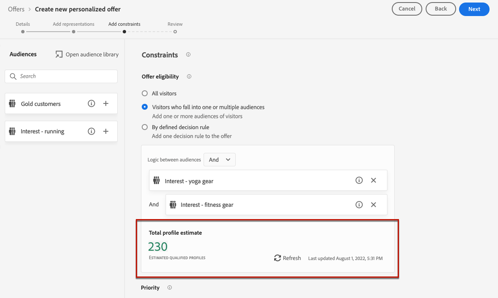

# Beperkingen aan een aanbieding toevoegen {#add-constraints}

>[!CONTEXTUALHELP]
>id="od_offer_constraints"
>title="Over aanbiedingsbeperkingen"
>abstract="Met beperkingen, kunt u specificeren hoe de aanbieding aan de gebruiker in vergelijking met andere aanbiedingen voorrang wordt gegeven en wordt voorgesteld."

>[!CONTEXTUALHELP]
>id="ajo_decisioning_constraints"
>title="Over aanbiedingsbeperkingen"
>abstract="Met beperkingen, kunt u specificeren hoe de aanbieding aan de gebruiker in vergelijking met andere aanbiedingen voorrang wordt gegeven en wordt voorgesteld."

>[!CONTEXTUALHELP]
>id="od_offer_priority"
>title="Info over aanbiedingsprioriteit"
>abstract="Op dit gebied, kunt u prioritaire montages voor de aanbieding specificeren. Prioriteit is een nummer dat wordt gebruikt om aanbiedingen te rangschikken die aan alle beperkingen voldoen, zoals geschiktheid, datums en aftopping."

>[!CONTEXTUALHELP]
>id="ajo_decisioning_priority"
>title="Prioriteit instellen"
>abstract="De prioritaire hulp bepaalt de prioriteit van de aanbieding in vergelijking met andere als de gebruiker voor meer dan één aanbieding in aanmerking komt. Hoe hoger de prioriteit van een aanbieding is, hoe hoger de prioriteit ervan wordt vergeleken met andere aanbiedingen."

Met beperkingen kunt u de voorwaarden definiëren waaronder een aanbieding wordt weergegeven.

1. Configureer de **[!UICONTROL Offer eligibility]**. [Meer informatie](#eligibility)

   

1. Definieer de **[!UICONTROL Priority]** van de aanbieding in vergelijking met andere aanbiedingen indien de gebruiker voor meer dan één aanbieding in aanmerking komt. Hoe hoger de prioriteit van een aanbieding is, hoe hoger de prioriteit ervan wordt vergeleken met andere aanbiedingen.

   

1. Geef de aanbiedingen op **[!UICONTROL Capping]**, wat het aantal keren betekent dat het aanbod zal worden ingediend. [Meer informatie](#capping)

   

1. Klikken **[!UICONTROL Next]** om alle beperkingen te bevestigen u bepaalde.

Als u bijvoorbeeld de volgende beperkingen instelt:

* Dit aanbod wordt alleen in overweging genomen voor gebruikers die voldoen aan de beslissingsregel &quot;Gold Loyalty Customers&quot;.
* De prioriteit van de aanbieding is vastgesteld op &quot;50&quot;, wat betekent dat de aanbieding wordt gepresenteerd vóór aanbiedingen met een prioriteit tussen 1 en 49 en na de aanbiedingen met een prioriteit van ten minste 51.
* Het aanbod wordt slechts eenmaal per gebruiker op alle plaatsen weergegeven.

## Subsidiabiliteit {#eligibility}

>[!CONTEXTUALHELP]
>id="ajo_decisioning_eligibility"
>title="Geschiktheid definiëren"
>abstract="Standaard kan elk profiel in aanmerking komen voor presentatie van de aanbieding, maar u kunt segmenten of besluitvormingsregels gebruiken om de aanbieding te beperken tot specifieke profielen."

>[!CONTEXTUALHELP]
>id="od_offer_eligibility"
>title="Geschiktheid voor aanbieding"
>abstract="In deze sectie kunt u besluitvormingsregels gebruiken om te bepalen welke gebruikers in aanmerking komen voor de aanbieding."
>additional-url="https://video.tv.adobe.com/v/329373" text="Demovideo bekijken"

De **[!UICONTROL Offer eligibility]** kunt u de aanbieding beperken tot specifieke profielen die u het gebruiken van segmenten of besluitvormingsregels bepaalt.

>[!NOTE]
>
>Meer informatie over het gebruik van **segmenten** versus **beslissingsregels** in [deze sectie](#segments-vs-decision-rules).

* Standaard worden de **[!UICONTROL All visitors]** geselecteerd is, wat betekent dat elk profiel in aanmerking komt voor de presentatie van de aanbieding.

   

* U kunt ook de presentatie van het voorstel beperken tot de leden van een of meerdere [Adobe Experience Platform-segmenten](../../segment/about-segments.md).

   Om dit te doen, activeer **[!UICONTROL Visitors who fall into one or multiple segments]** voegt u vervolgens een of meerdere segmenten toe vanuit het linkervenster en combineert u deze met de optie **[!UICONTROL And]** / **[!UICONTROL Or]** logische operatoren.

   

* Als u een specifieke koppeling wilt maken [beslissingsregel](../offer-library/creating-decision-rules.md) aan de aanbieding, selecteer **[!UICONTROL By defined decision rule]** en sleep de gewenste lijn van het linkerdeelvenster naar het deelvenster **[!UICONTROL Decision rule]** gebied.

   

   >[!CAUTION]
   >
   >Aanbiedingen op basis van gebeurtenissen worden momenteel niet ondersteund in [!DNL Journey Optimizer]. Als u een beslissingsregel maakt op basis van een [event](https://experienceleague.adobe.com/docs/experience-platform/segmentation/ui/segment-builder.html?lang=en#events){target=&quot;_blank&quot;}, kunt u deze niet gebruiken in een aanbieding.

Wanneer u segmenten of besluitvormingsregels selecteert, kunt u informatie over de geschatte gekwalificeerde profielen zien. Klikken **[!UICONTROL Refresh]** om gegevens bij te werken.

>[!NOTE]
>
>Profielramingen zijn niet beschikbaar wanneer regelparameters gegevens bevatten die niet in het profiel staan, zoals contextgegevens. Bijvoorbeeld, een toelatingsregel die het huidige weer om 80 graden vereist te zijn.

### Segmenten en beslissingsregels gebruiken {#segments-vs-decision-rules}

Als u een beperking wilt toepassen, kunt u de selectie van aanbiedingen beperken tot de leden van een of meerdere **Adobe Experience Platform-segmenten** of u kunt een **beslissingsregel**, beide oplossingen voor verschillende toepassingen.

In feite, is de output van een segment een lijst van profielen, terwijl een besluitvormingsregel een functie is die op bestelling tegen één enkel profiel tijdens het besluitvormingsproces wordt uitgevoerd. Het verschil tussen deze twee toepassingen wordt hieronder nader toegelicht.

* **Segmenten**

   Aan de ene kant zijn segmenten een groep Adobe Experience Platform-profielen die overeenkomen met een bepaalde logica op basis van profielkenmerken en gebeurtenissen ervaren. Het segment wordt echter niet opnieuw berekend door het Offertenbeheer, dat mogelijk niet up-to-date is wanneer de aanbieding wordt gepresenteerd.

   Meer informatie over segmenten in [deze sectie](../../segment/about-segments.md).

* **Beslissingsregels**

   Anderzijds is een beslissingsregel gebaseerd op in Adobe Experience Platform beschikbare gegevens en bepaalt aan wie een aanbieding kan worden getoond. Zodra geselecteerd in een aanbieding of een besluit voor een bepaalde plaatsing, wordt de regel uitgevoerd telkens als een besluit wordt genomen, die ervoor zorgt dat elk profiel de recentste en beste aanbieding krijgt.

   Meer informatie over beslissingsregels vindt u in [deze sectie](creating-decision-rules.md).

## Afbeelding {#capping}

>[!CONTEXTUALHELP]
>id="od_offer_globalcap"
>title="Over aanbiedingen beperken"
>abstract="In dit veld kunt u opgeven hoe vaak het voorstel kan worden weergegeven."

>[!CONTEXTUALHELP]
>id="ajo_decisioning_capping"
>title="Afbeelding gebruiken"
>abstract="Als u wilt voorkomen dat uw klanten te veel vragen, gebruikt u de optie Afdekken om het maximumaantal keren te bepalen dat een aanbieding kan worden gepresenteerd."

Afkappen wordt gebruikt als beperking om het maximumaantal keren te bepalen dat een aanbieding kan worden voorgesteld.

Door het aantal keren dat gebruikers specifieke aanbiedingen krijgen te beperken, kunt u voorkomen dat uw klanten te veel vragen en zo elk aanraakpunt optimaliseren met de beste aanbieding.

Volg de onderstaande stappen om het toewijzen van plafonds in te stellen.

1. Bepaal het aantal keren dat de aanbieding kan worden gepresenteerd.

   

   >[!NOTE]
   >
   >Het getal moet een geheel getal groter dan 0 zijn.

1. Geef op of u de aftopping wilt toepassen op alle gebruikers of op één specifiek profiel:

   

   * Selecteren **[!UICONTROL In total]** om te bepalen hoe vaak een aanbieding over het gecombineerde doelpubliek kan worden voorgesteld, betekenend over alle gebruikers.

      Als u bijvoorbeeld een elektronicawinkel bent met een &#39;tv-huis-deal&#39;, wilt u dat het aanbod slechts 200 keer wordt geretourneerd voor alle profielen.

   * Selecteren **[!UICONTROL Per profile]** om te bepalen hoe vaak een aanbieding aan dezelfde gebruiker kan worden voorgesteld.

      Als je bijvoorbeeld een bank bent met een &#39;Platinum credit card&#39;-aanbieding, wil je niet dat dit voorstel meer dan vijf keer per profiel wordt weergegeven. U bent namelijk van mening dat als de gebruiker het aanbod vijf keer heeft gezien en er niet op heeft gereageerd, hij een grotere kans heeft om op het volgende beste aanbod in te gaan.

1. Als u meerdere [representaties](#representations) voor je voorstel, geef aan of je de aftopping wilt toepassen **[!UICONTROL Across all placements]** of **[!UICONTROL For each placement]**.

   

   * **[!UICONTROL Across all placements]**: het beperken van aantallen zal alle besluiten over de plaatsen verbonden aan de aanbieding in totaal nemen.

      Als een aanbieding bijvoorbeeld een **E-mail** plaatsing en **Web** plaatsing, en u plaatst het maximum bij **2 per profiel voor alle plaatsen** Vervolgens kan elk profiel het aanbod in totaal maximaal twee keer ontvangen, ongeacht de plaatsingsmix.

   * **[!UICONTROL For each placement]**: Bij het beperken van tellingen worden de beslissingsaantallen voor elke plaatsing afzonderlijk toegepast.

      Als een aanbieding bijvoorbeeld een **E-mail** plaatsing en **Web** plaatsing, en u plaatst het maximum bij **2 per profiel voor elke plaatsing** Vervolgens kan elk profiel tot twee keer de aanbieding voor e-mailplaatsing ontvangen en nog eens twee keer de plaatsing op het web.

1. Als de aanbieding eenmaal is opgeslagen en goedgekeurd en het aantal keren dat u in dit veld hebt opgegeven aan de hand van de criteria die u hebt gedefinieerd, is weergegeven, wordt de levering gestopt.

Het aantal keren dat een aanbieding wordt voorgesteld, wordt berekend tijdens de voorbereiding van e-mail. Als u bijvoorbeeld een e-mail met een aantal voorstellen voorbereidt, tellen deze nummers mee voor de maximale limiet, ongeacht of de e-mail is verzonden of niet.

<!--If an email delivery is deleted or if the preparation is done again before being sent, the capping value for the offer is automatically updated.-->

>[!NOTE]
>
>Afdekkingstellers worden opnieuw ingesteld wanneer de aanbieding vervalt of 2 jaar na de startdatum van de aanbieding, afhankelijk van welke datum het eerst valt. Meer informatie over het definiëren van de datum van een aanbieding in [deze sectie](creating-personalized-offers.md#create-offer).

### Gevolgen van het wijzigen van datums voor plafonnering {#capping-change-date}

>[!CONTEXTUALHELP]
>id="ajo_decisioning_offer_change_date"
>title="Het wijzigen van datums kan invloed hebben op de plafondfunctie"
>abstract="Als er op deze aanbieding een maximumlimiet wordt toegepast, kan dit gevolgen hebben wanneer u de begin- of einddatum wijzigt."

U moet voorzichtig te werk gaan wanneer u de datum van een aanbieding wijzigt, omdat dit van invloed kan zijn op de aftopping als aan de volgende voorwaarden wordt voldaan:

* De aanbieding is [goedgekeurd](#review).
* [Afbeelding](#capping) wordt al toegepast op het voorstel.
* Afdekkingen worden gedefinieerd per profiel.

>[!NOTE]
>
>Meer informatie over het definiëren van de datum van een aanbieding in [deze sectie](creating-personalized-offers.md#create-offer).

Als u per profiel vastlegt, worden de geknipte aantallen op elk profiel opgeslagen. Wanneer u de begin- en einddatum van een goedgekeurd aanbod wijzigt, kan het aantal aftopping voor sommige profielen worden aangepast aan de verschillende hieronder beschreven scenario&#39;s.

Hier zijn de mogelijke scenario&#39;s wanneer **de begindatum van een aanbieding wijzigen**:

| Scenario: Indien... | Wat gebeurt er? dan... | Mogelijke invloed op het maximumaantal |
|--- |--- |--- |
| ... de aanvangsdatum van de aanbieding wordt bijgewerkt voordat de oorspronkelijke startdatum van de aanbieding is ingegaan; | ... het maximumaantal begint op de nieuwe begindatum. | Nee |
| ... de nieuwe begindatum valt vóór de huidige einddatum; | ... de begrenzing wordt voortgezet met een nieuwe begindatum en het vorige maximumaantal voor elk profiel wordt voortgezet. | Nee |
| ... de nieuwe begindatum valt na de huidige einddatum; | ... de huidige plafonnering verloopt en het nieuwe maximumaantal begint opnieuw bij 0 voor alle profielen op de nieuwe begindatum. | Ja |

Hier zijn de mogelijke scenario&#39;s wanneer **verlenging van de uiterste datum voor de aanbieding**:

| Scenario: Indien... | Wat gebeurt er? dan... | Mogelijke invloed op het maximumaantal |
|--- |--- |--- |
| ... een beslissingsverzoek wordt ingediend vóór de oorspronkelijke einddatum van de aanbieding; | ... het maximumaantal wordt bijgewerkt en het vorige maximumaantal voor elk profiel wordt voortgezet. | Nee |
| ... geen verzoek om een beslissing wordt ingediend vóór de oorspronkelijke einddatum; | ... het maximumaantal wordt opnieuw ingesteld op de oorspronkelijke einddatum voor elk profiel. Het nieuwe maximum aantal zal dan opnieuw van 0 voor om het even welke nieuwe beslissingsverzoeken beginnen die na de originele einddatum zullen voorkomen. | Ja |

**Voorbeeld**

Stel dat je een voorstel hebt met een oorspronkelijke begindatum ingesteld op **1 januari**, verloopt op **31 januari**.

1. De profielen X, Y en Z worden voorgesteld.
1. Aan **10 januari**, wordt de einddatum van de aanbieding gewijzigd in **15 februari**.
1. **11 januari tot en met 31 januari** alleen profiel Z wordt aangeboden.

   * Omdat een beslissingsverzoek vóór de oorspronkelijke einddatum is ingediend **voor profiel Z** kan de uiterste datum van de aanbieding worden verlengd tot **15 februari**.
   * Aangezien er echter geen activiteit heeft plaatsgevonden vóór de oorspronkelijke einddatum voor **profielen X en Y**, zullen hun tellers verlopen en hun het maximum beperken tellingen aan 0 op **31 januari**.

