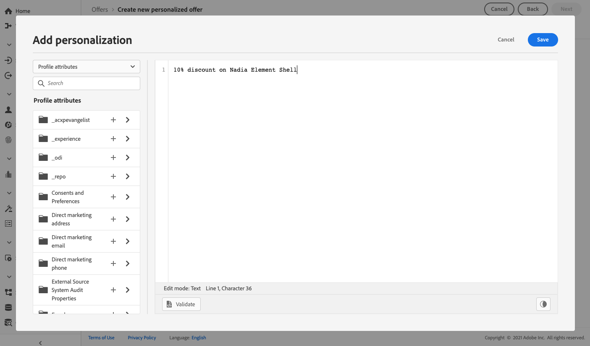

# Afbeeldingen toevoegen aan een aanbieding {#add-representations}

>[!CONTEXTUALHELP]
>id="ajo_decisioning_representation"
>title="Vertegenwoordigingen"
>abstract="Voeg representaties toe om te bepalen waar je voorstel in het bericht wordt weergegeven. Hoe meer vertegenwoordigingen een aanbieding heeft, des te meer mogelijkheden er zijn om het aanbod in verschillende plaatsingscontexten te gebruiken."

Een aanbieding kan op verschillende plaatsen in een bericht worden weergegeven: in een bovenste banner met een afbeelding, als tekst in een alinea, als een HTML-blok, enz. Hoe meer vertegenwoordigingen een aanbieding heeft, des te meer mogelijkheden er zijn om het aanbod in verschillende plaatsingscontexten te gebruiken.

## De representaties van de aanbieding configureren {#representations}

Volg onderstaande stappen om een of meerdere vertegenwoordigingen aan uw aanbieding toe te voegen en deze te configureren.

1. Voor de eerste representatie selecteert u eerst de **[!UICONTROL Channel]** die u wilt gebruiken.

   

   >[!NOTE]
   >
   >Alleen de beschikbare plaatsen voor het geselecteerde kanaal worden weergegeven in de vervolgkeuzelijst **[!UICONTROL Placement]** .

1. Selecteer een plaatsing in de lijst.

   U kunt ook de knop naast de vervolgkeuzelijst **[!UICONTROL Placement]** gebruiken om door alle plaatsen te bladeren.

   

   Daar kunt u de plaatsingen volgens hun kanaal en/of inhoudstype nog filtreren. Kies een plaatsing en klik op **[!UICONTROL Select]** .

   

1. Voeg inhoud toe aan uw representatie. Leer hoe in [&#x200B; deze sectie &#x200B;](#content).

1. Wanneer u inhoud zoals een afbeelding of URL toevoegt, kunt u een **[!UICONTROL Destination link]** opgeven: de gebruikers die op de aanbieding klikken, worden naar de bijbehorende pagina geleid.

   

1. Tot slot selecteer de taal van uw keus helpen identificeren en beheren wat aan vertoning aan de gebruikers te beheren.

1. Als u een andere representatie wilt toevoegen, gebruikt u de knop **[!UICONTROL Add representation]** en voegt u zoveel representaties toe als u nodig hebt.

   

1. Nadat u al uw representaties hebt toegevoegd, selecteert u **[!UICONTROL Next]** .

## Inhoud definiëren voor uw weergaven {#content}

U kunt verschillende typen inhoud aan een representatie toevoegen.

>[!NOTE]
>
>Alleen inhoud die overeenkomt met het inhoudstype van de plaatsing is beschikbaar voor gebruik.

### Afbeeldingen toevoegen {#images}

Als de geselecteerde plaatsing beeld-type is, kunt u inhoud toevoegen die uit de **bibliotheek komt van de Activa van Adobe Experience Cloud**, een gecentraliseerde bewaarplaats van activa die door [!DNL Adobe Experience Manager Assets] worden verstrekt.

>[!NOTE]
>
> Om met [&#x200B; de Hoofdzaak van de Activa van de Manager van de Ervaring van Adobe &#x200B;](https://experienceleague.adobe.com/docs/experience-manager-assets-essentials/help/introduction.html){target="_blank"} te werken, moet u [!DNL Assets Essentials] voor uw organisatie opstellen en ervoor zorgen dat de gebruikers een deel van de **Hoofdzaak van Activa Consumenten** of **Hoofdzaak van Activa** profielen van het Product zijn. Leer meer over [&#x200B; deze pagina &#x200B;](https://experienceleague.adobe.com/docs/experience-manager-assets-essentials/help/get-started-admins/deploy-administer.html){target="_blank"}.

1. Kies de optie **[!UICONTROL Asset library]**.

1. Selecteer **[!UICONTROL Browse]**.

   

1. Blader door de elementen om de gewenste afbeelding te selecteren

1. Klik op **[!UICONTROL Select]**.

   

### HTML- of JSON-bestanden toevoegen {#html-json}

Als de geselecteerde plaatsing HTML-type is, kunt u HTML of inhoud ook toevoegen JSON die uit de [&#x200B; bibliotheek van de Activa van Adobe Experience Cloud &#x200B;](https://experienceleague.adobe.com/docs/experience-manager-assets-essentials/help/introduction.html){target="_blank"} komt).

Bijvoorbeeld, creeerde u een HTML e-mailmalplaatje in [&#x200B; Adobe Experience Manager &#x200B;](https://experienceleague.adobe.com/docs/experience-manager.html){target="_blank"} en u wilt dat dossier voor uw aanbiedingsinhoud gebruiken. In plaats van het creëren van een nieuw dossier, kunt u het malplaatje in de **Bibliotheek van Activa** eenvoudig uploaden om het in de vertegenwoordiging van uw aanbieding te kunnen opnieuw gebruiken.

Om uw inhoud in een vertegenwoordiging opnieuw te gebruiken, doorblader de **Bibliotheek van Activa** zoals die in [&#x200B; wordt beschreven deze sectie &#x200B;](#images) en selecteer het HTML of JSON dossier van uw keus.


### URL&#39;s toevoegen {#urls}

Als u inhoud wilt toevoegen vanaf een externe openbare locatie, selecteert u **[!UICONTROL URL]** en voert u het URL-adres in van de inhoud die u wilt toevoegen.

U kunt URLs personaliseren gebruikend de verpersoonlijkingsredacteur. Leer meer over [&#x200B; verpersoonlijking &#x200B;](../../personalization/personalize.md#use-expression-editor).


U wilt bijvoorbeeld de afbeelding aanpassen die als een aanbieding wordt weergegeven. Je wilt dat gebruikers die de voorkeur geven aan vakanties in de stad de skyline NYC zien en gebruikers die de voorkeur geven aan strandvakanties om de noordkust van Hawaii te zien.

Gebruik de verpersoonlijkingsredacteur om de attributen van het Profiel terug te winnen die in Adobe Experience Platform worden opgeslagen gebruikend verenigingsschema&#39;s. [Meer informatie](https://experienceleague.adobe.com/docs/experience-platform/profile/union-schemas/union-schemas-overview.html){target="_blank"}


Als u een **[!UICONTROL Destination link]** opgeeft, kunt u ook de URL aanpassen waarnaar de gebruikers die op de aanbieding klikken, worden geleid.

### Aangepaste tekst toevoegen {#custom-text}

U kunt ook teksttype-inhoud invoegen wanneer u een compatibele plaatsing selecteert.

1. Selecteer de optie **[!UICONTROL Custom]** en klik op **[!UICONTROL Add content]** .

   

   >[!NOTE]
   >
   >Deze optie is niet beschikbaar voor afbeeldingstypeplaatsingen.

1. Typ de tekst die in de aanbieding wordt weergegeven.

   

   U kunt uw inhoud personaliseren gebruikend de verpersoonlijkingsredacteur. Leer meer over [&#x200B; verpersoonlijking &#x200B;](../../personalization/personalize.md#use-expression-editor).

   

   >[!NOTE]
   >
   >Alleen de bronnen **[!UICONTROL Profile attributes]** , **[!UICONTROL Audiences]** en **[!UICONTROL Helper functions]** zijn beschikbaar voor Beslissingsbeheer.

## Afbeeldingen personaliseren op basis van contextgegevens{#context-data}

Wanneer de contextgegevens in de [&#x200B; Edge beslissings &#x200B;](../api-reference/offer-delivery-api/edge-decisioning-api.md) vraag worden overgegaan, kunt u hefboomwerking deze gegevens om vertegenwoordiging dynamisch te personaliseren. U kunt bijvoorbeeld de weergave van een aanbieding afstemmen op basis van real-time factoren, zoals de huidige weersomstandigheden op het moment dat de beslissing wordt genomen.

Als u contextgegevens wilt gebruiken in aanbiedingsweergaven, neemt u de variabele met contextgegevens rechtstreeks op in de representatie-inhoud met behulp van de naamruimte `profile.timeSeriesEvents.` .

Hier volgt een syntaxisvoorbeeld dat wordt gebruikt om de representatie van een aanbieding aan te passen op basis van de besturingssystemen van de gebruikers:

```
 iosandroid 
```

Het overeenkomstige Edge-beslissingsverzoek, inclusief de contextgegevens, ziet er als volgt uit:

```
{
    "body": {
        "xdm": {
            "identityMap": {
                "Email": [
                    {
                        "id": "xyz@abc.com"
                    }
                ]
            },
            "device": {
                "model": "Apple"
            }
        },
        "extra": {
            "query": {
                "decisionScopes": [
                    "eyJ4ZG06..."
                ]
            }
        }
    }
}
```
