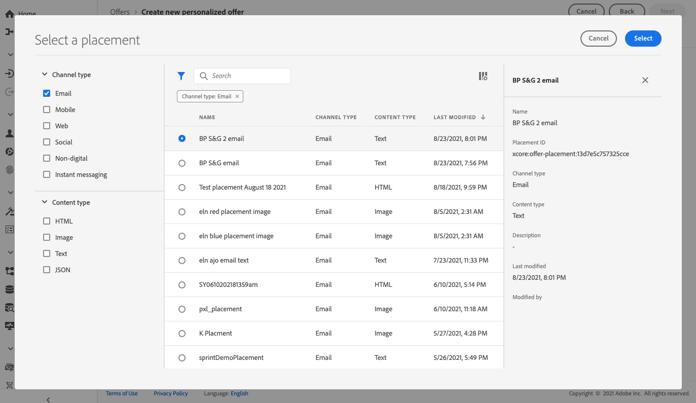

# Afbeeldingen toevoegen aan een aanbieding {#add-representations}

>[!CONTEXTUALHELP]
>id="ajo_decisioning_representation"
>title="Vertegenwoordigingen"
>abstract="Voeg afbeeldingen toe om te bepalen waar je voorstel in het bericht wordt weergegeven. Hoe meer vertegenwoordigingen een aanbieding heeft, des te meer mogelijkheden er zijn om het aanbod in verschillende plaatsingscontexten te gebruiken."

Een aanbieding kan op verschillende plaatsen in een bericht worden getoond: in een bovenste banner met een afbeelding, als tekst in een alinea, als een HTML-blok, enz. Hoe meer vertegenwoordigingen een aanbieding heeft, des te meer mogelijkheden er zijn om het aanbod in verschillende plaatsingscontexten te gebruiken.

## De representaties van de aanbieding configureren {#representations}

Volg onderstaande stappen om een of meerdere vertegenwoordigingen aan uw aanbieding toe te voegen en deze te configureren.

1. Voor de eerste weergave selecteert u eerst de optie **[!UICONTROL Channel]** dat zal worden gebruikt.

   

   >[!NOTE]
   >
   >Alleen de beschikbare plaatsen voor het geselecteerde kanaal worden weergegeven in het dialoogvenster **[!UICONTROL Placement]** vervolgkeuzelijst.

1. Selecteer een plaatsing in de lijst.

   U kunt ook de knop naast de knop **[!UICONTROL Placement]** vervolgkeuzelijst om door alle plaatsen te bladeren.

   

   Daar kunt u de plaatsingen volgens hun kanaal en/of inhoudstype nog filtreren. Kies een plaatsing en klik op **[!UICONTROL Select]**.

   

1. Voeg inhoud toe aan uw representatie. Meer informatie over [deze sectie](#content).

1. Wanneer u inhoud zoals een afbeelding of URL toevoegt, kunt u een **[!UICONTROL Destination link]**: de gebruikers die op de aanbieding klikken, worden naar de bijbehorende pagina geleid.

   

1. Tot slot selecteer de taal van uw keus helpen identificeren en beheren wat aan vertoning aan de gebruikers te beheren.

1. Als u een andere representatie wilt toevoegen, gebruikt u de optie **[!UICONTROL Add representation]** en voeg zo veel vertegenwoordigingen toe als nodig is.

   

1. Nadat u al uw representaties hebt toegevoegd, selecteert u **[!UICONTROL Next]**.

## Inhoud definiëren voor uw weergaven {#content}

U kunt verschillende typen inhoud aan een representatie toevoegen.

>[!NOTE]
>
>Alleen inhoud die overeenkomt met het inhoudstype van de plaatsing is beschikbaar voor gebruik.

### Afbeeldingen toevoegen {#images}

Als de geselecteerde plaatsing van het afbeeldingstype is, kunt u inhoud toevoegen die afkomstig is van het **Adobe Experience Cloud Asset** bibliotheek, een gecentraliseerde opslagplaats voor door [!DNL Adobe Experience Manager Assets Essentials].

>[!NOTE]
>
> Werken met [Adobe Experience Manager Assets Essentials](https://experienceleague.adobe.com/docs/experience-manager-assets-essentials/help/introduction.html){target=&quot;_blank&quot;}, moet u implementeren [!DNL Assets Essentials] voor uw organisatie en zorg ervoor dat de gebruikers een deel van zijn **Assets Essentials Consumer Users** of/en **Assets Essentials-gebruikers** Productprofielen. Meer informatie over [deze pagina](https://experienceleague.adobe.com/docs/experience-manager-assets-essentials/help/get-started-admins/deploy-administer.html){target=&quot;_blank&quot;}.

1. Kies de optie **[!UICONTROL Asset library]**.

1. Selecteer **[!UICONTROL Browse]**.

   

1. Blader door de elementen om de gewenste afbeelding te selecteren

1. Klik op **[!UICONTROL Select]**.

   

### HTML- of JSON-bestanden toevoegen {#html-json}

Als de geselecteerde plaatsing van het type HTML is, kunt u ook HTML- of JSON-inhoud toevoegen die afkomstig is van de [Adobe Experience Cloud Asset Library](https://experienceleague.adobe.com/docs/experience-manager-assets-essentials/help/introduction.html){target=&quot;_blank&quot;}).

U hebt bijvoorbeeld een e-mailsjabloon voor HTML gemaakt in [Adobe Experience Manager](https://experienceleague.adobe.com/docs/experience-manager.html){target=&quot;_blank&quot;} en u wilt dat bestand gebruiken voor uw aanbiedingsinhoud. In plaats van een nieuw bestand te maken, kunt u de sjabloon gewoon uploaden naar de **Elementenbibliotheek** om het in de vertegenwoordigingen van je voorstel opnieuw te kunnen gebruiken.

Als u de inhoud opnieuw wilt gebruiken in een weergave, bladert u naar de **Elementenbibliotheek** zoals beschreven in [deze sectie](#images) en selecteer het gewenste HTML- of JSON-bestand.

### URL&#39;s toevoegen {#urls}

Als u inhoud van een externe openbare locatie wilt toevoegen, selecteert u **[!UICONTROL URL]** Voer vervolgens het URL-adres in van de inhoud die u wilt toevoegen.

### Aangepaste tekst toevoegen {#custom-text}

U kunt ook teksttype-inhoud invoegen wanneer u een compatibele plaatsing selecteert.

1. Selecteer **[!UICONTROL Custom]** en klik op **[!UICONTROL Add content]**.

   

   >[!NOTE]
   >
   >Deze optie is niet beschikbaar voor afbeeldingstypeplaatsingen.

1. Typ de tekst die in de aanbieding wordt weergegeven.

   

   U kunt de inhoud personaliseren met de uitdrukkingseditor. Meer informatie over [personalisatie](../../personalization/personalize.md#use-expression-editor).

   

   >[!NOTE]
   >
   >Alleen de **[!UICONTROL Profile attributes]**, **[!UICONTROL Segment memberships]** en **[!UICONTROL Helper functions]** bronnen beschikbaar zijn voor het beheer van besluiten.

