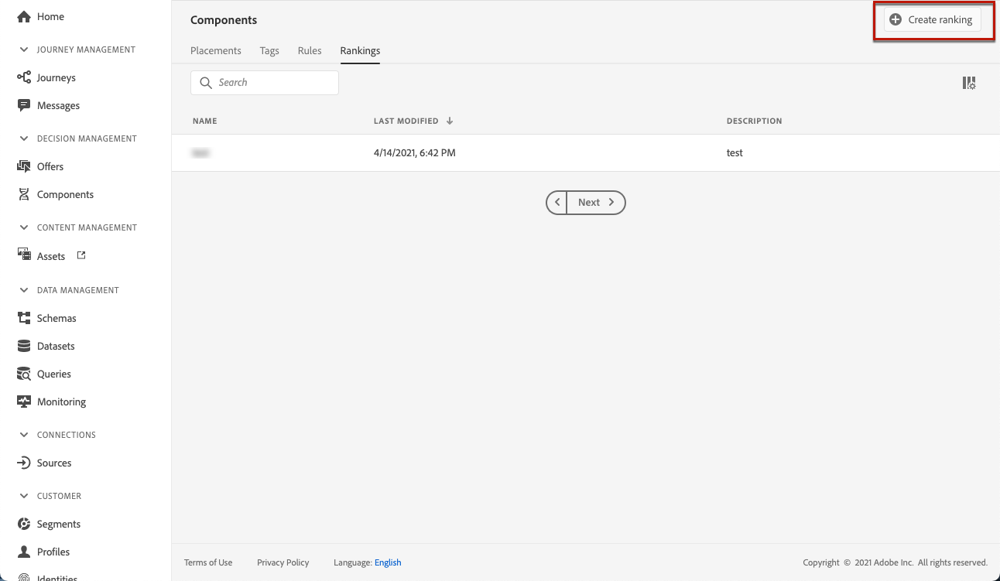
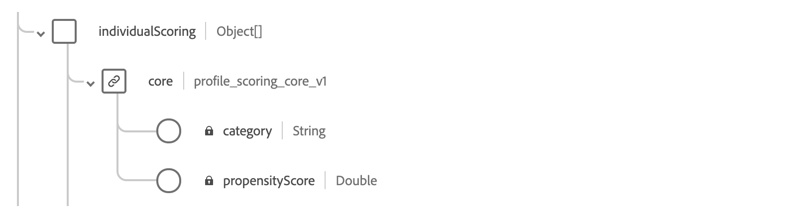

# Rangschikkingsformules maken {#create-ranking-formulas}

## Rangschikkingsformules {#about-ranking-formulas}

**Met behulp van** rangschikkingsformules kunt u regels definiëren die bepalen welke aanbieding eerst voor een bepaalde plaatsing moet worden gepresenteerd, in plaats van rekening te houden met de prioriteitsscores van de aanbiedingen.

Rangschikkingsformules worden uitgedrukt in **PQL-syntaxis** en kunnen profielkenmerken, contextgegevens en kenmerken gebruiken. Raadpleeg de [speciale documentatie](https://experienceleague.adobe.com/docs/experience-platform/segmentation/pql/overview.html) voor meer informatie over het gebruik van de PQL-syntaxis.

Zodra een rangschikkende formule is gecreeerd, kunt u het aan een plaatsing in een besluit (dat vroeger als aanbiedingsactiviteit wordt bekend) toewijzen. Voor meer op dit, zie [Vorm aanbiedingen selectie in besluiten](../offer-activities/configure-offer-selection.md).

## Een waarderingsformule maken {#create-ranking-formula}

Voer de volgende stappen uit om een rangschikkingsformule te maken:

1. Open het menu **[!UICONTROL Components]** en selecteer vervolgens het tabblad **[!UICONTROL Rankings]**. De eerder gemaakte lijst met waarderingen wordt weergegeven.

   

1. Klik **[!UICONTROL Create ranking]** om een nieuwe rangschikkingsformule tot stand te brengen.

   

1. Geef de naam, beschrijving en formule van de waarderingsformule op.

   In dit voorbeeld willen we de prioriteit van alle aanbiedingen verhogen met het kenmerk &quot;hot&quot; als het werkelijke weer heet is. Om dit te doen, **contextData.wind=hot** werd overgegaan in de beslissingsvraag.

   

1. Klik op **[!UICONTROL Save]**. Uw rangschikkingsformule wordt gecreeerd, kunt u het van de lijst selecteren om details te krijgen en het uit te geven of te schrappen.

   Het is nu klaar om in een besluit worden gebruikt om in aanmerking komende aanbiedingen voor een plaatsing te rangschikken (zie [Aanbiedingen selecteren in besluiten vormen](../offer-activities/configure-offer-selection.md)).

   

## Voorbeelden van willekeurige formules {#ranking-formula-examples}

U kunt verschillende rangschikkingsformules naar wens maken. Hieronder volgen enkele voorbeelden.

<!--
Boost by offer ID

Boost the priority of an offer with the offer ID *xcore:personalized-offer:13d213cd4cb328ec* by 5.

**Ranking formula:**

```
if( offer._id = "xcore:personalized-offer:13d213cd4cb328ec", offer.rank.priority + 5, offer.rank.priority)
```

Change the offer priority based on a certain profile attribute

Set the offer priority to 30 for offer *xcore:personalized-offer:13d213cd4cb328ec* if the user lives in the city of Bondi.

**Ranking formula:**

```
if( offer._id = "xcore:personalized-offer:13d213cd4cb328ec" and homeAddress.city.equals("Bondi", false), 30, offer.rank.priority)
```

Boost multiple offers by offer ID based on the presence of a profile's segment membership

Boost the priority of offers based on whether the user is a member of a priority segment, which is configured as an attribute in the offer.

**Ranking formula:**

```
if( segmentMembership.get("ups").get(offer.characteristics.prioritySegmentId).status in (["realized","existing"]), offer.rank.priority + 10, offer.rank.priority)
```
-->

### Verhoog aanbiedingen met bepaald aanbiedingskenmerk op basis van profielkenmerk

Als het profiel in de stad woont die overeenkomt met het aanbod, dan verdubbelt de prioriteit voor alle aanbiedingen in die stad.

**Willekeurige formule:**

```
if( offer.characteristics.city = homeAddress.city, offer.rank.priority * 2, offer.rank.priority)
```

### Verhoog aanbiedingen waarbij de einddatum minder dan 24 uur is.

**Willekeurige formule:**

```
if( offer.selectionConstraint.endDate occurs <= 24 hours after now, offer.rank.priority * 3, offer.rank.priority)
```

### De aanbiedingen van de verhoging met bepaalde aanbiedingsattributen die op contextgegevens worden gebaseerd

Verhoog bepaalde aanbiedingen die op de contextgegevens worden gebaseerd die in de beslissingsvraag worden overgegaan. Bijvoorbeeld, als `contextData.weather=hot` in de beslissingsvraag wordt overgegaan, moet de prioriteit van alle aanbiedingen met `attribute=hot` worden verhoogd.

**Willekeurige formule:**

```
if (@{_xdm.context.additionalParameters;version=1}.weather.isNotNull()
and offer.characteristics.weather=@{_xdm.context.additionalParameters;version=1}.weather, offer.rank.priority + 5, offer.rank.priority)
```

Wanneer u de API voor besluitvorming gebruikt, worden de contextgegevens toegevoegd aan het profielelement in de aanvraaginstantie, zoals in het onderstaande voorbeeld.

**Fragment van aanvraaginstantie:**

```
"xdm:profiles": [
{
    "xdm:identityMap": {
        "crmid": [
            {
            "xdm:id": "CRMID1"
            }
        ]
    },
    "xdm:contextData": [
        {
            "@type":"_xdm.context.additionalParameters;version=1",
            "xdm:data":{
                "xdm:weather":"hot"
            }
        }
    ]
 }],
```

### Verhoog de aanbiedingen op basis van de neiging van klanten om het aangeboden product te kopen

Als er twee exemplaren van *CustomerAI* zijn die de neiging berekenen om *travelInsurance* en *extraBaggage* voor een luchtvaartmaatschappij aan te schaffen, zal de volgende rangschikkingsformule de prioriteit (met 50 punten) van de aanbieding verhogen die specifiek voor of verzekering of bagage is als de klantenneigheidsscore om dat product te kopen hoger is dan 90.

Omdat elke *CustomerAI*-instantie echter een eigen object binnen het schema voor het uniforme profiel maakt, is het niet mogelijk de score dynamisch te selecteren op basis van het type van de aanbiedingsdichtheid. U moet dus de `if`-instructies in een keten plaatsen om eerst het type aanbiedingsvorm te controleren en vervolgens de score uit het juiste profielveld halen.

**Willekeurige formule:**

```
if ( offer.characteristics.propensityType = "extraBaggagePropensity" and _salesvelocity.CustomerAI.extraBaggagePropensity.score > 90, offer.rank.priority + 50,
    (
        if ( offer.characteristics.propensityType = "travelInsurancePropensity" and _salesvelocity.CustomerAI.insurancePropensity.score > 90, offer.rank.priority + 50, offer.rank.priority )
    )
)
```

Een betere oplossing is om de scores op te slaan in een array van het profiel. In het volgende voorbeeld worden verschillende populatiescore&#39;s gebruikt met behulp van een eenvoudige rangschikkingsformule. De verwachting is dat u een profielschema met een serie van scores hebt. In dit voorbeeld, is de instantiehuurder *_salesvelocity* en het profielschema bevat het volgende:



In dit geval geldt voor een profiel als:

```
{"_salesvelocity": {"individualScoring": [
                    {"core": {
                            "category":"insurance",
                            "propensityScore": 96.9
                        }},
                    {"core": {
                            "category":"personalLoan",
                            "propensityScore": 45.3
                        }},
                    {"core": {
                            "category":"creditCard",
                            "propensityScore": 78.1
                        }}
                    ]}
}
```

De aanbiedingen zouden een attribuut voor *propensityType* bevatten dat de categorie van de scores aanpast:


Uw rangschikkingsformule kan dan de prioriteit van elke aanbieding aan de klanten *propensityScore* voor dat *propensityType* plaatsen. Als geen score wordt gevonden, gebruik de statische prioriteit op de aanbieding wordt geplaatst:

```
let score = (select _Individual_Scoring1 from _salesvelocity.individualScoring
             where _Individual_Scoring1.core.category.equals(offer.characteristics.propensityType, false)).head().core.propensityScore
in if(score.isNotNull(), score, offer.rank.priority)
```
