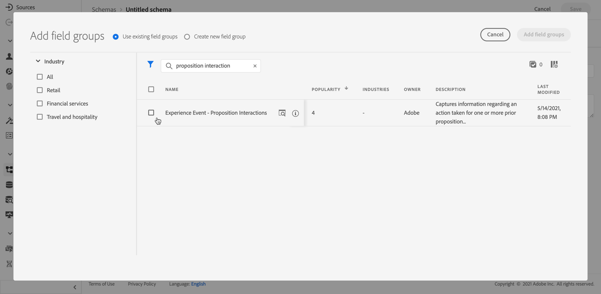

# AI-rangschikkingen {#ai-rankings}

## Aan de slag met AI-waarderingen {#get-started-with-ai-rankings}

<!--If you are an [Adobe Experience Platform](https://experienceleague.adobe.com/docs/experience-platform/landing/home.html){target="_blank"} user leveraging the **Offer Decisioning** application service,-->You can use a trained model system that ranks offers to display for a given profile.

>[!CAUTION]
>
>Het gebruik van de AI-rangschikking is momenteel beschikbaar in een vroeg stadium en alleen voor bepaalde gebruikers.

Met deze functie kunt u verschillende **classificatiestrategieën** gebaseerd op uw bedrijfsdoelstellingen. Gebruikend deze verschillende op doel-gebaseerde strategieën in een besluit (vroeger genoemd als aanbiedingsactiviteit), zal het opgeleide modelsysteem u helpen begrijpen hoe de verschillende rangschikkingsstrategieën uw doelstellingen beïnvloeden.

U kunt bijvoorbeeld een waarderingsstrategie selecteren voor het e-mailkanaal en een andere voor het pushkanaal. Voor elk kanaal zal het opgeleide modelsysteem veelvoudige gegevenspunten gebruiken om te bepalen welk aanbod eerst voor een bepaalde plaatsing zou moeten worden voorgesteld eerder dan rekening houdend met de prioritaire scores van de aanbiedingen of a [waarderingsformule](create-ranking-formulas.md).

<!--This feature is not enabled by default. To be able to use it, reach out to your Adobe contact.-->

Als er eenmaal een rangschikkingsstrategie is gemaakt, moet u deze toewijzen aan een plaatsing in een beslissing. Meer informatie in [Aanbiedingen selecteren in beslissingen configureren](../offer-activities/configure-offer-selection.md).

### Model voor automatische optimalisatie {#auto-optimization}

Momenteel in [!DNL Journey Optimizer] het enige ondersteunde modeltype voor AI-classificatie is **automatisch optimaliseren**.

Een model voor automatische optimalisatie is bedoeld voor aanbiedingen die het rendement maximaliseren op basis van de KPI&#39;s (Key Performance Indicators) die u instelt. <!--These KPIs could be in the form of conversion rates, revenue, etc.-->Op dit punt, richt de auto-optimalisering zich op het optimaliseren van aanbiedingskliks met aanbiedingsomzetting als doel.

>[!NOTE]
>
>In het model voor automatische optimalisatie worden geen contextuele gegevens of gebruikersprofielgegevens gebruikt. De resultaten worden geoptimaliseerd op basis van de algemene prestaties van de aanbiedingen.

Met auto-optimalisering, is de uitdaging om verkennend leren en het gebruik van dat leren in evenwicht te brengen. Dit beginsel staat bekend als **&quot;multi-gewapende bandit&quot;-benadering**.

Om deze uitdaging aan te gaan, gebruikt het model voor automatische optimalisatie het **Thompson Sampling** methode, waarmee kan worden bepaald welke optie moet worden gevolgd om de verwachte beloningen te maximaliseren. Met andere woorden, Thompson Sampling is een soort versterkende leertechniek voor het oplossen van het dilemma van exploratie en exploitatie in een veelbewapend bankenprobleem.

Met de Thompson Sampling-methode kunnen ook uitdagingen zoals het &quot;koude start&quot;-probleem worden aangepakt, d.w.z. wanneer een nieuw aanbod in de campagne wordt geïntroduceerd, heeft het geen geschiedenis waaruit het kan voortborduren.

## Een waarderingsstrategie maken {#create-ranking-strategy}

Volg onderstaande stappen om een classificatiestrategie te maken:

1. Toegang krijgen tot **[!UICONTROL Components]** en selecteert u vervolgens de **[!UICONTROL AI rankings]** tab.

   

   Alle classificatiestrategieën die tot nu toe zijn ontwikkeld, worden opgesomd.

1. Klik op de knop **[!UICONTROL Create strategy]**.

1. Vul de volgende velden in:

   

   * **[!UICONTROL Name]**: De unieke naam die u moet opgeven.

   * **[!UICONTROL Model type]**: Momenteel is het enige ondersteunde modeltype **[!UICONTROL Auto-optimization]**.<!--More will be supported in the future so the drop-down list will be enabled.-->

   * **[!UICONTROL Optimization metric]**:

      Met deze optie kunnen marketers kiezen hoe het model voor machinaal leren moet worden gebouwd en opgeleid: op basis van weergegeven aanbiedingen, op aanbiedingen geklikt in e-mail en/of aanbiedingen geklikt op het web.

      >[!NOTE]
      >
      >U kunt indien nodig alle metrische typen selecteren.

      Er zijn twee typen optimalisatiemetriek:
      * **[!UICONTROL Impression]**: Momenteel komen de gebeurtenissen die de indruk wekken overeen met alle weergegeven aanbiedingen.
      * **[!UICONTROL Conversion]**: Conversiegebeurtenissen komen overeen met alle aanbiedingen die resulteren in klikken via e-mail of web.

      Alle geselecteerde drukgebeurtenissen en/of conversiegebeurtenissen worden automatisch vastgelegd met de Web SDK of de Mobile SDK die is opgegeven. Meer informatie hierover vindt u in [Overzicht Adobe Experience Platform Web SDK](https://experienceleague.adobe.com/docs/experience-platform/edge/home.html?lang=en).

   * **[!UICONTROL Dataset ID]**: Voor omzetting, moet u een dataset verstrekken waar de gebeurtenissen worden verzameld door het van de drop-down lijst te selecteren. Leer hoe u een dergelijke gegevensset maakt in [deze sectie](#create-dataset). <!--This dataset needs to be associated with a schema that must have the **[!UICONTROL Proposition Interactions]** field group (previously known as mixin) associated with it.-->

   

   >[!CAUTION]
   >
   >Alleen de gegevenssets die zijn gemaakt op basis van schema&#39;s die zijn gekoppeld aan de **[!UICONTROL Experience Event - Proposition Interactions]** veldgroep (voorheen bekend als mixin) wordt weergegeven in de vervolgkeuzelijst.

1. Sla de waarderingsstrategie op en activeer deze.

   

Het is nu klaar om te worden gebruikt in een besluit om in aanmerking komende aanbiedingen voor plaatsing in aanmerking te nemen. Meer informatie in [deze sectie](../offer-activities/configure-offer-selection.md#use-ranking-strategy).<!--TBC?-->

## Een gegevensset maken om gebeurtenissen te verzamelen {#create-dataset}

U moet een dataset tot stand brengen waar de omzettingsgebeurtenissen zullen worden verzameld. Begin door het schema te creëren dat in uw dataset zal worden gebruikt:

1. Van de **[!UICONTROL Data Management]** menu, selecteert u **[!UICONTROL Schema]**, ga naar de **[!UICONTROL Browse]** en klik op **[!UICONTROL Create schema]**.

   

1. Kies **[!UICONTROL XDM ExperienceEvent]**.

   

   >[!NOTE]
   >
   >    Meer informatie over XDM-schema&#39;s en veldgroepen in de [Documentatie over XDM System-overzicht](https://experienceleague.adobe.com/docs/experience-platform/xdm/home.html?lang=en).


1. In de **[!UICONTROL Search]** veld, typt u &quot;propositieinteractie&quot; en selecteert u de **[!UICONTROL Experience Event - Proposition Interactions]** veldgroep.

   

   >[!CAUTION]
   >
   >    Het schema dat in uw dataset zal worden gebruikt moet hebben **[!UICONTROL Experience Event - Proposition Interactions]** veldgroep die eraan is gekoppeld. Anders kunt u het niet gebruiken in uw waarderingsstrategie.

1. Klik op **[!UICONTROL Add field groups]**.

   

   >[!NOTE]
   >Veldgroep werd voorheen mixin genoemd.

1. Typ een naam en sla het schema op.<!--How do you edit the fields in this new schema? Examples?-->

>[!NOTE]
>
>    Meer informatie over het samenstellen van schema&#39;s vindt u in [Basisbeginselen van de schemacompositie](https://experienceleague.adobe.com/docs/experience-platform/xdm/schema/composition.html?lang=en#understanding-schemas).

U bent nu bereid om een dataset tot stand te brengen gebruikend dit schema. Volg de onderstaande stappen om dit te doen:

1. Van de **[!UICONTROL Data Management]** menu, selecteert u **[!UICONTROL Datasets]**, ga naar de **[!UICONTROL Browse]** en klik op **[!UICONTROL Create dataset]**.

   

1. Selecteer **[!UICONTROL Create dataset from schema]**.

   

1. Selecteer het schema dat u zojuist hebt gemaakt in de lijst.

   

1. Klik op **[!UICONTROL Next]**.

1. Geef een unieke naam op voor de gegevensset in het dialoogvenster **[!UICONTROL Name]** veld en klik op **[!UICONTROL Finish]**.

   

De dataset is nu klaar om te worden geselecteerd om gebeurtenisgegevens te verzamelen wanneer [het opstellen van een rangschikkingsstrategie](#create-ranking-strategy).

## Schema-vereisten aanbieden {#schema-requirements}

U moet nu beschikken over:

* de rangorde heeft vastgesteld,
* gedefinieerd welk type gebeurtenis u wilt vastleggen - weergegeven aanbod (indruk) en/of aangeklikte aanbieding (conversie);
* en in welke gegevensset u de gebeurtenisgegevens wilt verzamelen.

Telkens wanneer een aanbieding wordt getoond en/of geklikt, wilt u dat de overeenkomstige gebeurtenis automatisch wordt gevangen door **[!UICONTROL Experience Event - Proposition Interactions]** veldgroep met de [Adobe Experience Platform Web SDK](https://experienceleague.adobe.com/docs/experience-platform/edge/web-sdk-faq.html#what-is-adobe-experience-platform-web-sdk%3F){target=&quot;_blank&quot;} of Mobile SDK.

Als u gebeurtenistypen wilt kunnen verzenden (weergegeven aanbod of aangeklikte aanbieding), moet u de juiste waarde voor elk gebeurtenistype instellen in een ervaringsgebeurtenis die naar Adobe Experience Platform wordt verzonden. Hieronder vindt u de schemavereisten die u in uw JavaScript-code moet implementeren:

### Weergegeven scenario voorstellen

**Type gebeurtenis:** `decisioning.propositionDisplay`
**Bron:** Web.sdk/Alloy.js (`sendEvent command -> xdm : {eventType, interactionMixin}`) of batch ingestie
+++**Bemonsteringslading:**

```
{
    "@id": "a7864a96-1eac-4934-ab44-54ad037b4f2b",
    "xdm:timestamp": "2020-09-26T15:52:25+00:00",
    "xdm:eventType": "decisioning.propositionDisplay",
    "https://ns.adobe.com/experience/decisioning/propositions":
    [
        {
            "xdm:items":
            [
                {
                    "xdm:id": "personalized-offer:f67bab756ed6ee4",
                },
                {
                    "xdm:id": "personalized-offer:f67bab756ed6ee5",
                }
            ],
            "xdm:id": "3cc33a7e-13ca-4b19-b25d-c816eff9a70a", //decision event id - taken from experience event for “nextBestOffer”
            "xdm:scope": "scope:12cfc3fa94281acb", //decision scope id - taken from experience event for “nextBestOffer”
        }
    ]
}
```

+++

### Aangeboden scenario

**Type gebeurtenis:** `decisioning.propositionInteract`
**Bron:** Web.sdk/Alloy.js (`sendEvent command -> xdm : {eventType, interactionMixin}`) of batch ingestie
+++**Bemonsteringslading:**

```
{
    "@id": "a7864a96-1eac-4934-ab44-54ad037b4f2b",
    "xdm:timestamp": "2020-09-26T15:52:25+00:00",
    "xdm:eventType": "decisioning.propositionInteract",
    "https://ns.adobe.com/experience/decisioning/propositions":
    [
        {
            "xdm:items":
            [
                {
                    "xdm:id": "personalized-offer:f67bab756ed6ee4"
                },
                {
                    "xdm:id": "personalized-offer:f67bab756ed6ee5"
                },
            ],
            "xdm:id": "3cc33a7e-13ca-4b19-b25d-c816eff9a70a", //decision event id
            "xdm:scope": "scope:12cfc3fa94281acb", //decision scope id
        }
    ]
}
```

+++

<!--
## Using a ranking strategy {#using-ranking}

To use the ranking strategy you created above, follow the steps below:

Once a ranking strategy has been created, you can assign it to a placement in a decision. For more on this, see [Configure offers selection in decisions](../offer-activities/configure-offer-selection.md).

1. Create a decision.
1. Add a placement.
1. Add a collection.
1. Choose to rank offers by AI ranking (select it from the drop-down list).
1. Click Add ranking.
1. Select the ranking strategy that you created. All the details of the ranking strategy are displayed.
1. Click Next to confirm.
1. Save your decision.

It is now ready to be used in a decision to rank eligible offers for a placement (see [Configure offers selection in decisions](../offer-activities/configure-offer-selection.md)).
-->

