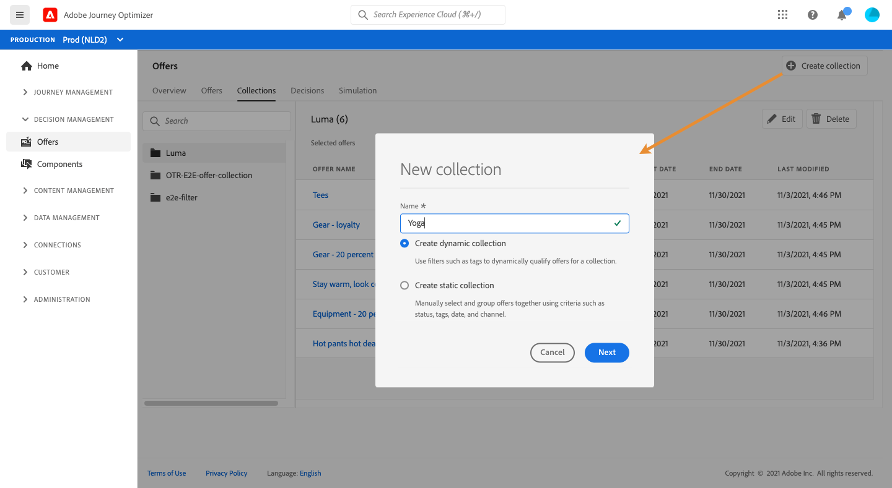
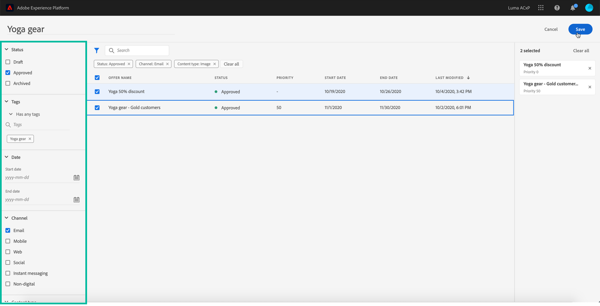

# Verzamelingen maken {#creating-collections}

Met verzamelingen kunt u uw aanbiedingen ordenen door deze te hergroeperen in categorieën van uw keuze. U kunt bijvoorbeeld een &quot;sport&quot;-collectie maken die alleen sportgerelateerde aanbiedingen bevat.

 [Ontdek deze functie in video](#video)

De lijst met aanbiedingsinzamelingen is toegankelijk in **[!UICONTROL Offers]** menu.

U kunt twee typen verzamelingen maken:

* **Dynamische** verzamelingen zijn verzamelingen van aanbiedingen op basis van labels. Deze verzamelingen worden automatisch bijgewerkt. Als bijvoorbeeld een nieuwe aanbieding wordt gemaakt met de geselecteerde tag, wordt deze automatisch toegevoegd aan de verzameling.

* **Statische** verzamelingen zijn verzamelingen die handmatig zijn gemaakt door afzonderlijke aanbiedingen te selecteren die u in de verzameling wilt opnemen. De verzameling kan alleen worden bijgewerkt door er handmatig meer aanbiedingen aan toe te voegen.

Ga als volgt te werk om een verzameling te maken:

1. Ga naar het **[!UICONTROL Collections]** lusje, dan klik **[!UICONTROL Create collection]**.

1. Geef de naam en het type verzameling op dat u wilt maken.

   

1. Als u een dynamische verzameling wilt maken, selecteert u in het linkerdeelvenster de tag van de aanbiedingen die u aan de verzameling wilt toevoegen. Klik vervolgens op **[!UICONTROL Save]**. Alle aanbiedingen met de geselecteerde tag worden opgeslagen in de verzameling.

   Zie [Codes maken](../offer-library/creating-tags.md) voor meer informatie over het maken van codes.

   

1. Als u een statische verzameling wilt maken, filtert u in het linkerdeelvenster de lijst met aanbiedingen (status, label, datum, kanaal, inhoudstype) en selecteert u de aanbiedingen die u aan de verzameling wilt toevoegen.

   

   >[!NOTE]
   >
   >Statische verzamelingen worden niet automatisch bijgewerkt. Als u aanbiedingen wilt toevoegen aan een statische verzameling, moet u deze bewerken en handmatig toevoegen.

1. Zodra de inzameling wordt gecreeerd, toont het in de lijst. U kunt het selecteren om het uit te geven of te schrappen.

   

## Video over zelfstudie {#video}

>[!NOTE]
>
>Deze video is van toepassing op de Offer decisioning toepassingsservice die op Adobe Experience Platform is gebouwd. Het biedt echter algemene richtlijnen voor het gebruik van Aanbieding in de context van Journey Optimizer.

>[!VIDEO](https://video.tv.adobe.com/v/329376?quality=12)
