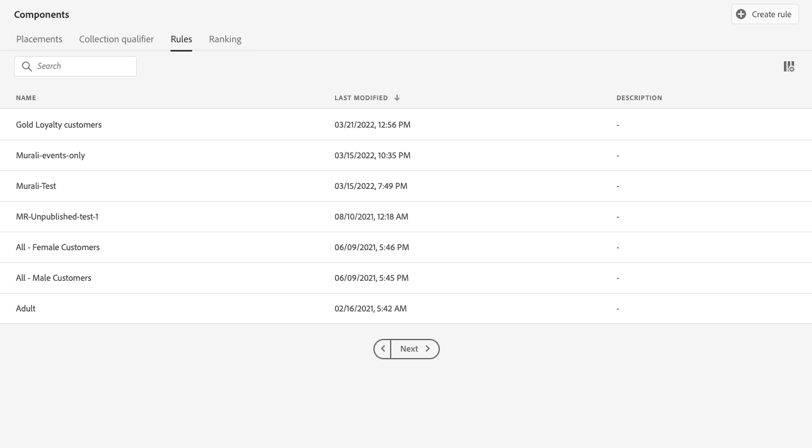

# Beslissingsregels maken {#create-decision-rules}

## Over beslissingsregels {#about}

Je kunt besluitvormingsregels voor voorstellen maken op basis van gegevens die beschikbaar zijn in Adobe Experience Platform. Beslissingsregels bepalen aan wie een aanbieding kan worden getoond.

U kunt bijvoorbeeld opgeven dat u alleen een &#39;Women&#39;s Winter Clothing Offer&#39; wilt laten zien wanneer (Gender = &#39;Vrouwelijk&#39;) en (Region = &#39;Noordoost&#39;).

➡️ [Ontdek deze functie in video](#video)

Hier volgt een lijst met beperkingen die in acht moeten worden genomen wanneer u werkt met beslissingsregels:

* Bij Edge-besluitvorming wordt het randprofiel gebruikt waarin geen gebeurtenissen worden opgeslagen. Elke regel die in een randbesluit wordt gebruikt, is daarom ongeldig.
* Wanneer het creëren van een besluitvormingsregel, wordt het terugkijken naar een vorige periode niet gesteund. Bijvoorbeeld, als u een ervaringsgebeurtenis specificeert die binnen de laatste maand als component van de regel voorkwam. Elke poging om een terugzoekperiode op te nemen tijdens het maken van regels, veroorzaakt een fout bij het opslaan ervan.
  <!--* Decision requests that use the hub profile will look at the last 100 experience events on the profile to evaluate rules that reference historical experience events.-->

## Een beslissingsregel maken {#create}

De lijst met gemaakte beslissingsregels is toegankelijk in het menu **[!UICONTROL Components]** .

Voer de volgende stappen uit om een beslissingsregel te maken:

1. Ga naar de tab **[!UICONTROL Rules]** en klik vervolgens op **[!UICONTROL Create rule]** .

   

1. Noem uw regel en verstrek een beschrijving, dan vorm de regel volgens uw behoeften.

   Om dit te doen, is de Bouwer van het Segment van Adobe Experience Platform **beschikbaar om u te helpen de voorwaarden van de regel bouwen.** [&#x200B; leer hoe te om segmentdefinities te bouwen &#x200B;](../../audience/creating-a-segment-definition.md)

   <!--In this example, the rule will target customers that have the "Gold" loyalty level.-->

   

   >[!NOTE]
   >
   >De segmentbouwer die wordt verstrekt om besluitvormingsregels tot stand te brengen heeft sommige specifieke eigenschappen in vergelijking met die gebruikt met de **[!UICONTROL Segmentation]** dienst. Nochtans, is het globale proces dat in de [&#x200B; documentatie van de Bouwer van het Segment &#x200B;](../../audience/creating-a-segment-definition.md) wordt beschreven nog geldig om de regels van aanbiedingsbesluiten te bouwen. Leer meer in de [&#x200B; documentatie van de Dienst van de Segmentatie van Adobe Experience Platform &#x200B;](https://experienceleague.adobe.com/docs/experience-platform/segmentation/ui/segment-builder.html?lang=nl-NL).

1. Terwijl u nieuwe velden toevoegt en configureert in de werkruimte, wordt in het deelvenster **[!UICONTROL Audience properties]** informatie weergegeven over de geschatte profielen die bij het publiek horen. Klik op **[!UICONTROL Refresh estimate]** om gegevens bij te werken.

   

   >[!NOTE]
   >
   >Profielramingen zijn niet beschikbaar wanneer regelparameters gegevens bevatten die niet in het profiel staan, zoals contextgegevens. Bijvoorbeeld, een toelatingsregel die het huidige weer om 80 graden vereist te zijn.

1. Klik op **[!UICONTROL Save]** om te bevestigen.

1. Nadat de regel is gemaakt, wordt deze weergegeven in de lijst **[!UICONTROL Rules]** . U kunt het selecteren om zijn eigenschappen te tonen, en het uitgeven of schrappen.

   

>[!CAUTION]
>
>Aanbiedingen op basis van gebeurtenissen worden momenteel niet ondersteund in [!DNL Journey Optimizer] . Als u een besluitvormingsregel creeert die op een [&#x200B; wordt gebaseerd gebeurtenis &#x200B;](https://experienceleague.adobe.com/docs/experience-platform/segmentation/ui/segment-builder.html?lang=nl-NL#events){target="_blank"}, zult u niet het in een aanbieding kunnen hefboomwerking geven.

## Video over zelfstudie {#video}

>[!VIDEO](https://video.tv.adobe.com/v/329373?quality=12)
