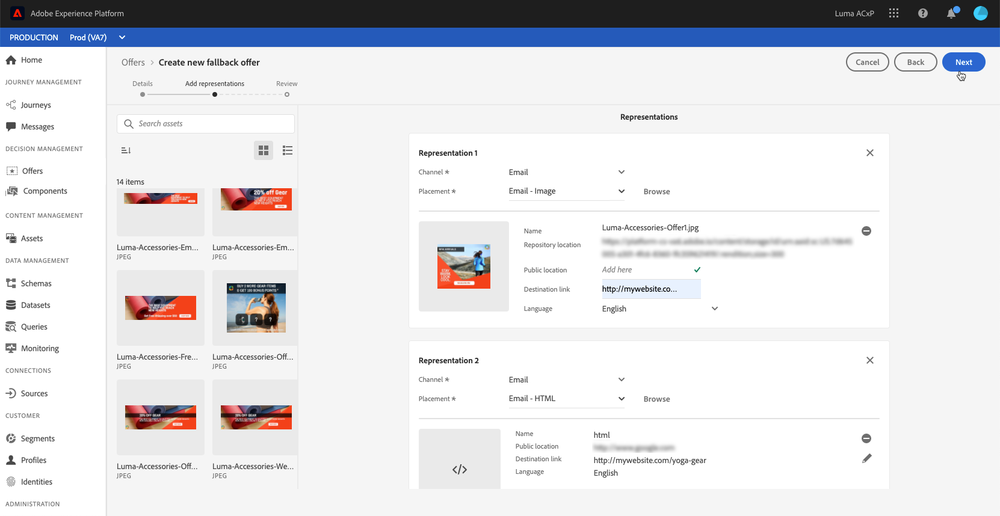

# Alternatieve aanbiedingen maken {#creating-fallback-offers}

De fallback-aanbieding wordt naar klanten gestuurd als zij niet in aanmerking komen voor andere aanbiedingen. De stappen om een reserveaanbieding tot stand te brengen bestaan uit het creëren van één of verscheidene vertegenwoordiging, zoals wanneer het creëren van een aanbieding.

➡️ [Ontdek deze functie in video](#video)

De lijst met fallback-aanbiedingen is toegankelijk in het menu **[!UICONTROL Offers]**.

Voer de volgende stappen uit om een fallback-aanbieding te maken:

>[!NOTE]
>
>Merk op dat, in tegenstelling tot gepersonaliseerde aanbiedingen, de terugvalaanbiedingen geen toelatingsregels en beperkingsparameters hebben, omdat zij aan klanten als laatste redmiddel zonder voorwaarde worden voorgesteld.

1. Klik **[!UICONTROL Create offer]**, dan selecteer **[!UICONTROL Fallback offer]**.

   

1. Geef de naam van de fallback-aanbieding op. U kunt ook een of meerdere bestaande tags aan de bibliotheek koppelen, zodat u de bibliotheek met aanbiedingen eenvoudiger kunt doorzoeken en organiseren.

   

1. Maak een of meer representaties voor de fallback-aanbieding. Hiervoor sleept u plaatsingen vanuit het linkervenster, bijvoorbeeld wanneer u een gepersonaliseerde aanbieding maakt. Zie [Aangepaste aanbiedingen maken](../offer-library/creating-personalized-offers.md).

   

1. Zodra de vertegenwoordiging van de reserveaanbieding is toegevoegd, een summiere vertoningen. Als alles correct is geconfigureerd en uw fallback-aanbieding klaar is om aan klanten te worden gepresenteerd, klikt u op **[!UICONTROL Finish]** en selecteert u **[!UICONTROL Save and approve]**.

   U kunt de fallback-aanbieding ook opslaan als concept, zodat u deze later kunt bewerken en goedkeuren.

   

1. De fallback-aanbieding wordt in de lijst weergegeven met de status **[!UICONTROL Live]** of **[!UICONTROL Draft]**, afhankelijk van het feit of u deze al dan niet hebt goedgekeurd in de vorige stap.

   Het is nu klaar om aan klanten te worden geleverd. U kunt het selecteren om zijn eigenschappen te tonen en het uit te geven. <!-- no suppression? -->

   

## Video over zelfstudie {#video}

>[!NOTE]
>
>Deze video is van toepassing op de Offer decisioning toepassingsservice die op Adobe Experience Platform is gebouwd. Het biedt echter algemene richtlijnen voor het gebruik van Aanbieding in de context van Journey Optimizer.

>[!VIDEO](https://video.tv.adobe.com/v/329383?quality=12)
