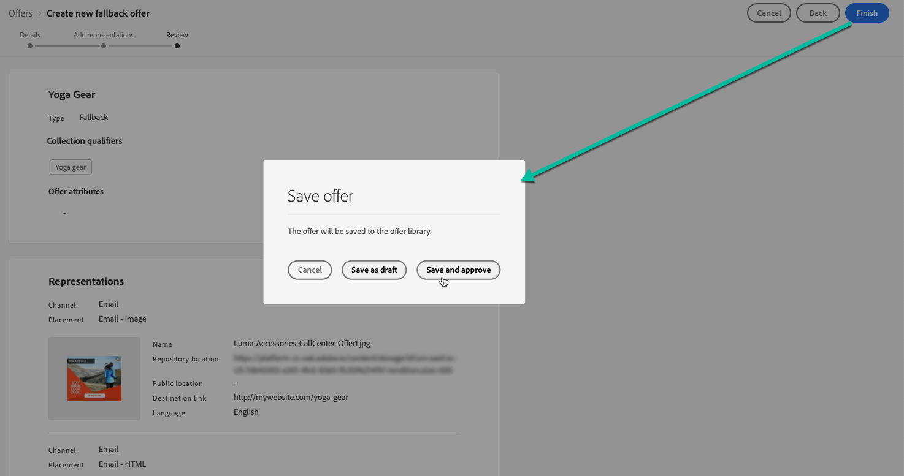

# Alternatieve aanbiedingen maken {#create-fallback-offers}

>[!CONTEXTUALHELP]
>id="ajo_decisioning_new_fallback"
>title="Fallback-aanbieding"
>abstract="Een fallback-aanbieding is de standaardaanbieding die wordt weergegeven wanneer een eindgebruiker niet in aanmerking komt voor een van de persoonlijke aanbiedingen."

>[!CONTEXTUALHELP]
>id="ajo_decisioning_fallback_offer_details "
>title="Details over alternatieven voor aanbiedingen"
>abstract="Geef de naam van de fallback-aanbieding op. U kunt ook een of meer bestaande verzamelingsaanduidingen eraan koppelen, zodat u de bibliotheek met aanbiedingen eenvoudiger kunt doorzoeken en indelen."

De fallback-aanbieding wordt naar klanten gestuurd als zij niet in aanmerking komen voor andere aanbiedingen. De stappen om een reserveaanbieding tot stand te brengen bestaan uit het creëren van één of verscheidene vertegenwoordiging, zoals wanneer het creëren van een aanbieding.

➡️ [Ontdek deze functie in video](#video)

De lijst met terugvalaanbiedingen is toegankelijk in het menu **[!UICONTROL Offers]** .

Voer de volgende stappen uit om een fallback-aanbieding te maken:

>[!NOTE]
>
>Merk op dat, in tegenstelling tot gepersonaliseerde aanbiedingen, de terugvalaanbiedingen geen toelatingsregels en beperkingsparameters hebben, omdat zij aan klanten als laatste redmiddel zonder voorwaarde worden voorgesteld.

1. Klik op **[!UICONTROL Create offer]** en selecteer vervolgens **[!UICONTROL Fallback offer]** .

   

1. Geef de naam van de fallback-aanbieding op. U kunt ook een of meerdere bestaande kwalificatoren voor verzamelingen (voorheen bekend als &#39;tags&#39;) aan de verzameling koppelen, zodat u de bibliotheek met aanbiedingen eenvoudiger kunt doorzoeken en indelen.

   

1. Selecteer **[!UICONTROL Manage access]** als u aangepaste of basislabels voor gegevensgebruik aan de aanbieding wilt toewijzen. [ leer meer over de Controle van de Toegang van het Niveau van Objecten (OLAC) ](../../administration/object-based-access.md)

1. Maak een of meer representaties voor de fallback-aanbieding. Hiervoor sleept u plaatsingen vanuit het linkervenster, bijvoorbeeld wanneer u een gepersonaliseerde aanbieding maakt. Zie [ gepersonaliseerde aanbiedingen ](../offer-library/creating-personalized-offers.md) creëren.

   

   >[!CAUTION]
   >
   >De aanbiedingen van de reserve zouden alle vertegenwoordiging moeten bevatten die binnen a [ wordt gebruikt besluit ](../offer-activities/create-offer-activities.md). Als een beslissing bijvoorbeeld vijf voorstellen bevat en elk voorstel een andere representatie heeft, moeten er vijf voorstellen in het fallback-aanbod worden opgenomen.

1. Zodra de vertegenwoordiging van de reserveaanbieding is toegevoegd, een summiere vertoningen. Als alles correct is geconfigureerd en uw fallback-aanbieding klaar is om aan klanten te worden aangeboden, klikt u op **[!UICONTROL Finish]** en selecteert u vervolgens **[!UICONTROL Save and approve]** .

   U kunt de fallback-aanbieding ook opslaan als concept, zodat u deze later kunt bewerken en goedkeuren.

   

1. De fallback-aanbieding wordt in de lijst weergegeven met de status **[!UICONTROL Live]** of **[!UICONTROL Draft]** , afhankelijk van het feit of u deze al dan niet hebt goedgekeurd in de vorige stap.

   Het is nu klaar om aan klanten te worden geleverd. U kunt het selecteren om zijn eigenschappen te tonen en het uit te geven. <!-- no suppression? -->

   

## Hoe kan ik-video {#video}

>[!VIDEO](https://video.tv.adobe.com/v/329383?quality=12)

