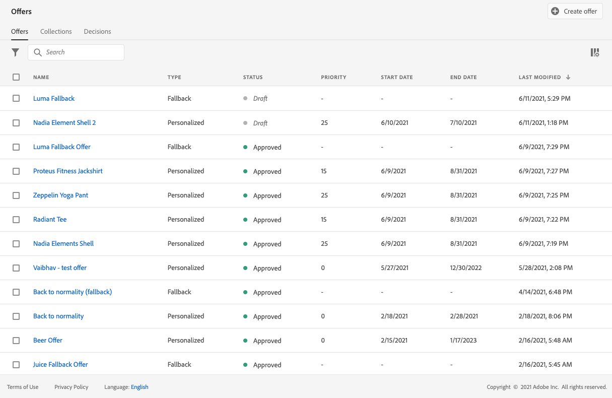
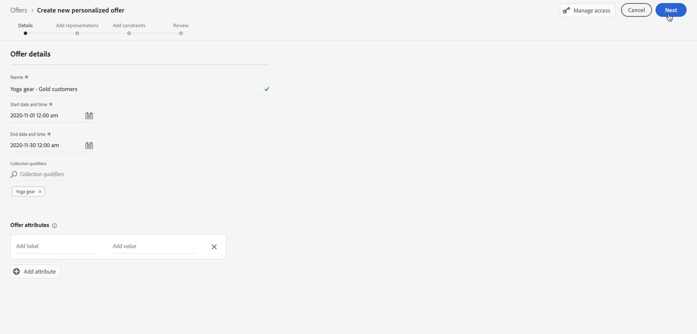
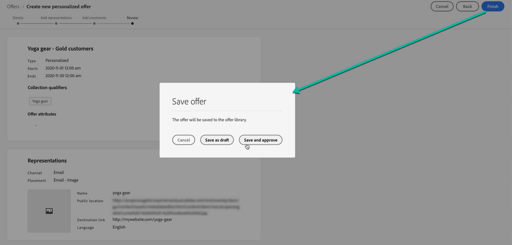
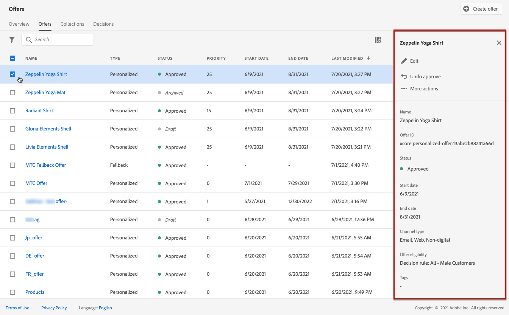

# Aanbiedingen op maat maken {#create-personalized-offers}

Voordat u een aanbieding maakt, moet u controleren of u het volgende hebt gemaakt:

* A **plaatsing** waarin de aanbieding wordt weergegeven. Zie [Plaatsen maken](../offer-library/creating-placements.md)
* Als u een toelatingsvoorwaarde wilt toevoegen: a **beslissingsregel** daarin wordt bepaald onder welke voorwaarden de aanbieding zal worden ingediend . Zie [Beslissingsregels maken](../offer-library/creating-decision-rules.md).
* Eén of meerdere **tags** die u wellicht aan de aanbieding wilt koppelen. Zie [Tags maken](../offer-library/creating-tags.md).

➡️ [Ontdek deze functie in video](#video)

De lijst met gepersonaliseerde aanbiedingen is toegankelijk in het **[!UICONTROL Offers]** -menu.

## Een aanbieding maken {#create-offer}

>[!CONTEXTUALHELP]
>id="od_offer_attributes"
>title="Aanbiedingskenmerken"
>abstract="Met aanbiedingskenmerken kunt u sleutelwaardeparen aan de aanbieding koppelen voor rapportage- en analysedoeleinden."

>[!CONTEXTUALHELP]
>id="ajo_decisioning_offer_attributes"
>title="Aanbiedingskenmerken"
>abstract="Met aanbiedingskenmerken kunt u sleutelwaardeparen aan de aanbieding koppelen voor rapportage- en analysedoeleinden."

Om een **aanbieden** Voer de volgende stappen uit:

1. Klikken **[!UICONTROL Create offer]** selecteert u vervolgens **[!UICONTROL Personalized offer]**.

   

1. Geef de naam van de aanbieding en de begin- en einddatum en -tijd op. Buiten deze datums wordt de aanbieding niet geselecteerd door het beslissingsprogramma.

   

   >[!CAUTION]
   >
   >Het bijwerken van de begin- en einddatum kan van invloed zijn op de aftopping. [Meer informatie](add-constraints.md#capping-change-date)

1. U kunt ook een of meerdere bestaande **[!UICONTROL tags]** aan de aanbieding, zodat u de bibliotheek van de Aanbieding gemakkelijker kunt zoeken en organiseren. [Meer informatie](creating-tags.md).

1. De **[!UICONTROL Offer attributes]** kunt u sleutelwaardeparen aan de aanbieding koppelen voor rapportage- en analysedoeleinden.

1. Voeg afbeeldingen toe om te bepalen waar je voorstel in het bericht wordt weergegeven. [Meer informatie](add-representations.md)

   

1. Voeg beperkingen toe om de voorwaarden te plaatsen voor de aanbieding die moet worden getoond. [Meer informatie](add-constraints.md)

   

1. Bekijk het voorstel en sla het op. [Meer informatie](#review)

## Het voorstel bekijken {#review}

Zodra de toelatingsregels en de beperkingen zijn bepaald, toont een samenvatting van de aanbiedingseigenschappen.

1. Zorg ervoor alles behoorlijk wordt gevormd.

1. Wanneer uw voorstel klaar is om aan gebruikers te worden aangeboden, klikt u op **[!UICONTROL Finish]**.

1. Selecteer **[!UICONTROL Save and approve]**.

   

   U kunt het voorstel ook opslaan als concept, zodat u het later kunt bewerken en goedkeuren.

De aanbieding wordt in de lijst weergegeven met de **[!UICONTROL Approved]** of **[!UICONTROL Draft]** status, afhankelijk van het feit of u het al dan niet in de vorige stap hebt goedgekeurd.

Het is nu klaar om aan gebruikers te worden geleverd.

## Aanbiedingen beheren {#offer-list}

In de lijst met aanbiedingen kunt u de aanbieding selecteren om de eigenschappen ervan weer te geven. U kunt het ook bewerken, de status wijzigen (**Concept**, **Goedgekeurd**, **Gearchiveerd**), dupliceert de aanbieding of verwijdert deze.

Selecteer **[!UICONTROL Edit]** om terug te gaan naar de modus Uitgave van aanbieding, waar u de [details](#create-offer), [representaties](#representations)en bewerkt u de [subsidiabiliteitsregels en beperkingen](#eligibility).

Selecteer een goedgekeurd voorstel en klik op **[!UICONTROL Undo approve]** om de status van de aanbieding weer in te stellen op **[!UICONTROL Draft]**.

De status opnieuw instellen op **[!UICONTROL Approved]** Selecteer de bijbehorende knop die nu wordt weergegeven.

De **[!UICONTROL More actions]** schakelt u de hieronder beschreven handelingen in.

* **[!UICONTROL Duplicate]**: een aanbod doet ontstaan met dezelfde eigenschappen, representaties, subsidiabiliteitsregels en beperkingen. Standaard bevat de nieuwe aanbieding de **[!UICONTROL Draft]** status.
* **[!UICONTROL Delete]**: Hiermee verwijdert u het voorstel uit de lijst.

   >[!CAUTION]
   >
   >Het aanbod en de inhoud ervan zijn niet meer toegankelijk. Deze handeling kan niet ongedaan worden gemaakt.
   >
   >Indien de aanbieding in een collectie of een beslissing wordt gebruikt, kan zij niet worden geschrapt. U moet het voorstel eerst uit om het even welke voorwerpen verwijderen.

* **[!UICONTROL Archive]**: stelt de aanbiedingsstatus in op **[!UICONTROL Archived]**. Het voorstel is nog steeds beschikbaar in de lijst, maar u kunt de status niet terugzetten op **[!UICONTROL Draft]** of **[!UICONTROL Approved]**. U kunt deze alleen dupliceren of verwijderen.

U kunt ook de status van meerdere aanbiedingen tegelijk verwijderen of wijzigen door de desbetreffende selectievakjes in te schakelen.

Als u de status van meerdere aanbiedingen met verschillende statussen wilt wijzigen, worden alleen de desbetreffende statussen gewijzigd.

Nadat u een voorstel hebt gemaakt, kunt u in de lijst op de naam ervan klikken.

Op deze manier hebt u toegang tot gedetailleerde informatie voor dat aanbod. Selecteer **[!UICONTROL Change log]** tab naar [alle wijzigingen controleren](../get-started/user-interface.md#monitoring-changes) die aan het aanbod zijn gedaan.

## Video over zelfstudie {#video}

>[!NOTE]
>
>Deze video is van toepassing op de Offer decisioning toepassingsservice die op Adobe Experience Platform is gebouwd. Het biedt echter algemene richtlijnen voor het gebruik van Aanbieding in de context van Journey Optimizer.

>[!VIDEO](https://video.tv.adobe.com/v/329375?quality=12)
