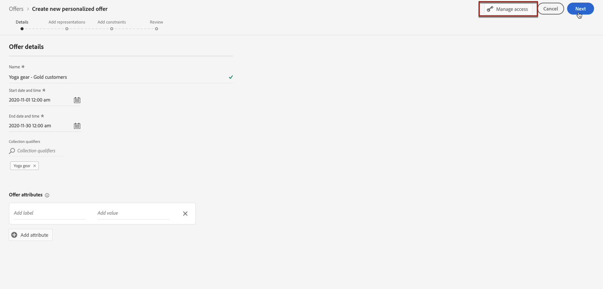
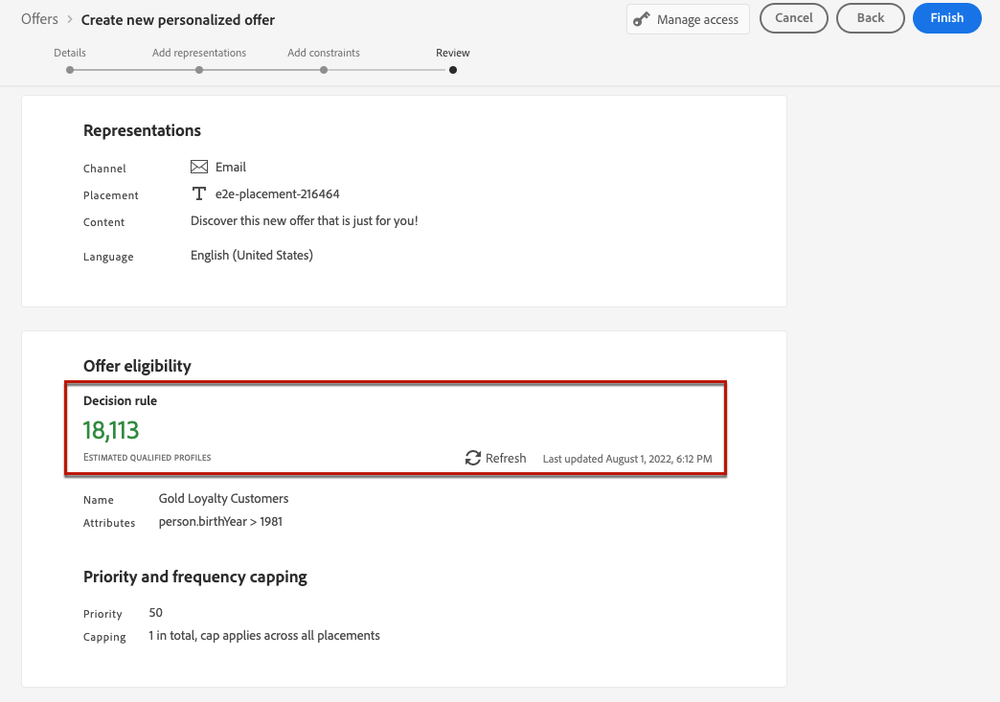

# Gepersonaliseerde aanbiedingen maken {#create-personalized-offers}

Voordat u een aanbieding maakt, moet u controleren of u het volgende hebt gemaakt:

* A **plaatsing** waarin de aanbieding zal worden getoond. Zie [&#x200B; plaatsingen &#x200B;](../offer-library/creating-placements.md) creëren
* Als u een toelatingsvoorwaarde wilt toevoegen: a **besluitvormingsregel** die de voorwaarde zal bepalen waaronder de aanbieding zal worden voorgesteld. Zie [&#x200B; besluitvormingsregels &#x200B;](../offer-library/creating-decision-rules.md) creëren.
* Één of verscheidene **inzamelingsbepalers** (die eerder als &quot;markeringen&quot;worden bekend) die u aan de aanbieding kunt willen associëren. Zie [&#x200B; inzamelingsbepalende eigenschappen &#x200B;](../offer-library/creating-tags.md) creëren.

➡️ [Ontdek deze functie in video](#video)

De lijst met gepersonaliseerde aanbiedingen is toegankelijk in het menu **[!UICONTROL Offers]** .

## Een aanbieding maken {#create-offer}

>[!CONTEXTUALHELP]
>id="ajo_decisioning_offer_details"
>title="Details voorstel"
>abstract="Vul de naam en de begin- en einddatum van de aanbieding in. Buiten deze datums wordt de aanbieding niet geselecteerd door de beslissingsengine."

>[!CONTEXTUALHELP]
>id="od_offer_attributes"
>title="Aanbiedingskenmerken"
>abstract="Met aanbiedingskenmerken kunt u sleutelwaardeparen aan de aanbieding koppelen voor rapportage- en analysedoeleinden."

>[!CONTEXTUALHELP]
>id="ajo_decisioning_offer_attributes"
>title="Aanbiedingskenmerken"
>abstract="Met aanbiedingskenmerken kunt u sleutelwaardeparen aan de aanbieding koppelen voor rapportage- en analysedoeleinden."

>[!CONTEXTUALHELP]
>id="ajo_decisioning_new_personalized"
>title="Persoonlijk aanbod"
>abstract="Een gepersonaliseerd aanbod is een aanpasbaar bericht op basis van geschiktheidsregels en -beperkingen."

>[!CONTEXTUALHELP]
>id="ajo_decisioning_new_fallback"
>title="Fallback-aanbieding"
>abstract="Een fallback-aanbieding is de standaardaanbieding die wordt weergegeven wanneer een eindgebruiker niet in aanmerking komt voor een van de persoonlijke aanbiedingen."

Om een **aanbieding** tot stand te brengen, volg deze stappen:

1. Klik op **[!UICONTROL Create offer]** en selecteer vervolgens **[!UICONTROL Personalized offer]** .

   

1. Geef de naam van de aanbieding en de begin- en einddatum en -tijd op. Buiten deze datums wordt de aanbieding niet geselecteerd door de beslissingsengine.

   >[!NOTE]
   >
   >Wanneer u tijden selecteert, wordt rekening gehouden met uw huidige tijdzone.

   

   >[!CAUTION]
   >
   >Het bijwerken van de begin- en einddatum kan van invloed zijn op de aftopping. [Meer informatie](add-constraints.md#capping-change-date)

1. U kunt ook een of meerdere bestaande **[!UICONTROL collection qualifiers]** aan de aanbieding koppelen, zodat u de bibliotheek met aanbiedingen eenvoudiger kunt doorzoeken en indelen. [Meer informatie](creating-tags.md).

1. In de sectie **[!UICONTROL Offer attributes]** kunt u sleutelwaardeparen aan de aanbieding koppelen voor rapportage- en analysedoeleinden.

1. Selecteer **[!UICONTROL Manage access]** als u aangepaste of basislabels voor gegevensgebruik aan de aanbieding wilt toewijzen. [&#x200B; leer meer over de Controle van de Toegang van het Niveau van Objecten (OLAC) &#x200B;](../../administration/object-based-access.md)

   

1. Voeg representaties toe om te bepalen waar je voorstel in het bericht wordt weergegeven. [Meer informatie](add-representations.md)

   

   >[!CAUTION]
   >
   >De omvang van een aanbieding, inclusief alle representaties, mag niet groter zijn dan 300 kB.

1. Voeg beperkingen toe om de voorwaarden te plaatsen voor de aanbieding die moet worden getoond. [Meer informatie](add-constraints.md)

   >[!NOTE]
   >
   >Wanneer u publiek of beslissingsregels selecteert, kunt u informatie over de geschatte gekwalificeerde profielen zien. Klik op **[!UICONTROL Refresh]** om gegevens bij te werken.
   >
   >Let op: profielschattingen zijn niet beschikbaar wanneer regelparameters gegevens bevatten die niet in het profiel staan, zoals contextgegevens. Bijvoorbeeld, een toelatingsregel die het huidige weer om 80 graden vereist te zijn.

   

1. Bekijk het voorstel en sla het op. [Meer informatie](#review)

## Het voorstel bekijken {#review}

Zodra de toelatingsregels en de beperkingen zijn bepaald, toont een samenvatting van de aanbiedingseigenschappen.

1. Zorg ervoor alles behoorlijk wordt gevormd.

1. U kunt informatie weergeven over de geschatte gekwalificeerde profielen. Klik op **[!UICONTROL Refresh]** om gegevens bij te werken.

   

1. Klik op **[!UICONTROL Finish]** als uw voorstel klaar is om aan de gebruikers te worden aangeboden.

1. Selecteer **[!UICONTROL Save and approve]**.

   

   U kunt het voorstel ook opslaan als concept, zodat u het later kunt bewerken en goedkeuren.

De aanbieding wordt in de lijst weergegeven met de status **[!UICONTROL Approved]** of **[!UICONTROL Draft]** , afhankelijk van het feit of u de aanbieding hebt goedgekeurd of niet in de vorige stap.

Het is nu klaar om aan gebruikers te worden geleverd.

## Aanbiedingen beheren {#offer-list}

In de lijst met aanbiedingen kunt u de aanbieding selecteren en de eigenschappen ervan weergeven. U kunt het ook uitgeven, zijn status veranderen (**Ontwerp**, **Goedgekeurd**, **Gearchiveerd**), de aanbieding dupliceren, of het schrappen.

Selecteer de **[!UICONTROL Edit]** knoop om naar de wijze van de aanbiedingsuitgave terug te gaan, waar u de 1&rbrace; details van de aanbieding [&#x200B; kunt wijzigen, &#x200B;](#create-offer) vertegenwoordiging [, evenals &#x200B;](add-representations.md#representations) geschiktheidsregels en beperkingen [&#x200B; uitgeven.](add-constraints.md#eligibility)

Selecteer een goedgekeurde aanbieding en klik op **[!UICONTROL Undo approve]** om de status van de aanbieding weer in te stellen op **[!UICONTROL Draft]** .

Als u de status opnieuw wilt instellen op **[!UICONTROL Approved]** , selecteert u de bijbehorende knop die nu wordt weergegeven.

Met de knop **[!UICONTROL More actions]** schakelt u de hieronder beschreven handelingen in.

* **[!UICONTROL Duplicate]** : maakt een aanbieding met dezelfde eigenschappen, representaties, geschiktheidsregels en beperkingen. Standaard heeft de nieuwe aanbieding de status **[!UICONTROL Draft]** .
* **[!UICONTROL Delete]** : hiermee verwijdert u het voorstel uit de lijst.

  >[!CAUTION]
  >
  >Het aanbod en de inhoud ervan zijn niet meer toegankelijk. Deze handeling kan niet ongedaan worden gemaakt.
  >
  >Indien de aanbieding in een collectie of een beslissing wordt gebruikt, kan zij niet worden geschrapt. U moet het voorstel eerst uit om het even welke voorwerpen verwijderen.

* **[!UICONTROL Archive]** : stelt de status van het aanbod in op **[!UICONTROL Archived]** . De aanbieding is nog steeds beschikbaar in de lijst, maar u kunt de status niet terugzetten op **[!UICONTROL Draft]** of **[!UICONTROL Approved]** . U kunt deze alleen dupliceren of verwijderen.

U kunt ook de status van meerdere aanbiedingen tegelijk verwijderen of wijzigen door de desbetreffende selectievakjes in te schakelen.

Als u de status van meerdere aanbiedingen met verschillende statussen wilt wijzigen, worden alleen de desbetreffende statussen gewijzigd.

Nadat u een voorstel hebt gemaakt, kunt u in de lijst op de naam ervan klikken.

Op deze manier hebt u toegang tot gedetailleerde informatie voor dat aanbod. Selecteer het **[!UICONTROL Change log]** lusje aan [&#x200B; controle alle veranderingen &#x200B;](../get-started/user-interface.md#changes-logs) die aan de aanbieding zijn aangebracht.

## Video over zelfstudie {#video}

>[!VIDEO](https://video.tv.adobe.com/v/329375?quality=12)
