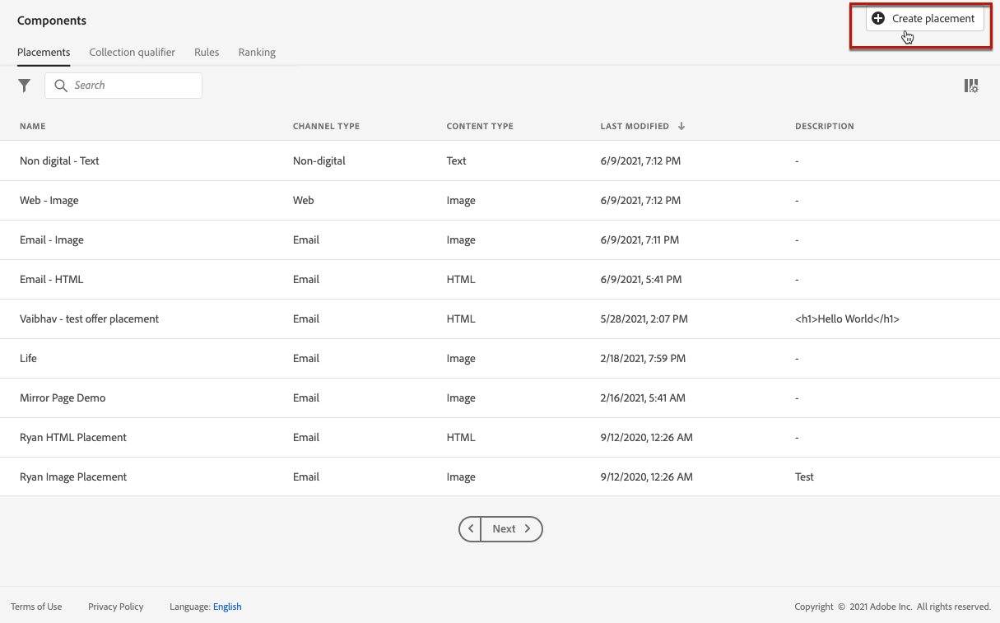
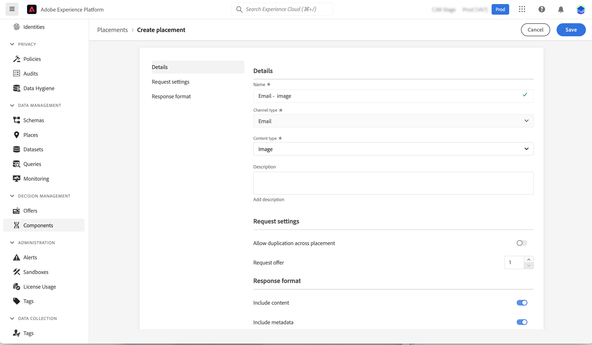

# Plaatsingen maken {#create-placements}

>[!CONTEXTUALHELP]
>id="ajo_decisioning_placement"
>title="Plaatsing"
>abstract="Een plaatsing is een container die wordt gebruikt om aanbiedingen te tonen. Het helpt ervoor te zorgen dat de juiste aanbiedingsinhoud op de juiste plaats binnen uw bericht verschijnt. Plaatsen worden gemaakt via het menu &quot;Componenten&quot;."

Een plaatsing helpt ervoor te zorgen dat de juiste aanbiedingsinhoud op de juiste plaats binnen uw bericht verschijnt. Wanneer u inhoud aan een aanbieding toevoegt, wordt u gevraagd een plaatsing te selecteren waarin die inhoud kan worden weergegeven.

➡️ [Leer hoe u plaatsingen in deze video kunt maken](#video)

In het onderstaande voorbeeld zijn er drie plaatsen die overeenkomen met verschillende typen inhoud (afbeelding, tekst, HTML).

De lijst met stages is toegankelijk in het **[!UICONTROL Components]** -menu. Er zijn filters beschikbaar waarmee u plaatsingen kunt ophalen op basis van een specifiek kanaal of specifieke inhoud.

Voer de volgende stappen uit om een plaatsing te maken:

1. Klik op **[!UICONTROL Create placement]**.

   

1. Definieer de eigenschappen van de plaatsing:

   * **[!UICONTROL Name]**: De naam van de plaatsing. Zorg ervoor dat u een betekenisvolle naam definieert om deze eenvoudiger op te halen.
   * **[!UICONTROL Channel type]**: Het kanaal waarvoor de plaatsing wordt gebruikt.
   * **[!UICONTROL Content type]**: Het type inhoud dat de plaatsing mag weergeven: Tekst, HTML, Afbeeldingskoppeling of JSON.
   * **[!UICONTROL Description]**: Een beschrijving van de plaatsing (optioneel).

   

1. De **[!UICONTROL Request settings]** en **[!UICONTROL Response format]** de secties verstrekken extra parameters:

   * **[!UICONTROL Allow Duplicates across placements]**: Bepaal of dezelfde aanbieding meerdere keren kan worden voorgesteld voor verschillende plaatsen. Als deze optie is ingeschakeld, overweegt het systeem dezelfde aanbieding voor meerdere plaatsingen. Standaard is de parameter ingesteld op false.

     Als deze optie voor om het even welke plaatsing in een beslissingsverzoek aan vals wordt geplaatst, zullen alle plaatsen in het verzoek het &quot;vals&quot;plaatsen erven.

   * **[!UICONTROL Request offer]**: Standaard wordt één aanbieding van het beslissingsbereik geretourneerd voor elk profiel. Met deze optie kunt u het aantal geretourneerde voorstellen aanpassen. Als u bijvoorbeeld 2 selecteert, worden de beste 2 aanbiedingen weergegeven voor het geselecteerde beslissingsbereik.

   * **[!UICONTROL Include content]** / **[!UICONTROL Include metadata]**: specificeer als de inhoud en de meta-gegevens van de aanbieding in de API reactie zouden moeten zijn teruggekeerd. U kunt alleen alle metagegevens of specifieke velden opnemen. De waarde voor Inclusief metagegevens is standaard ingesteld op true.

   Deze parameters kunnen ook rechtstreeks in uw API-verzoek worden ingesteld als u met de [API voor besluitvorming](https://experienceleague.adobe.com/docs/journey-optimizer/using/offer-decisioning/api-reference/offer-delivery-api/decisioning-api.html). Als u deze echter configureert in de gebruikersinterface, kunt u tijd besparen omdat u deze niet in elke API-aanvraag hoeft door te geven. Merk op dat als u de parameters zowel in gebruikersinterface als het API verzoek vormt, de waarden van het API verzoek over degenen van de interface zullen prevaleren.

   >[!NOTE]
   >
   >Als u met de [Edge-API voor besluitvorming](https://experienceleague.adobe.com/docs/journey-optimizer/using/offer-decisioning/api-reference/offer-delivery-api/edge-decisioning-api.html?), kunt u deze parameters niet in uw verzoek plaatsen. U moet ze in dit scherm definiëren.
   >
   >Als u met de [Batchbeslissing-API](../api-reference/offer-delivery-api/batch-decisioning-api.md)kunt u deze parameters instellen in dit scherm of in uw API-verzoek. Als parameterwaarden niet overeenkomen tussen het scherm en het APi-verzoek, worden de aanvraagwaarden gebruikt.

1. Klik op **[!UICONTROL Save]** om te bevestigen.

1. Zodra de plaatsing wordt gecreeerd, toont het in de plaatsingslijst. U kunt het selecteren om zijn eigenschappen te tonen en het uit te geven.

   

## Hoe kan ik-video{#video}

Leer hoe u plaatsingen in het besluitvormingsbeheer kunt maken.

>[!VIDEO](https://video.tv.adobe.com/v/329372?quality=12)

