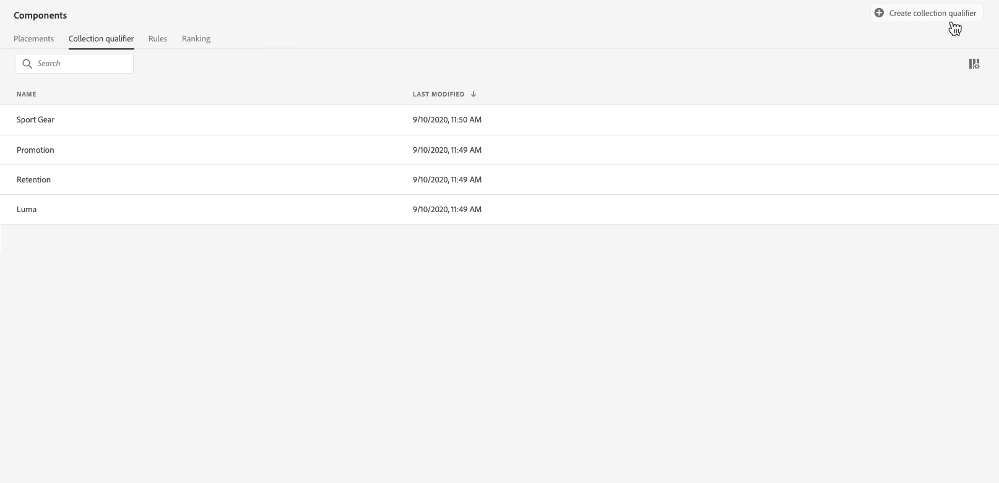

# Verzamelingsaanduidingen maken {#create-tags}

>[!CONTEXTUALHELP]
>id="ajo_decisioning_offer_tags"
>title="Verzamelingsaanduidingen"
>abstract="Koppel een of meer verzamelingskwalificeerders aan de aanbieding om de bibliotheek met aanbiedingen overzichtelijker te houden en aanbiedingen gemakkelijker te vinden. Verzamelingsaanduidingen worden gemaakt in het menu Component."

Door verzamelingsaanduidingen (die voorheen &#39;&#39;tags&#39;&#39; werden genoemd) aan uw aanbiedingen te koppelen, kunt u ze eenvoudiger organiseren. U kunt bijvoorbeeld een label geven aan de zwarte vrijdag-aanbiedingen met de verzamelingsaanduiding &#39;Zwarte vrijdag&#39;. U kunt dan de onderzoeksfunctionaliteit in de Bibliotheek van de Aanbieding gebruiken om van alle aanbiedingen met die inzamelingskwalificatie gemakkelijk de plaats te bepalen.

Verzamelingsbepalers kunnen ook worden gebruikt om aanbiedingen samen te groeperen in aanbiedingsinzamelingen. Zie [ inzamelingen ](../offer-library/creating-collections.md) creëren.

➡️ [Ontdek deze functie in video](#video)

De lijst met gemaakte verzamelingskwalificatietoetsen is toegankelijk in het menu **[!UICONTROL Components]** .

Ga als volgt te werk om een verzamelingskwalificatie te maken:

1. Ga naar de tab **[!UICONTROL Collection qualifiers]** en klik vervolgens op **[!UICONTROL Create collection qualifier]** .

1. Geef de naam van de verzamelingskwalificatie op en klik op **[!UICONTROL Save]** .

   

1. Zodra de inzamelingsbepaler wordt gecreeerd, toont het in de lijst. U kunt het selecteren om zijn eigenschappen te tonen en het uit te geven of te onderdrukken.

   

## Hoe kan ik-video {#video}

>[!VIDEO](https://video.tv.adobe.com/v/329374?quality=12)
