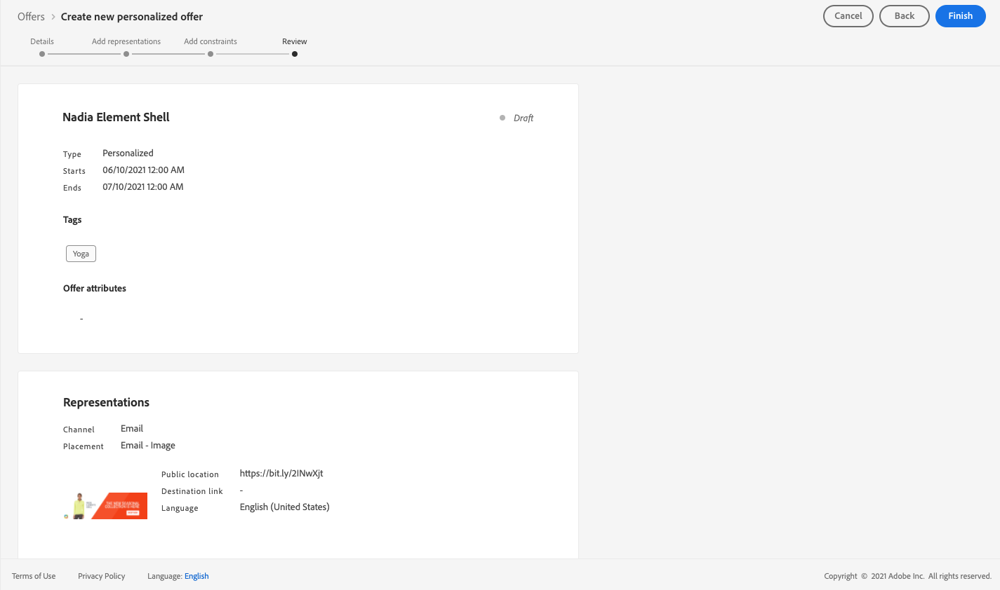

# Gebruiksscenario: Gepersonaliseerde aanbiedingen configureren om deze in een e-mail te gebruiken {#configure-add-personalized-offers-email}

Deze sectie stelt een voorbeeld van begin tot eind voor om te tonen hoe te om aanbiedingen te vormen en hen te gebruiken in een e-mail, die op een besluit wordt gebaseerd u eerder creeerde.

## Belangrijkste stappen {#main-steps}

De belangrijkste stappen om aanbiedingen te vormen, hen te omvatten in een besluit en hefboomwerking dit besluit in een e-mail zijn hieronder vermeld:

1. Voordat u aanbiedingen maakt, [uw componenten definiëren](#define-components)

   * Plaatsingen maken
   * Beslissingsregels maken
   * Tags maken
   * Classificaties maken (optioneel)

1. [De aanbiedingen configureren](#configure-offers)

   * Aanbiedingen maken
   * Voor elke aanbieding:

      * Weergaven maken en een plaatsing en een element selecteren voor elke representatie
      * Voeg een regel toe voor elke aanbieding
      * Een prioriteit voor elke aanbieding definiëren

1. [Een alternatieve aanbieding maken](#create-fallback)

1. [Een verzameling maken](#create-collection) om de persoonlijke aanbiedingen op te nemen die u hebt gemaakt

1. [De beslissing configureren](#configure-decision)

   * Een beslissing nemen
   * Selecteer de plaatsen u creeerde
   * Selecteer voor elke plaatsing de verzameling
   * Selecteer voor elke plaatsing een positie (optioneel)
   * Selecteer de fallback

1. [De beslissing invoegen in een e-mail](#insert-decision-in-email)

   * Selecteer een plaatsing die overeenkomt met de aanbiedingen die u wilt weergeven
   * Selecteer de beslissing uit de items die compatibel zijn met de geselecteerde plaatsing
   * Je voorstellen bekijken

Het algemene besluitvormingsproces voor het gebruik van aanbiedingen in een e-mail kan als volgt worden beschreven:

## De componenten definiëren {#define-components}

Voordat u aanbiedingen gaat maken, moet u verschillende componenten definiëren die u in uw aanbiedingen wilt gebruiken.

U vindt ze onder de **[!UICONTROL Decision Management]** > **[!UICONTROL Components menu]**.

1. Beginnen met maken **plaatsing** voor uw voorstellen.

   U gebruikt deze plaatsingen om te bepalen waar de resulterende aanbieding zal verschijnen wanneer het bepalen van uw biedingsbesluit.

   In dit voorbeeld maakt u drie plaatsen met de volgende kanaal- en inhoudstypen:

   * *Web - Afbeelding*
   * *E-mail - Afbeelding*
   * *Niet-digitaal - tekst*

   

   De gedetailleerde stappen voor het maken van plaatsingen worden beschreven in [deze sectie](../../using/offers/offer-library/creating-placements.md).

1. Maken **beslissingsregels**.

   Beslissingsregels zullen een profiel in Adobe Experience Platform het beste aanbieden.

   Vorm twee eenvoudige regels door te gebruiken **[!UICONTROL XDM Individual Profile > Person > Gender]** kenmerk:

   * *Vrouwelijke klanten*
   * *Mannelijke klanten*

   

   De gedetailleerde stappen voor het maken van regels worden beschreven in [deze sectie](../../using/offers/offer-library/creating-decision-rules.md).

1. U kunt ook een **tag**.

   Vervolgens kunt u het aan uw aanbiedingen koppelen en deze tag gebruiken om uw voorstellen samen in een verzameling te groeperen.

   In dit voorbeeld maakt u de opdracht *Yoga* tag.

   

   De gedetailleerde stappen voor het maken van tags worden beschreven in [deze sectie](../../using/offers/offer-library/creating-tags.md).

1. Als u regels wilt definiëren die bepalen welke aanbieding als eerste voor een bepaalde plaatsing moet worden gepresenteerd (in plaats van rekening te houden met de prioriteitsscores van de aanbiedingen), kunt u een **waarderingsformule**.

   De gedetailleerde stappen voor het maken van rangschikkingsformules worden beschreven in [deze sectie](../../using/offers/ranking/create-ranking-formulas.md#create-ranking-formula).

   >[!NOTE]
   >
   >In dit voorbeeld zullen we alleen de prioriteitsscores gebruiken. Meer informatie over [subsidiabiliteitsregels en beperkingen](../../using/offers/offer-library/creating-personalized-offers.md#eligibility).

## Aanbiedingen configureren {#configure-offers}

U kunt nu uw aanbiedingen maken en configureren. In dit voorbeeld maakt u vier aanbiedingen die u volgens elk specifiek profiel wilt weergeven.

1. Een aanbieding maken. Meer informatie in [deze sectie](../../using/offers/offer-library/creating-personalized-offers.md#create-offer).

1. In deze aanbieding, creeer drie vertegenwoordiging. Elke vertegenwoordiging moet een combinatie van een plaatsing zijn die u vroeger creeerde en activa:

   * Eén die overeenkomt met de *Web - Afbeelding* plaatsing
   * Eén die overeenkomt met de *E-mail - Afbeelding* plaatsing
   * Eén die overeenkomt met de *Niet-digitaal - tekst* plaatsing

   >[!NOTE]
   >
   >Een aanbieding kan op verschillende plaatsen in een bericht worden getoond om meer kansen tot gebruik van de aanbieding in verschillende plaatsingscontexten tot stand te brengen.

   Meer informatie over vertegenwoordigingen in [deze sectie](../../using/offers/offer-library/creating-personalized-offers.md#representations).

1. Selecteer een geschikte afbeelding voor de eerste twee plaatsen. Voer aangepaste tekst in voor de *Niet-digitaal - tekst* plaatsing.

   

1. In de **[!UICONTROL Offer eligibility]** sectie, selecteert u **[!UICONTROL By defined decision rule]** en sleep de lijn van uw keuze.

   

1. Vul de **[!UICONTROL Priority]**. In dit voorbeeld voegt u *25*.

1. Controleer je voorstel en klik op **[!UICONTROL Save and approve]**.

   

1. In dit voorbeeld maakt u nog drie aanbiedingen met dezelfde weergaven, maar met verschillende elementen. Wijs hen met verschillende regels en prioriteiten toe, zoals:

   * Eerste aanbieding - Beslissingsregel: *Vrouwelijke klanten*, prioriteit: *25*
   * Tweede aanbod - Beslissingsregel: *Vrouwelijke klanten*, prioriteit: *15*
   * Derde aanbieding - Beslissingsregel: *Mannelijke klanten*, prioriteit: *25*
   * Vierde aanbod - Beslissingsregel: *Mannelijke klanten*, prioriteit: *15*

   

De gedetailleerde stappen om aanbiedingen tot stand te brengen en te vormen worden beschreven in [deze sectie](../../using/offers/offer-library/creating-personalized-offers.md).

## Een alternatieve aanbieding maken {#create-fallback}

1. Een alternatieve aanbieding maken.

1. Definieer dezelfde representaties als voor de aanbiedingen, met de juiste middelen (deze moeten verschillen van de afbeeldingen die in uw aanbiedingen worden gebruikt).

   Elke vertegenwoordiging moet een combinatie van een plaatsing zijn die u vroeger creeerde en activa:

   * Eén die overeenkomt met de *Web - Afbeelding* plaatsing
   * Eén die overeenkomt met de *E-mail - Afbeelding* plaatsing
   * Eén die overeenkomt met de *Niet-digitaal - tekst* plaatsing

   

1. Controleer uw fallback-aanbieding en klik op **[!UICONTROL Save and approve]**.

Je fallbackvoorstel is nu klaar om te worden gebruikt in een beslissing.

De gedetailleerde stappen om een reserveaanbieding tot stand te brengen en te vormen worden beschreven in [deze sectie](../../using/offers/offer-library/creating-fallback-offers.md).

## Een verzameling maken {#create-collection}

Wanneer het vormen van het besluit, zult u uw gepersonaliseerde aanbiedingen als deel van een inzameling moeten toevoegen.

1. Om het besluitvormingsproces te versnellen, creeer een dynamische inzameling.

1. Gebruik de *Yoga* tag gebruiken om de vier aangepaste aanbiedingen te selecteren die u eerder hebt gemaakt.

   

De gedetailleerde stappen voor het maken van een verzameling worden beschreven in [deze sectie](../../using/offers/offer-library/creating-collections.md).

## De beslissing configureren {#configure-decision}

Nu moet u een besluit maken dat plaatsingen zal combineren met de gepersonaliseerde aanbiedingen en het fallback-aanbod dat u net hebt gemaakt.

Deze combinatie wordt door de Offer decisioning-engine gebruikt om de beste aanbieding voor een specifiek profiel te vinden: in dit voorbeeld zal het gebaseerd zijn op de prioriteit en beslissingsregel u aan elk aanbod toewees.

Om een aanbiedingsbesluit tot stand te brengen en te vormen, volg de belangrijkste stappen hieronder:

1. Een beslissing nemen. Meer informatie in [deze sectie](../../using/offers/offer-activities/create-offer-activities.md#create-activity).

1. Selecteer *Web - Afbeelding*, *E-mail - Afbeelding* en *Niet-digitaal - tekst* stages.

   

1. Voeg voor elke plaatsing de verzameling toe die u hebt gemaakt.

   

1. Als u een classificatie hebt gedefinieerd wanneer [samenstellen van componenten](#define-components), kunt u deze toewijzen aan een plaatsing in de beslissing. Indien meerdere aanbiedingen in aanmerking komen om in deze plaatsing te worden gepresenteerd, wordt in de beslissing gebruik gemaakt van deze formule om te berekenen welke aanbieding het eerst wordt geleverd.

   De gedetailleerde stappen om een rangschikkingsformule aan een plaatsing toe te wijzen worden beschreven in [deze sectie](../../using/offers/offer-activities/configure-offer-selection.md#assign-ranking-formula).

1. Selecteer de fallback-aanbieding die u hebt gemaakt. Het wordt weergegeven als een beschikbare fallback-aanbieding voor de drie geselecteerde plaatsingen.

   

1. Controleer uw beslissing en klik op **[!UICONTROL Save and approve]**.

   

Uw beslissing is nu klaar om te worden gebruikt voor het aanbieden van geoptimaliseerde en persoonlijke aanbiedingen.

De gedetailleerde stappen om een besluit tot stand te brengen en te vormen worden beschreven in [deze sectie](../../using/offers/offer-activities/create-offer-activities.md).

## De beslissing invoegen in een e-mail {#insert-decision-in-email}

Nu uw beslissing live is, kunt u deze invoegen in een e-mailbericht. Volg hiervoor de stappen die in [deze pagina](../../using/design/deliver-personalized-offers.md).

