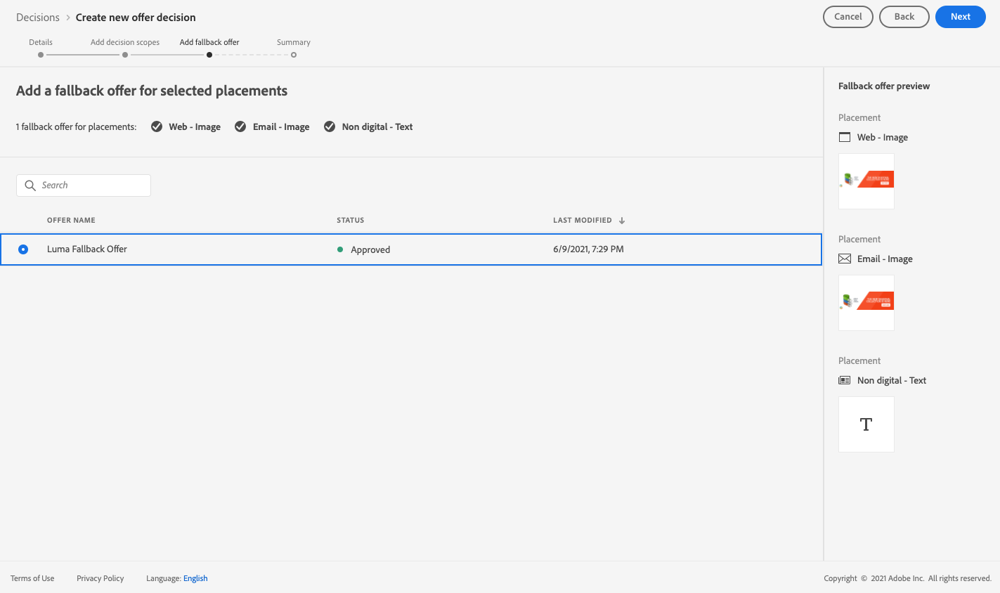
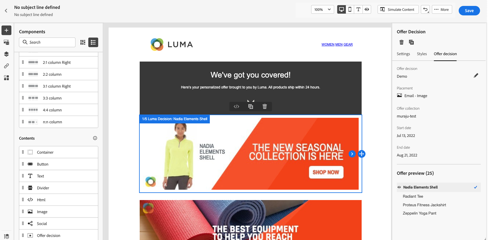

# Hoofdlettergebruik: gepersonaliseerde aanbiedingen configureren om deze in een e-mail te gebruiken {#configure-add-personalized-offers-email}

Deze sectie stelt een voorbeeld van begin tot eind voor om te tonen hoe te om aanbiedingen te vormen en hen te gebruiken in een e-mail, die op een besluit wordt gebaseerd u eerder creeerde.

## Belangrijkste stappen {#main-steps}

De belangrijkste stappen om aanbiedingen te vormen, hen te omvatten in een besluit en hefboomwerking dit besluit in een e-mail zijn hieronder vermeld:

1. Alvorens aanbiedingen te creëren, [ bepaal uw componenten ](#define-components)

   * Plaatsingen maken
   * Beslissingsregels maken
   * Verzamelingsaanduidingen maken (voorheen &#39;&#39;tags&#39;&#39; genoemd)
   * Classificaties maken (optioneel)

1. [De aanbiedingen configureren](#configure-offers)

   * Aanbiedingen maken
   * Voor elke aanbieding:

      * Weergaven maken en een plaatsing en een element selecteren voor elke representatie
      * Voeg een regel toe voor elke aanbieding
      * Een prioriteit voor elke aanbieding definiëren

1. [Een alternatieve aanbieding maken](#create-fallback)

1. [ creeer een inzameling ](#create-collection) om de gepersonaliseerde aanbiedingen te omvatten u creeerde

1. [De beslissing configureren](#configure-decision)

   * Een beslissing nemen
   * Selecteer de plaatsen u creeerde
   * Selecteer voor elke plaatsing de verzameling
   * Selecteer voor elke plaatsing een positie (optioneel)
   * Selecteer de fallback

1. [De beslissing invoegen in een e-mail](#insert-decision-in-email)

   * Selecteer een plaatsing die overeenkomt met de aanbiedingen die u wilt weergeven
   * Selecteer de beslissing uit de items die compatibel zijn met de geselecteerde plaatsing
   * Voorbeeld van je voorstellen bekijken

Het algemene besluitvormingsproces voor het gebruik van aanbiedingen in een e-mail kan als volgt worden beschreven:

## De componenten definiëren {#define-components}

Voordat u aanbiedingen gaat maken, moet u verschillende componenten definiëren die u in uw aanbiedingen wilt gebruiken.

U vindt ze onder **[!UICONTROL Decision Management]** > **[!UICONTROL Components menu]** .

1. Begin door **plaatsen** voor uw aanbiedingen te creëren.

   U gebruikt deze plaatsingen om te bepalen waar de resulterende aanbieding zal verschijnen wanneer het bepalen van uw biedingsbesluit.

   In dit voorbeeld maakt u drie plaatsen met de volgende kanaal- en inhoudstypen:

   * *Web - Beeld*
   * *E-mail - Beeld*
   * *niet-digitaal - Tekst*

   

   De gedetailleerde stappen om plaatsingen tot stand te brengen worden beschreven in [ deze sectie ](../../using/offers/offer-library/creating-placements.md).

1. Creeer **besluitvormingsregels**.

   Beslissingsregels zullen een profiel in Adobe Experience Platform het beste aanbieden.

   Vorm twee eenvoudige regels door het **[!UICONTROL XDM Individual Profile > Person > Gender]** attribuut te gebruiken:

   * *Vrouwelijke Klanten*
   * *Mannelijke Klanten*

   

   De gedetailleerde stappen om regels tot stand te brengen worden beschreven in [ deze sectie ](../../using/offers/offer-library/creating-decision-rules.md).

1. U kunt a **inzamelingsbepaler** ook tot stand brengen.

   U zult het dan aan uw aanbiedingen kunnen associëren en deze inzamelingskwalificatie gebruiken om uw aanbiedingen samen in een inzameling te groeperen.

   In dit voorbeeld, creeer het *Yoga* inzamelingsbepaler.

   

   De gedetailleerde stappen om inzamelingsbepalende eigenschappen tot stand te brengen worden beschreven in [ deze sectie ](../../using/offers/offer-library/creating-tags.md).

1. Als u regels wilt bepalen die welke aanbieding eerst voor een bepaalde plaatsing (eerder dan het rekening houden met de prioritaire scores van aanbiedingen) zullen bepalen, kunt u a **rangschikkende formule** tot stand brengen.

   De gedetailleerde stappen om rangschikkende formules tot stand te brengen worden beschreven in [ deze sectie ](../../using/offers/ranking/create-ranking-formulas.md#create-ranking-formula).

   >[!NOTE]
   >
   >In dit voorbeeld zullen we alleen de prioriteitsscores gebruiken. Leer meer over [ toelatingsregels en beperkingen ](../../using/offers/offer-library/add-constraints.md#eligibility).

## Aanbiedingen configureren {#configure-offers}

U kunt nu uw aanbiedingen maken en configureren. In dit voorbeeld maakt u vier aanbiedingen die u volgens elk specifiek profiel wilt weergeven.

1. Maak een voorstel. Lees meer in [deze sectie](../../using/offers/offer-library/creating-personalized-offers.md#create-offer).

1. In deze aanbieding, creeer drie vertegenwoordiging. Elke vertegenwoordiging moet een combinatie van een plaatsing zijn die u vroeger creeerde en activa:

   * Één die aan het *Web beantwoordt - Beeld* plaatsing
   * Één die aan *e-mail beantwoordt - Beeld* plaatsing
   * Één die aan *niet-digitaal beantwoordt - Tekst* plaatsing

   >[!NOTE]
   >
   >Een aanbieding kan op verschillende plaatsen in een bericht worden getoond om meer kansen tot gebruik van de aanbieding in verschillende plaatsingscontexten tot stand te brengen.

   Leer meer over vertegenwoordiging in [ deze sectie ](../../using/offers/offer-library/add-representations.md#representations).

1. Selecteer een geschikte afbeelding voor de eerste twee plaatsen. Ga douanetekst voor *niet-digitaal in - de plaatsing van de Tekst*.

   

1. Selecteer **[!UICONTROL Offer eligibility]** in de sectie **[!UICONTROL By defined decision rule]** en sleep de regel van uw keuze.

   

1. Vul **[!UICONTROL Priority]** in. In dit voorbeeld, voeg *25* toe.

1. Controleer uw voorstel en klik op **[!UICONTROL Save and approve]** .

   

1. In dit voorbeeld maakt u nog drie aanbiedingen met dezelfde weergaven, maar met verschillende elementen. Wijs hen met verschillende regels en prioriteiten toe, zoals:

   * Eerste aanbieding - de regel van het Besluit: *Vrouwelijke Klanten*, Prioriteit: *25*
   * Tweede aanbieding - Beslissingsregel: *Vrouwelijke Klanten*, Prioriteit: *15*
   * Derde aanbieding - Beslissingsregel: *Mannelijke Klanten*, Prioriteit: *25*
   * Vierde aanbieding - Beslissingsregel: *Mannelijke Klanten*, Prioriteit: *15*

   

De gedetailleerde stappen om aanbiedingen tot stand te brengen en te vormen worden beschreven in [ deze sectie ](../../using/offers/offer-library/creating-personalized-offers.md).

## Een alternatieve aanbieding maken {#create-fallback}

1. Maak een fallback-aanbieding.

1. Definieer dezelfde representaties als voor de aanbiedingen, met de juiste middelen (deze moeten verschillen van de afbeeldingen die in uw aanbiedingen worden gebruikt).

   Elke vertegenwoordiging moet een combinatie van een plaatsing zijn die u vroeger creeerde en activa:

   * Één die aan het *Web beantwoordt - Beeld* plaatsing
   * Één die aan *e-mail beantwoordt - Beeld* plaatsing
   * Één die aan *niet-digitaal beantwoordt - Tekst* plaatsing

   

1. Controleer uw fallback-aanbieding en klik op **[!UICONTROL Save and approve]** .

Je fallbackvoorstel is nu klaar om te worden gebruikt in een beslissing.

De gedetailleerde stappen om een reserveaanbieding tot stand te brengen en te vormen worden beschreven in [ deze sectie ](../../using/offers/offer-library/creating-fallback-offers.md).

## Een verzameling maken {#create-collection}

Wanneer het vormen van het besluit, zult u uw gepersonaliseerde aanbiedingen als deel van een inzameling moeten toevoegen.

1. Om het besluitvormingsproces te versnellen, creeer een dynamische inzameling.

1. Gebruik *Yoga* inzamelingskwalificatie om de vier gepersonaliseerde aanbiedingen te selecteren u vroeger creeerde.

   

De gedetailleerde stappen om een inzameling tot stand te brengen worden beschreven in [ deze sectie ](../../using/offers/offer-library/creating-collections.md).

## De beslissing configureren {#configure-decision}

Nu moet u een besluit maken dat plaatsingen zal combineren met de gepersonaliseerde aanbiedingen en het fallback-aanbod dat u net hebt gemaakt.

Deze combinatie wordt door de beslissingsengine gebruikt om de beste aanbieding voor een specifiek profiel te vinden. In dit voorbeeld is de combinatie gebaseerd op de regel voor prioriteit en beslissing die u aan elke aanbieding hebt toegewezen.

Om een aanbiedingsbesluit tot stand te brengen en te vormen, volg de belangrijkste stappen hieronder:

1. Maak een beslissing. Lees meer in [deze sectie](../../using/offers/offer-activities/create-offer-activities.md#create-activity).

1. Selecteer het *Web - Beeld*, *E-mail - Beeld* en *niet-digitaal - de plaatsen van de Tekst*.

   

1. Voeg voor elke plaatsing de verzameling toe die u hebt gemaakt.

   

1. Als u een rangschikking bepaalde wanneer [ bouwend uw componenten ](#define-components), kunt u het aan een plaatsing in het besluit toewijzen. Indien meerdere aanbiedingen in aanmerking komen om in deze plaatsing te worden gepresenteerd, wordt in de beslissing gebruik gemaakt van deze formule om te berekenen welke aanbieding het eerst wordt geleverd.

   De gedetailleerde stappen om een rangschikkende formule aan een plaatsing toe te wijzen worden beschreven in [ deze sectie ](../../using/offers/offer-activities/configure-offer-selection.md#assign-ranking-formula).

1. Selecteer de fallback-aanbieding die u hebt gemaakt. Het wordt weergegeven als een beschikbare fallback-aanbieding voor de drie geselecteerde plaatsingen.

   

1. Controleer uw beslissing en klik op **[!UICONTROL Save and approve]** .

   

Uw beslissing is nu klaar om te worden gebruikt voor het aanbieden van geoptimaliseerde en persoonlijke aanbiedingen.

De gedetailleerde stappen om een besluit tot stand te brengen en te vormen worden beschreven in [ deze sectie ](../../using/offers/offer-activities/create-offer-activities.md).

## De beslissing invoegen in een e-mail {#insert-decision-in-email}

Nu uw beslissing live is, kunt u deze invoegen in een e-mailbericht. Om dit te doen, volg de stappen die op [ worden gedetailleerd deze pagina ](../../using/email/add-offers-email.md).

