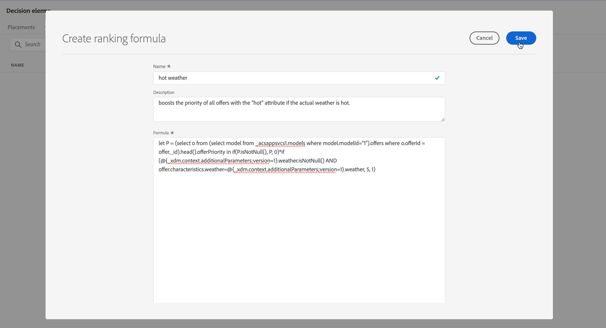

# Beoordelingsformule {#create-ranking-formulas}

## Rangschikkingsformules {#about-ranking-formulas}

**Rangschikkende formules** staan u toe om regels te bepalen die welke aanbieding eerst voor een bepaalde plaatsing, eerder dan rekening houdend met de prioritaire scores van aanbiedingen zullen bepalen.

De rangschikkende formules worden uitgedrukt in **syntaxis van PQL** en kunnen attributen van het hefboomwerkingenprofiel, contextgegevens en aanbiedingsattributen. Voor meer op hoe te om de syntaxis van PQL te gebruiken, verwijs naar de [&#x200B; specifieke documentatie &#x200B;](https://experienceleague.adobe.com/docs/experience-platform/segmentation/pql/overview.html).

Nadat u een rangschikkingsformule hebt gemaakt, kunt u deze toewijzen aan een plaatsing in een beslissing. Voor meer op dit, zie [&#x200B; aanbiedingsselectie in besluiten &#x200B;](../offer-activities/configure-offer-selection.md) vormen.

## Een waarderingsformule maken {#create-ranking-formula}

Voer de volgende stappen uit om een rangschikkingsformule te maken:

1. Open het menu **[!UICONTROL Components]** en selecteer vervolgens de tab **[!UICONTROL Ranking]** . Het tabblad **[!UICONTROL Formulas]** is standaard geselecteerd. De lijst met eerder gemaakte formules wordt weergegeven.

   

1. Klik op **[!UICONTROL Create ranking]** om een nieuwe waarderingsformule te maken.

   

1. Geef de naam, beschrijving en formule van de formule op.

   In dit voorbeeld willen we de prioriteit van alle aanbiedingen verhogen met het kenmerk &quot;hot&quot; als het werkelijke weer heet is. Om dit te doen, werd **contextData.weather=hot** overgegaan in de beslissingsvraag. [&#x200B; Leer hoe te met contextgegevens &#x200B;](../context-data.md) te werken

   

   >[!IMPORTANT]
   >
   >Bij het maken van een rangschikkingsformule wordt het terugzoeken naar een vorige periode niet ondersteund. Bijvoorbeeld, als u een ervaringsgebeurtenis specificeert die binnen de laatste maand als component van de formule voorkwam. Elke poging om een terugzoekperiode op te nemen tijdens het maken van een formule, veroorzaakt een fout bij het opslaan ervan.

1. Klik op **[!UICONTROL Save]**. Uw rangschikkingsformule wordt gecreeerd, kunt u het van de lijst selecteren om details te krijgen en het uit te geven of te schrappen.

   Het is nu klaar om in een besluit worden gebruikt om in aanmerking komende aanbiedingen voor een plaatsing (zie [&#x200B; te rangschikken aanbiedingen selectie in besluiten &#x200B;](../offer-activities/configure-offer-selection.md)).

   

## Voorbeelden van willekeurige formules {#ranking-formula-examples}

U kunt verschillende rangschikkingsformules naar wens maken. Hieronder volgen enkele voorbeelden.

<!--
Boost by offer ID

Boost the priority of an offer with the offer ID *xcore:personalized-offer:13d213cd4cb328ec* by 5.

**Ranking formula:**

```
if( offer._id = "xcore:personalized-offer:13d213cd4cb328ec", offer.rank.priority + 5, offer.rank.priority)
```

Change the offer priority based on a certain profile attribute

Set the offer priority to 30 for offer *xcore:personalized-offer:13d213cd4cb328ec* if the user lives in the city of Bondi.

**Ranking formula:**

```
if( offer._id = "xcore:personalized-offer:13d213cd4cb328ec" and homeAddress.city.equals("Bondi", false), 30, offer.rank.priority)
```

Boost multiple offers by offer ID based on the presence of a profile's audience membership

Boost the priority of offers based on whether the user is a member of a priority audience, which is configured as an attribute in the offer.

**Ranking formula:**

```
if( segmentMembership.get("ups").get(offer.characteristics.get("prioritySegmentId")).status in (["realized","existing"]), offer.rank.priority + 10, offer.rank.priority)
```
-->

### Verhoog aanbiedingen met bepaald aanbiedingskenmerk op basis van profielkenmerk

Als het profiel in de stad woont die overeenkomt met het aanbod, dan verdubbelt de prioriteit voor alle aanbiedingen in die stad.

**Rangschikkende formule:**

```
if( offer.characteristics.get("city") = homeAddress.city, offer.rank.priority * 2, offer.rank.priority)
```

### Verhoog aanbiedingen waarbij de einddatum minder dan 24 uur is.

**Rangschikkende formule:**

```
if( offer.selectionConstraint.endDate occurs <= 24 hours after now, offer.rank.priority * 3, offer.rank.priority)
```

### Verhoog de aanbiedingen op basis van de neiging van klanten om het aangeboden product te kopen

U kunt de score voor een aanbieding verhogen op basis van een klantdichtheid-score.

In dit voorbeeld, is de instantiehuurder *_salesvelocity* en het profielschema bevat een waaier van scores die in een serie wordt opgeslagen:


In dit geval geldt voor een profiel als:

```
{"_salesvelocity": {"individualScoring": [
                    {"core": {
                            "category":"insurance",
                            "propensityScore": 96.9
                        }},
                    {"core": {
                            "category":"personalLoan",
                            "propensityScore": 45.3
                        }},
                    {"core": {
                            "category":"creditCard",
                            "propensityScore": 78.1
                        }}
                    ]}
}
```

### Verhoog de aanbiedingen op basis van contextgegevens {#context-data}

Met [!DNL Journey Optimizer] kunt u bepaalde aanbiedingen verhogen op basis van de contextgegevens die in de aanroep worden doorgegeven. Als bijvoorbeeld `contextData.weather=hot` wordt doorgegeven, moet de prioriteit van alle aanbiedingen met `attribute=hot` worden verhoogd. Gedetailleerde informatie over hoe te om contextgegevens over te gaan gebruikend **Edge Beslissing** en **Beslissing** APIs, verwijs naar [&#x200B; deze sectie &#x200B;](../context-data.md)

Merk op dat wanneer het gebruiken van **Beslissing** API, de contextgegevens aan het profielelement in het verzoeklichaam, zoals in het hieronder voorbeeld worden toegevoegd.

```
"xdm:profiles": [
{
    "xdm:identityMap": {
        "crmid": [
            {
            "xdm:id": "CRMID1"
            }
        ]
    },
    "xdm:contextData": [
        {
            "@type":"_xdm.context.additionalParameters;version=1",
            "xdm:data":{
                "xdm:weather":"hot"
            }
        }
    ]
    
}],
```

Hier zijn voorbeelden die illustreren hoe te om contextgegevens in het rangschikken formules te gebruiken om de prioriteit van aanbiedingen te verhogen. Breid elke sectie uit om details op de syntaxis van de rangschikkende formule te krijgen.

>[!NOTE]
>
>Vervang `<OrgID>` in de Edge-voorbeelden voor beslissings-API door uw organisatie-TENant-id.

+++Verhoog de aanbiedingsprioriteit met 10 als het kanaal van contextgegevens het aangewezen kanaal van de klant aanpast

>[!BEGINTABS]

>[!TAB  Beslissing API ]

`if (@{_xdm.context.additionalParameters;version=1}.channel.isNotNull() and @{_xdm.context.additionalParameters;version=1}.channel.equals(_abcMobile.preferredChannel), offer.rank.priority + 10, offer.rank.priority)`

>[!TAB  Edge Beslissende API ]

`if (xEvent.<OrgID>.channel.isNotNull() and xEvent.<OrgID>.channel.equals(_abcMobile.preferredChannel), offer.rank.priority + 10, offer.rank.priority)`

>[!ENDTABS]

+++

+++Verhoog de prioriteit van alle aanbiedingen met &quot;attribute=hot&quot;als &quot;contextData.wind=hot&quot;in de vraag wordt overgegaan.

>[!BEGINTABS]

>[!TAB  Beslissing API ]

`if (@{_xdm.context.additionalParameters;version=1}.weather.isNotNull() and offer.characteristics.get("weather")=@{_xdm.context.additionalParameters;version=1}.weather, offer.rank.priority + 5, offer.rank.priority)`

>[!TAB  Edge Beslissende API ]

`if (xEvent.<OrgID>.weather.isNotNull() and offer.characteristics.get("weather")=xEvent.<OrgID>.weather, offer.rank.priority + 5, offer.rank.priority)`

>[!ENDTABS]

+++

+++Verhoging inhoudoorsprong

>[!BEGINTABS]

>[!TAB  Beslissing API ]

`if (@{_xdm.context.additionalParameters;version=1}.contentorigin.isNotNull() and offer.characteristics.contentorigin=@{_xdm.context.additionalParameters;version=1}.contentorigin, offer.rank.priority * 100, offer.rank.priority)`

>[!TAB  Edge Beslissende API ]

`if (xEvent.<OrgID>.contentorigin.isNotNull() and offer.characteristics.contentorigin=xEvent.<OrgID>.contentorigin, offer.rank.priority * 100, offer.rank.priority)`

>[!ENDTABS]

+++

+++Weezelaar Boost

>[!BEGINTABS]

>[!TAB  Beslissing API ]

`if (@{_xdm.context.additionalParameters;version=1}.weather.isNotNull() and offer.characteristics.weather=@{_xdm.context.additionalParameters;version=1}.weather, offer.rank.priority * offer.characteristics.scoringBoost, offer.rank.priority)`

>[!TAB  Edge Beslissende API ]

`if (xEvent.<OrgID>.weather.isNotNull() and offer.characteristics.weather=xEvent.<OrgID>.weather, offer.rank.priority * offer.characteristics.scoringBoost, offer.rank.priority)`

>[!ENDTABS]

+++
