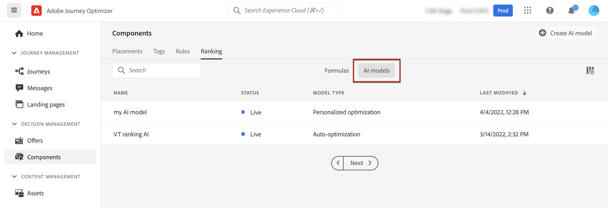

# AI-modellen maken {#ai-rankings}

[!DNL Journey Optimizer] laat u toe om **AI modellen** tot stand te brengen om aanbiedingen te rangschikken die op uw bedrijfsdoelstellingen worden gebaseerd.

>[!CAUTION]
>
>Om, AI modellen tot stand te brengen uit te geven of te schrappen, moet u **het Rangschikken van Strategieën** toestemming hebben leiden. [Meer informatie](../../administration/high-low-permissions.md#manage-ranking-strategies)

## Een AI-model maken {#create-ranking-strategy}

>[!CONTEXTUALHELP]
>id="ajo_decisioning_ai_model_metric"
>title="Optimalisatiemetrisch"
>abstract="[!DNL Journey Optimizer] rangschikt aanbiedingen die op het **worden gebaseerd omzettingspercentage** (het tarief van de Omzetting = Totaal aantal omzettingsgebeurtenissen/Totaal aantal impressiegebeurtenissen). De omzettingspercentage wordt berekend gebruikend twee types van metriek: **de gebeurtenissen van de Impressie** (aanbiedingen die worden getoond) en **de gebeurtenissen van de Omzetting** (aanbiedingen die in kliks via e-mail of Web) resulteren. Deze gebeurtenissen worden automatisch vastgelegd met de Web SDK of de Mobile SDK die is opgegeven."

Voer de volgende stappen uit om een AI-model te maken:

1. Maak een gegevensset waarin conversiegebeurtenissen worden verzameld. [&#x200B; leer hoe &#x200B;](../data-collection/create-dataset.md)

1. Open in het menu **[!UICONTROL Components]** het tabblad **[!UICONTROL Ranking]** en selecteer vervolgens **[!UICONTROL AI models]** .

   

   Alle tot nu toe gemaakte AI-modellen worden vermeld.

1. Klik op de knop **[!UICONTROL Create AI model]**.

1. Geef een unieke naam en een beschrijving voor het AI-model op en selecteer het type AI-model dat u wilt maken:

   * **[!UICONTROL Auto-optimization]** optimaliseert aanbiedingen op basis van de prestaties van eerdere aanbiedingen. [Meer informatie](auto-optimization-model.md)
   * **[!UICONTROL Personalized optimization]** optimaliseert en personaliseert aanbiedingen op basis van publiek en biedt prestaties. [Meer informatie](personalized-optimization-model.md)

   

   >[!NOTE]
   >
   >Het gedeelte **[!UICONTROL Optimization metric]** bevat informatie over de conversiegebeurtenis die door het AI-model wordt gebruikt om de rangorde van aanbiedingen te berekenen.
   >
   >[!DNL Journey Optimizer] rangschikt aanbiedingen die op het **worden gebaseerd omzettingspercentage** (het tarief van de Omzetting = Totaal aantal omzettingsgebeurtenissen/Totaal aantal impressiegebeurtenissen). De conversiesnelheid wordt berekend aan de hand van twee soorten meetwaarden:
   >* **de gebeurtenissen van de Indrukking** (aanbiedingen die worden getoond)
   >* **de gebeurtenissen van de Omzetting** (aanbiedingen die in kliks via e-mail of Web) resulteren.
   >
   >Deze gebeurtenissen worden automatisch vastgelegd met de Web SDK of de Mobile SDK die is opgegeven. Leer meer over dit in [&#x200B; het overzicht van SDK van het Web van Adobe Experience Platform &#x200B;](https://experienceleague.adobe.com/docs/experience-platform/edge/home.html?lang=nl-NL).

1. Selecteer de gegevensset(s) waar de conversie- en impressiefeedagen worden verzameld. Leer hoe te om dergelijke dataset in [&#x200B; tot stand te brengen deze sectie &#x200B;](../data-collection/create-dataset.md). <!--This dataset needs to be associated with a schema that must have the **[!UICONTROL Proposition Interactions]** field group (previously known as mixin) associated with it.-->

   

   >[!CAUTION]
   >
   >Alleen de gegevenssets die zijn gemaakt op basis van schema&#39;s die zijn gekoppeld aan de **[!UICONTROL Experience Event - Proposition Interactions]** -veldgroep (voorheen bekend als mixin), worden weergegeven in de vervolgkeuzelijst.

1. Als u een **[!UICONTROL Personalized optimization]** AI-model maakt, selecteert u het segment dat u wilt gebruiken om het AI-model te trainen.

   ➡️ [Ontdek deze functie in video](#video)

   

   >[!NOTE]
   >
   >U kunt maximaal vijf soorten publiek selecteren.

1. Sla het AI-model op en activeer het.

   

<!--At this point, you must have:

* created the AI model,
* defined which type of event you want to capture - offer displayed (impression) and/or offer clicked (conversion),
* and in which dataset you want to collect the event data.-->

Nu telkens als een aanbieding wordt getoond en/of geklikt, wilt u de overeenkomstige gebeurtenis automatisch worden gevangen door de **[!UICONTROL Experience Event - Proposition Interactions]** gebiedsgroep gebruikend het [&#x200B; Web SDK van Adobe Experience Platform &#x200B;](https://experienceleague.adobe.com/docs/experience-platform/edge/web-sdk-faq.html?lang=nl-NL#what-is-adobe-experience-platform-web-sdk%3F){target="_blank"} of Mobiele SDK.

Als u gebeurtenistypen wilt kunnen verzenden (weergegeven aanbod of aangeklikte aanbieding), moet u de juiste waarde voor elk gebeurtenistype instellen in een ervaringsgebeurtenis die naar Adobe Experience Platform wordt verzonden. [&#x200B; leer hoe &#x200B;](../data-collection/schema-requirement.md)

## Hoe kan ik-video {#video}

Leer hoe u een gepersonaliseerd optimalisatiemodel maakt en hoe u dit op een beslissing toepast.

>[!VIDEO](https://video.tv.adobe.com/v/3445957?quality=12&captions=dut)
