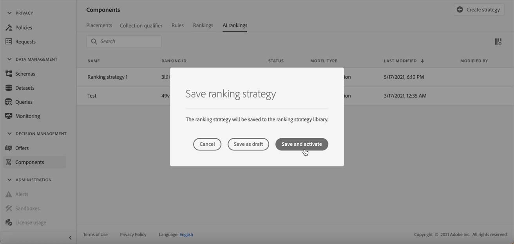

# AI-modellen maken {#ai-rankings}

[!DNL Journey Optimizer] biedt u de mogelijkheid om **AI-modellen** om aanbiedingen te rangschikken die op uw bedrijfsdoelstellingen worden gebaseerd.

>[!CAUTION]
>
>Als u AI-modellen wilt maken, bewerken of verwijderen, moet u beschikken over de **Rangestrategieën beheren** toestemming. [Meer informatie](../../administration/high-low-permissions.md#manage-ranking-strategies)

## Een AI-model maken {#create-ranking-strategy}

Voer de volgende stappen uit om een AI-model te maken:

1. In de **[!UICONTROL Components]** menu, opent u de **[!UICONTROL Ranking]** tab, dan selecteren **[!UICONTROL AI models]**.

   

   Alle tot nu toe gemaakte AI-modellen worden vermeld.

1. Klik op de knop **[!UICONTROL Create AI model]**.

1. Geef een unieke naam en een beschrijving op voor het AI-model.

   <!--* **[!UICONTROL Auto-optimization]** optimizes offers based on past offer performance. [Learn more](auto-optimization-model.md)
    * **[!UICONTROL Personalized]** optimizes and personalizes offers based on segments and offer performance. [Learn more](personalized-optimization-model.md)-->

   

   >[!NOTE]
   >
   >De **[!UICONTROL Optimization metric]** biedt informatie over de conversiegebeurtenis die door het AI-model wordt gebruikt om de rangorde van de aanbiedingen te berekenen.
   >
   >[!DNL Journey Optimizer] aanbiedingen op basis van de **omrekeningskoers** (Conversietarief = Totaal aantal conversiegebeurtenissen / Totaal aantal impressiegebeurtenissen). De conversiesnelheid wordt berekend aan de hand van twee soorten meetwaarden:
   >* **Impressiegebeurtenissen** (aanbiedingen die worden weergegeven)
   >* **Conversiegebeurtenissen** (aanbiedingen die resulteren in klikken via e-mail of web).

   >
   >Deze gebeurtenissen worden automatisch vastgelegd met de Web SDK of de Mobile SDK die is opgegeven. Meer informatie hierover vindt u in [Overzicht Adobe Experience Platform Web SDK](https://experienceleague.adobe.com/docs/experience-platform/edge/home.html?lang=en).

1. Selecteer de gegevensset(s) waar de conversie- en impressiefeedagen worden verzameld. Leer hoe u een dergelijke gegevensset maakt in [deze sectie](#create-dataset). <!--This dataset needs to be associated with a schema that must have the **[!UICONTROL Proposition Interactions]** field group (previously known as mixin) associated with it.-->

   

   >[!CAUTION]
   >
   >Alleen de gegevenssets die zijn gemaakt op basis van schema&#39;s die zijn gekoppeld aan de **[!UICONTROL Experience Event - Proposition Interactions]** veldgroep (voorheen bekend als mixin) wordt weergegeven in de vervolgkeuzelijst.

<!--1. If you are creating a **[!UICONTROL Personalization]** AI model, select the segment(s) to use to train the AI model.

    

    >[!NOTE]
    >
    >You can select up to 5 segments.-->

1. Sla het AI-model op en activeer het.

   
