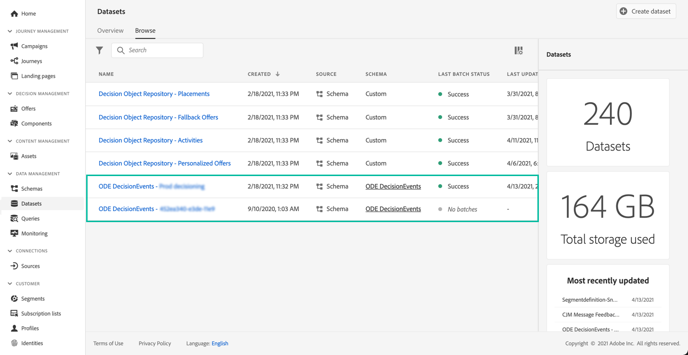

# Aan de slag met besluitvormingsgebeurtenissen {#monitor-offer-events}

Telkens wanneer het Beslissingsbeheer een besluit neemt voor een bepaald profiel, wordt informatie over deze gebeurtenissen automatisch naar Adobe Experience Platform verzonden.

Hierdoor kunt u meer inzicht krijgen in uw beslissingen, bijvoorbeeld om te weten welk aanbod aan een bepaald profiel is gepresenteerd. U kunt deze gegevens uitvoeren om hen in uw eigen rapporterend systeem, of hefboomwerking de Dienst van de Vraag van Adobe Experience Platform  in combinatie met andere hulpmiddelen voor verbeterde analyse en rapporteringsdoeleinden te analyseren.

## Belangrijkste informatie beschikbaar in gegevensreeksen {#key-information}

Elke gebeurtenis die wordt verzonden wanneer een beslissing wordt genomen, bevat vier belangrijke gegevenspunten die u voor analyse- en rapportagedoeleinden kunt gebruiken:

* **[!UICONTROL Fallback]**: naam en ID van de alternatieve aanbieding als er geen persoonlijke aanbieding is geselecteerd;
* **[!UICONTROL Placement]**: naam, id en kanaal van de plaatsing die voor de aanbieding wordt gebruikt;
* **[!UICONTROL Selections]**: naam en id van de voor het profiel geselecteerde aanbieding;
* **[!UICONTROL Activity]**: naam en id van de beslissing.

Daarnaast kunt u ook de **[!UICONTROL identityMap]** en **[!UICONTROL Timestamp]**-velden gebruiken om informatie op te halen over het profiel en het tijdstip waarop de aanbieding is geleverd.

Raadpleeg voor meer informatie over alle XDM-velden die bij elke beslissing worden verzonden, [deze sectie](xdm-fields.md).

## Gegevensbestanden voor toegang {#access-datasets}

De datasets met gebeurtenissen voor Beslissingsbeheer zijn toegankelijk via het menu Adobe Experience Platform **[!UICONTROL Datasets]** . Eén dataset wordt automatisch gemaakt bij het invullen van elk van uw instanties.

Deze datasets zijn gebaseerd op het **[!UICONTROL ODE DecisionEvents]** schema, dat alle gebieden XDM bevat die worden vereist om informatie van Beslissingsbeheer naar Adobe Experience Platform te verzenden.

>[!NOTE]
>
>Merk op dat de datasets van ODE DecisionEvents **niet-profieldatasets** zijn, wat betekent dat ze niet in Experience Platform kunnen worden opgenomen voor gebruik door het realtimeklantprofiel.
