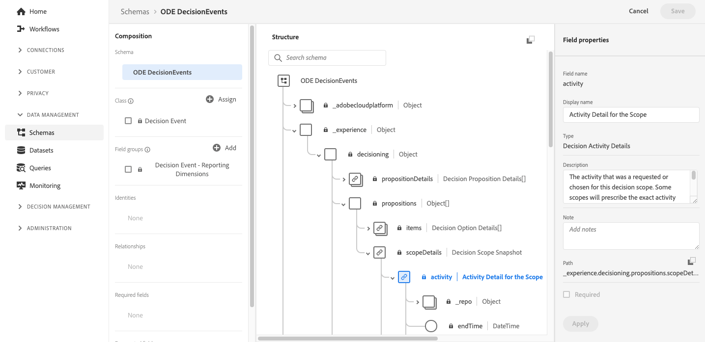

# Toegang tot gebeurtenissen van XDM-velden {#decisioningevents-xdm-schema}

>[!TIP]
>
>Het besluit, de nieuwe beslissingsmogelijkheden van [!DNL Adobe Journey Optimizer], is nu beschikbaar via de op code gebaseerde ervaring en e-mailkanalen! [Meer informatie](../../experience-decisioning/gs-experience-decisioning.md)

U kunt tot het schema DecisioningEvents XDM van DecisioningEvents direct van een dataset toegang hebben die de gebeurtenissen van het Beheer van het Besluit bevat.

Het schema bevat alle velden die vereist zijn om informatie van Beslissingsbeheer naar Adobe Experience Platform te verzenden.

Voor meer informatie over een specifiek veld selecteert u het veld om een informatievenster met de eigenschappen van het veld weer te geven.

Gedetailleerde informatie over het werken met XDM-schema&#39;s en -velden is beschikbaar in de documentatie van het Gegevenservaringsmodel.

* [XDM-systeemoverzicht](https://experienceleague.adobe.com/docs/experience-platform/xdm/home.html?lang=nl)
* [XDM-bronnen verkennen](https://experienceleague.adobe.com/docs/experience-platform/xdm/ui/explore.html?lang=nl)
