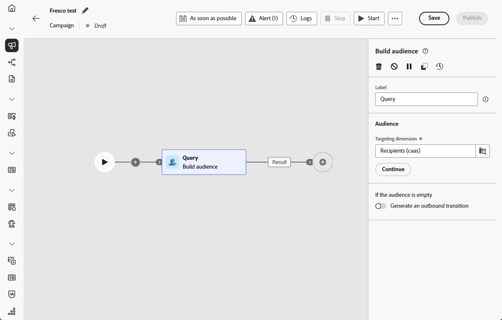

# publiek opbouwen {#build-audience}

>[!CONTEXTUALHELP]
>id="ajo_orchestration_build_audience"
>title="Activiteit voor publiek opbouwen"
>abstract="**bouwt publieksactiviteit** toestaat u om het publiek te bepalen dat de Geordende campagne zal ingaan. Wanneer het verzenden van berichten in de context van een Geordende campagne, wordt het berichtpubliek niet bepaald in de kanaalactiviteit, maar in a **bouwt publieksactiviteit**."

Als een markeerteken kunt u complexe publiekssegmenten maken via een intuïtieve interface, zodat u gebruikers kunt richten op basis van een groot aantal criteria en gedragingen om uw campagnes effectiever op maat te maken.

Gebruik hiervoor de **[!UICONTROL Build audience]** doelactiviteit. Deze activiteit bepaalt het publiek dat de Geordende campagne ingaat. Wanneer u berichten verzendt als onderdeel van een geordende campagne, wordt het publiek gedefinieerd in de **[!UICONTROL Build audience]** -activiteit, niet in de geordende campagne.

## Vorm de het publieksactiviteit van de Bouwstijl {#build-audience-configuration}

>[!CONTEXTUALHELP]
>id="ajo_orchestration_build_audience_audienceselector"
>title="Doelgroep"
>abstract="Selecteer uw publiek, de zelfde manier u een publiek gebruikt wanneer het ontwerpen van een nieuwe levering."

Voer de volgende stappen uit om de **[!UICONTROL Build audience]** -activiteit te configureren:

1. Voeg een **[!UICONTROL Build audience]** activiteit toe.

   

1. Definieer een **[!UICONTROL Label]** .

1. Configureer uw publiek door de stappen uit te voeren die in de onderstaande tabbladen worden beschreven.

1. Kies de **[!UICONTROL Targeting dimension]**. Met de doeldimensie kunt u de doelgroep van de actie definiëren: ontvangers, begunstigden van contracten, exploitant, abonnees, enz. Standaard is het doel geselecteerd bij de ontvangers.

1. Klik op **[!UICONTROL Continue]**.

1. Gebruik de regelbouwer om uw vraag te bepalen. [&#x200B; leer meer over de Bouwer van de Regel in deze sectie &#x200B;](../orchestrated-rule-builder.md)

1. Geef op of een uitgaande overgang moet worden gegenereerd wanneer het publiek leeg is.

## Voorbeelden{#build-audience-examples}

Hier is een voorbeeld van een geordende campagne met twee **[!UICONTROL Build audience]** -activiteiten. De eerste doelen zijn profielen met items in hun winkelwagentje, gevolgd door een e-maillevering. De tweede richt profielen met een verlanglijst, gevolgd door een levering van SMS.

