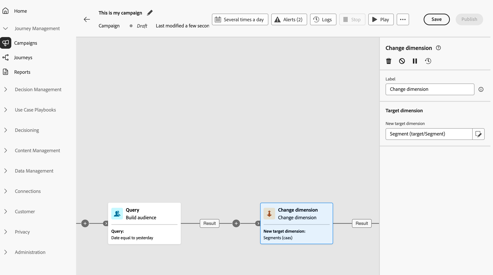

# Dimensie wijzigen {#change-dimension}

>[!CONTEXTUALHELP]
>id="ajo_orchestration_dimension_complement"
>title="Een complement genereren"
>abstract="U kunt een extra uitgaande overgang met de resterende bevolking produceren, die als duplicaat werd uitgesloten. Om dit te doen, op **van een knevel voorzien produceer complement** optie"

>[!CONTEXTUALHELP]
>id="ajo_orchestration_change_dimension"
>title="Dimensieactiviteit wijzigen"
>abstract="Met deze activiteit kunt u de doeldimensie wijzigen terwijl u een publiek maakt. Het verschuift de as afhankelijk van het gegevensmalplaatje en de inputdimensie. U kunt bijvoorbeeld van de dimensie &quot;contracten&quot; naar de dimensie &quot;clients&quot; schakelen."

+++ Inhoudsopgave

| Welkom bij georkestreerde campagnes | Start uw eerste georkestreerde campagne | De database opvragen | Gecontroleerde campagnes |
|---|---|---|---|
| [ worden begonnen met georkestreerde campagnes ](../gs-orchestrated-campaigns.md)  [ stappen van de Configuratie ](../configuration-steps.md)  [ Zeer belangrijke stappen voor georkestreerde campagneverwezenlijking ](../gs-campaign-creation.md) | [ creeer een georkestreerde campagne ](../create-orchestrated-campaign.md)  [ Orchestrate activiteiten ](../orchestrate-activities.md)   [ Begin en controleer de campagne ](../start-monitor-campaigns.md)  [ Meldend ](../reporting-campaigns.md) | [ Werk met de Vraag Modeler ](../orchestrated-rule-builder.md)  [ bouwt uw eerste vraag ](../build-query.md)  [ uitdrukkingen ](../edit-expressions.md) uit | [ wordt begonnen met activiteiten ](about-activities.md)   Activiteiten: [ en-sluit zich aan ](and-join.md) - [ bouwt publiek ](build-audience.md) - **[dimensie van de Verandering](change-dimension.md)** - [ combineert ](combine.md) - [ Deduplicatie ](deduplication.md) - [ Verrijking ](enrichment.md) - [ Fork ](fork.md) opnieuw verzoening [ - ](reconciliation.md) Gesplitst [ - ](split.md) wacht  |

{style="table-layout:fixed"}

+++

 

Als tellers, kunt u publiek verfijnen richtend door van één gegevensentiteit aan een andere verbonden entiteit binnen een georkestreerde campagne over te schakelen. Op deze manier kunt u van gebruikersprofielen naar specifieke acties, zoals aankopen, boekingen of andere interacties, gaan.

Hiervoor gebruikt u de **[!UICONTROL Change dimension]** -activiteit. Hiermee kunt u de doeldimensie tijdens de georkestreerde campagne wijzigen op basis van de structuur van uw gegevensmodel en de invoerdimensie.

<!--
>[!IMPORTANT]
>
>Please note that the **[!UICONTROL Change Dimension]** and **[!UICONTROL Change Data source]** activities should not be added in one row. If you need to use both activities consecutively, make sure you include an **[!UICONTROL Enrichement]** activity in between them. This ensures proper execution and prevents potential conflicts or errors.-->

## Vorm de de afmetingsactiviteit van de Verandering {#configure}

Voer de volgende stappen uit om de **[!UICONTROL Change dimension]** -activiteit te configureren:

1. Voeg een **[!UICONTROL Change dimension]** activiteit aan uw georkestreerde campagne toe.

   

1. Definieer de **[!UICONTROL New target dimension]** . Tijdens het wijzigen van de afmetingen worden alle records bewaard.

1. Voer de georkestreerde campagne uit om het resultaat te bekijken. Vergelijk de gegevens in de lijsten vóór en na de activiteit van de veranderingsdimensie, en vergelijk de structuur van de georkestreerde campagnetabellen.

## Voorbeeld {#example}

Bij dit gebruik moet een SMS-bericht worden verzonden naar profielen die de afgelopen maand een verlanglijst hebben gemaakt.

Begin met een **[!UICONTROL Build audience]** -activiteit waarbij u de **[!UICONTROL Wishlist]** -dimensie gebruikt om alle relevante wenslijsten te selecteren.

Voeg vervolgens een **[!UICONTROL Change dimension]** -activiteit in om de doeldimensie te veranderen van **[!UICONTROL Wishlist]** in *** [!UICONTROL Recipient] **. Hierdoor kan de georkestreerde campagne het SMS verzenden naar de profielen die aan die verlanglijsten zijn gekoppeld.

