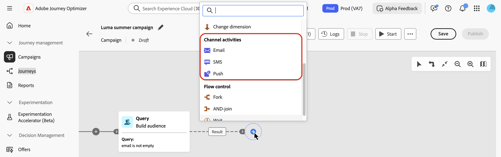
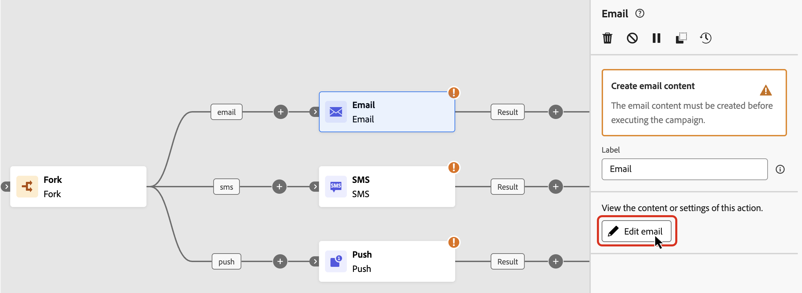
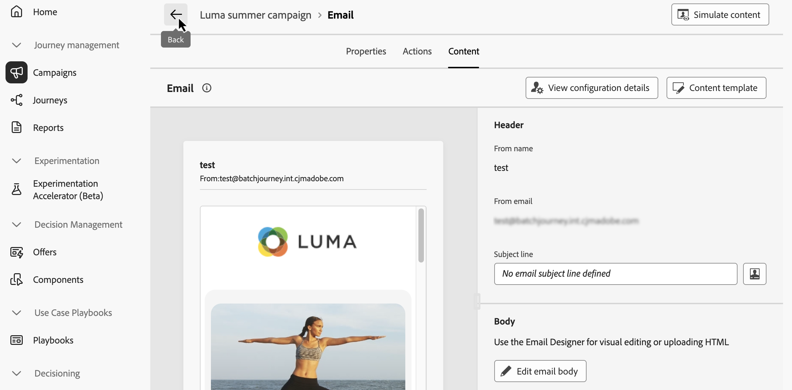
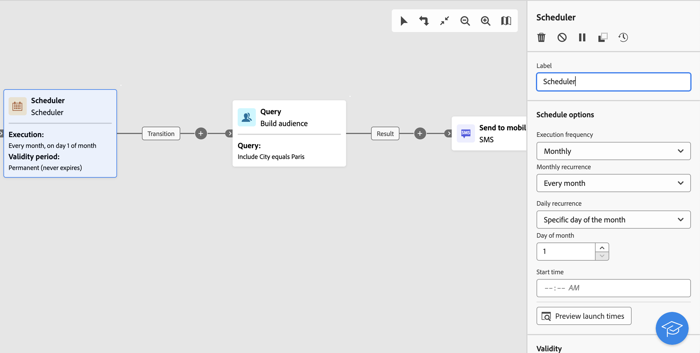

# Kanaalactiviteiten {#channel}

>[!CONTEXTUALHELP]
>id="ajo_orchestration_email"
>title="E-mailactiviteit"
>abstract="Met de e-mailactiviteit kunt u e-mails verzenden binnen uw geordende campagne, voor zowel eenmalige als terugkerende berichten. Hiermee wordt het proces geautomatiseerd waarbij e-mails worden verzonden naar een doel dat is berekend binnen dezelfde geordende campagne. U kunt kanaalactiviteiten combineren tot een uit meerdere stappen bestaand campagnecanvas om kanaalcampagnes te maken die acties op klantengedrag en gegevens kunnen teweegbrengen."

>[!CONTEXTUALHELP]
>id="ajo_orchestration_sms"
>title="SMS-activiteit"
>abstract="Met de SMS-activiteit kunt u SMS verzenden binnen uw geordende campagne voor zowel eenmalige als terugkerende berichten. Het dient om het proces te automatiseren om SMS naar een doel te verzenden dat binnen de zelfde Geordende campagne wordt berekend. U kunt kanaalactiviteiten combineren tot het campagnecanvas met meerdere stappen om kanaalcampagnes te maken die acties kunnen activeren op basis van het gedrag en de gegevens van de klant."

>[!CONTEXTUALHELP]
>id="ajo_orchestration_push"
>title="Push-activiteit"
>abstract="Met de pushactiviteit kunt u pushmeldingen verzenden als onderdeel van uw geordende campagne. Het laat de levering van zowel eenmalige als terugkomende Geordende campagnes toe, die de verzending van de Duw berichten aan een vooraf bepaald doel binnen de zelfde Geordende campagne automatiseren. U kunt kanaalactiviteiten in het campagnecanvas combineren om kanaalcampagnes te creëren die acties kunnen teweegbrengen die op klantengedrag en gegevens worden gebaseerd."

<!--
UNUSED IDs in BJ

>[!CONTEXTUALHELP]
>id="ajo_orchestration_push_ios"
>title="Push iOS activity"
>abstract="The Push iOS activity lets you send iOS Push notifications as part of your Orchestrated campaign. It enables the delivery of both one-time and recurring Orchestrated campaigns, automating the sending of iOS Push notifications to a predefined target within the same workflow. You can combine channel activities into the campaign canvas to create cross-channel campaigns that can trigger actions based on customer behavior and data."

>[!CONTEXTUALHELP]
>id="ajo_orchestration_push_android"
>title="Push Android activity"
>abstract="The Push Android activity lets you send Android Push notifications as part of your Orchestrated campaign. It enables the delivery of both one-time and recurring messages, automating the sending of Android Push notifications to a predefined target within the same Orchestrated campaign. You can combine channel activities into the Orchestrated campaign canvas to create cross-channel campaigns that can trigger actions based on customer behavior and data."

-->

>[!CONTEXTUALHELP]
>id="ajo_orchestration_directmail"
>title="Directe post"
>abstract="De direct-mailactiviteit vergemakkelijkt direct mail verzenden binnen uw Geordende campagne, voor zowel eenmalige als terugkomende berichten. Hiermee wordt het genereren van het extractiebestand geautomatiseerd dat is vereist door directe-mailproviders. U kunt kanaalactiviteiten in het Geordende campagnecanvas combineren om kanaalcampagnes tot stand te brengen die acties kunnen teweegbrengen die op klantengedrag en gegevens worden gebaseerd."

Met [!DNL Adobe Journey Optimizer] kunt u marketingcampagnes automatiseren en uitvoeren via verschillende kanalen: e-mail, SMS en pushberichten. U kunt deze kanaalactiviteiten combineren tot het campagnecanvas om via meerdere kanalen geordende campagnes te maken. Deze campagnes kunnen acties teweegbrengen die op klantengedrag en gegevens worden gebaseerd.

Bijvoorbeeld:

* Verzend een welkomstreeks via e-mail, SMS en push.
* Na aankoop een e-mailvervolgbericht verzenden.
* Verzend gepersonaliseerde verjaardagsgroeten via SMS.

Door kanaalactiviteiten te gebruiken, kunt u uitvoerige en gepersonaliseerde campagnes tot stand brengen die klanten over veelvoudige touchpoints en aandrijvingsomzettingen in dienst nemen.

>[!CAUTION]
>
>Alleen SMS-, push- en e-mailkanalen worden ondersteund in geordende campagnes.

## Een kanaalactiviteit toevoegen en de eigenschappen ervan definiëren {#add}

>[!PREREQUISITES]
>
>Alvorens een kanaalactiviteit toe te voegen, bepaal het doelpubliek gebruikend a [ bouwt publiek ](build-audience.md) of a [ gelezen publiek ](read-audience.md) activiteit.

1. Voeg een kanaalactiviteit toe aan het canvas. De beschikbare kanaalactiviteiten zijn **[!UICONTROL Email]** , **[!UICONTROL SMS]** en **[!UICONTROL Push]** .

   

1. Selecteer de activiteit en klik op **[!UICONTROL Edit email]** , **[!UICONTROL Edit SMS]** of **[!UICONTROL Edit Push]** afhankelijk van het gekozen kanaal.

   

1. Voer op het tabblad **[!UICONTROL Properties]** een beschrijving in en schakel vervolgens over naar het tabblad **[!UICONTROL Actions]** om de activiteit te configureren.

## De kanaalconfiguratie en -instellingen instellen {#configuration}

Gebruik het tabblad **[!UICONTROL Actions]** om een kanaalconfiguratie voor uw bericht te selecteren en aanvullende instellingen te configureren, zoals het bijhouden van inhoud, het experimenteren met inhoud of meertalige inhoud.

1. **selecteer een kanaalconfiguratie**

   Een configuratie wordt bepaald door de Beheerder van het a [ Systeem ](../../start/path/administrator.md). Het bevat alle technische parameters voor het verzenden van het bericht, zoals headerparameters, subdomein, mobiele apps, enzovoort. [ leer hoe te de configuraties van het opstellingskanaal ](../../configuration/channel-surfaces.md)

    toont

1. **pas het begrenzen van regels** toe

   Selecteer in de vervolgkeuzelijst **[!UICONTROL Rule set]** een kanaalregel die is ingesteld om de bijschilderingsregels toe te passen op uw campagne. De reeksen van de kanaalregel van hefboomwerking staan u toe om frequentie het begrenzen door communicatie type te plaatsen om het overbelasten van klanten met gelijkaardige berichten te verhinderen. [ leer hoe te met regelreeksen ](../../conflict-prioritization/rule-sets.md) werken

1. **Overeenkomst van het Spoor** (E-mail en SMS)

   In de sectie **[!UICONTROL Action tracking]** kunt u bijhouden hoe de ontvangers op uw e-mail- of SMS-berichten reageren. De resultaten van het bijhouden van de campagne zijn toegankelijk vanuit het campagnerapport nadat de campagne is uitgevoerd. [ leer meer over campagnerapporten ](../../reports/campaign-global-report-cja.md)

1. **laat Snelle leveringswijze** toe (Duw)

   De snelle leveringswijze is een [!DNL Journey Optimizer] toe:voegen-op die zeer snelle pushbericht toestaat die in grote volumes door campagnes verzenden. De snelle levering wordt gebruikt wanneer de vertraging in berichtlevering zaken-kritiek is. U wilt bijvoorbeeld een dringende pushwaarschuwing verzenden op mobiele telefoons, zoals het doorgeven van nieuws aan gebruikers die uw nieuwszender-app hebben geïnstalleerd. Leer hoe te om Snelle leveringswijze voor de Duw berichten [ op deze pagina ](../../push/create-push.md#rapid-delivery) toe te laten.

   Voor meer informatie over prestaties wanneer het gebruiken van Snelle leveringswijze, verwijs naar [ het productbeschrijving van Adobe Journey Optimizer ](https://helpx.adobe.com/legal/product-descriptions/adobe-journey-optimizer.html){target="_blank"}.

1. **creeer een inhoudexperiment**

   Gebruik de sectie **[!UICONTROL Content experiment]** om meerdere leveringsbehandelingen te definiëren om te meten welke het beste presteert voor uw doelgroep. Klik de **[!UICONTROL Create experiment]** knoop dan de stappen volgen die in deze sectie worden gedetailleerd: [ creeer een inhoudexperiment ](../../content-management/content-experiment.md).

1. **voeg meertalige inhoud** toe

   Gebruik de sectie **[!UICONTROL Languages]** om inhoud in meerdere talen binnen uw campagne te maken. Klik hiertoe op de knop **[!UICONTROL Add languages]** en selecteer de gewenste **[!UICONTROL Language settings]** . De gedetailleerde informatie over hoe te opstelling en gebruik meertalige mogelijkheden zijn beschikbaar in deze sectie: [ krijgt begonnen met meertalige inhoud ](../../content-management/multilingual-gs.md).

   

Wanneer uw kanaalactiviteit is gevormd, selecteer het **[!UICONTROL Content]** lusje om zijn inhoud te bepalen.

## De inhoud definiëren {#content}

Schakel over naar het tabblad **[!UICONTROL Content]** om uw bericht te maken. De processtappen zijn afhankelijk van het geselecteerde kanaal. Leer gedetailleerde stappen om uw berichtinhoud op de volgende pagina&#39;s tot stand te brengen.

<table style="table-layout:fixed"><tr style="border: 0; text-align: center;" >
<td> <a href="../../email/create-email.md"><strong>Een e-mail maken</strong></a></td>
<td> <a href="../../sms/create-sms.md"><strong>SMS maken</strong></a></td>
<td><a href="../../push/create-push.md"><strong>Een pushmelding maken</strong></a></td>
</tr></table>

## Aanpassing toevoegen

Personalization in geordende campagnes werkt op dezelfde manier als andere **[!UICONTROL Journey Optimizer]** campagnes of reizen. Er zijn echter enkele belangrijke verschillen die specifiek zijn voor het georkestreerde canvas.

Wanneer u tot de verpersoonlijkingsredacteur van een Geordende campagne toegang hebt, bevatten twee belangrijkste omslagen eigenschappen beschikbaar voor verpersoonlijking die hieronder wordt gedetailleerd.

* **[!UICONTROL Profile attributes]**

  Deze map bevat alle profielgerelateerde gegevens van [!DNL Adobe Experience Platform] . Dit zijn standaardkenmerken zoals naam, e-mailadres, locatie of andere kenmerken die in het gebruikersprofiel zijn vastgelegd.

* **[!UICONTROL Target attributes]** (specifiek voor geordende campagnes)

  Deze map is uniek voor geordende campagnes. Deze bevat kenmerken die rechtstreeks binnen het canvas van de campagne worden berekend. Deze bevat twee submappen:

   * **`<Targeting dimension>`** (bijv. &quot;Ontvangers&quot;, &quot;Aankopen&quot;): bevat alle kenmerken die betrekking hebben op de dimensie waarop uw campagne betrekking heeft.

   * **`Enrichment`**: neemt gegevens die via **[!UICONTROL Enrichment]** -activiteiten zijn toegevoegd, op in uw canvas. Dit staat u toe om berichten te personaliseren die op externe datasets of extra logica worden gebaseerd die tijdens orchestratie worden opgenomen. [ leer hoe te om een activiteit van de Verrijking te gebruiken ](../activities/enrichment.md)

Voor een gedetailleerd overzicht van hoe te om de verpersoonlijkingsredacteur te gebruiken, verwijs naar [ begonnen wordt met verpersoonlijking ](../../personalization/personalize.md).

## Uw inhoud controleren en testen

Zodra de inhoud is gemaakt, gebruikt u de knop **[!UICONTROL Simulate Content]** om een voorvertoning van uw inhoud weer te geven en deze te testen met testprofielen of voorbeeldinvoergegevens die vanuit een CSV-/JSON-bestand zijn geüpload of handmatig zijn toegevoegd. [Meer informatie](../../content-management/preview-test.md)

## Volgende stappen {#next}

Wanneer de berichtinhoud klaar is, navigeert u met de pijl **[!UICONTROL Back]** terug naar uw geordende campagne. Vervolgens kunt u de activiteiten op het canvas ordenen en de campagne publiceren om de berichten te verzenden. [ leren hoe te om Geordende campagnes te beginnen en te controleren ](../start-monitor-campaigns.md)

 toont

<!--
## Examples {#cross-channel-workflow-sample}

Here is a cross-channel Orchestrated campaign example with a segmentation and two deliveries. The Orchestrated campaign targets all customers who live in Paris and who are interested in coffee machines. Among this population, an email is sent to the regular customers and an SMS is sent to the VIP clients.

<!--
description, which use case you can perform (common other activities that you can link before of after the activity)

how to add and configure the activity

example of a configured activity within a workflow
The Email delivery activity allows you to configure the sending an email in a workflow. 

-->

<!--You can also create a recurring Orchestrated campaign to send a personalized SMS every first day of the month at 8 PM to all customers living in Paris.

-->

<!-- Scheduled emails available?

This can be a single send email and sent just once, or it can be a recurring email.
* Single send emails are standard emails, sent once.
* Recurring emails allow you to send the same email multiple times to different targets over a defined period. You can aggregate the deliveries per period in order to get reports that correspond to your needs.

When linked to a scheduler, you can define recurring emails.
Email recipients are defined upstream of the activity in the same workflow, via an Audience targeting activity.

-->

<!--The message preparation is triggered according to the workflow execution parameters. From the message dashboard, you can select whether to request or not a manual confirmation to send the message (required by default). You can start the workflow manually or place a scheduler activity in the workflow to automate execution.-->

