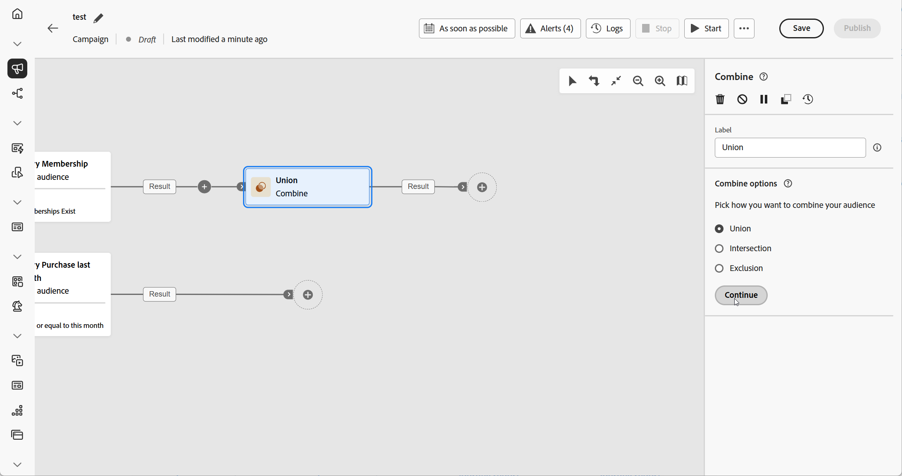
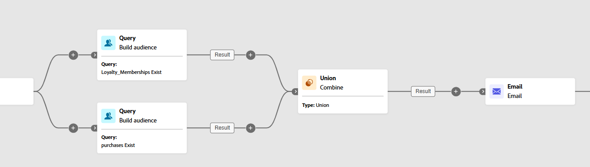

# Combineren {#combine}

>[!CONTEXTUALHELP]
>id="ajo_orchestration_combine"
>title="Combineer activiteit"
>abstract="**combineert** activiteit staat u toe om segmentatie op uw binnenkomende bevolking uit te voeren. U kunt dus meerdere populaties combineren, een deel ervan uitsluiten of gegevens alleen gemeenschappelijk houden voor meerdere doelen."

+++ Inhoudsopgave

| Welkom bij georkestreerde campagnes | Start uw eerste georkestreerde campagne | De database opvragen | Gecontroleerde campagnes |
|---|---|---|---|
| [ wordt begonnen met georkestreerde campagnes ](../gs-orchestrated-campaigns.md)   creeer en beheer relationele Schema&#39;s en Datasets:  <ul><li>[ worden begonnen met Schema&#39;s en Datasets ](../gs-schemas.md)</li><li>[ Handmatig schema ](../manual-schema.md)</li><li>[ het uploadschema van het Dossier ](../file-upload-schema.md)</li><li>[ Ingest gegevens ](../ingest-data.md)</li></ul>[ toegang en beheer georkestreerde campagnes ](../access-manage-orchestrated-campaigns.md) | [ Zeer belangrijke stappen om een georkestreerde campagne ](../gs-campaign-creation.md)  [ tot stand te brengen en te plannen de campagne ](../create-orchestrated-campaign.md)  [ activiteiten van het Orchestrate ](../orchestrate-activities.md)  [ Begin en de campagne ](../start-monitor-campaigns.md)  [ Meldend ](../reporting-campaigns.md) te controleren | [ Werk met de regelbouwer ](../orchestrated-rule-builder.md)  [ bouwt uw eerste vraag ](../build-query.md)  [ uit geeft uitdrukkingen ](../edit-expressions.md)  [ opnieuw op ](../retarget.md) | [ wordt begonnen met activiteiten ](about-activities.md)   Activiteiten: [ en-sluit zich aan ](and-join.md) - [ bouwt publiek ](build-audience.md) - [ dimensie van de Verandering ](change-dimension.md) - [ de activiteiten van het Kanaal ](channels.md) - <b>[ combineren ](combine.md)</b> - [ Deduplicatie ](deduplication.md) - [ Verrijking ](enrichment.md) Formeel k [ - ](fork.md) Verzoening [ - ](reconciliation.md) sparen publiek [ - ](save-audience.md) Gesplitst [ - ](split.md) wacht  |

{style="table-layout:fixed"}

+++

 

>[!BEGINSHADEBOX]

 

De inhoud op deze pagina is niet definitief en kan worden gewijzigd.

>[!ENDSHADEBOX]

De **[!UICONTROL Combine]** activiteit is een type van **[!UICONTROL Targeting]** activiteit die u toelaat om uw binnenkomende bevolking effectief te segmenteren. Hiermee kunt u meerdere populaties samenvoegen, specifieke segmenten uitsluiten of alleen de gegevens behouden die over verschillende doelen worden gedeeld.

De volgende segmentatieopties zijn beschikbaar:

* **[!UICONTROL Union]** : voegt de resultaten van meerdere activiteiten samen tot één gezamenlijk doel.

* **[!UICONTROL Intersection]**: behoudt alleen de elementen die gemeenschappelijk zijn voor alle binnenkomende populaties.

* **[!UICONTROL Exclusion]**: verwijdert elementen uit één populatie op basis van opgegeven criteria.

## De combinatieactiviteit configureren {#combine-configuration}

>[!CONTEXTUALHELP]
>id="ajo_orchestration_intersection_merging_options"
>title="Samenvoegopties voor doorsnede"
>abstract="Met de doorsnede kunt u alleen de elementen behouden die gemeenschappelijk zijn voor de verschillende binnenkomende populaties in de activiteit. Controleer in de sectie Sets to join alle vorige activiteiten waaraan u wilt deelnemen."

>[!CONTEXTUALHELP]
>id="ajo_orchestration_exclusion_merging_options"
>title="Samenvoegopties voor uitsluiting"
>abstract="Met deze uitsluiting kunt u elementen op basis van bepaalde criteria uitsluiten van één populatie. Controleer in de sectie Sets to join alle vorige activiteiten waaraan u wilt deelnemen."

>[!CONTEXTUALHELP]
>id="ajo_orchestration_combine_options"
>title="Selecteer het segmentatietype"
>abstract="Selecteer hoe u het publiek wilt combineren. De **Unie** staat u toe om het resultaat van veelvoudige activiteiten in één enkel doel te hergroeperen. **Intersection** staat u toe om slechts de elementen gemeenschappelijk voor de verschillende binnenkomende populaties in de activiteit te houden. De **Uitsluiting** staat u toe om elementen van één bevolking volgens bepaalde criteria uit te sluiten. "

Voer de volgende algemene stappen uit om de **[!UICONTROL Combine]** -activiteit te configureren:

1. Voeg meerdere activiteiten, zoals **[!UICONTROL Build audience]** -activiteiten, toe om ten minste twee verschillende uitvoeringstakken te vormen.
1. Voeg een **[!UICONTROL Combine]** activiteit aan om het even welke vorige takken toe.
1. Selecteer het segmentatietype: [ unie ](#union), [ intersection ](#intersection) of [ uitsluiting ](#exclusion).
1. Klik op **[!UICONTROL Continue]**.
1. Controleer in de sectie **[!UICONTROL Sets to join]** alle vorige activiteiten waaraan u wilt deelnemen.

## Samenvoegen {#combine-union}

>[!CONTEXTUALHELP]
>id="ajo_orchestration_combine_reconciliation"
>title="Afstemmingsopties"
>abstract="Selecteer het **Type van Verzoening** om te bepalen hoe te om duplicaten te behandelen. Door gebrek, wordt de **optie van Sleutels** geactiveerd, betekenend dat de activiteit slechts één element houdt wanneer de elementen van de verschillende binnenkomende overgangen de zelfde sleutel hebben. Gebruik de **selectie van A kolommen** optie om de lijst van kolommen te bepalen waarop de gegevensverzoening wordt toegepast."

Binnen de **[!UICONTROL Combine]** -activiteit kunt u een **[!UICONTROL Union]** configureren door een **[!UICONTROL Reconciliation type]** te selecteren om te bepalen hoe dubbele records worden beheerd:

* **[!UICONTROL Keys only]** (standaardwaarde): behoudt één record wanneer meerdere binnenkomende overgangen dezelfde sleutel delen. Deze optie is alleen van toepassing wanneer de binnenkomende populaties homogeen zijn.

* **[!UICONTROL A selection of columns]**: hiermee kunt u opgeven welke kolommen worden gebruikt voor het afstemmen van gegevens. Selecteer **[!UICONTROL Add attribute]**.

In het volgende voorbeeld, wordt a **[!UICONTROL Combine]** activiteit gebruikt met a **[!UICONTROL Union]** om de resultaten van twee vragen, **Loyalty Leden** en **Aankopers** samen te voegen, in één enkel, groter publiek dat alle profielen van beide segmenten omvat.

## Doorsnede {#combine-intersection}

>[!CONTEXTUALHELP]
>id="ajo_orchestration_intersection_reconciliation_options"
>title="Afstemmingsopties voor doorsnede"
>abstract="Selecteer het **Type van Verzoening** om te bepalen hoe te om duplicaten te behandelen. Door gebrek, wordt de **optie van Sleutels** geactiveerd, betekenend dat de activiteit slechts één element houdt wanneer de elementen van de verschillende binnenkomende overgangen de zelfde sleutel hebben. Gebruik de **selectie van A kolommen** optie om de lijst van kolommen te bepalen waarop de gegevensverzoening wordt toegepast."

In de **[!UICONTROL Combine]** -activiteit kunt u een **[!UICONTROL Intersection]** configureren. Hiervoor moet u de volgende extra stappen volgen:

1. Selecteer **[!UICONTROL Reconciliation type]** om te bepalen hoe duplicaten worden verwerkt:

   * **[!UICONTROL Keys only]** (standaardwaarde): behoudt één record wanneer meerdere binnenkomende overgangen dezelfde sleutel delen. Deze optie is alleen van toepassing wanneer de binnenkomende populaties homogeen zijn.

   * **[!UICONTROL A selection of columns]**: hiermee kunt u opgeven welke kolommen worden gebruikt voor het afstemmen van gegevens. Selecteer **[!UICONTROL Add attribute]**.

1. Schakel **[!UICONTROL Generate completement]** in als u de resterende populatie wilt verwerken. Het complement omvat de samenvoeging van alle binnenkomende activiteitsresultaten, met uitzondering van de doorsnede. Een extra uitgaande overgang wordt toegevoegd aan de activiteit.

Het volgende voorbeeld illustreert het gebruik van **[!UICONTROL Intersection]** tussen twee vraagactiviteiten. Het wordt gebruikt om profielen te identificeren die **Leden van de Loyalty** zijn en een aankoop binnen de laatste maand hebben gemaakt.

## Uitsluiting {#combine-exclusion}

>[!CONTEXTUALHELP]
>id="ajo_orchestration_exclusion_options"
>title="Uitsluitingsregels"
>abstract="Indien nodig, kunt u binnenkomende lijsten manipuleren. Om een doel van een andere dimensie uit te sluiten, moet dit doel worden teruggebracht naar dezelfde doeldimensie als het hoofddoel. Om dit te doen, voegt de klik een regel in de sectie van de Regels van de Uitsluiting toe en specificeert de voorwaarden van de afmetingsverandering. Afstemming van gegevens vindt plaats via een attribuut of een join-functie."

>[!CONTEXTUALHELP]
>id="ajo_orchestration_combine_sets"
>title="Te combineren sets selecteren"
>abstract="In de **Reeksen om zich bij** sectie aan te sluiten, selecteer de **Primaire reeks** van de binnenkomende overgangen. Dit is de set waaruit elementen worden uitgesloten. De andere sets komen overeen met de elementen voordat deze worden uitgesloten van de primaire set."

>[!CONTEXTUALHELP]
>id="ajo_orchestration_combine_exclusion"
>title="Uitsluitingsregels"
>abstract="Indien nodig, kunt u binnenkomende lijsten manipuleren. Om een doel van een andere dimensie uit te sluiten, moet dit doel worden teruggebracht naar dezelfde doeldimensie als het hoofddoel. Om dit te doen, voegt de klik een regel in de sectie van de Regels van de Uitsluiting toe en specificeert de voorwaarden van de afmetingsverandering. Afstemming van gegevens vindt plaats via een attribuut of een join-functie."

>[!CONTEXTUALHELP]
>id="ajo_orchestration_combine_complement"
>title="Combineren genereert een complement"
>abstract="Schakel de optie Aanvulling genereren in of uit om de resterende populatie in een extra overgang te verwerken."

In de **[!UICONTROL Combine]** -activiteit kunt u een **[!UICONTROL Exclusion]** configureren. Hiervoor moet u de volgende extra stappen volgen:

1. Kies in de sectie **[!UICONTROL Sets to join]** de **[!UICONTROL Primary set]** , die de hoofdpopulatie vertegenwoordigt. Records in de andere sets worden uitgesloten van deze primaire set.

1. Indien nodig, kunt u binnenkomende lijsten aanpassen om doelstellingen van verschillende afmetingen te richten. Om een doel van een andere dimensie uit te sluiten, moet het eerst worden opgenomen in dezelfde doelgerichte dimensie als de belangrijkste bevolking. Klik hiertoe op **[!UICONTROL Add a rule]** en definieer de voorwaarden voor het wijzigen van de dimensie. De verzoening wordt dan gedaan gebruikend of een attribuut of een toetreden.

1. Schakel **[!UICONTROL Generate completement]** in als u de resterende populatie wilt verwerken. Het complement omvat de samenvoeging van alle binnenkomende activiteitsresultaten, met uitzondering van de doorsnede. Een extra uitgaande overgang wordt toegevoegd aan de activiteit.

In het volgende **[!UICONTROL Exclusion]** -voorbeeld worden twee query&#39;s weergegeven die zijn geconfigureerd voor filterprofielen die een product hebben aangeschaft. De profielen die geen loyaliteitslidmaatschap hebben worden dan uitgesloten van de eerste reeks.

