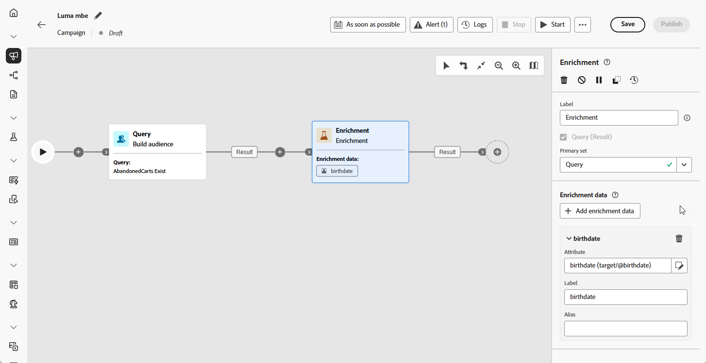
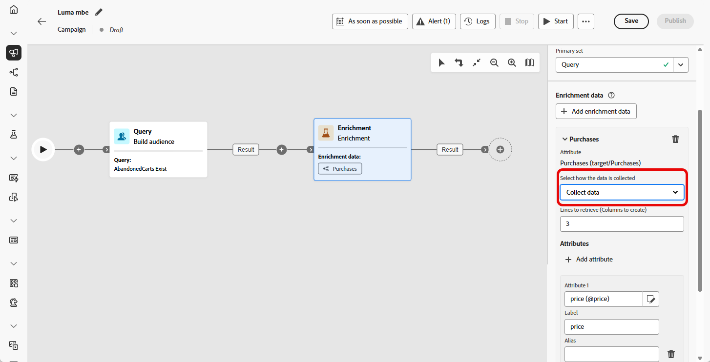
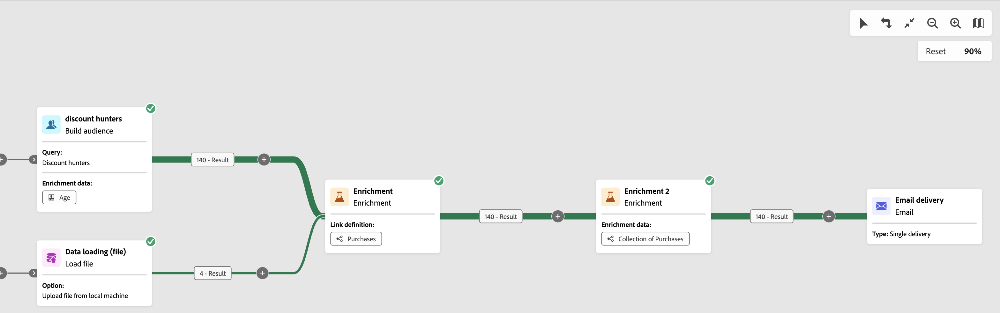
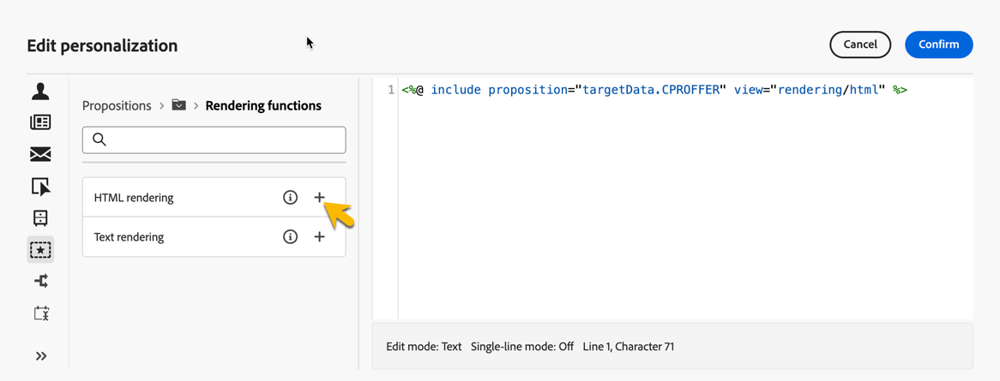

# Verrijking {#enrichment}

>[!CONTEXTUALHELP]
>id="ajo_orchestration_enrichment"
>title="Verrijkingsactiviteit"
>abstract="De **Verrijking** activiteit staat u toe om de gerichte gegevens met extra informatie van het gegevensbestand te verbeteren. Het wordt vaak gebruikt in een campagne na segmenteringsactiviteiten."

De **[!UICONTROL Enrichment]** -activiteit is een **[!UICONTROL Targeting]** -activiteit waarmee u de publieksgegevens kunt verbeteren met extra kenmerken.

U kunt deze informatie gebruiken om uw publiek nauwkeuriger te segmenteren op basis van gedrag, voorkeuren of behoeften, en om persoonlijke berichten te maken die beter aansluiten op elk profiel.

## Een verrijkingsactiviteit toevoegen {#enrichment-configuration}

>[!CONTEXTUALHELP]
>id="ajo_targetdata_personalization_enrichmentdata"
>title="Verrijkingsgegevens"
>abstract="Selecteer de gegevens om uw geordende campagne te verrijken. U kunt twee soorten verrijkingsgegevens selecteren: één enkel verrijkingsattribuut van de doelafmeting, of een inzamelingsverbinding, die een verbinding met een 1-N kardinaliteit tussen lijsten is."

>[!CONTEXTUALHELP]
>id="ajo_orchestration_enrichment_data"
>title="Verrijkingsactiviteit"
>abstract="Zodra de verrijkingsgegevens aan de Orchestrated campagne zijn toegevoegd, kan het in de activiteiten worden gebruikt die na de activiteit van de Verrijking worden toegevoegd om klanten in verschillende groepen te segmenteren die op hun gedrag, voorkeur, en behoeften worden gebaseerd, of om gepersonaliseerde marketing berichten en campagnes te creëren die eerder met uw doelpubliek zullen resoneren."

Volg deze stappen om de **1&rbrace; activiteit van de Verrijking &lbrace;te vormen:**

1. Voeg een **Verrijking** activiteit toe.

1. Klik **toevoegen verrijkingsgegevens** en selecteer de attributen om de gegevens te gebruiken te verrijken.

   U kunt twee soorten verrijkingsgegevens selecteren: één enkel verrijkingsattribuut van de doelafmeting, of een inzamelingsverbinding. Elk van deze typen wordt in de volgende voorbeelden beschreven:

   * [Enkel verrijkingskenmerk](#single-attribute)
   * [Verzamelingskoppeling](#collection-link)

   

## Voorbeelden {#example}

### Enkel verrijkingskenmerk {#single-attribute}

In dit voorbeeld verrijkt u het publiek met één kenmerk, zoals de geboortedatum, van de huidige doeldimensie.

Dit doet u als volgt:

1. Klik op **[!UICONTROL Add enrichment data]**.

1. Selecteer een eenvoudig veld, zoals **[!UICONTROL Date of birth]** , in de huidige dimensie.

   

1. Klik op **[!UICONTROL Confirm]**.

### Verzamelingskoppeling {#collection-link}

Met dit gebruiksgeval verrijkt u de doelgroep met gegevens uit een gekoppelde tabel. U wilt bijvoorbeeld de drie meest recente aankopen ophalen onder $100.

Hiertoe configureert u de verrijking als volgt:

* **de attributen van de Verrijking**: **[!UICONTROL Price]**

* **Aantal verslagen** terug te winnen: 3

* **Filter**: omvat slechts aankopen waar **[!UICONTROL Price]** minder dan $100 is

#### Het kenmerk toevoegen {#add-attribute}

Selecteer eerst de verzamelingskoppeling die de gegevens bevat waarmee u wilt verrijken.

1. Klik op **[!UICONTROL Add enrichment data]**.

1. Selecteer in de tabel **[!UICONTROL Purchases]** het veld **[!UICONTROL Price]** .

   

#### De verzamelingsinstellingen definiëren{#collection-settings}

Configureer vervolgens hoe de gegevens moeten worden verzameld en hoeveel items moeten worden opgenomen.

1. Kies **[!UICONTROL Select how the data is collected]** in het vervolgkeuzemenu **[!UICONTROL Collect data]** .

   

1. Typ **[!UICONTROL Lines to retrieve (Columns to create)]** in het veld `3` .

1. Selecteer **[!UICONTROL Aggregated data]** en kies vervolgens **[!UICONTROL Average]** in het vervolgkeuzemenu **[!UICONTROL Aggregate function]** om een aggregatie uit te voeren (bijvoorbeeld een gemiddeld aankoopbedrag).

   

1. Met de velden **[!UICONTROL Label]** en **[!UICONTROL Alias]** kunt u de verrijkte kenmerken gemakkelijker herkennen in volgende activiteiten.

#### Filters definiëren{#collection-filters}

Ten slotte pas filters toe om ervoor te zorgen dat alleen relevante records worden opgenomen:

1. Klik op **[!UICONTROL Create filters]**.

1. Voeg de volgende twee voorwaarden toe:

   * **[!UICONTROL Price]** bestaat (om NULL&#39;s uit te sluiten)

   * **[!UICONTROL Price]** is kleiner dan 100

   

1. Klik op **[!UICONTROL Confirm]**.

<!--
#### Define the sorting{#collection-sorting}

We now need to apply sorting in order to retrieve the three **latest** purchases.

1. Activate the **Enable sorting** option.
1. Click inside the **Attribute** field.
1. Select the **Order date** field.
1. Click **Confirm**. 
1. Select **Descending** from the **Sort** drop-down.

## Data reconciliation {#reconciliation}

>[!CONTEXTUALHELP]
>id="ajo_orchestration_enrichment_reconciliation"
>title="Reconciliation"
>abstract="The **Enrichment** activity can be used to reconcile data from the Journey Optimizer schema with data from another schema, or with data coming from a temporary schema such as data uploaded using a Load file activity. This type of link defines a reconciliation towards a unique record. Journey Optimizer creates a link to a target table by adding a foreign key in it for storing a reference to the unique record."

The **Enrichment** activity can be used to reconcile data from the the Campaign database schema with data from another schema, or with data coming from a temporary schema such as data uploaded using a Load file activity. This type of link defines a reconciliation towards a unique record. Journey Optimizer creates a link to a target table by adding a foreign key in it for storing a reference to the unique record.

For example, you can use this option to reconcile a profile's country, specified in an uploaded file, with one of the countries available in the dedicated table of the Campaign database. 

Follow the steps to configure an **Enrichment** activity with a reconciliation link: 

1. Click the **Add link** button in the **Reconciliation** section.
1. Identify the data you want to create a reconciliation link with.

    * To create a reconciliation link with data from the Campaign database, select **Database schema** and choose the schema where the target is stored. 
    * To create a reconciliation link with data coming from the input transition, select **Temporary schema** and choose the Orchestrated campaign transition where the target data is stored. 

1. The **Label** and **Name** fields are automatically populated based on the selected target schema. You can change their values if necessary.

1. In the **Reconciliation criteria** section, specify how you want to reconcile data from the source and destination tables:

    * **Simple join**: Reconcile a specific field from the source table with another field in the destination table. To do this, click the **Add join** button and specify the **Source** and **Destination** fields to use for the reconciliation.

        >[!NOTE]
        >
        >You can use one or more **Simple join** criteria, in which case they must all be verified so that the data can be linked together.

    * **Advanced join**: Use the rule builder to configure the reconciliation criteria. To do this, click the **Create condition** button then define your reconciliation criteria by building your own rule using AND and OR operations.

The example below shows an Orchestrated campaign configured to create a link between Journey Optimizer profiles table and a temporary table generated a **Load file** activity. In this example, the **Enrichment** activity reconciliates both tables using the email address as reconciliation criteria.

### Enrichment with linked data {#link-example}

The example below shows an Orchestrated campaign configured to create a link between two transitions. The first transitions targets profile data using a **Query** activity, while the second transition includes purchase data stored into a file loaded through a Load file activity.

* The first **Enrichment** activity links the primary set (data from the **Query** activity) with the schema from the **Load file** activity. This allows us to match each profile targeted by the query with the corresponding purchase data.

    

* A second **Enrichment** activity is added in order to enrich data from the Orchestrated campaign table with the purchase data coming from the **Load file** activity. This allows us to use those data in further activities, for example, to personalize messages sent to the customers with information on their purchase.

    

## Create links between tables {#create-links}

>[!CONTEXTUALHELP]
>id="ajo_orchestration_enrichment_simplejoin"
>title="Link definition"
>abstract="Create a link between the working table data and Adobe Journey Optimizer. For example, if you load data from a file which contains the account number, country and email of recipients, you have to create a link towards the country table in order to update this information in their profiles."

The **[!UICONTROL Link definition]** section allows you to create a link between the working table data and Adobe Journey Optimizer. For example, if you load data from a file which contains the account number, country and email of recipients, you have to create a link towards the country table in order to update this information in their profiles.

There are several types of links available:

* **[!UICONTROL 1 cardinality simple link]**: Each record from the primary set can be associated with one and only one record from the linked data.
* **[!UICONTROL 0 or 1 cardinality simple link]**: Each record from the primary set can be associated with 0 or 1 record from the linked data, but not more than one.
* **[!UICONTROL N cardinality collection link]**: Each record from the primary set can be associated with 0, 1 or more (N) records from the linked data.

To create a link, follow these steps:

1. In the **[!UICONTROL Link definition]** section, click the **[!UICONTROL Add link]** button.

    

1. In the **Relation type** drop-down list, choose the type of link you want to create.

1. Identify the target you want to link the primary set to:

    * To link an existing table in the database, choose **[!UICONTROL Database schema]** and select the desired table from the **[!UICONTROL Target schema]** field.
    * To link with data from the input transition, choose **Temporary schema** and select the transition whose data you want to use.

1. Define the reconciliation criteria to match data from the primary set with the linked schema. There are two types of joins available:

    * **Simple join**: Select a specific attribute to match data from the two schemas. Click **Add join** and select the **Source** and **Destination** attributes to use as reconciliation criteria. 
    * **Advanced join**: Create a join using advanced conditions. Click **Add join** and click the **Create condition** button to open the rule builder.

A workflow example using links is available in the [Examples](#link-example) section.

## Add offers {#add-offers}

>[!CONTEXTUALHELP]
>id="ajo_orchestration_enrichment_offer_proposition"
>title="Offer proposition"
>abstract="The Enrichment activity allows you to add offers for each profile."

The **[!UICONTROL Enrichment]** activity allows you to add offers for each profile.

To do so, follow the steps to configure an **[!UICONTROL Enrichment]** activity with an offer: 

1. In the **[!UICONTROL Enrichment]** activity, at the **[!UICONTROL Offer proposition]** section, click on the **[!UICONTROL Add offer]** button

    

1. You have two choices for the offer selection :

    * **[!UICONTROL Search for the best offer in category]** : check this option and specify the offer engine call parameters (offer space, category or theme(s), contact date, number of offers to keep). The engine will calculate the best offer(s) to add according to these parameters. We recommend completing either the Category or the Theme field, rather than both at the same time.

        

    * **[!UICONTROL A predefined offer]** : check this option and specify an offer space, a specific offer, and a contact date to directly configure the offer that you would like to add, without calling the offer engine.

        

1. After selecting your offer, click on **[!UICONTROL Confirm]** button.

You can now use the offer in the delivery activity.

### Using the offers from Enrichment activity

Within an Orchestrated campaign, if you want to use the offers you get from an enrichment activity in your delivery, follow the steps below:

1. Open the delivery activity and go in the content edition. Click on **[!UICONTROL Offers settings]** button and select in the drop-down list the **[!UICONTROL Offers space]** corresponding to your offer. 
If you want to to view only offers from the enrichment activity, set the number of **[!UICONTROL Propositions]** to 0, and save the modifications.

     

1. In the Email Designer, when adding a personalization with offers, click on the **[!UICONTROL Propositions]** icon, it will display the offer(s) you get from the **[!UICONTROL Enrichment]** activity. Open the offer you want to choose by clicking on it.

     

    Go in **[!UICONTROL Rendering functions]** and choose **[!UICONTROL HTML rendering]** or **[!UICONTROL Text rendering]** according to your needs.

     

>[!NOTE]
>
>If you choose to have more than one offer in the **[!UICONTROL Enrichment]** activity at the **[!UICONTROL Number of offers to keep]** option, all the offers are displayed when clicking on the **[!UICONTROL Propositions]** icon.

-->