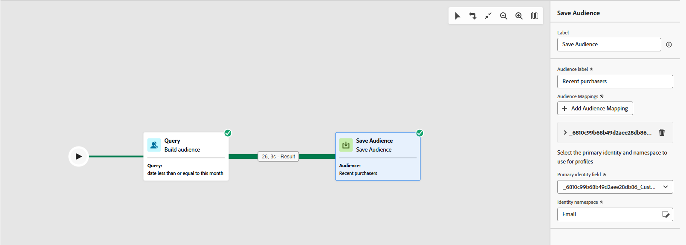

# Doelgroep opslaan {#save-audience}

>[!CONTEXTUALHELP]
>id="ajo_orchestration_save_audience"
>title="Activiteit van publiek opslaan"
>abstract="**sparen publiek** activiteit is a **richtend** activiteit die u toestaat om een bestaand publiek bij te werken of nieuwe te creëren van de bevolking die vroeger in de Geordende campagne wordt geproduceerd. Zodra gecreeerd, worden deze publiek toegevoegd aan de lijst van toepassingspubliek en kan van het **Publiek** menu worden betreden."

De **[!UICONTROL Save audience]** -activiteit is een **[!UICONTROL Targeting]** -activiteit die wordt gebruikt om een nieuw publiek te maken of om een bestaand publiek bij te werken op basis van de bevolking die eerder in de geordende campagne is gegenereerd. Nadat het publiek is opgeslagen, wordt het toegevoegd aan de lijst met doelgroepen van de toepassing en wordt het toegankelijk via het menu **[!UICONTROL Audiences]** .

Het wordt doorgaans gebruikt om publiekssegmenten vast te leggen die zijn gemaakt in dezelfde campagneworkflow en deze beschikbaar te maken voor hergebruik in toekomstige campagnes. Doorgaans is dit gekoppeld aan andere doelactiviteiten, zoals **[!UICONTROL Build audience]** of **[!UICONTROL Combine]** , om de uiteindelijke doelpopulatie te besparen.
Met de **[!UICONTROL Save audience]** -activiteit kunt u een bestaand publiek niet bijwerken. U kunt alleen een nieuw publiek maken of een bestaand publiek overschrijven met een nieuwe definitie.

## Vorm sparen publieksactiviteit {#save-audience-configuration}

Voer de volgende stappen uit om de **[!UICONTROL Save audience]** -activiteit te configureren:

1. Voeg een **[!UICONTROL Save audience]** activiteit aan uw Geordende campagne toe.

1. Voer een **[!UICONTROL Audience label]** in die het opgeslagen publiek identificeert.

   >[!NOTE]
   >
   >Het publiek **[!UICONTROL Label]** moet uniek zijn voor alle campagnes. U kunt een publieksnaam die al is gebruikt in de **[!UICONTROL Save audience]** -activiteit van een andere campagne niet opnieuw gebruiken.

1. Kies een **[!UICONTROL Profile mapping field&#x200B;]** optie in de doeldimensie van uw campagne. Deze afbeelding bepaalt hoe de profielen in het **Bewaarde publiek** met de doeldimensie van de campagne tijdens uitvoering worden verbonden.

   Alleen toewijzingen die compatibel zijn met de huidige doeldimensie, d.w.z. de toewijzing uit de inkomende overgang, zijn beschikbaar in de vervolgkeuzelijst om te zorgen voor een goede afstemming tussen het publiek en de context van de campagne.

   ➡️ [ volg de stappen in deze pagina worden gedetailleerd om uw Campagne te creëren richtend afmeting ](../target-dimension.md)

   

1. Klik op **[!UICONTROL Add audience mappings]** om aanvullende gegevens van kenmerken van de **[!UICONTROL Target dimension]** of verrijkt **[!UICONTROL Profile attributes]** op te nemen.

   Op deze manier kunt u meer informatie aan de **[!UICONTROL Saved audience]** -activiteit koppelen dan aan de primaire profieltoewijzing, waardoor u de opties voor het toewijzen van doelen en personalisatie kunt verbeteren.

   

1. Voltooi uw opstelling door de Geordende campagne te bewaren en te publiceren. Hierdoor wordt uw publiek gegenereerd en opgeslagen.

1. Publiceer de campagne voor het publiek dat moet worden gemaakt of vervangen omdat de **[!UICONTROL Save audience]** -activiteit niet wordt uitgevoerd terwijl de campagne zich in **[!UICONTROL Draft mode]** bevindt.

De inhoud van het opgeslagen publiek is dan beschikbaar in de detailweergave van het publiek, die toegankelijk is via het menu **[!UICONTROL Audiences]** , of kan worden geselecteerd wanneer het doel wordt ingesteld op een publiek, bijvoorbeeld met een **[!UICONTROL Read audience]** -activiteit.

>[!NOTE]
>
>Als in uw publieksdefinitie Experience Platform-schemakenmerken worden gebruikt die zijn gelabeld met gegevensgebruik (DULE), worden deze labels automatisch overgenomen door het opgeslagen publiek. U hoeft ze niet opnieuw toe te passen. [ leer meer over het Beheer van Gegevens ](../../action/action-privacy.md)

## Voorbeeld {#save-audience-example}

In het volgende voorbeeld ziet u hoe u een eenvoudig publiek kunt maken door doelframes in te stellen. Een vraag identificeert alle ontvangers die een reis in de laatste 30 dagen door deze bevolking binnen uw Geordende campagne te filtreren boekten. Door **Ontvangers te kiezen - CRMID** als **het richten dimensie**, richt het publiek elke individuele het boeken gebeurtenis eerder dan enkel de ontvanger als geheel. De **[!UICONTROL Save audience]** -activiteit legt deze profielen vervolgens vast om een herbruikbaar publiek van recente kopers te maken.

