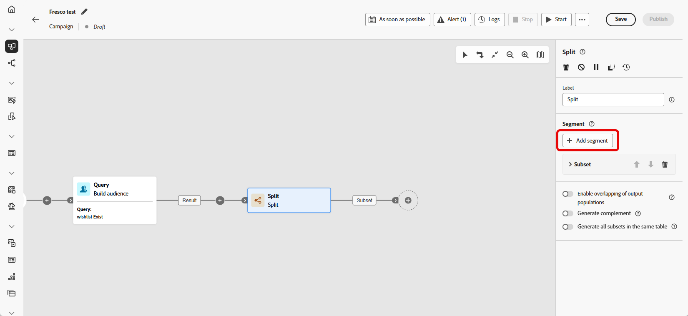

# Splitsen {#split}

>[!CONTEXTUALHELP]
>id="ajo_orchestration_split"
>title="Gesplitste activiteit"
>abstract="De **Gesplitste** activiteit staat u toe om inkomende populaties in veelvoudige subsets te segmenteren die op verschillende selectiecriteria, zoals het filtreren regels of populatiegrootte worden gebaseerd."

+++ Inhoudsopgave

| Welkom bij georkestreerde campagnes | Start uw eerste georkestreerde campagne | De database opvragen | Gecontroleerde campagnes |
|---|---|---|---|
| [ krijgen begonnen met georkestreerde campagnes ](gs-orchestrated-campaigns.md)  [ stappen van de Configuratie ](configuration-steps.md)  [ Toegang en beheert georkestreerde campagnes ](access-manage-orchestrated-campaigns.md) | [ Zeer belangrijke stappen voor georkestreerde campagneverwezenlijking ](gs-campaign-creation.md)  [ creëren en plannen de campagne ](create-orchestrated-campaign.md)  [ activiteiten van het Orchestrate ](orchestrate-activities.md)  <b>[ Begin en controleer de campagne ](start-monitor-campaigns.md)</b>  [ Meldend ](reporting-campaigns.md) | [ Werk met de regelbouwer ](orchestrated-rule-builder.md)  [ bouwt uw eerste vraag ](build-query.md)  [ uit geeft uitdrukkingen ](edit-expressions.md)  [ opnieuw op ](retarget.md) | [ wordt begonnen met activiteiten ](activities/about-activities.md)   Activiteiten: [ en-sluit zich aan ](activities/and-join.md) - [ bouwt publiek ](activities/build-audience.md) - [ dimensie van de Verandering ](activities/change-dimension.md) - [ de activiteiten van het Kanaal ](activities/channels.md) - [ combineren ](activities/combine.md) - [ Deduplicatie ](activities/deduplication.md) - [ Verrijking ](activities/enrichment.md) Formeel k [ - ](activities/fork.md) Verzoening [ - ](activities/reconciliation.md) sparen publiek [ - ](save-audience.md) Gesplitst [ - ](activities/split.md) wacht  |

{style="table-layout:fixed"}

+++

 

De **[!UICONTROL Split]** -activiteit is een **[!UICONTROL Targeting]** -activiteit die de binnenkomende populatie segmenteert in meerdere subsets op basis van gedefinieerde selectiecriteria zoals filterregels of populatiegrootte.

## De activiteit Splitsen configureren {#split-configuration}

>[!CONTEXTUALHELP]
>id="ajo_orchestration_split_segments"
>title="Segmenten voor splitsingsactiviteit"
>abstract="Voeg zoveel subsets toe als u wilt om de binnenkomende populatie te segmenteren.   wanneer de **Gesplitste** activiteit wordt uitgevoerd, wordt de bevolking gesegmenteerd over de verschillende ondergroepen in de orde zij aan de activiteit worden toegevoegd. Voordat u de georkestreerde campagne start, moet u de subsets met de pijlknoppen in de gewenste volgorde plaatsen."

>[!CONTEXTUALHELP]
>id="ajo_orchestration_split_filter"
>title="Activiteitsfilter splitsen"
>abstract="Als u een filtervoorwaarde op de subset wilt toepassen, klikt u op **[!UICONTROL Create filter]** en configureert u de gewenste filterregel met de querymodelfunctie. Neem bijvoorbeeld profielen op van de binnenkomende populatie waarvan het e-mailadres voorkomt in de database."

>[!CONTEXTUALHELP]
>id="ajo_orchestration_split_limit"
>title="Limiet voor gesplitste activiteit"
>abstract="Als u het aantal profielen wilt beperken dat door de subset wordt geselecteerd, schakelt u de optie **[!UICONTROL Enable limit]** in en geeft u het aantal of de percentages van de populatie op die u wilt opnemen."

>[!CONTEXTUALHELP]
>id="ajo_orchestration_split_sorting"
>title="Splitsen op activiteit"
>abstract="Wanneer u een populatielimiet voor een subset instelt, kunt u de geselecteerde profielen op basis van een specifiek profielkenmerk in oplopende of aflopende volgorde rangschikken. Om dit te doen, knevel op **het sorteren** optie toe. U kunt bijvoorbeeld een subset beperken tot alleen de bovenste 50 profielen met het hoogste aankoopbedrag."

>[!CONTEXTUALHELP]
>id="ajo_orchestration_split_complement"
>title="Splitsen genereert complement"
>abstract="Zodra u alle subsets hebt gevormd, kunt u de resterende populatie selecteren die geen van de subsets aanpast en hen in een extra uitgaande overgang omvat. Om dit te doen, op **van een knevel te voorzien produceert complement** optie."

>[!CONTEXTUALHELP]
>id="ajo_orchestration_split_generatesubsets"
>title="Alle subsets in dezelfde tabel genereren"
>abstract="Schakel deze optie in en uit om alle subsets te groeperen in één uitvoerovergang."

>[!CONTEXTUALHELP]
>id="ajo_orchestration_split_emptytransition"
>title="Lege overgang overslaan"
>abstract="Schakel de optie **[!UICONTROL Skip empty transition]** in en uit om de uitvoerovergang voor deze subset uit te schakelen als de binnenkomende populatie leeg is."

>[!CONTEXTUALHELP]
>id="ajo_orchestration_split_enable_overlapping"
>title="Overlappende uitvoerpopulaties inschakelen"
>abstract=" Met de optie **[!UICONTROL Enable overlapping of output populations]** kunt u populaties beheren die tot verschillende subsets behoren. Wanneer het vakje niet wordt gecontroleerd, zorgt de gespleten activiteit ervoor een ontvanger niet in verscheidene outputovergangen kan aanwezig zijn, zelfs als het aan de criteria van verscheidene subsets voldoet. Deze worden als doel ingesteld op het eerste tabblad met overeenkomende criteria. Als het selectievakje is ingeschakeld, kunnen de ontvangers in verschillende subsets worden gevonden als ze voldoen aan hun filtercriteria."

Voer de volgende stappen uit om de **[!UICONTROL Split]** -activiteit te configureren:

1. Voeg een **[!UICONTROL Split]** activiteit aan uw georkestreerde campagne toe.

1. Het deelvenster voor activiteitenconfiguratie wordt geopend met een standaardsubset. Klik op de knop **[!UICONTROL Add segment]** om zoveel subsets toe te voegen als u wilt om de binnenkomende populatie te segmenteren.

   

   >[!IMPORTANT]
   >
   >De **Gesplitste** activiteitenprocessen subsets in de orde zij worden toegevoegd. Als de eerste subset bijvoorbeeld 70% van de bevolking opneemt, worden de criteria van de volgende subset toegepast op de resterende 30%.
   >
   >Voordat u de georkestreerde campagne uitvoert, moet u ervoor zorgen dat de subsets volgens plan zijn geordend. Gebruik de pijlknoppen om de positie ervan aan te passen.

1. Nadat subsets zijn toegevoegd, toont de activiteit evenveel uitvoerovergangen als er subsets zijn. We raden u ten zeerste aan het label van elke subset te wijzigen om deze gemakkelijk te identificeren in het georkestreerde campagneccanvas.

1. Filters configureren voor elke subset:

   1. Klik op een subset om de instellingen te openen.

   1. Klik op **[!UICONTROL Create filter]** om filterregels te definiëren met behulp van de querymodelfunctie. Selecteer bijvoorbeeld profielen met een geldig e-mailadres.

      

   1. Als u het aantal geselecteerde profielen wilt beperken, schakelt u **[!UICONTROL Enable limit]** in en geeft u een getal of percentage op.

   1. Als u een overgang wilt overslaan wanneer de subset leeg is, schakelt u **[!UICONTROL Skip empty transition]in.**

1. Schakel **[!UICONTROL Generate complement]** in als u profielen wilt opnemen die niet overeenkomen met een subset. Dit leidt tot een extra uitgaande overgang voor de resterende bevolking.

   >[!NOTE]
   >
   >Schakel **[!UICONTROL Generate all subsets in the same table]** in om alle subsets te groeperen in één overgang.

1. Gebruik **[!UICONTROL Enable overlapping of output populations]** om profielen in meerdere subsets weer te geven:

   * **Als ongecontroleerd**, wordt elk profiel toegewezen aan slechts één ondergroep, eerste waarvan criteria het aanpast zelfs als het voor andere ondergroepen kwalificeert.

   * **Als gecontroleerd**, kunnen de profielen in veelvoudige ondergroepen worden omvat als zij aan de criteria voor elk voldoen.

De activiteit wordt nu gevormd. Bij de uitvoering van de georkestreerde campagne wordt de bevolking opgedeeld in de verschillende ondergroepen, in de volgorde waarin ze aan de activiteit zijn toegevoegd.

## Voorbeeld{#split-example}

In het volgende voorbeeld wordt de activiteit **[!UICONTROL Split]** gebruikt om een publiek in verschillende subsets te segmenteren op basis van het communicatiekanaal dat we willen gebruiken:

* **Subset 1 &quot;e-mail&quot;**: omvat profielen die een telefoonaantal hebben verstrekt.

* **Subset 2 &quot;sms&quot;**: doelprofielen met een mobiel telefoonaantal dat in het gegevensbestand wordt opgeslagen.

* **Complementeer overgang**: vangt om het even welke resterende profielen die niet aan de criteria voor één van beide ondergroep voldoen.

